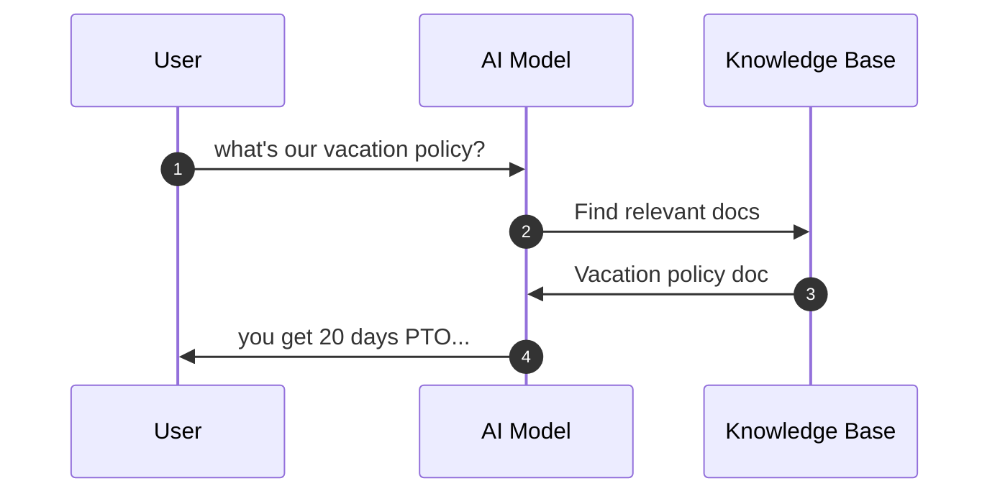
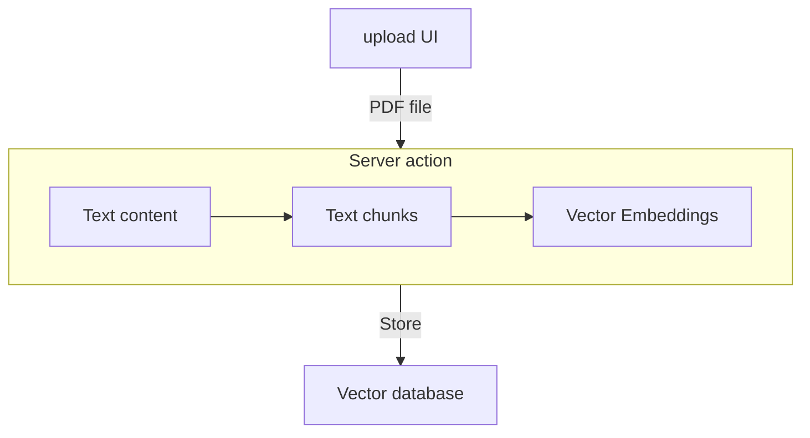
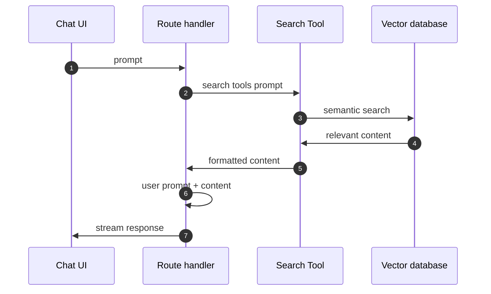

[RAG Chatbot](#top)

- [Setup](#setup)
- [Authentication of Clerk](#authentication-of-clerk)
- [Uploading knowledge documents](#uploading-knowledge-documents)

------------------------------------------------------------------------

```
 rag-chatbot   |       Tech Stack            |     function           |  implementation
---------------|-----------------------------|------------------------|--------------------------
               | @clerk/nextjs               | authentication         | login/logout auth
               | Shadcn ui                   | ui library             |
 RAG chatbot   | Neon                        | Vector database        |
               | drizzle-kit, drizzle-orm    | DB ORM                 |
               | AI SDK, AI element          | AI, chatbot components |
               | @langchain/textsplitters    | text chunks, embeddings|
               | pdf-parse                   | pdf file handler       |
```



```
├─ 📂app/
│  ├─ 📂api/
│  │  └─ 📂chat/
│  │     └─ 📄route.ts     - chat route handler
│  ├─ 📂chat/
│  │  └─ 📄page.tsx        - chat UI
│  ├─ 📄layout.tsx
│  ├─ 📄page.tsx
│  └─ 📂upload/
│     ├─ 📄actions.ts      - pdf upload actions
│     └─ 📄page.tsx        - upload UI
├─ 📂components/
│  ├─ 📂ai-elements/
│  ├─ 📄navigation.tsx     - top nav components
│  └─ 📂ui/
├─ drizzle.config.ts
├─ 📂lib/
│  ├─ 📄chunking.ts
│  ├─ 📄db-schema.ts
│  ├─ 📄db.config.ts
│  ├─ 📄embeddings.ts
│  ├─ 📄search.ts
│  └─ 📄utils.ts
├─ 📂migrations/
│  ├─ 📄0000_abnormal_ultimo.sql
│  ├─ 📄0001_dashing_sally_floyd.sql
│  └─ meta/
├─ 📄next.config.ts       - nextjs config
├─ 📄proxy.ts             - clerk config
├─ 📄public/
├─ 📄tsconfig.json
└─ 📂types/
   └─ 📄globals.d.ts
```

[⬆️back to top](#top)

## Setup

1. AI SDK for react
   1. `npm install ai @ai-sdk/openai @ai-sdk/react zod`
   2. https://ai-sdk.dev/docs/getting-started/nextjs-pages-router
2. Shadcn
   1. `npx shadcn@latest init`
   2. `npx shadcn@latest add`
3. create '.env.local' in root directory
4. AI Element of AI SDK Vecel:
   1. `npx ai-elements@latest`
   3. Create a Route Handler ('app/api/chat/route.ts') - nextjs pages router
   4. Wire up the UI with AI element: create 'app\chat\page.tsx`
      1. `import { useChat } from '@ai-sdk/react';`
   5. https://ai-sdk.dev/elements

[⬆️back to top](#top)

## Authentication of Clerk

1. `npm install @clerk/nextjs`
2. Add `clerkMiddleware()` to your app
  1. create 'proxy.ts' in root directory(v16+, using 'middleware.ts' if <=1v5>)
  2. add `ClerkProvider` to '/app/layout.tsx'
  3. Create your first user: got to `http://localhost:3000` and sign up to create your first user
     1. honggzb@gmail.com, Honggzb11!
3. Customize sign-in-or-up page
   1. create 'components\navigation.tsx'(signin/signup) and put it to '/app/layout.tsx'
   2. Make the sign-in-or-up route public
      1. modify 'proxy.ts' --> add `createRouteMatcher`
   3. [Build your own  page for your Next.js app with Clerk](https://clerk.com/docs/nextjs/guides/development/custom-sign-in-or-up-page)
- https://clerk.com/docs/nextjs/getting-started/quickstart

[⬆️back to top](#top)

## Uploading knowledge documents


1. setup NEON database
   1. create project in neon console, add `NEON_DATABASE_URL` to '.env.local'
   2. `npm i @neondatabase/serverless drizzle-orm drizzle-kit dotenv`
   3. create 'lib/db.config.ts'
   4. create 'lib/db.schema.ts'  <-- schema
   5. create 'drizzle.config.ts' in root directory  <-- Setup Drizzle config file
   6. Generate SQL migration files based on your Drizzle schema
      1. `npx drizzle-kit generate --custom`
      2. add `CREATE EXTENSION IF NOT EXISTS vector;` to 'migrations\xxx.sql'
      3. `npx drizzle-kit migrate`   --> will create 'migrations' folder
         - verify if it success
            - go to neon console -> 'SQL Editor'
            - `SELECT extname, extversion FROM pg_extension WHERE extname = 'vector'`
      4. `npx drizzle-kit generate`  -->  will create user migration file 'migrations\xxx.sql' according user schema('lib/db.schema.ts')
      5. `npx drizzle-kit migrate`  -->
         - verify if it success:  go to neon console -> 'Tables' --> if there is 'document' table
   7. References
      1. [Get Started with Drizzle and Neon](https://orm.drizzle.team/docs/get-started/neon-new)
      2. [Migrations with Drizzle Kit](https://orm.drizzle.team/docs/kit-overview)
2. create Server action
   1. create 'lib\embeddings.ts' <- Embedding helper functions
      1. when process a PDF, need to generate embeddings for multiple chunks of text
      2. when a user searches, need to generate an embedding for their search query
   2. chunks utilities
      1. `npm i @langchain/textsplitters`
      2. create 'lib\chunking.ts'
   3. store(pdf process) utilities
      1. `npm i pdf-parse`
      2. add `serverExternalPackages: ["pdf-parse"]` to 'next.config.ts'
      3. create 'app\upload\actions.ts'
      4. create 'app\upload\page.tsx'    <-- upload UI
   4. Semantic Search function(using drizzle-orm) and Integrating Search Tool for AI
      1. create 'lib\search.ts'
      2. modify 'app\api\chat\route.ts'  <-- add `tools`
   5. Adding Role-Based Access Control(only admin can upload pdf files, if it is not admin will navigate to home page)
      1. create 'types\globals.d.ts'
      2. modify '\proxy.ts'  <-- add `isAdminRoute`, `isAdmin`
      3. go to clerk console
         1. --> 'Configure' tab
         2. --> 'sessions'
         3. --> 'Customize session token' -->  input `{ "metadata": "{{user.public_metadata}}" }` and save
      4. go to 'users' tab
         - -->  click 'xxx@xxxx.com'
         - --> scroll to 'Metadata'
         - --> click 'edit' in 'public' line
         - --> input `{ "role": "admin"}`



[⬆️back to top](#top)

> References
- [Build a RAG Chatbot from Scratch | React, Next.js, AI SDK, AI Elements, Neon, Drizzle, Clerk](https://www.youtube.com/watch?v=3E5OxozYuA8)
- https://github.com/gopinav/Next.js-AI-SDK-RAG-Chatbot
