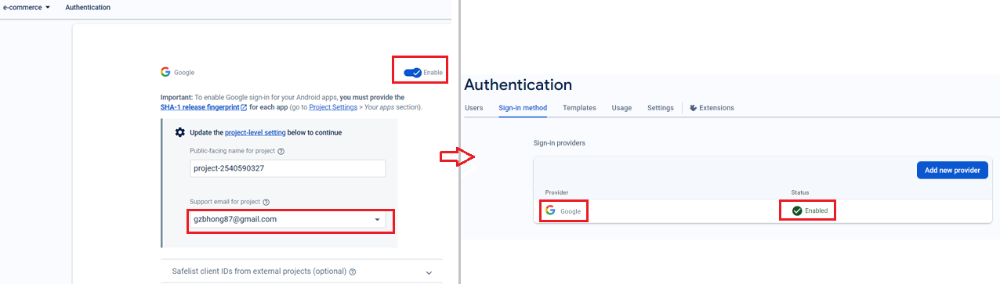
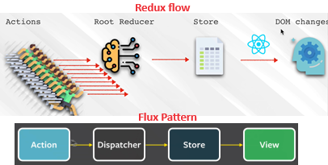
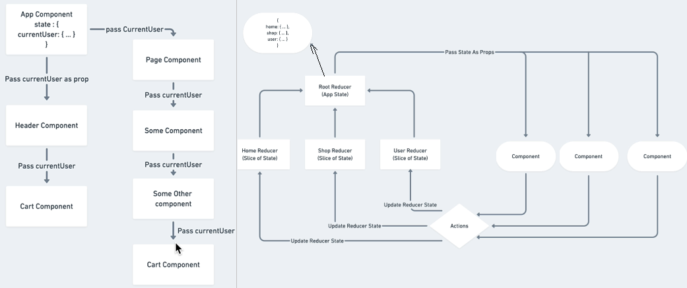
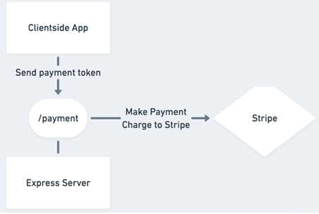

[React + Ts + Redux + Vite](#top)

- [withRouter HOC no longer exists in react-router-dom v6](#withrouter-hoc-no-longer-exists-in-react-router-dom-v6)
- [Form](#form)
- [Authentication using Firebase](#authentication-using-firebase)
  - [Add Firebase to project](#add-firebase-to-project)
  - [using google email authentication](#using-google-email-authentication)
  - [firebase firestore](#firebase-firestore)
  - [using Google email authentication](#using-google-email-authentication-1)
- [Redux using Redux Toolkit-ts](#redux-using-redux-toolkit-ts)
  - [Create a Redux Store](#create-a-redux-store)
  - [Provide the Redux Store to React](#provide-the-redux-store-to-react)
  - [Create a Redux State Slice](#create-a-redux-state-slice)
  - [using redux in component](#using-redux-in-component)
- [Redux Persist + Redux Toolkit](#redux-persist--redux-toolkit)
  - [adding persistReducer and persistStore to store](#adding-persistreducer-and-persiststore-to-store)
  - [wrap root component with PersistGate](#wrap-root-component-with-persistgate)
- [Stripe](#stripe)
  - [stripe server](#stripe-server)
- [Styled Components](#styled-components)
  - [using function in styled component](#using-function-in-styled-component)
- [GraphQL + react](#graphql--react)
  - [Initialize ApolloClient](#initialize-apolloclient)
  - [Fetch data with useQuery](#fetch-data-with-usequery)
  - [update data with useMutation](#update-data-with-usemutation)
- [Initialize ApolloServer](#initialize-apolloserver)
  - [define schema](#define-schema)
  - [APOLLO SERVER](#apollo-server)
  - [APOLLO Explorer](#apollo-explorer)
- [Responsive issue](#responsive-issue)
- [Performance Cheat Sheet](#performance-cheat-sheet)
  - [Code splitting](#code-splitting)
  - [Route-based code splitting -React Lazy + Suspense](#route-based-code-splitting--react-lazy--suspense)
  - [Memo and PureComponent](#memo-and-purecomponent)
  - [Gzipping with express compression](#gzipping-with-express-compression)
  - [React profiler API](#react-profiler-api)
- [Progressive Web App](#progressive-web-app)
  - [Progressive Web App checklist](#progressive-web-app-checklist)
- [Tests](#tests)
  - [types of test](#types-of-test)


----------------------------------------------------------------------------------------------------------

## withRouter HOC no longer exists in react-router-dom v6

- ['withRouter' is not exported from 'react-router-dom'](https://stackoverflow.com/questions/69934351/withrouter-is-not-exported-from-react-router-dom)
- using `useNavigate`, `useLocation` instead of 

## Form

- decide on components
- decide the state and where it lives
- what changes when state changes

[⬆ back to top](#top)

## Authentication using Firebase

### Add Firebase to project

- `npm install firebase`
- create 'e-commerce' project in [firebase console](https://console.firebase.google.com/)
  - [Add Firebase to your JavaScript project](https://firebase.google.com/docs/web/setup)
- create 'src\firebase\firebase.utils.tsx'

```javascript
//firebase.utils.tsx
//Before: version 8
// import firebase from 'firebase/app';
// import 'firebase/auth';
// import 'firebase/firestore';
// v9 compat packages are API compatible with v8 code
import firebase from "firebase/compat/app";
import 'firebase/compat/auth';
import 'firebase/compat/firestore';
const firebaseConfig = {
    apiKey: "xxxxxxxx",
    authDomain: "xxxxxxxx",
    projectId: "xxxxxxxxx",
    storageBucket: "xxxxxxxxx",
    messagingSenderId: "2540590327",
    appId: "1:xxxxxxxx:web:xxxxxxxxxxx",
    measurementId: "G-xxxxxxxxxxxxxxx"
};
firebase.initializeApp(firebaseConfig);
```

### using google email authentication

- enable google email sign-in in firebase console
- 
- add codes in 'src\firebase\firebase.utils.tsx' and component.tsx

```javascript
//1. src\firebase\firebase.utils.tsx
export const auth = firebase.auth();
export const firestore = firebase.firestore();
const provider = new firebase.auth.GoogleAuthProvider();
provider.setCustomParameters({ prompt: 'select_account' });
export const signInWithGoogle = () => auth.signInWithPopup(provider);
export default firebase;
//2. src\components\sign-in\Signin.tsx
<CustomButton onClick={signInWithGoogle}> Sign in with Google</CustomButton> 
```

-  **Cross-Origin-Opener-Policy policy** would block the window closed call error while using google auth
-  changed the method from `signInWithPopup` to `signInWithRedirect`. But with this method, need to handle this redirect with "useEffect" hook
- https://stackoverflow.com/questions/76446840/cross-origin-opener-policy-policy-would-block-the-window-closed-call-error-while

[⬆ back to top](#top)

### firebase firestore

- types of firestore returns(Document or Collection)
  - queryReference: current place in db
    - `firestore.doc(‘/users/:userId’);`
    - `firestore.collections(‘/users’);`
  - querySnapshot: 
  - queryReference object does not have the actual data of the collection or document. It instead has properties that tell us details about it, or the method to get the Snapshot object which gives us the data we are looking for
- documentRef objects  ->  returns a documentSnapshot object
  - `.set()`:   create
  - `.get()`:  retrieve
  - `.update()`: update
  - `.delete()`: delete
- collectionRef object  ->  returns a querySnapshot object
  - `.add()`: `collectionRef.add({//value: prop})`
  - `.get()`
- DocumentSnapshot
  - `.exists` property: check if a document exists
  - `.data()` method: returns us a JSON object of the document
- QuerySnapshot
  - `.empty` property: check if there are any documents in the collection
  - `.docs` property: get all the documents in the collection, It returns an array of our documents as documentSnapshot
objects.

```javascript
  useEffect(() => {
    auth.onAuthStateChanged((user) => {
      console.log(user);
      if(user?.user && !!user.user) {seIisLogin(true)}
    });
  }, [])
```

[⬆ back to top](#top)

### using Google email authentication

```javascript
/* firebase/firebase.utils */
export const auth = firebase.auth();
export const firestore = firebase.firestore();
export const provider = new firebase.auth.GoogleAuthProvider();
provider.setCustomParameters({ prompt: 'select_account' });
// move to signin.tsx due to cross origin policy
//export const signInWithGoogle = () => auth.signInWithRedirect(provider);
/* signin.tsx */
import { auth, provider } from '../../firebase/firebase.utils';
const onClick = () =>
  auth.signInWithRedirect(provider).catch(error => {
      console.error(error);
})
```

[⬆ back to top](#top)

## Redux using Redux Toolkit-ts

- principles of redux state
  - Single source of truth
  - state is read only
  - Changes using pure function
- 
- design state of project
  - 
- [Redux Toolkit](https://redux-toolkit.js.org/tutorials/quick-start)

### Create a Redux Store

```javascript
import { configureStore } from '@reduxjs/toolkit'
export const store = configureStore({
  reducer: { counter: counterReducer },
})
// Infer the `RootState` and `AppDispatch` types from the store itself
export type RootState = ReturnType<typeof store.getState>
// Inferred type: {posts: PostsState, comments: CommentsState, users: UsersState}
export type AppDispatch = typeof store.dispatch
```

[⬆ back to top](#top)

### Provide the Redux Store to React

```javascript
import { store } from './app/store'
import { Provider } from 'react-redux'
ReactDOM.render(
  <Provider store={store}>
    <App />
  </Provider>,
  document.getElementById('root')
)
```

[⬆ back to top](#top)

### Create a Redux State Slice

```javascript
import { createSlice } from '@reduxjs/toolkit'
import type { PayloadAction } from '@reduxjs/toolkit'
export interface CounterState {
  value: number
}
const initialState: CounterState = {
  value: 0,
}
export const counterSlice = createSlice({
  name: 'counter',
  initialState,
  reducers: {
    increment: (state) => {
      // Redux Toolkit allows us to write "mutating" logic in reducers. It
      // doesn't actually mutate the state because it uses the Immer library,
      // which detects changes to a "draft state" and produces a brand new
      // immutable state based off those changes
      state.value += 1
    },
  },
})
// Action creators are generated for each case reducer function
export const { increment } = counterSlice.actions
export default counterSlice.reducer
```

[⬆ back to top](#top)

### using redux in component

- `useSelector`: read data from the store
- `useDispatch`: dispatch actions

```javascript
import type { RootState } from '../../app/store'
import { useSelector, useDispatch } from 'react-redux'
import { decrement, increment } from './counterSlice'
export function Counter() {
  const count = useSelector((state: RootState) => state.counter.value)
  const dispatch = useDispatch()
  return (
    <div>
      <div>
        <button aria-label="Increment value" onClick={() => dispatch(increment())} >
          Increment
        </button>
        <span>{count}</span>
        <button aria-label="Decrement value" onClick={() => dispatch(decrement())} >
          Decrement
        </button>
      </div>
    </div>
  )
}
```

[⬆ back to top](#top)

## Redux Persist + Redux Toolkit

- `npm install redux-persist`

### adding persistReducer and persistStore to store

```javascript
import { combineReducers, configureStore } from "@reduxjs/toolkit";
import storage from 'redux-persist/lib/storage';
//import storageSession from 'redux-persist/lib/storage/session';  //sessionStorage
import { persistReducer, persistStore } from 'redux-persist';
// Nested persists using Redux Persist
const rootReducer = combineReducers({
    userSlice: userReducer, 
    cartSlice: cartReducer 
});
const persistConfig = {
    key: 'root',
    storage,      //using localStorage
    whitelist: ["cartSlice"],
}
const persistedReducer = persistReducer(persistConfig, rootReducer)
export const store = configureStore({
    reducer: persistedReducer, 
    // middleware to prevent some serialize error
    middleware: (getDefaultMiddleware) =>
      getDefaultMiddleware({
        serializableCheck: {
          ignoredActions: [FLUSH, REHYDRATE, PAUSE, PERSIST, PURGE, REGISTER],
        },
    }),
});
export const persistor = persistStore(store);
export type RootState = ReturnType<typeof store.getState>;
export type AppDispatch = typeof store.dispatch;
```

[⬆ back to top](#top)

### wrap root component with PersistGate

```javascript
import { PersistGate } from 'redux-persist/integration/react'
import { persistor, store } from './store/store';

<React.StrictMode>
    <Provider store={store}>
      <PersistGate loading={null} persistor={persistor}>
        <App />
      </PersistGate>
    </Provider>
</React.StrictMode>,
```

- [Redux Persist official](https://github.com/rt2zz/redux-persist)
- [Persist state with Redux Persist using Redux Toolkit in React](https://blog.logrocket.com/persist-state-redux-persist-redux-toolkit-react/)
  
[⬆ back to top](#top)

## Stripe

- payment standard for internet
- `npm i react-stripe-checkout`
- `npm install prop-types --save`

```javascript
import StripeCheckout from 'react-stripe-checkout';
const StripeButton = ({price}) => {
  const priceForStripe = price * 100;
  const publishableKey = 'pk_test_WBqax2FWVzS9QlpJScO07iuL';
  const onToken = token => {
    console.log(token);
    alert('Payment Succesful!');
  };
  return (
    <StripeCheckout
      label='Pay Now'
      name='CRWN Clothing Ltd.'
      billingAddress
      shippingAddress
      image='https://svgshare.com/i/CUz.svg'
      description={`Your total is $${price}`}
      amount={priceForStripe}
      panelLabel='Pay Now'
      token={onToken}
      stripeKey={publishableKey}
    />
  )
}
export default StripeButton;
```

### stripe server 

- for integrate stripe to app
- 
- create a server and add stripe route in server.js
  - dotenv: handle secret key
  - axios: install to client
  - [Fetch API](https://developer.mozilla.org/en-US/docs/Web/API/Fetch_API/Using_Fetch#supplying_request_options)
  - add proxy to client/package.json

```
├── Client
│     ├── public/
│     ├── src/
│     └── package.json
├── server.js
└── package.json
```

- modify 'client\src\components\stripe-button\StripeButton.tsx'

```javascript
const onToken = token => {
    console.log(token);
    //alert('Payment Succesful!');
    axios({
      url: 'payment',
      method: 'post',
      data: {
        amount: priceForStripe,
        token,
      }
    }).then(response => {
      alert('Payment Succesful!');
    }).catch(error => {
      console.log('Payment error', JSON.parse(error));
      alert('There was an issue with your payment! Please make sure you use the provided credit card.');
    });
};
```

[⬆ back to top](#top)

## Styled Components 

- `npm install styled-components`
- `npm i --save-dev @types/styled-components`

```javascript
//header.styles.tsx
import { Link } from "react-router-dom";
import styled, { css } from "styled-components"
 const OptiionContainerStyles = css`
  //...
`;
export const HeaderContainer = styled.div`
  //...
`;
export const LogoContainer = styled(Link)`
  //...
`;
export const OptionContainer = styled.div`
  //...
`;
export const OptionLink = styled(Link)`
  ${OptiionContainerStyles}
`;
export const OptionDiv = styled.div`
  ${OptiionContainerStyles}
`;
//header.tsx
<HeaderContainer className='header'>
  <LogoContainer to="/" className='logo-container'>
            
  </LogoContainer>
  <OptionContainer className='options'>
    <OptionLink className='option' to='/shopall'> SHOP ALL </OptionLink>
    <OptionLink className='option' to='/'> CONTACT </OptionLink>
      { currentUser !== ''? <OptionDiv className='option' onClick={ () => auth.signOut() }> SIGNOUT </OptionDiv> 
                        : <OptionLink className='option' to='/signin'> SIGNIN </OptionLink>}
      <CartIcon />
  </OptionContainer>
  { isHidden ? null : <CardDropdown /> }
</HeaderContainer>
```

### using function in styled component

```javascript
//src\components\custom-button\CustomButton.styles.tsx
//src\components\custom-button\CustomButton.tsx
const getButtonStyles = props => {
  if (props.isGoogleSignIn) {
    return googleSignInStyles;
  }
  return props.inverted ? invertedButtonStyles : buttonStyles;
};

```

- [Add Styled Components to Vite SSR](https://alexrabin.com/blog/vite-ssr-styled-components)
  - https://github.com/alexrabin/vite-ssr-styled-components/tree/main]

[⬆ back to top](#top)

## GraphQL + react

- [GraphQL playground](https://www.crwn-clothing.com/)
- [apollo graphql](https://www.apollographql.com/docs/)
- [Apollo Server (Node.js) & Apollo Client-React tutorials](https://www.apollographql.com/tutorials/lift-off-part1)
- [Apollo Client React document](https://www.apollographql.com/docs/react/)
- [Official Github sample](https://github.com/apollographql/odyssey-lift-off-part1/tree/main/final)
- `npm install @apollo/client graphql`

### Initialize ApolloClient

```javascript
// main.tsx
import React from 'react'
import ReactDOM from 'react-dom/client'
import { ApolloClient, InMemoryCache, ApolloProvider } from '@apollo/client';
import App from './App';

const client = new ApolloClient({
  uri: 'https://flyby-router-demo.herokuapp.com/',
  cache: new InMemoryCache(),
});
// Supported in React 18+
ReactDOM.createRoot(document.getElementById('root')!).render((
  <React.StrictMode>
    <ApolloProvider client={client}>
      <App />
    </ApolloProvider>
  </React.StrictMode>
);
```

### Fetch data with useQuery

- `useQuery`: fetch queries with arguments, [useQuery API](https://www.apollographql.com/docs/react/data/queries)
- `useMutation`: update data, [useMutation API](https://www.apollographql.com/docs/react/data/mutations)

```javascript
// Import everything needed to use the `useQuery` hook
import { useQuery, gql } from '@apollo/client';
// define the query
const GET_LOCATIONS = gql`
  query GetLocations {
    locations {
      id
      name
      description
      photo
    }
  }
`;
//define a component named DisplayLocations that executes GET_LOCATIONS query with the useQuery hook
function DisplayLocations() {
  const { loading, error, data } = useQuery(GET_LOCATIONS);
  if (loading) return <p>Loading...</p>;
  if (error) return <p>Error : {error.message}</p>;
  return data.locations.map(({ id, name, description, photo }) => (
    <div key={id}>
      <h3>{name}</h3>
      <br />
      <b>About this location:</b>
      <p>{description}</p><br />
    </div>
  ));
}

export default function App() {
  return (
    <div>
      <h2>My first Apollo app 🚀</h2>
      <DisplayLocations />
    </div>
  );
}
```

- When app reloads, you should briefly see a loading indicator, followed by a list of locations and details about those locations
- [CodeSandbox](https://codesandbox.io/s/github/apollographql/docs-examples/tree/main/apollo-client/v3/getting-started)

[⬆ back to top](#top)

### update data with useMutation

```javascript
import { gql, useMutation } from '@apollo/client';
// Define mutation
const INCREMENT_COUNTER = gql`
  # Increments a back-end counter and gets its resulting value
  mutation IncrementCounter {
    currentValue
  }
`;
function MyComponent() {
  // Pass mutation to useMutation
  const [mutateFunction, { data, loading, error }] = useMutation(INCREMENT_COUNTER);
}
// Example: to add items to their list
import { gql, useMutation } from '@apollo/client';
const ADD_TODO = gql`
  mutation AddTodo($type: String!) {
    addTodo(type: $type) {
      id
      type
    }
  }
`;
function AddTodo() {
  let input;
  const [addTodo, { data, loading, error }] = useMutation(ADD_TODO);
  if (loading) return 'Submitting...';
  if (error) return `Submission error! ${error.message}`;
  return (
    <div>
      <form onSubmit={e => {
          e.preventDefault();
          addTodo({ variables: { type: input.value } });
          input.value = '';
        }}>
        <input ref={node => input = node} />
        <button type="submit">Add Todo</button>
      </form>
    </div>
  );
}
```

[⬆ back to top](#top)

## Initialize ApolloServer

```
📦 odyssey-lift-off-part1
 ┣ 📂 client
 ┃ ┣ 📂 public
 ┃ ┣ 📂 src
 ┃ ┣ 📄 index.html
 ┃ ┣ 📄 package.json
 ┃ ┣ 📄 README.md
 ┃ ┣ 📄 tsconfig.json
 ┃ ┣ 📄 vite.config.ts
 ┣ 📂 server
 ┃ ┣ 📂 src
 ┃ ┃ ┣ 📄 index.ts 
 ┃ ┃ ┣ 📄 schema.ts
 ┃ ┣ 📄 README.md
 ┃ ┣ 📔 package.json
 ┗ 📄 README.md
```

### define schema

- `npm install @apollo/server graphql graphql-tag`
  - The `@apollo/server`:  provides a full-fledged, spec-compliant GraphQL server
  - The `graphql`: provides the core logic for parsing and validating GraphQL queries
  - The `graphql-tag`: provides the gql template literal

```javascript
import gql from "graphql-tag";
const typeDefs = gql`
  type Query {
    "Query to get tracks array for the homepage grid"
    tracksForHome: [Track!]!
  }

  "A track is a group of Modules that teaches about a specific topic"
  type Track {
    id: ID!
    "The track's title"
    title: String!
    "The track's main Author"
    author: Author!
    "The track's illustration to display in track card or track page detail"
    thumbnail: String
    "The track's approximate length to complete, in minutes"
    length: Int
    "The number of modules this track contains"
    modulesCount: Int
  }

  "Author of a complete Track or a Module"
  type Author {
    id: ID!
    "Author's first and last name"
    name: String!
    "Author's profile picture"
    photo: String
  }
`;
module.exports = typeDefs;
```

### APOLLO SERVER

- Mocking data: `npm install @graphql-tools/mock @graphql-tools/schema`
- server.ts

### APOLLO Explorer

- open `http://localhost:4000` in browser

[⬆ back to top](#top)

## Responsive issue

- create styled component 'global.styles.tsx'
- add to App.tsx
- modify others styled component

```ts
import { createGlobalStyle } from 'styled-components';

export const GlobalStyle = createGlobalStyle`
	body {
		font-family: 'Open Sans Condensed';
		padding: 20px 40px;
		@media screen and (max-width: 800px) {
			padding: 10px;
		}
	}
`;
// app.tsx
return (
    <>
      <GlobalStyle />
      <BrowserRouter>
        <Header currentUser={currentUser} hidden={isHidden} />
        <Routes>
          //....
        </Routes>
      </BrowserRouter>
    </>
  )
```


[React Performance](#top)

## Performance Cheat Sheet

|policy|explanation|
|---|---|
|Production mode|Make sure deployed app is a production build, NOT a development build|
|Keys|make sure every component mapped from an array has a unique and stable key|
|Check component hierarchy or state| first try to solve a problem by changing component hierarchy or state. A lot of problems can be solved by correcting component hierarchy or state organization|
|Memoization|memoization is a solid strategy if the cost of checking is less than the time you save rendering. Only memoize if time saved is more than cost of memoized operation|
|Suspense API| use the Suspense API to progressively load your app|
|useTransition hook| use the useTransition hook to fix nasty performance bugs|
|Code splitting||

### Code splitting

- project setup supports code splitting via [dynamic import()](https://2ality.com/2017/01/import-operator.html#loading-code-on-demand)
- [Code splitting](https://facebook.github.io/create-react-app/docs/code-splitting)

```ts
//moduleA.js
const moduleA = 'Hello';
export { moduleA };
//App.js
import React, { Component } from 'react';
class App extends Component {
  handleClick = () => {
    import('./moduleA')
      .then(({ moduleA }) => {
        // Use moduleA
      })
      .catch(err => {
        // Handle failure
      });
  };
  render() {
    return (
      <div>
        <button onClick={this.handleClick}>Load</button>
      </div>
    );
  }
}
export default App;
```

### Route-based code splitting -React Lazy + Suspense

- [Route-based code splitting](https://legacy.reactjs.org/docs/code-splitting.html#route-based-code-splitting)
- [Lazy-loading components with Suspense](https://react.dev/reference/react/lazy#suspense-for-code-splitting)

```ts
import { Suspense, lazy } from 'react';
const Home = lazy(() => import('./routes/Home'));
const About = lazy(() => import('./routes/About'));
const App = () => (
  <Router>
    <Suspense fallback={<div>Loading...</div>}>
      <Routes>
        <Route path="/" element={<Home />} />
        <Route path="/about" element={<About />} />
      </Routes>
    </Suspense>
  </Router>
);
```

- `React.lazy` currently only supports default exports. 
- If the module want to import uses named exports, can create an intermediate module that reexports it as the default. This ensures that tree shaking keeps working and that you don’t pull in unused components

```ts
// ManyComponents.js
export const MyComponent = /* ... */;
export const MyUnusedComponent = /* ... */;
// MyComponent.js
export { MyComponent as default } from "./ManyComponents.js";
// MyApp.js
import { lazy } from 'react';
const MyComponent = lazy(() => import("./MyComponent.js"));
```

### Memo and PureComponent

- function component always re-render when state change
- [memo](https://react.dev/reference/react/memo): lets you skip re-rendering a component when its props are unchanged
- tips
  - class componene     <-- change to PureComponent, `class someClassComponent extends React.PureComponent { }`
  - function component  <-- Wrap a component in memo, `export defaule memo(SomeComponent);`

### Gzipping with express compression

- for express:
  - `npm i compression`
  - adding `app.use(compression);` to server.js
- [Nginx + Create-React-App + gzip](https://itnext.io/nginx-create-react-app-gzip-tripple-your-lighthouse-performance-score-in-5-minutes-627465c3f445)


### React profiler API

- [<Profiler>](https://react.dev/reference/react/Profiler) lets you measure rendering performance of a React tree programmatically
- Pitfall: Profiling adds some additional overhead, so it is **disabled in the production build by default**

```ts
<Profiler id="App" onRender={onRender}>
  <App />
</Profiler>
//Home.tsx
<HomeContainer className='homepage'>
  <Profiler id="Directory" onRender={(id, phase, actualDuration) => {
      console.log({
          id,
          phase,
          actualDuration
        });
  }}>
    <Directory />
  </Profiler>
</HomeContainer>
```

[⬆ back to top](#top)

## Progressive Web App

### Progressive Web App checklist

1. https
2. App Manifest
3. Service workers: a script that browser runs in the background, sepertate from the web page webapp
   1. acts as what we call a programmable proxy, allowing us to control what happens on a request
   2. And it's the reason that we can make our apps, our progressive Web apps, work offline
4. `npx create-react-app my-app --template cra-template-pwa`
5.  Copy the `service-worker.js` and `serviceWorkerRegistration.js` file from the new created app and add it into our `client/src` directory.
6.  Copy the all the "workbox-*" dependencies from the package.json file in the dependencies section and add it into our client folders package.json
    - 

```ts
// robofriends-redux/public/manifest.json
{
  "short_name": "React App",
  "name": "Create React App Sample",
  "icons": [
    {
      "src": "favicon.ico",
      "sizes": "64x64 32x32 24x24 16x16",
      "type": "image/x-icon"
    }
  ],
  "start_url": "./index.html",
  "display": "standalone",
  "theme_color": "#000000",
  "background_color": "#ffffff"
}
//robofriends-redux/src/registerServiceWorker.js
// In production, we register a service worker to serve assets from local cache.

// This lets the app load faster on subsequent visits in production, and gives
// it offline capabilities. However, it also means that developers (and users)
// will only see deployed updates on the "N+1" visit to a page, since previously
// cached resources are updated in the background.

// To learn more about the benefits of this model, read https://goo.gl/KwvDNy.
// This link also includes instructions on opting out of this behavior.

const isLocalhost = Boolean(
  window.location.hostname === 'localhost' ||
    // [::1] is the IPv6 localhost address.
    window.location.hostname === '[::1]' ||
    // 127.0.0.1/8 is considered localhost for IPv4.
    window.location.hostname.match(
      /^127(?:\.(?:25[0-5]|2[0-4][0-9]|[01]?[0-9][0-9]?)){3}$/
    )
);
export default function register() {
  if (process.env.NODE_ENV === 'production' && 'serviceWorker' in navigator) {
    // The URL constructor is available in all browsers that support SW.
    const publicUrl = new URL(process.env.PUBLIC_URL, window.location);
    if (publicUrl.origin !== window.location.origin) {
      // Our service worker won't work if PUBLIC_URL is on a different origin
      // from what our page is served on. This might happen if a CDN is used to
      // serve assets; see https://github.com/facebookincubator/create-react-app/issues/2374
      return;
    }
    window.addEventListener('load', () => {
      const swUrl = `${process.env.PUBLIC_URL}/service-worker.js`;

      if (isLocalhost) {
        // This is running on localhost. Lets check if a service worker still exists or not.
        checkValidServiceWorker(swUrl);
      } else {
        // Is not local host. Just register service worker
        registerValidSW(swUrl);
      }
    });
  }
}
function registerValidSW(swUrl) {
  navigator.serviceWorker
    .register(swUrl)
    .then(registration => {
      registration.onupdatefound = () => {
        const installingWorker = registration.installing;
        installingWorker.onstatechange = () => {
          if (installingWorker.state === 'installed') {
            if (navigator.serviceWorker.controller) {
              // At this point, the old content will have been purged and
              // the fresh content will have been added to the cache.
              // It's the perfect time to display a "New content is
              // available; please refresh." message in your web app.
              console.log('New content is available; please refresh.');
            } else {
              // At this point, everything has been precached.
              // It's the perfect time to display a
              // "Content is cached for offline use." message.
              console.log('Content is cached for offline use.');
            }
          }
        };
      };
    })
    .catch(error => {
      console.error('Error during service worker registration:', error);
    });
}
function checkValidServiceWorker(swUrl) {
  // Check if the service worker can be found. If it can't reload the page.
  fetch(swUrl)
    .then(response => {
      // Ensure service worker exists, and that we really are getting a JS file.
      if (
        response.status === 404 ||
        response.headers.get('content-type').indexOf('javascript') === -1
      ) {
        // No service worker found. Probably a different app. Reload the page.
        navigator.serviceWorker.ready.then(registration => {
          registration.unregister().then(() => {
            window.location.reload();
          });
        });
      } else {
        // Service worker found. Proceed as normal.
        registerValidSW(swUrl);
      }
    })
    .catch(() => {
      console.log(
        'No internet connection found. App is running in offline mode.'
      );
    });
}
export function unregister() {
  if ('serviceWorker' in navigator) {
    navigator.serviceWorker.ready.then(registration => {
      registration.unregister();
    });
  }
}
```

```ts
// check for browser support of service worker
if('serviceworker' in navigator) {
    navigator.serviceWorker.register('service-worker.js')
        .then(function(registeration){
            //succesful registration
            console.log('Hooray. Registration successful, scope is :', registeration.scope);
        }).catch(function(err){
            //failed registration, service worker won't be installed
            console.log('Whoops, Service worker registration failed, error: ', err);
        })
}
```

> Reference
- lighthouse - browser plugin
- [isserviceworkerready](https://jakearchibald.github.io/isserviceworkerready/)
- [Favicon Generator](https://realfavicongenerator.net/)
- https://whatwebcando.today/
- https://web.dev/articles/pwa-checklist
- https://github.com/aneagoie/robofriends-redux/tree/master

[⬆ back to top](#top)

## Tests

### types of test

- Unit tests： small, pure function
- Integration tests
- Automation tests

[⬆ back to top](#top)
