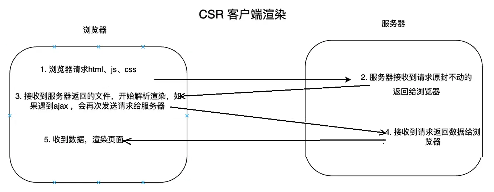
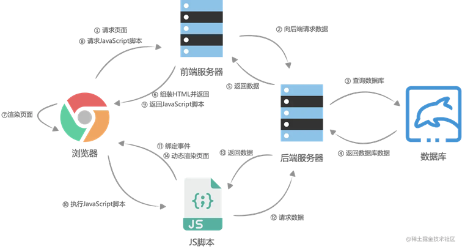

[Main Concepts of NextJS](#top)

- [Dynamic route](#dynamic-route)
- [渲染后移 SSR SSG](#渲染后移-ssr-ssg)

------------------------------------------------------

## Dynamic route

```ts
//method 1: localhost:3000/user/123
// src/pages/user/[userId].js
import { useRouter } from 'next/router';
function User() {
  const router = useRouter();
  const { userId } = router.query;

  return <h1>User ID: {userId}</h1>;
}
export default User;
//method 2: localhost:3000/posts/1
// src\pages\posts\[id].jsx
const Post = ({data}) => {
  return (
    <div>
      <h2>{ data.name }</h2>
      <div>height: {data.height}</div>
      <div>weight: {data.weight}</div>
      <div>
        
      </div>
    </div>
  )
}
export default Post;

export async function getServerSideProps(context) {
  const { id } = context.query;
  const res = await fetch(`https://pokeapi.co/api/v2/pokemon/${id}`).then(
    (data) => data.json()
  );
  return {
    props: { data: res }
  };
}
```

## 渲染后移 SSR SSG

- `getServerSideProps()`  --> SSR, 每个请求request时候生成
- `getStaticProps()`      --> SSG，build时候生成  --> 用于生成动态路由的路径。它确定了哪些路径在构建时应该被预先渲染
- `getStaticPaths()`      --> SSG，build时候生成  --> 用于获取页面的静态数据。它用于预先获取页面所需的数据，并在构建时将其注入到页面中

```ts
import _ from 'lodash'
export async function getStaticProps(context) {
  const { id } = context.params;
  const res = await fetch(`https://pokeapi.co/api/v2/pokemon/${id}`).then(
    (data) => data.json()
  );
  return {
    props: { data: res },
    revalidate: 10,   //静态页面存在时间是10s
  };
}
export async function getStaticPaths() {
    return {
        paths: _.range(1, 20).map((id) => ({ params: { id: id + "" }})),
        fallback: "blocking",   // false -> 404, true -> error
    };
}
```


|||
|---|---|
|CSR：Client Side Rendering，客户端渲染||
|SSR：Server Side Rendering，服务端渲染||
|SSG：Static Site Generation，静态网站生成||
|ISR：Incremental Site Rendering，增量式的网站渲染||
|DPR：Distributed Persistent Rendering，分布式的持续渲染||

