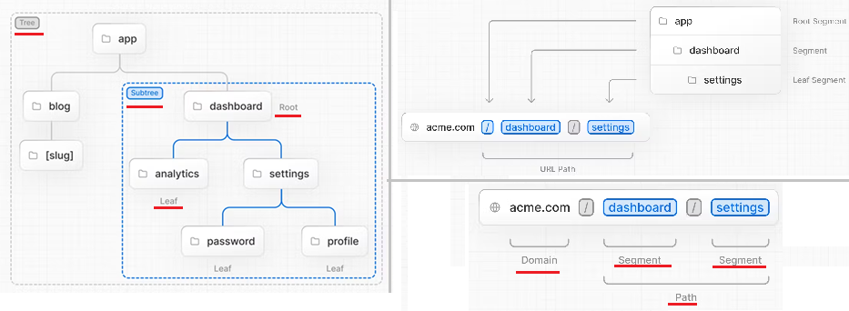
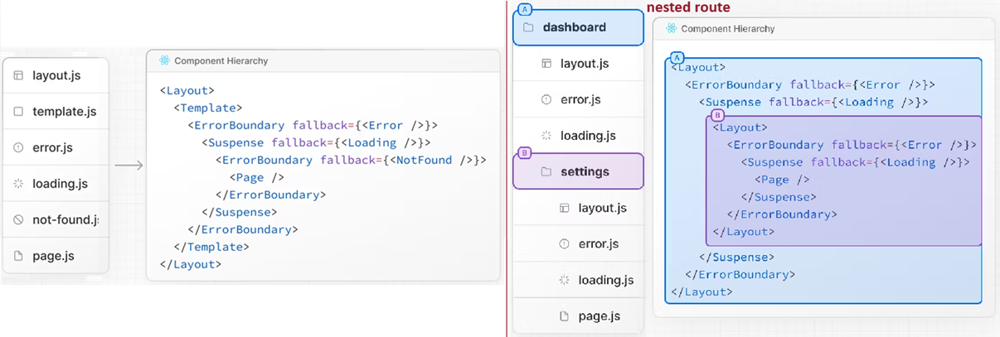
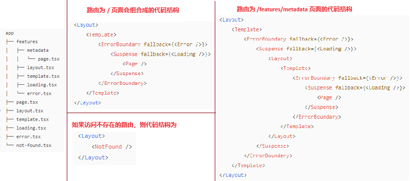
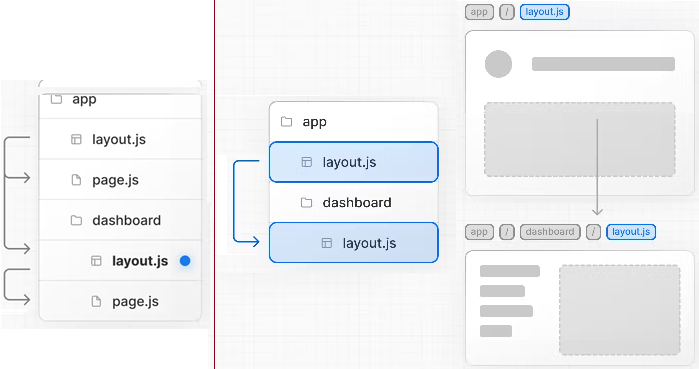
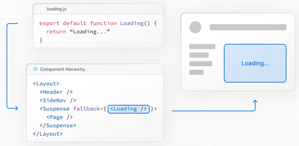
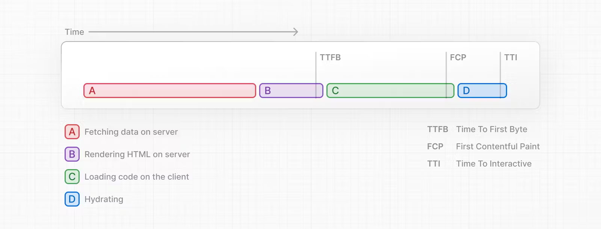
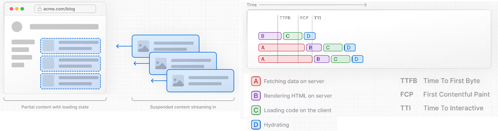

[NextJs学习-App Router](#top)

- [Terminology](#terminology)
- [Component Hierarchy](#component-hierarchy)
- [Advanced Routing Patterns](#advanced-routing-patterns)
- [Pages and Layouts](#pages-and-layouts)
  - [Templates](#templates)
  - [Metadata](#metadata)
- [Linking and Navigating](#linking-and-navigating)
  - [ Component](#-component)
  - [useRouter hook](#userouter-hook)
  - [redirect function](#redirect-function)
  - [Using the native History API](#using-the-native-history-api)
  - [Routing and Navigation](#routing-and-navigation)
- [Loading UI and Streaming](#loading-ui-and-streaming)
  - [Instant loading state- loading.tsx](#instant-loading-state--loadingtsx)
  - [Streaming with Suspense- loading.tsx](#streaming-with-suspense--loadingtsx)
  - [SEO](#seo)
- [Error Handling-error.tsx](#error-handling-errortsx)

-----------------------------------------------------------------

- app 模式主要从以下三个方面来扩展和调整文件路由系统
  - 约定页面相关内容
  - 平行路由和插槽功能
  - 约定 web api 路由实现
- The App Router works in a new directory named **app**
  - If application uses the **pages** directory, please also see the [Pages Router](https://nextjs.org/docs/pages/building-your-application/routing) documentation
- Note: 
  - The App Router takes priority over the Pages Router
  - <mark>By default, components inside **app** are React Server Components</mark>, but can be set to a Client Component
  - 默认还是 pages 模式，可在配置中开启 app 模式

```ts
// next.config.js
/** @type {import('next').NextConfig} */
const nextConfig = {
  experimental: {
    appDir: true
  }
}
module.exports = nextConfig
```

- 在app目录下，默认的js文件都只会运行在服务端，不会出现在客户端，如果需要在客户端进行交互的组件，那么需要在 js 文件最顶部添加 "use client" 来标识，表明代码需要在客户端运行，这时候这部分代码才会出现在客户端
- 实现多种渲染模式
  - SSG：页面默认就是 SSG
  - CSR：在使用 "use client" 的客户端组件中进行请求数据，也是基于SSG，然后在客户端 hydrate 后进行请求数据更新页面内容
  - SSR：服务端组件声明为异步组件，也就是 async 函数组件，且数据请求关闭缓存，也就是fetch请求时第二个参数中的cache字段设置为 no-store 、 no-cache 或者 设置revalidate 为 0 的时候，才会是动态服务端渲染
  - ISR：在请求中设置 revalidate ，或者在 page.js 中设置 revalidate :export revalidate = 60 60秒进行增量静态化，也可以继续使用 pages/api/revalidate 的指令方式，需要注意还是需要写在 pages 目录

[⬆ back to top](#top)

## Terminology

- 

## Component Hierarchy

- React components defined in special files of a route segment are rendered in a specific hierarchy
- 
- 
- 

## Advanced Routing Patterns

- [Parallel Routes](https://nextjs.org/docs/app/building-your-application/routing/parallel-routes): 平行路由
  - 多个平行的路由可以在同一个页面当成组件来显示，提升代码的组织能力
  - 使用方式为：使用 @ 开头的目录名下面的文件，将会自动注入到 Layout 组件的 props 中
  - 比如有一个数据面板页面，页面分为了两个模块：用户数据模块、性能数据模块
- [Intercepting Routes](https://nextjs.org/docs/app/building-your-application/routing/intercepting-routes):插槽功能

```
app
├── dashboard
│   ├── @userInfo           // 用户行为数据模块
│   │   ├── devices         // 用户设备信息
│   │   │   └── page.tsx
│   │   ├── locations       // 用户地理位置分布
│   │   │   └── page.tsx
│   │   ├── default.tsx
│   │   └── page.tsx
│   ├── @performance        // 性能数据模块
│   │   ├── app             // app 性能数据
│   │   │   └── page.tsx
│   │   ├── web             // web性能数据
│   │   │   └── page.tsx
│   │   ├── default.tsx
│   │   ├── page.tsx
│   │   └── default.tsx
│   └── layout.tsx
├── page.tsx
└── layout.tsx
```

```ts
//app/dashboard/layout.tsx
import Link from "next/link";
export default function Layout({ children, userInfo, performance }: any) {
  return (
    <>
      {children}
      <h2>用户行为数据</h2>
      {/* 导航 */}
      <div>
        <Link href={"/dashboard/devices"}>设备信息 </Link>
        <Link href={"/dashboard/locations"}>地理位置</Link>
      </div>
      <div className="userInfo">{userInfo}</div>
      <br />
      <h2>性能数据</h2>
      {/* 导航 */}
      <div>
        <Link href={"/dashboard/app"}>app 性能数据</Link>
        <Link href={"/dashboard/web"}>web 性能数据</Link>
      </div>
      <div className="performance">{performance}</div>
    </>
  );
}
```

- 约定 web api 路由实现：
  - 约定 route.js 为 api 文件，和 page 类似，即 app/test/api/user/route.js 代表的web接口为 /test/api/user，可以定义 GET 、POST、PUT、PATCH、DELETE、HEAD 和 OPTIONS 请求方式。如果调用了未定义的请求方式，则返回 405，表示不支持该请求方式
  - route.js 和 page.js 冲突，当有 page.js 时，route.js 就不会生效
  - [Route Handlers](https://link.juejin.cn/?target=https%3A%2F%2Fbeta.nextjs.org%2Fdocs%2Frouting%2Froute-handlers)

```ts
import { NextResponse, type NextRequest } from 'next/server';
export async function GET(req: NextRequest, { params }: { params: Record<string, string | string | undefined[]> }) {
  const res = await fetch('https://data.mongodb-api.com/...', {
    headers: {
      'Content-Type': 'application/json',
      'API-Key': process.env.DATA_API_KEY,
    },
  });
  const data = await res.json();
  return NextResponse.json({ data })
}
export async function POST(req: NextRequest, { params }: { params: Record<string, string | string | undefined[]> }) {
  // ...
  return NextResponse.json({
      // ...
  })
}
```

[⬆ back to top](#top)

## Pages and Layouts

- The special files `layout.js`, `page.js`, and `template.js` allow you to create UI for a route
- A layout is UI that is shared between multiple routes
- 
- `page.js`: defaultly exporting page
- `layout.js`:  defaultly layout, the component should accept a `children prop` that will be populated with a child layout (if it exists) or a page during rendering
  - Layouts are Server Components by default but can be set to a Client Component
  - Only the root layout can contain `<html>` and `<body>` tags

|file|explanation|
|---|---|
|page.js| 页面组件（app/page.js代表路由为 / 的页面，其实就类似于取代 index.js），有 page.js 才能表明该约定文件路由是一个页面|
|layout.js| 布局组件，切换路由时保留状态，不重新渲染|
|template.js| 模版组件，和 layout 类似，但切换路由时会重新渲染，不保留状态|
|loading.js| 加载组件，就是使用 Suspense 组件包裹 Page 组件，在 Page 组件渲染返回内容之前显示加载组件|
|error.js| 错误文件，页面渲染异常的时候显示的组件|
|not-found.js| 页面404组件，只在 app 目录下第一级目录生效，存在时只有根 layout 生效|

- 除了 not-found.js ，其他的约定组件则对app下所有目录生效

```ts
//app/page.tsx ---  is the UI for the `/` URL
export default function Page() {
  return <h1>Hello, Home page!</h1>
}
//app/dashboard/page.tsx -- is the UI for the `/dashboard` URL
export default function Page() {
  return <h1>Hello, Dashboard Page!</h1>
}
// app/layout.tsx  ----Root Layout (Required)
export default function RootLayout({
  children,
}: {
  children: React.ReactNode
}) {
  return (
    <html lang="en">
      <body>
        {/* Layout UI */}
        <main>{children}</main>
      </body>
    </html>
  )
}
// app/dashboard/layout.tsx
export default function DashboardLayout({
  children, // will be a page or nested layout
}: {
  children: React.ReactNode
}) {
  return (
    <section>
      {/* Include shared UI here e.g. a header or sidebar */}
      <nav></nav>
      {children}
    </section>
  )
}
```

[⬆ back to top](#top)

### Templates

- Templates are similar to layouts in that they wrap each child layout or page
- Unlike layouts that persist across routes and maintain state, templates create a new instance for each of their children on navigation. This means that when a user navigates between routes that share a template, a new instance of the component is mounted, DOM elements are recreated, **state is not preserved**, and **effects are re-synchronized**
  - Features that rely on `useEffect` (e.g logging page views) and `useState` (e.g a per-page feedback form)
  - To change the default framework behavior
- A template can be defined by exporting a default React component from a template.js file. The component should accept a children prop

```ts
// app/template.tsx
export default function Template({ children }: { children: React.ReactNode }) {
  return <div>{children}</div>
}
// output 
<Layout>
  {/* Note that the template is given a unique key. */}
  <Template key={routeParam}>{children}</Template>
</Layout>
```

[⬆ back to top](#top)

### Metadata

- Metadata can be defined by exporting a `metadata` object or `generateMetadata` function in a layout.js or page.js file
- Learn more about available metadata options in the [Metadata API](https://nextjs.org/docs/app/api-reference/functions/generate-metadata)

```ts
//app/page.tsx
import { Metadata } from 'next'
export const metadata: Metadata = {
  title: 'Next.js',
}
export default function Page() {
  return '...'
}
```

[⬆ back to top](#top)

## Linking and Navigating

### <Link> Component

- `<Link>` is a built-in component that extends the HTML `<a>` tag to provide **prefetching** and **client-side navigation** between routes
- Samples
  - Linking to Dynamic Segments: `<Link href={`/blog/${post.slug}`}>{post.title}</Link>`
  - Checking Active Links:  `<Link className={`link ${pathname === '/' ? 'active' : ''}`} href="/">Home</Link>`
  - Scrolling to an id:  `<Link href="/dashboard#settings">Settings</Link>`
- Disabling scroll restoration: 
  - The default behavior of the Next.js App Router is to scroll to the top of a new route or to maintain the scroll position for backwards and forwards navigation 
  - pass `scroll={false}` to the `<Link>` component
  - `scroll: false` to `router.push()` or `router.replace()`

```ts
import Link from 'next/link'
export default function Page() {
  return <Link href="/dashboard">Dashboard</Link>
}
//1) Linking to Dynamic Segments
export default function PostList({ posts }) {
  return (
    <ul>
      {posts.map((post) => (
        <li key={post.id}>
          <Link href={`/blog/${post.slug}`}>{post.title}</Link>
        </li>
      ))}
    </ul>
  )
}
//2) Checking Active Links
'use client'
import { usePathname } from 'next/navigation'
import Link from 'next/link'
export function Links() {
  const pathname = usePathname()
  return (
    <nav>
      <ul>
        <li><Link className={`link ${pathname === '/' ? 'active' : ''}`} href="/"> Home </Link></li>
        <li><Link className={`link ${pathname === '/about' ? 'active' : ''}`} href="/about">About</Link></li>
      </ul>
    </nav>
  )
}
//3) Scrolling to an id
<Link href="/dashboard#settings">Settings</Link>
// Output
<a href="/dashboard#settings">Settings</a>
//4) Disabling scroll restoration
// next/link
<Link href="/dashboard" scroll={false}> Dashboard </Link>
// useRouter
import { useRouter } from 'next/navigation'
const router = useRouter()
router.push('/dashboard', { scroll: false })
```

[⬆ back to top](#top)

### useRouter hook

- `useRouter` hook allows you to programmatically change routes from Client Components
- [useRouter API reference](https://nextjs.org/docs/app/api-reference/functions/use-router)
- 推荐使用： Use the `<Link>` component to navigate between routes unless you have a specific requirement for using `useRouter`

```ts
'use client'
import { useRouter } from 'next/navigation'
export default function Page() {
  const router = useRouter()
  return (
    <button type="button" onClick={() => router.push('/dashboard')}>
      Dashboard
    </button>
  )
}
```

[⬆ back to top](#top)

### redirect function

- For **Server Components**, use the redirect function instead
  - `redirect` can be called in Client Components during the rendering process but not in event handlers. You can use the `useRouter hook` instead.
- `redirect` returns a 307 (Temporary Redirect) status code by default
- `redirect` returns a 303 When used in a Server Action
- 

```ts
import { redirect } from 'next/navigation'
async function fetchTeam(id: string) {
  const res = await fetch('https://...')
  if (!res.ok) return undefined
  return res.json()
}
export default async function Profile({ params }: { params: { id: string } }) {
  const team = await fetchTeam(params.id)
  if (!team) {
    redirect('/login')
  }
  // ...
}
```

[⬆ back to top](#top)

### Using the native History API

- Next.js allows you to use the native `window.history.pushState` and `window.history.replaceState` methods to update the browser's history stack **without reloading the page**
- `pushState` and `replaceState` calls integrate into the Next.js Router, allowing you to sync with `usePathname` and `useSearchParams`

```ts
'use client'
import { useSearchParams } from 'next/navigation'
export default function SortProducts() {
  const searchParams = useSearchParams()
  function updateSorting(sortOrder: string) {
    const params = new URLSearchParams(searchParams.toString())
    params.set('sort', sortOrder)
    window.history.pushState(null, '', `?${params.toString()}`)
  }
  return (
    <>
      <button onClick={() => updateSorting('asc')}>Sort Ascending</button>
      <button onClick={() => updateSorting('desc')}>Sort Descending</button>
    </>
  )
}
//window.history.replaceStat
//Use it to replace the current entry on the browser's history stack. 
// The user is not able to navigate back to the previous state. For example, to switch the application's locale
'use client'
import { usePathname } from 'next/navigation'
export function LocaleSwitcher() {
  const pathname = usePathname()
  function switchLocale(locale: string) {
    // e.g. '/en/about' or '/fr/contact'
    const newPath = `/${locale}${pathname}`
    window.history.replaceState(null, '', newPath)
  }
  return (
    <>
      <button onClick={() => switchLocale('en')}>English</button>
      <button onClick={() => switchLocale('fr')}>French</button>
    </>
  )
}
```

[⬆ back to top](#top)

### Routing and Navigation

1. Code splitting: Server Components allow your application code to be automatically code-split by route segments. This means only the code needed for the current route is loaded on navigation
   1. [<Link> API reference](https://nextjs.org/docs/app/api-reference/components/link)
2. Prefetching: two ways routes are prefetched in Next.js
   1. `<Link>` component: Routes are automatically prefetched
   2. `router.prefetch()`: The `useRouter hook` can be used to prefetch routes programmatically
3. Router Cache: an in-memory client-side cache
   1. As users navigate around the app, the React Server Component Payload of prefetched route segments and visited routes are stored in the cache
   2. This means on navigation, the cache is reused as much as possible, instead of making a new request to the server - improving performance by reducing the number of requests and data transferred
4. Partial rendering: only the route segments that change on navigation re-render on the client, and any shared segments are preserved
   1. For example, when navigating between two sibling routes, /dashboard/settings and /dashboard/analytics, the settings and analytics pages will be rendered, and the shared dashboard layout will be preserved
5. Soft navigation: only the route segments that have changed are re-rendered (partial rendering). This enables client React state to be preserved during navigation
6. Backwards and forwards navigation: re-use route segments in the Router Cache

[⬆ back to top](#top)

## Loading UI and Streaming

### Instant loading state- loading.tsx

- instant loading state is **fallback UI** that is shown immediately upon navigation
- can pre-render loading indicators such as skeletons and spinners, or a cover photo, title, etc
- 

```ts
//app/dashboard/loading.tsx
export default function Loading() {
  return <LoadingSkeleton />  // You can add any UI inside Loading, including a Skeleton.
}
```

[⬆ back to top](#top)

### Streaming with Suspense- loading.tsx

- The App Router supports streaming with Suspense for both Node.js and Edge runtimes
- 传统ssr渲染流程
  - 
  - 传统的ssr渲染流程，当用户请求一个页面时，服务器会根据路由匹配到对应的组件，然后渲染该组件，最后将渲染后的html返回给用户。
  - 如果组件中存在异步数据，那么服务端会等待异步数据加载完成之后再渲染，这样可能会导致页面白屏时间较长的问题
- Streaming流式渲染
  - 
  - 把一个组件拆分成多个小块，然后分块渲染
  - 当客户端请求页面时会优先展示静态内容，等到服务端异步数据加载完成并渲染成功后，客户端再继续渲染剩余的内容
  - 注意: 流式渲染并不会提高整个页面的加载速度，只是将白屏时间缩短了

```ts
//app/dashboard/page.tsx
import { Suspense } from 'react'
import { PostFeed, Weather } from './Components'
export default function Posts() {
  return (
    <section>
      <Suspense fallback={<p>Loading feed...</p>}>
        <PostFeed />
      </Suspense>
      <Suspense fallback={<p>Loading weather...</p>}>
        <Weather />
      </Suspense>
    </section>
  )
}
// 
export default async function PostFeed() {
    const list = await fetch('https://xxx')
    return (<pre>list</pre>)
}
// 
export default async function Weather() {
    const list = await fetch('https://xxx')
    return (<pre>list</pre>)
}
```

### SEO

- Since streaming is server-rendered, it does not impact SEO. You can use the [Rich Results Test tool](https://search.google.com/test/rich-results) from Google to see how your page appears to Google's web crawlers and view the serialized HTML

[⬆ back to top](#top)

## Error Handling-error.tsx


[⬆ back to top](#top)

> References
- [Next.js official](https://nextjs.org/)
- [Using App Router-official](https://nextjs.org/docs/app)
- [Next.js运用实践](https://juejin.cn/column/7196868559125250104)
- [Next.js 13 的 app 目录模式功能梳理](https://juejin.cn/post/7221162775074734135)
- [nextjs-cn文档](https://blog.chdl.fun/ChBlog/docs/category/nextjs)
