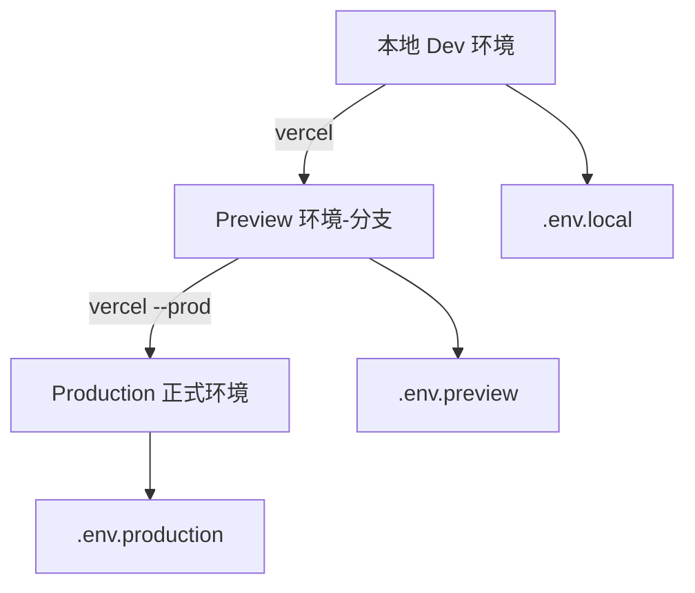
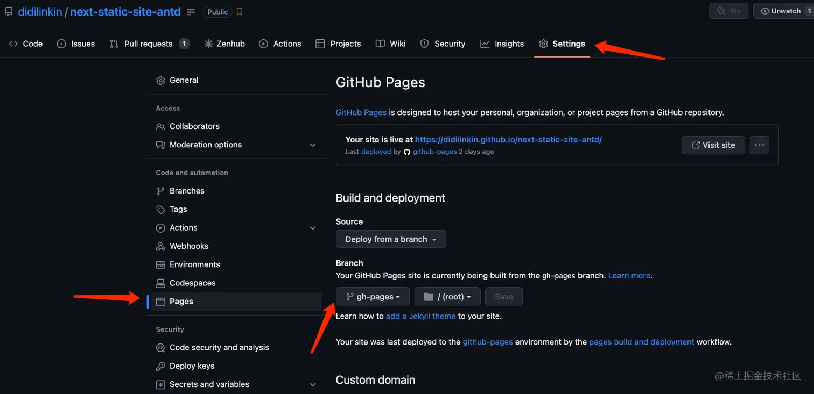
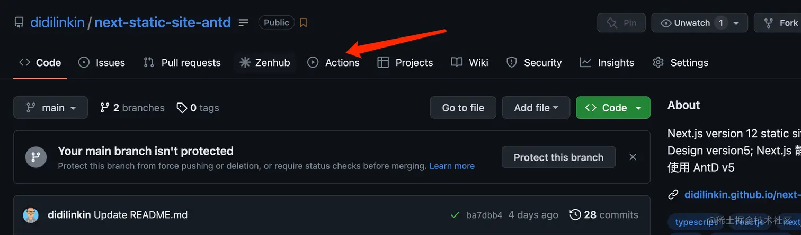
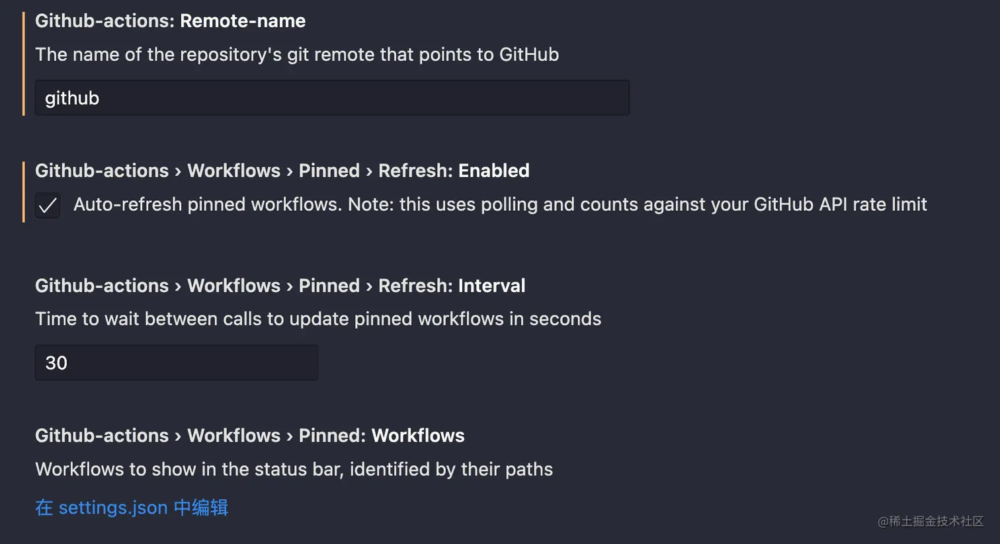
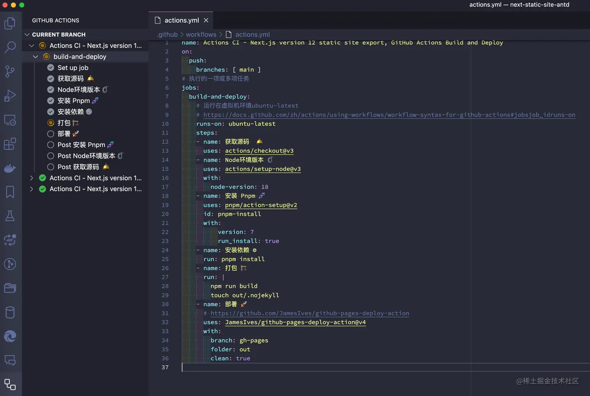

[Next.js多环境部署](#top)

- [环境变量的分离与管理](#环境变量的分离与管理)
- [部署到Vercel](#部署到vercel)
  - [在Vercel中配置环境变量](#在vercel中配置环境变量)
  - [Vercel CLI 配置与部署流程](#vercel-cli-配置与部署流程)
- [部署GitHub](#部署github)
  - [配置GitHub Actions](#配置github-actions)
  - [VS Code官方插件Github Actions](#vs-code官方插件github-actions)
  - [配置 Next.js](#配置-nextjs)

-------------------------------------------------------
|环境|说明|典型用途|Vercel部署阶段|
|---|---|---|---|
|🧪Development	|本地开发环境	|本地调试、快速重启、实验功能|本地运行：`next dev`|
|👀 Preview (Staging)	|临时预览环境	|Pull Request 预览、产品验收测试|分支部署：`git push feature/...`|
|🚀 Production	|线上正式环境	|最终用户访问|合并主分支：`git push main`|

## 环境变量的分离与管理

```bash
.env.local         # 本地开发环境
.env.development   # `next dev` 使用
.env.preview       # Vercel Preview 环境使用
.env.production    # Vercel Production 环境使用
```

```ini
# .env.local
NEXT_PUBLIC_API_BASE=http://localhost:3000/api
PRIVATE_KEY_LOCAL=dev_secret
# .env.preview
NEXT_PUBLIC_API_BASE=https://preview-api.example.com
PRIVATE_KEY_PREVIEW=preview_secret
# .env.production
NEXT_PUBLIC_API_BASE=https://api.example.com
PRIVATE_KEY_PRODUCTION=prod_secret
```

## 部署到Vercel

- Next.js会在构建时读取环境变量，根据运行命令自动选择优先级, 优先级从高到低
  - <mark>`.env.local > .env.[mode] > .env`</mark>
- 以 `NEXT_PUBLIC_` 开头的变量会暴露到浏览器端
- 其他变量（如数据库密钥）仅在 Node.js 端可访问

### 在Vercel中配置环境变量

1. 打开项目 → 点击 Settings → Environment Variables
2. 添加以下键值：

|Name|Value|Environment|
|---|---|---|
|NEXT_PUBLIC_API_BASE|http://localhost:3000/api|Development|
|NEXT_PUBLIC_API_BASE|https://preview-api.example.com|Preview|
|NEXT_PUBLIC_API_BASE|https://api.example.com|Production|

### Vercel CLI 配置与部署流程



1. `npm install -g vercel`
2. `vercel login`
3. `vercel init`
4. 部署命令

|命令	|作用|
|---|---|
|`vercel dev`	|启动本地 Vercel 模拟环境（等价于 next dev）|
|`vercel`	|部署到 Preview 环境（默认）|
|`vercel --prod`|	部署到 Production|

[⬆ back to top](#top)

## 部署GitHub

###　配置GitHub Pages

- Github Pages 是 GitHub的静态站点托管服务
- Settings > Pages > Source中, 将Branch分支设定在`.gh-pages` 并点击Save保存配置(通常是将服务设置在`.gh-pages`分支)
   - 

### 配置GitHub Actions

- GitHub Actions 是 GitHub 的持续集成服务, 允许创建自定义工作流，可使用这些工作流来自动化开发过程，例如 构建、测试和部署代码
  - 
- GitHub Actions的配置文件叫做workflow文件，存放在代码仓库的 `.github/workflows`目录
- workflow文件采用**YAML**格式
- 一个库可以有多个 workflow 文件, GitHub只要发现`.github/workflows`目录里面有 *.yml文件, 就会自动运行该文件

|GitHub Actions字段||
|---|---|
|`name`|name 字段是 workflow 的名称。如果省略该字段，默认为当前 workflow 的文件名|
|`on`|on 字段指定触发 workflow 的条件，通常是某些事件|
|`on.<push|pull_request>.<tags|branches>`|指定触发事件时，可以限定分支或标签|
|`jobs.<job_id>.name`|workflow 文件的主体是jobs字段, 表示要执行的一项或多项任务|
|`jobs.<job_id>.needs`|needs 字段指定当前任务的依赖关系, 即运行顺序|
|`jobs.<job_id>.runs-on`|runs-on 字段指定运行所需要的虚拟机环境, 它是必填字段|
|`jobs.<job_id>.steps`|steps 字段指定每个 Job 的运行步骤，可以包含一个或多个步骤, 每个步骤都可以指定三个字段|

- github/workflows/actions.yml

```ymal
name: Actions CI - Next.js version 12 static site export, GitHub Actions Build and Deploy
on:
  push:
    branches: [ main ]
# 执行的一项或多项任务
jobs:
  build-and-deploy:
    # 运行在虚拟机环境ubuntu-latest
    # https://docs.github.com/zh/actions/using-workflows/workflow-syntax-for-github-actions#jobsjob_idruns-on
    runs-on: ubuntu-latest
    steps:
    - name: 获取源码  🛎️
      uses: actions/checkout@v3
    - name: Node环境版本 🗜️
      uses: actions/setup-node@v3
      with:
        node-version: 18
    - name: 安装 Pnpm 🧬
      uses: pnpm/action-setup@v2
      id: pnpm-install
      with:
          version: 7
          run_install: true
    - name: 安装依赖 ⚙️
      run: pnpm install
    - name: 打包 🏗️
      run: |
        npm run build
        touch out/.nojekyll
    - name: 部署 🚀
      uses: JamesIves/github-pages-deploy-action@v4
      with:
        branch: gh-pages
        folder: out
        clean: true
```

### VS Code官方插件Github Actions

- VS Code官方插件 [Github Actions](https://marketplace.visualstudio.com/items?itemName=github.vscode-github-actions)
- 插件配置
  - 设置 VS Code编辑器登录 GitHub账号, 并且绑定
  - 将 remote名称 设置为上传 GitHub的 remote名称, 默认值: origin
- 勾选 **Auto-refresh** 自动刷新, 可以实时查看 workflow工作流状态
  - 
  - 

### 配置 Next.js

- prepare
  - 创建Next.js应用程序并使用`npm run build`命令生成静态文件
  - 在项目根目录下创建一个名为“out”的文件夹，并将生成的静态文件放入其中
  - 在项目根目录下创建一个名为“package.json”的文件，并添加以下代码

```js
{
    "name": "my-nextjs-app",
    "homepage": "https://your-username.github.io/your-app-name",
    "scripts": {
        "build": "next build && next export",
        "deploy": "gh-pages -d out"   #将静态文件部署到GitHub Pages
    },
    "dependencies": {
        "gh-pages": "^3.2.0",
        "next": "^12.0.1",
        "react": "^17.0.2",
        "react-dom": "^17.0.2"
    },
    "devDependencies": {
        "typescript": "^4.5.5"
    }
}
```

1. 配置路径
   1. Next.js的 `next/image`、`next/link` 和 `next/router` 指定路径是相对于 `/`的, 所以需要通过配置使 Next.js 得到 `/<repo>`
   2. 有两个相关的配置选项: `basePath` 和 `assetPrefix`
      1. 将 `basePath` 设置为 `/<repo name>` 将生成 GitHub Pages 可访问链接
      2. 将 `assetPrefix` 设置为 `/<repo name>/` 将生成 GitHub Pages 可访问图像
2. 'next.config.js'

```js
// next.config.js
/** @type {import('next').NextConfig} */
// 用于为静态资源（如图像、样式表、JavaScript 文件等）设置 URL 前缀
// 这在将应用部署到自定义域名或 CDN 上时特别有用，因为它允许您将静态资源存储在不同的位置
let assetPrefix = `/${repo}/`
// 用于为应用设置基础路径
// 这在将应用部署到子目录下时特别有用，因为它允许您指定应用所在的目录
let basePath = `/${repo}`
const isGithubActions = process.env.GITHUB_ACTIONS || false
if (isGithubActions) {
  const repo = process.env.GITHUB_REPOSITORY.replace(/.*?\//, '')
  assetPrefix = `/${repo}/`
  basePath = `/${repo}`
}
const nextConfig = {
  assetPrefix,
  basePath,
  reactStrictMode: true,
  images: {
    unoptimized: true,
  },
}
module.exports = nextConfig
```

[⬆ back to top](#top)

- [使用 GitHub Actions 构建、部署 Next.js 并将其托管到 GitHub Pages](https://juejin.cn/post/7220410343649624121)
