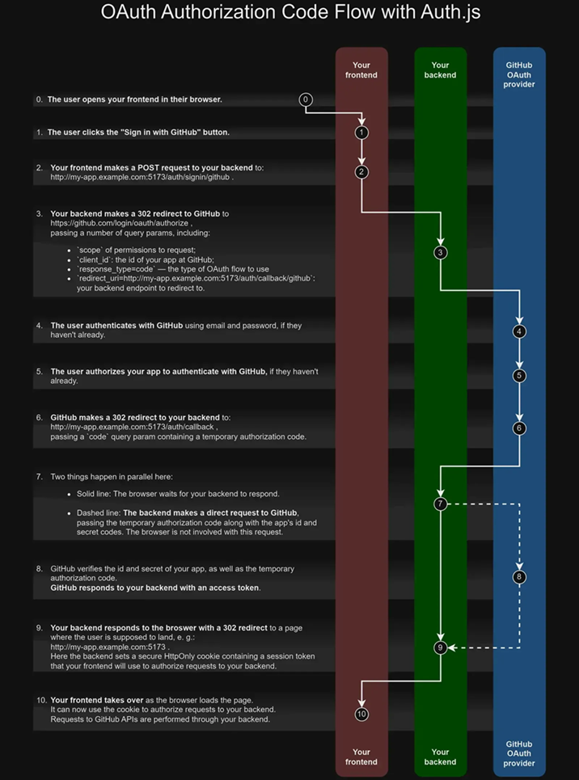
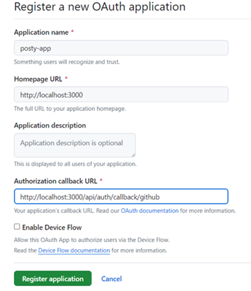

[NextJs学习-AuthJS](#top)

- [Concepts of OAuth in AuthJs](#concepts-of-oauth-in-authjs)
  - [How OAuth work](#how-oauth-work)
  - [Session strategies](#session-strategies)
- [Database models in AuthJS](#database-models-in-authjs)
- [Setup AuthJS for nextjs](#setup-authjs-for-nextjs)
- [Session Management of AuthJS](#session-management-of-authjs)
  - [Signin and Signout](#signin-and-signout)
    - [Page Server Side](#page-server-side)
    - [Page Client Side](#page-client-side)
  - [Get Session](#get-session)
- [date-fns](#date-fns)

--------------------------------------
## Concepts of OAuth in AuthJs

### How OAuth work

- Authentication Providers in 'Auth.js' are **predefined** OAuth configurations that allow your users to sign in with pre-existing logins at their favorite service
- [Configuring an OAuth provider](https://authjs.dev/guides/configuring-oauth-providers)
- the OAuth Authorization Code flow we support generally has 6 parts:
  1. The application requests authorization to access service resources from the user
  2. If the user authorized the request, the application receives an authorization grant
  3. The application requests an access token from the authorization server (API) by presenting authentication of its own identity, and the authorization grant
  4. If the application identity is authenticated and the authorization grant is valid, the authorization server (API) issues an access token to the application. Authorization is complete.
  5. The application requests the resource from the resource server (API) and presents the access token for authentication
  6. If the access token is valid, the resource server (API) serves the resource to the application

<svg id="r3b" width="100%" xmlns="http://www.w3.org/2000/svg" style="max-width: 1079px;" viewBox="-195 -10 1079 1961" role="graphics-document document" aria-roledescription="sequence"><g><rect x="619.5" y="1875" fill="#eaeaea" stroke="#666" width="181" height="65" rx="3" ry="3" class="actor"></rect><text x="710" y="1907.5" dominant-baseline="central" alignment-baseline="central" class="actor" style="text-anchor: middle; font-size: 16px; font-weight: 400; font-family: inherit;"><tspan x="710" dy="0">Auth Server (GitHub)</tspan></text></g><g><rect x="261" y="1875" fill="#eaeaea" stroke="#666" width="150" height="65" rx="3" ry="3" class="actor"></rect><text x="336" y="1907.5" dominant-baseline="central" alignment-baseline="central" class="actor" style="text-anchor: middle; font-size: 16px; font-weight: 400; font-family: inherit;"><tspan x="336" dy="0">App Server</tspan></text></g><g><rect x="0" y="1875" fill="#eaeaea" stroke="#666" width="150" height="65" rx="3" ry="3" class="actor"></rect><text x="75" y="1907.5" dominant-baseline="central" alignment-baseline="central" class="actor" style="text-anchor: middle; font-size: 16px; font-weight: 400; font-family: inherit;"><tspan x="75" dy="0">Browser</tspan></text></g><g><line id="actor5" x1="710" y1="5" x2="710" y2="1875" class="200" stroke-width="0.5px" stroke="#999"></line><g id="root-5"><rect x="619.5" y="0" fill="#eaeaea" stroke="#666" width="181" height="65" rx="3" ry="3" class="actor"></rect><text x="710" y="32.5" dominant-baseline="central" alignment-baseline="central" class="actor" style="text-anchor: middle; font-size: 16px; font-weight: 400; font-family: inherit;"><tspan x="710" dy="0">Auth Server (GitHub)</tspan></text></g></g><g><line id="actor4" x1="336" y1="5" x2="336" y2="1875" class="200" stroke-width="0.5px" stroke="#999"></line><g id="root-4"><rect x="261" y="0" fill="#eaeaea" stroke="#666" width="150" height="65" rx="3" ry="3" class="actor"></rect><text x="336" y="32.5" dominant-baseline="central" alignment-baseline="central" class="actor" style="text-anchor: middle; font-size: 16px; font-weight: 400; font-family: inherit;"><tspan x="336" dy="0">App Server</tspan></text></g></g><g><line id="actor3" x1="75" y1="5" x2="75" y2="1875" class="200" stroke-width="0.5px" stroke="#999"></line><g id="root-3"><rect x="0" y="0" fill="#eaeaea" stroke="#666" width="150" height="65" rx="3" ry="3" class="actor"></rect><text x="75" y="32.5" dominant-baseline="central" alignment-baseline="central" class="actor" style="text-anchor: middle; font-size: 16px; font-weight: 400; font-family: inherit;"><tspan x="75" dy="0">Browser</tspan></text></g></g><style>#r3b{margin:1.5rem auto 0;}#r3b{font-family:inherit;font-size:16px;fill:#333;}#r3b .error-icon{fill:#552222;}#r3b .error-text{fill:#552222;stroke:#552222;}#r3b .edge-thickness-normal{stroke-width:2px;}#r3b .edge-thickness-thick{stroke-width:3.5px;}#r3b .edge-pattern-solid{stroke-dasharray:0;}#r3b .edge-pattern-dashed{stroke-dasharray:3;}#r3b .edge-pattern-dotted{stroke-dasharray:2;}#r3b .marker{fill:#333333;stroke:#333333;}#r3b .marker.cross{stroke:#333333;}#r3b svg{font-family:inherit;font-size:16px;}#r3b .actor{stroke:hsl(259.6261682243, 59.7765363128%, 87.9019607843%);fill:#ECECFF;}#r3b text.actor&gt;tspan{fill:black;stroke:none;}#r3b .actor-line{stroke:grey;}#r3b .messageLine0{stroke-width:1.5;stroke-dasharray:none;stroke:#333;}#r3b .messageLine1{stroke-width:1.5;stroke-dasharray:2,2;stroke:#333;}#r3b #arrowhead path{fill:#333;stroke:#333;}#r3b .sequenceNumber{fill:white;}#r3b #sequencenumber{fill:#333;}#r3b #crosshead path{fill:#333;stroke:#333;}#r3b .messageText{fill:#333;stroke:none;}#r3b .labelBox{stroke:hsl(259.6261682243, 59.7765363128%, 87.9019607843%);fill:#ECECFF;}#r3b .labelText,#r3b .labelText&gt;tspan{fill:black;stroke:none;}#r3b .loopText,#r3b .loopText&gt;tspan{fill:black;stroke:none;}#r3b .loopLine{stroke-width:2px;stroke-dasharray:2,2;stroke:hsl(259.6261682243, 59.7765363128%, 87.9019607843%);fill:hsl(259.6261682243, 59.7765363128%, 87.9019607843%);}#r3b .note{stroke:#aaaa33;fill:#fff5ad;}#r3b .noteText,#r3b .noteText&gt;tspan{fill:black;stroke:none;}#r3b .activation0{fill:#f4f4f4;stroke:#666;}#r3b .activation1{fill:#f4f4f4;stroke:#666;}#r3b .activation2{fill:#f4f4f4;stroke:#666;}#r3b .actorPopupMenu{position:absolute;}#r3b .actorPopupMenuPanel{position:absolute;fill:#ECECFF;box-shadow:0px 8px 16px 0px rgba(0,0,0,0.2);filter:drop-shadow(3px 5px 2px rgb(0 0 0 / 0.4));}#r3b .actor-man line{stroke:hsl(259.6261682243, 59.7765363128%, 87.9019607843%);fill:#ECECFF;}#r3b .actor-man circle,#r3b line{stroke:hsl(259.6261682243, 59.7765363128%, 87.9019607843%);fill:#ECECFF;stroke-width:2px;}#r3b :root{--mermaid-font-family:inherit;}</style><g></g><defs><symbol id="computer" width="24" height="24"><path transform="scale(.5)" d="M2 2v13h20v-13h-20zm18 11h-16v-9h16v9zm-10.228 6l.466-1h3.524l.467 1h-4.457zm14.228 3h-24l2-6h2.104l-1.33 4h18.45l-1.297-4h2.073l2 6zm-5-10h-14v-7h14v7z"></path></symbol></defs><defs><symbol id="database" fill-rule="evenodd" clip-rule="evenodd"><path transform="scale(.5)" d="M12.258.001l.256.004.255.005.253.008.251.01.249.012.247.015.246.016.242.019.241.02.239.023.236.024.233.027.231.028.229.031.225.032.223.034.22.036.217.038.214.04.211.041.208.043.205.045.201.046.198.048.194.05.191.051.187.053.183.054.18.056.175.057.172.059.168.06.163.061.16.063.155.064.15.066.074.033.073.033.071.034.07.034.069.035.068.035.067.035.066.035.064.036.064.036.062.036.06.036.06.037.058.037.058.037.055.038.055.038.053.038.052.038.051.039.05.039.048.039.047.039.045.04.044.04.043.04.041.04.04.041.039.041.037.041.036.041.034.041.033.042.032.042.03.042.029.042.027.042.026.043.024.043.023.043.021.043.02.043.018.044.017.043.015.044.013.044.012.044.011.045.009.044.007.045.006.045.004.045.002.045.001.045v17l-.001.045-.002.045-.004.045-.006.045-.007.045-.009.044-.011.045-.012.044-.013.044-.015.044-.017.043-.018.044-.02.043-.021.043-.023.043-.024.043-.026.043-.027.042-.029.042-.03.042-.032.042-.033.042-.034.041-.036.041-.037.041-.039.041-.04.041-.041.04-.043.04-.044.04-.045.04-.047.039-.048.039-.05.039-.051.039-.052.038-.053.038-.055.038-.055.038-.058.037-.058.037-.06.037-.06.036-.062.036-.064.036-.064.036-.066.035-.067.035-.068.035-.069.035-.07.034-.071.034-.073.033-.074.033-.15.066-.155.064-.16.063-.163.061-.168.06-.172.059-.175.057-.18.056-.183.054-.187.053-.191.051-.194.05-.198.048-.201.046-.205.045-.208.043-.211.041-.214.04-.217.038-.22.036-.223.034-.225.032-.229.031-.231.028-.233.027-.236.024-.239.023-.241.02-.242.019-.246.016-.247.015-.249.012-.251.01-.253.008-.255.005-.256.004-.258.001-.258-.001-.256-.004-.255-.005-.253-.008-.251-.01-.249-.012-.247-.015-.245-.016-.243-.019-.241-.02-.238-.023-.236-.024-.234-.027-.231-.028-.228-.031-.226-.032-.223-.034-.22-.036-.217-.038-.214-.04-.211-.041-.208-.043-.204-.045-.201-.046-.198-.048-.195-.05-.19-.051-.187-.053-.184-.054-.179-.056-.176-.057-.172-.059-.167-.06-.164-.061-.159-.063-.155-.064-.151-.066-.074-.033-.072-.033-.072-.034-.07-.034-.069-.035-.068-.035-.067-.035-.066-.035-.064-.036-.063-.036-.062-.036-.061-.036-.06-.037-.058-.037-.057-.037-.056-.038-.055-.038-.053-.038-.052-.038-.051-.039-.049-.039-.049-.039-.046-.039-.046-.04-.044-.04-.043-.04-.041-.04-.04-.041-.039-.041-.037-.041-.036-.041-.034-.041-.033-.042-.032-.042-.03-.042-.029-.042-.027-.042-.026-.043-.024-.043-.023-.043-.021-.043-.02-.043-.018-.044-.017-.043-.015-.044-.013-.044-.012-.044-.011-.045-.009-.044-.007-.045-.006-.045-.004-.045-.002-.045-.001-.045v-17l.001-.045.002-.045.004-.045.006-.045.007-.045.009-.044.011-.045.012-.044.013-.044.015-.044.017-.043.018-.044.02-.043.021-.043.023-.043.024-.043.026-.043.027-.042.029-.042.03-.042.032-.042.033-.042.034-.041.036-.041.037-.041.039-.041.04-.041.041-.04.043-.04.044-.04.046-.04.046-.039.049-.039.049-.039.051-.039.052-.038.053-.038.055-.038.056-.038.057-.037.058-.037.06-.037.061-.036.062-.036.063-.036.064-.036.066-.035.067-.035.068-.035.069-.035.07-.034.072-.034.072-.033.074-.033.151-.066.155-.064.159-.063.164-.061.167-.06.172-.059.176-.057.179-.056.184-.054.187-.053.19-.051.195-.05.198-.048.201-.046.204-.045.208-.043.211-.041.214-.04.217-.038.22-.036.223-.034.226-.032.228-.031.231-.028.234-.027.236-.024.238-.023.241-.02.243-.019.245-.016.247-.015.249-.012.251-.01.253-.008.255-.005.256-.004.258-.001.258.001zm-9.258 20.499v.01l.001.021.003.021.004.022.005.021.006.022.007.022.009.023.01.022.011.023.012.023.013.023.015.023.016.024.017.023.018.024.019.024.021.024.022.025.023.024.024.025.052.049.056.05.061.051.066.051.07.051.075.051.079.052.084.052.088.052.092.052.097.052.102.051.105.052.11.052.114.051.119.051.123.051.127.05.131.05.135.05.139.048.144.049.147.047.152.047.155.047.16.045.163.045.167.043.171.043.176.041.178.041.183.039.187.039.19.037.194.035.197.035.202.033.204.031.209.03.212.029.216.027.219.025.222.024.226.021.23.02.233.018.236.016.24.015.243.012.246.01.249.008.253.005.256.004.259.001.26-.001.257-.004.254-.005.25-.008.247-.011.244-.012.241-.014.237-.016.233-.018.231-.021.226-.021.224-.024.22-.026.216-.027.212-.028.21-.031.205-.031.202-.034.198-.034.194-.036.191-.037.187-.039.183-.04.179-.04.175-.042.172-.043.168-.044.163-.045.16-.046.155-.046.152-.047.148-.048.143-.049.139-.049.136-.05.131-.05.126-.05.123-.051.118-.052.114-.051.11-.052.106-.052.101-.052.096-.052.092-.052.088-.053.083-.051.079-.052.074-.052.07-.051.065-.051.06-.051.056-.05.051-.05.023-.024.023-.025.021-.024.02-.024.019-.024.018-.024.017-.024.015-.023.014-.024.013-.023.012-.023.01-.023.01-.022.008-.022.006-.022.006-.022.004-.022.004-.021.001-.021.001-.021v-4.127l-.077.055-.08.053-.083.054-.085.053-.087.052-.09.052-.093.051-.095.05-.097.05-.1.049-.102.049-.105.048-.106.047-.109.047-.111.046-.114.045-.115.045-.118.044-.12.043-.122.042-.124.042-.126.041-.128.04-.13.04-.132.038-.134.038-.135.037-.138.037-.139.035-.142.035-.143.034-.144.033-.147.032-.148.031-.15.03-.151.03-.153.029-.154.027-.156.027-.158.026-.159.025-.161.024-.162.023-.163.022-.165.021-.166.02-.167.019-.169.018-.169.017-.171.016-.173.015-.173.014-.175.013-.175.012-.177.011-.178.01-.179.008-.179.008-.181.006-.182.005-.182.004-.184.003-.184.002h-.37l-.184-.002-.184-.003-.182-.004-.182-.005-.181-.006-.179-.008-.179-.008-.178-.01-.176-.011-.176-.012-.175-.013-.173-.014-.172-.015-.171-.016-.17-.017-.169-.018-.167-.019-.166-.02-.165-.021-.163-.022-.162-.023-.161-.024-.159-.025-.157-.026-.156-.027-.155-.027-.153-.029-.151-.03-.15-.03-.148-.031-.146-.032-.145-.033-.143-.034-.141-.035-.14-.035-.137-.037-.136-.037-.134-.038-.132-.038-.13-.04-.128-.04-.126-.041-.124-.042-.122-.042-.12-.044-.117-.043-.116-.045-.113-.045-.112-.046-.109-.047-.106-.047-.105-.048-.102-.049-.1-.049-.097-.05-.095-.05-.093-.052-.09-.051-.087-.052-.085-.053-.083-.054-.08-.054-.077-.054v4.127zm0-5.654v.011l.001.021.003.021.004.021.005.022.006.022.007.022.009.022.01.022.011.023.012.023.013.023.015.024.016.023.017.024.018.024.019.024.021.024.022.024.023.025.024.024.052.05.056.05.061.05.066.051.07.051.075.052.079.051.084.052.088.052.092.052.097.052.102.052.105.052.11.051.114.051.119.052.123.05.127.051.131.05.135.049.139.049.144.048.147.048.152.047.155.046.16.045.163.045.167.044.171.042.176.042.178.04.183.04.187.038.19.037.194.036.197.034.202.033.204.032.209.03.212.028.216.027.219.025.222.024.226.022.23.02.233.018.236.016.24.014.243.012.246.01.249.008.253.006.256.003.259.001.26-.001.257-.003.254-.006.25-.008.247-.01.244-.012.241-.015.237-.016.233-.018.231-.02.226-.022.224-.024.22-.025.216-.027.212-.029.21-.03.205-.032.202-.033.198-.035.194-.036.191-.037.187-.039.183-.039.179-.041.175-.042.172-.043.168-.044.163-.045.16-.045.155-.047.152-.047.148-.048.143-.048.139-.05.136-.049.131-.05.126-.051.123-.051.118-.051.114-.052.11-.052.106-.052.101-.052.096-.052.092-.052.088-.052.083-.052.079-.052.074-.051.07-.052.065-.051.06-.05.056-.051.051-.049.023-.025.023-.024.021-.025.02-.024.019-.024.018-.024.017-.024.015-.023.014-.023.013-.024.012-.022.01-.023.01-.023.008-.022.006-.022.006-.022.004-.021.004-.022.001-.021.001-.021v-4.139l-.077.054-.08.054-.083.054-.085.052-.087.053-.09.051-.093.051-.095.051-.097.05-.1.049-.102.049-.105.048-.106.047-.109.047-.111.046-.114.045-.115.044-.118.044-.12.044-.122.042-.124.042-.126.041-.128.04-.13.039-.132.039-.134.038-.135.037-.138.036-.139.036-.142.035-.143.033-.144.033-.147.033-.148.031-.15.03-.151.03-.153.028-.154.028-.156.027-.158.026-.159.025-.161.024-.162.023-.163.022-.165.021-.166.02-.167.019-.169.018-.169.017-.171.016-.173.015-.173.014-.175.013-.175.012-.177.011-.178.009-.179.009-.179.007-.181.007-.182.005-.182.004-.184.003-.184.002h-.37l-.184-.002-.184-.003-.182-.004-.182-.005-.181-.007-.179-.007-.179-.009-.178-.009-.176-.011-.176-.012-.175-.013-.173-.014-.172-.015-.171-.016-.17-.017-.169-.018-.167-.019-.166-.02-.165-.021-.163-.022-.162-.023-.161-.024-.159-.025-.157-.026-.156-.027-.155-.028-.153-.028-.151-.03-.15-.03-.148-.031-.146-.033-.145-.033-.143-.033-.141-.035-.14-.036-.137-.036-.136-.037-.134-.038-.132-.039-.13-.039-.128-.04-.126-.041-.124-.042-.122-.043-.12-.043-.117-.044-.116-.044-.113-.046-.112-.046-.109-.046-.106-.047-.105-.048-.102-.049-.1-.049-.097-.05-.095-.051-.093-.051-.09-.051-.087-.053-.085-.052-.083-.054-.08-.054-.077-.054v4.139zm0-5.666v.011l.001.02.003.022.004.021.005.022.006.021.007.022.009.023.01.022.011.023.012.023.013.023.015.023.016.024.017.024.018.023.019.024.021.025.022.024.023.024.024.025.052.05.056.05.061.05.066.051.07.051.075.052.079.051.084.052.088.052.092.052.097.052.102.052.105.051.11.052.114.051.119.051.123.051.127.05.131.05.135.05.139.049.144.048.147.048.152.047.155.046.16.045.163.045.167.043.171.043.176.042.178.04.183.04.187.038.19.037.194.036.197.034.202.033.204.032.209.03.212.028.216.027.219.025.222.024.226.021.23.02.233.018.236.017.24.014.243.012.246.01.249.008.253.006.256.003.259.001.26-.001.257-.003.254-.006.25-.008.247-.01.244-.013.241-.014.237-.016.233-.018.231-.02.226-.022.224-.024.22-.025.216-.027.212-.029.21-.03.205-.032.202-.033.198-.035.194-.036.191-.037.187-.039.183-.039.179-.041.175-.042.172-.043.168-.044.163-.045.16-.045.155-.047.152-.047.148-.048.143-.049.139-.049.136-.049.131-.051.126-.05.123-.051.118-.052.114-.051.11-.052.106-.052.101-.052.096-.052.092-.052.088-.052.083-.052.079-.052.074-.052.07-.051.065-.051.06-.051.056-.05.051-.049.023-.025.023-.025.021-.024.02-.024.019-.024.018-.024.017-.024.015-.023.014-.024.013-.023.012-.023.01-.022.01-.023.008-.022.006-.022.006-.022.004-.022.004-.021.001-.021.001-.021v-4.153l-.077.054-.08.054-.083.053-.085.053-.087.053-.09.051-.093.051-.095.051-.097.05-.1.049-.102.048-.105.048-.106.048-.109.046-.111.046-.114.046-.115.044-.118.044-.12.043-.122.043-.124.042-.126.041-.128.04-.13.039-.132.039-.134.038-.135.037-.138.036-.139.036-.142.034-.143.034-.144.033-.147.032-.148.032-.15.03-.151.03-.153.028-.154.028-.156.027-.158.026-.159.024-.161.024-.162.023-.163.023-.165.021-.166.02-.167.019-.169.018-.169.017-.171.016-.173.015-.173.014-.175.013-.175.012-.177.01-.178.01-.179.009-.179.007-.181.006-.182.006-.182.004-.184.003-.184.001-.185.001-.185-.001-.184-.001-.184-.003-.182-.004-.182-.006-.181-.006-.179-.007-.179-.009-.178-.01-.176-.01-.176-.012-.175-.013-.173-.014-.172-.015-.171-.016-.17-.017-.169-.018-.167-.019-.166-.02-.165-.021-.163-.023-.162-.023-.161-.024-.159-.024-.157-.026-.156-.027-.155-.028-.153-.028-.151-.03-.15-.03-.148-.032-.146-.032-.145-.033-.143-.034-.141-.034-.14-.036-.137-.036-.136-.037-.134-.038-.132-.039-.13-.039-.128-.041-.126-.041-.124-.041-.122-.043-.12-.043-.117-.044-.116-.044-.113-.046-.112-.046-.109-.046-.106-.048-.105-.048-.102-.048-.1-.05-.097-.049-.095-.051-.093-.051-.09-.052-.087-.052-.085-.053-.083-.053-.08-.054-.077-.054v4.153zm8.74-8.179l-.257.004-.254.005-.25.008-.247.011-.244.012-.241.014-.237.016-.233.018-.231.021-.226.022-.224.023-.22.026-.216.027-.212.028-.21.031-.205.032-.202.033-.198.034-.194.036-.191.038-.187.038-.183.04-.179.041-.175.042-.172.043-.168.043-.163.045-.16.046-.155.046-.152.048-.148.048-.143.048-.139.049-.136.05-.131.05-.126.051-.123.051-.118.051-.114.052-.11.052-.106.052-.101.052-.096.052-.092.052-.088.052-.083.052-.079.052-.074.051-.07.052-.065.051-.06.05-.056.05-.051.05-.023.025-.023.024-.021.024-.02.025-.019.024-.018.024-.017.023-.015.024-.014.023-.013.023-.012.023-.01.023-.01.022-.008.022-.006.023-.006.021-.004.022-.004.021-.001.021-.001.021.001.021.001.021.004.021.004.022.006.021.006.023.008.022.01.022.01.023.012.023.013.023.014.023.015.024.017.023.018.024.019.024.02.025.021.024.023.024.023.025.051.05.056.05.06.05.065.051.07.052.074.051.079.052.083.052.088.052.092.052.096.052.101.052.106.052.11.052.114.052.118.051.123.051.126.051.131.05.136.05.139.049.143.048.148.048.152.048.155.046.16.046.163.045.168.043.172.043.175.042.179.041.183.04.187.038.191.038.194.036.198.034.202.033.205.032.21.031.212.028.216.027.22.026.224.023.226.022.231.021.233.018.237.016.241.014.244.012.247.011.25.008.254.005.257.004.26.001.26-.001.257-.004.254-.005.25-.008.247-.011.244-.012.241-.014.237-.016.233-.018.231-.021.226-.022.224-.023.22-.026.216-.027.212-.028.21-.031.205-.032.202-.033.198-.034.194-.036.191-.038.187-.038.183-.04.179-.041.175-.042.172-.043.168-.043.163-.045.16-.046.155-.046.152-.048.148-.048.143-.048.139-.049.136-.05.131-.05.126-.051.123-.051.118-.051.114-.052.11-.052.106-.052.101-.052.096-.052.092-.052.088-.052.083-.052.079-.052.074-.051.07-.052.065-.051.06-.05.056-.05.051-.05.023-.025.023-.024.021-.024.02-.025.019-.024.018-.024.017-.023.015-.024.014-.023.013-.023.012-.023.01-.023.01-.022.008-.022.006-.023.006-.021.004-.022.004-.021.001-.021.001-.021-.001-.021-.001-.021-.004-.021-.004-.022-.006-.021-.006-.023-.008-.022-.01-.022-.01-.023-.012-.023-.013-.023-.014-.023-.015-.024-.017-.023-.018-.024-.019-.024-.02-.025-.021-.024-.023-.024-.023-.025-.051-.05-.056-.05-.06-.05-.065-.051-.07-.052-.074-.051-.079-.052-.083-.052-.088-.052-.092-.052-.096-.052-.101-.052-.106-.052-.11-.052-.114-.052-.118-.051-.123-.051-.126-.051-.131-.05-.136-.05-.139-.049-.143-.048-.148-.048-.152-.048-.155-.046-.16-.046-.163-.045-.168-.043-.172-.043-.175-.042-.179-.041-.183-.04-.187-.038-.191-.038-.194-.036-.198-.034-.202-.033-.205-.032-.21-.031-.212-.028-.216-.027-.22-.026-.224-.023-.226-.022-.231-.021-.233-.018-.237-.016-.241-.014-.244-.012-.247-.011-.25-.008-.254-.005-.257-.004-.26-.001-.26.001z"></path></symbol></defs><defs><symbol id="clock" width="24" height="24"><path transform="scale(.5)" d="M12 2c5.514 0 10 4.486 10 10s-4.486 10-10 10-10-4.486-10-10 4.486-10 10-10zm0-2c-6.627 0-12 5.373-12 12s5.373 12 12 12 12-5.373 12-12-5.373-12-12-12zm5.848 12.459c.202.038.202.333.001.372-1.907.361-6.045 1.111-6.547 1.111-.719 0-1.301-.582-1.301-1.301 0-.512.77-5.447 1.125-7.445.034-.192.312-.181.343.014l.985 6.238 5.394 1.011z"></path></symbol></defs><defs><marker id="arrowhead" refX="7.9" refY="5" markerUnits="userSpaceOnUse" markerWidth="12" markerHeight="12" orient="auto"><path d="M 0 0 L 10 5 L 0 10 z"></path></marker></defs><defs><marker id="crosshead" markerWidth="15" markerHeight="8" orient="auto" refX="4" refY="4.5"><path fill="none" stroke="#000000" stroke-width="1pt" d="M 1,2 L 6,7 M 6,2 L 1,7" style="stroke-dasharray: 0, 0;"></path></marker></defs><defs><marker id="filled-head" refX="15.5" refY="7" markerWidth="20" markerHeight="28" orient="auto"><path d="M 18,7 L9,13 L14,7 L9,1 Z"></path></marker></defs><defs><marker id="sequencenumber" refX="15" refY="15" markerWidth="60" markerHeight="40" orient="auto"><circle cx="15" cy="15" r="6"></circle></marker></defs><g><rect x="-145" y="75" fill="#EDF2AE" stroke="#666" width="195" height="40" rx="0" ry="0" class="note"></rect><text x="-47" y="80" text-anchor="middle" dominant-baseline="middle" alignment-baseline="middle" class="noteText" dy="1em" style="font-family: inherit; font-size: 16px; font-weight: 400;"><tspan x="-47">User clicks on "Sign in"</tspan></text></g><g><rect x="-138" y="365" fill="#EDF2AE" stroke="#666" width="188" height="80" rx="0" ry="0" class="note"></rect><text x="-44" y="370" text-anchor="middle" dominant-baseline="middle" alignment-baseline="middle" class="noteText" dy="1em" style="font-family: inherit; font-size: 16px; font-weight: 400;"><tspan x="-44">Sign in options</tspan></text><text x="-44" y="390" text-anchor="middle" dominant-baseline="middle" alignment-baseline="middle" class="noteText" dy="1em" style="font-family: inherit; font-size: 16px; font-weight: 400;"><tspan x="-44">are shown the user</tspan></text><text x="-44" y="410" text-anchor="middle" dominant-baseline="middle" alignment-baseline="middle" class="noteText" dy="1em" style="font-family: inherit; font-size: 16px; font-weight: 400;"><tspan x="-44">(GitHub, Twitter, etc...)</tspan></text></g><g><rect x="-133" y="455" fill="#EDF2AE" stroke="#666" width="183" height="60" rx="0" ry="0" class="note"></rect><text x="-41" y="460" text-anchor="middle" dominant-baseline="middle" alignment-baseline="middle" class="noteText" dy="1em" style="font-family: inherit; font-size: 16px; font-weight: 400;"><tspan x="-41">User clicks on</tspan></text><text x="-41" y="480" text-anchor="middle" dominant-baseline="middle" alignment-baseline="middle" class="noteText" dy="1em" style="font-family: inherit; font-size: 16px; font-weight: 400;"><tspan x="-41">"Sign in with GitHub"</tspan></text></g><g><rect x="504" y="785" fill="#EDF2AE" stroke="#666" width="181" height="120" rx="0" ry="0" class="note"></rect><text x="595" y="790" text-anchor="middle" dominant-baseline="middle" alignment-baseline="middle" class="noteText" dy="1em" style="font-family: inherit; font-size: 16px; font-weight: 400;"><tspan x="595">Sign in options</tspan></text><text x="595" y="810" text-anchor="middle" dominant-baseline="middle" alignment-baseline="middle" class="noteText" dy="1em" style="font-family: inherit; font-size: 16px; font-weight: 400;"><tspan x="595"> are supplied as</tspan></text><text x="595" y="830" text-anchor="middle" dominant-baseline="middle" alignment-baseline="middle" class="noteText" dy="1em" style="font-family: inherit; font-size: 16px; font-weight: 400;"><tspan x="595">query params</tspan></text><text x="595" y="850" text-anchor="middle" dominant-baseline="middle" alignment-baseline="middle" class="noteText" dy="1em" style="font-family: inherit; font-size: 16px; font-weight: 400;"><tspan x="595">(clientId, </tspan></text><text x="595" y="870" text-anchor="middle" dominant-baseline="middle" alignment-baseline="middle" class="noteText" dy="1em" style="font-family: inherit; font-size: 16px; font-weight: 400;"><tspan x="595">scope, etc...)</tspan></text></g><g><rect x="-131" y="1005" fill="#EDF2AE" stroke="#666" width="181" height="60" rx="0" ry="0" class="note"></rect><text x="-40" y="1010" text-anchor="middle" dominant-baseline="middle" alignment-baseline="middle" class="noteText" dy="1em" style="font-family: inherit; font-size: 16px; font-weight: 400;"><tspan x="-40">User inserts their</tspan></text><text x="-40" y="1030" text-anchor="middle" dominant-baseline="middle" alignment-baseline="middle" class="noteText" dy="1em" style="font-family: inherit; font-size: 16px; font-weight: 400;"><tspan x="-40">credentials in GitHub</tspan></text></g><text x="204" y="130" text-anchor="middle" dominant-baseline="middle" alignment-baseline="middle" class="messageText" dy="1em" style="font-family: inherit; font-size: 16px; font-weight: 400;">GET</text><text x="204" y="150" text-anchor="middle" dominant-baseline="middle" alignment-baseline="middle" class="messageText" dy="1em" style="font-family: inherit; font-size: 16px; font-weight: 400;">"api/auth/signin"</text><line x1="76" y1="185" x2="332" y2="185" class="messageLine0" stroke-width="2" stroke="none" marker-end="url(#arrowhead)" style="fill: none;"></line><text x="337" y="200" text-anchor="middle" dominant-baseline="middle" alignment-baseline="middle" class="messageText" dy="1em" style="font-family: inherit; font-size: 16px; font-weight: 400;">Computes the available</text><text x="337" y="220" text-anchor="middle" dominant-baseline="middle" alignment-baseline="middle" class="messageText" dy="1em" style="font-family: inherit; font-size: 16px; font-weight: 400;">sign in providers</text><text x="337" y="240" text-anchor="middle" dominant-baseline="middle" alignment-baseline="middle" class="messageText" dy="1em" style="font-family: inherit; font-size: 16px; font-weight: 400;">from the "providers" option</text><path d="M 337,275 C 397,265 397,305 337,295" class="messageLine0" stroke-width="2" stroke="none" marker-end="url(#arrowhead)" style="fill: none;"></path><text x="207" y="320" text-anchor="middle" dominant-baseline="middle" alignment-baseline="middle" class="messageText" dy="1em" style="font-family: inherit; font-size: 16px; font-weight: 400;">Redirects to Sign in page</text><line x1="335" y1="355" x2="79" y2="355" class="messageLine0" stroke-width="2" stroke="none" marker-end="url(#arrowhead)" style="fill: none;"></line><text x="204" y="530" text-anchor="middle" dominant-baseline="middle" alignment-baseline="middle" class="messageText" dy="1em" style="font-family: inherit; font-size: 16px; font-weight: 400;">POST</text><text x="204" y="550" text-anchor="middle" dominant-baseline="middle" alignment-baseline="middle" class="messageText" dy="1em" style="font-family: inherit; font-size: 16px; font-weight: 400;">"api/auth/signin/github"</text><line x1="76" y1="585" x2="332" y2="585" class="messageLine0" stroke-width="2" stroke="none" marker-end="url(#arrowhead)" style="fill: none;"></line><text x="337" y="600" text-anchor="middle" dominant-baseline="middle" alignment-baseline="middle" class="messageText" dy="1em" style="font-family: inherit; font-size: 16px; font-weight: 400;">Computes sign in</text><text x="337" y="620" text-anchor="middle" dominant-baseline="middle" alignment-baseline="middle" class="messageText" dy="1em" style="font-family: inherit; font-size: 16px; font-weight: 400;">options for GitHub</text><text x="337" y="640" text-anchor="middle" dominant-baseline="middle" alignment-baseline="middle" class="messageText" dy="1em" style="font-family: inherit; font-size: 16px; font-weight: 400;">(scopes, callback URL, etc...)</text><path d="M 337,675 C 397,665 397,705 337,695" class="messageLine0" stroke-width="2" stroke="none" marker-end="url(#arrowhead)" style="fill: none;"></path><text x="522" y="720" text-anchor="middle" dominant-baseline="middle" alignment-baseline="middle" class="messageText" dy="1em" style="font-family: inherit; font-size: 16px; font-weight: 400;">GET</text><text x="522" y="740" text-anchor="middle" dominant-baseline="middle" alignment-baseline="middle" class="messageText" dy="1em" style="font-family: inherit; font-size: 16px; font-weight: 400;">"github.com/login/oauth/authorize"</text><line x1="337" y1="775" x2="706" y2="775" class="messageLine0" stroke-width="2" stroke="none" marker-end="url(#arrowhead)" style="fill: none;"></line><text x="394" y="920" text-anchor="middle" dominant-baseline="middle" alignment-baseline="middle" class="messageText" dy="1em" style="font-family: inherit; font-size: 16px; font-weight: 400;">Shows sign in page</text><text x="394" y="940" text-anchor="middle" dominant-baseline="middle" alignment-baseline="middle" class="messageText" dy="1em" style="font-family: inherit; font-size: 16px; font-weight: 400;">in GitHub.com</text><text x="394" y="960" text-anchor="middle" dominant-baseline="middle" alignment-baseline="middle" class="messageText" dy="1em" style="font-family: inherit; font-size: 16px; font-weight: 400;">to the user</text><line x1="709" y1="995" x2="79" y2="995" class="messageLine0" stroke-width="2" stroke="none" marker-end="url(#arrowhead)" style="fill: none;"></line><text x="391" y="1080" text-anchor="middle" dominant-baseline="middle" alignment-baseline="middle" class="messageText" dy="1em" style="font-family: inherit; font-size: 16px; font-weight: 400;">GitHub validates the inserted credentials</text><line x1="76" y1="1115" x2="706" y2="1115" class="messageLine0" stroke-width="2" stroke="none" marker-end="url(#arrowhead)" style="fill: none;"></line><text x="711" y="1130" text-anchor="middle" dominant-baseline="middle" alignment-baseline="middle" class="messageText" dy="1em" style="font-family: inherit; font-size: 16px; font-weight: 400;">Generates one time access code</text><text x="711" y="1150" text-anchor="middle" dominant-baseline="middle" alignment-baseline="middle" class="messageText" dy="1em" style="font-family: inherit; font-size: 16px; font-weight: 400;">and calls callback</text><text x="711" y="1170" text-anchor="middle" dominant-baseline="middle" alignment-baseline="middle" class="messageText" dy="1em" style="font-family: inherit; font-size: 16px; font-weight: 400;">URL defined in</text><text x="711" y="1190" text-anchor="middle" dominant-baseline="middle" alignment-baseline="middle" class="messageText" dy="1em" style="font-family: inherit; font-size: 16px; font-weight: 400;">App settings</text><path d="M 711,1225 C 771,1215 771,1255 711,1245" class="messageLine0" stroke-width="2" stroke="none" marker-end="url(#arrowhead)" style="fill: none;"></path><text x="525" y="1270" text-anchor="middle" dominant-baseline="middle" alignment-baseline="middle" class="messageText" dy="1em" style="font-family: inherit; font-size: 16px; font-weight: 400;">GET</text><text x="525" y="1290" text-anchor="middle" dominant-baseline="middle" alignment-baseline="middle" class="messageText" dy="1em" style="font-family: inherit; font-size: 16px; font-weight: 400;">"api/auth/github/callback?code=123"</text><line x1="709" y1="1325" x2="340" y2="1325" class="messageLine0" stroke-width="2" stroke="none" marker-end="url(#arrowhead)" style="fill: none;"></line><text x="337" y="1340" text-anchor="middle" dominant-baseline="middle" alignment-baseline="middle" class="messageText" dy="1em" style="font-family: inherit; font-size: 16px; font-weight: 400;">Grabs code</text><text x="337" y="1360" text-anchor="middle" dominant-baseline="middle" alignment-baseline="middle" class="messageText" dy="1em" style="font-family: inherit; font-size: 16px; font-weight: 400;">to exchange it for</text><text x="337" y="1380" text-anchor="middle" dominant-baseline="middle" alignment-baseline="middle" class="messageText" dy="1em" style="font-family: inherit; font-size: 16px; font-weight: 400;">access token</text><path d="M 337,1415 C 397,1405 397,1445 337,1435" class="messageLine0" stroke-width="2" stroke="none" marker-end="url(#arrowhead)" style="fill: none;"></path><text x="522" y="1460" text-anchor="middle" dominant-baseline="middle" alignment-baseline="middle" class="messageText" dy="1em" style="font-family: inherit; font-size: 16px; font-weight: 400;">POST</text><text x="522" y="1480" text-anchor="middle" dominant-baseline="middle" alignment-baseline="middle" class="messageText" dy="1em" style="font-family: inherit; font-size: 16px; font-weight: 400;">"github.com/login/oauth/access_token"</text><text x="522" y="1500" text-anchor="middle" dominant-baseline="middle" alignment-baseline="middle" class="messageText" dy="1em" style="font-family: inherit; font-size: 16px; font-weight: 400;">{code: 123}</text><line x1="337" y1="1535" x2="706" y2="1535" class="messageLine0" stroke-width="2" stroke="none" marker-end="url(#arrowhead)" style="fill: none;"></line><text x="711" y="1550" text-anchor="middle" dominant-baseline="middle" alignment-baseline="middle" class="messageText" dy="1em" style="font-family: inherit; font-size: 16px; font-weight: 400;">Verifies code is</text><text x="711" y="1570" text-anchor="middle" dominant-baseline="middle" alignment-baseline="middle" class="messageText" dy="1em" style="font-family: inherit; font-size: 16px; font-weight: 400;">valid and generates</text><text x="711" y="1590" text-anchor="middle" dominant-baseline="middle" alignment-baseline="middle" class="messageText" dy="1em" style="font-family: inherit; font-size: 16px; font-weight: 400;">access token</text><path d="M 711,1625 C 771,1615 771,1655 711,1645" class="messageLine0" stroke-width="2" stroke="none" marker-end="url(#arrowhead)" style="fill: none;"></path><text x="525" y="1670" text-anchor="middle" dominant-baseline="middle" alignment-baseline="middle" class="messageText" dy="1em" style="font-family: inherit; font-size: 16px; font-weight: 400;">{ access_token: 16C7x... }</text><line x1="709" y1="1705" x2="340" y2="1705" class="messageLine0" stroke-width="2" stroke="none" marker-end="url(#arrowhead)" style="fill: none;"></line><text x="337" y="1720" text-anchor="middle" dominant-baseline="middle" alignment-baseline="middle" class="messageText" dy="1em" style="font-family: inherit; font-size: 16px; font-weight: 400;">Generates session token</text><text x="337" y="1740" text-anchor="middle" dominant-baseline="middle" alignment-baseline="middle" class="messageText" dy="1em" style="font-family: inherit; font-size: 16px; font-weight: 400;">and stores session</text><path d="M 337,1775 C 397,1765 397,1805 337,1795" class="messageLine0" stroke-width="2" stroke="none" marker-end="url(#arrowhead)" style="fill: none;"></path><text x="207" y="1820" text-anchor="middle" dominant-baseline="middle" alignment-baseline="middle" class="messageText" dy="1em" style="font-family: inherit; font-size: 16px; font-weight: 400;">You're now logged in!</text><line x1="335" y1="1855" x2="79" y2="1855" class="messageLine0" stroke-width="2" stroke="none" marker-end="url(#arrowhead)" style="fill: none;"></line></svg>



### Session strategies

- configure the session strategy using the `session.strategy` option in the main 'Auth.js' config file
- Auth.js supports 2 main session strategies
  - the JWT-based session and
  - Database session

## Database models in AuthJS

<svg id="r3c" width="100%" xmlns="http://www.w3.org/2000/svg" style="max-width: 645.6231079101562px;" viewBox="0 0 645.6231079101562 581" role="graphics-document document" aria-roledescription="er"><style>#r3c{margin:1.5rem auto 0;}#r3c{font-family:inherit;font-size:16px;fill:#333;}#r3c .error-icon{fill:#552222;}#r3c .error-text{fill:#552222;stroke:#552222;}#r3c .edge-thickness-normal{stroke-width:2px;}#r3c .edge-thickness-thick{stroke-width:3.5px;}#r3c .edge-pattern-solid{stroke-dasharray:0;}#r3c .edge-pattern-dashed{stroke-dasharray:3;}#r3c .edge-pattern-dotted{stroke-dasharray:2;}#r3c .marker{fill:#333333;stroke:#333333;}#r3c .marker.cross{stroke:#333333;}#r3c svg{font-family:inherit;font-size:16px;}#r3c .entityBox{fill:#ECECFF;stroke:#9370DB;}#r3c .attributeBoxOdd{fill:#ffffff;stroke:#9370DB;}#r3c .attributeBoxEven{fill:#f2f2f2;stroke:#9370DB;}#r3c .relationshipLabelBox{fill:hsl(80, 100%, 96.2745098039%);opacity:0.7;background-color:hsl(80, 100%, 96.2745098039%);}#r3c .relationshipLabelBox rect{opacity:0.5;}#r3c .relationshipLine{stroke:#333333;}#r3c .entityTitleText{text-anchor:middle;font-size:18px;fill:#333;}#r3c #MD_PARENT_START{fill:#f5f5f5!important;stroke:#333333!important;stroke-width:1;}#r3c #MD_PARENT_END{fill:#f5f5f5!important;stroke:#333333!important;stroke-width:1;}#r3c :root{--mermaid-font-family:inherit;}</style><g></g><defs><marker id="MD_PARENT_START" refX="0" refY="7" markerWidth="190" markerHeight="240" orient="auto"><path d="M 18,7 L9,13 L1,7 L9,1 Z"></path></marker></defs><defs><marker id="MD_PARENT_END" refX="19" refY="7" markerWidth="20" markerHeight="28" orient="auto"><path d="M 18,7 L9,13 L1,7 L9,1 Z"></path></marker></defs><defs><marker id="ONLY_ONE_START" refX="0" refY="9" markerWidth="18" markerHeight="18" orient="auto"><path stroke="gray" fill="none" d="M9,0 L9,18 M15,0 L15,18"></path></marker></defs><defs><marker id="ONLY_ONE_END" refX="18" refY="9" markerWidth="18" markerHeight="18" orient="auto"><path stroke="gray" fill="none" d="M3,0 L3,18 M9,0 L9,18"></path></marker></defs><defs><marker id="ZERO_OR_ONE_START" refX="0" refY="9" markerWidth="30" markerHeight="18" orient="auto"><circle stroke="gray" fill="white" cx="21" cy="9" r="6"></circle><path stroke="gray" fill="none" d="M9,0 L9,18"></path></marker></defs><defs><marker id="ZERO_OR_ONE_END" refX="30" refY="9" markerWidth="30" markerHeight="18" orient="auto"><circle stroke="gray" fill="white" cx="9" cy="9" r="6"></circle><path stroke="gray" fill="none" d="M21,0 L21,18"></path></marker></defs><defs><marker id="ONE_OR_MORE_START" refX="18" refY="18" markerWidth="45" markerHeight="36" orient="auto"><path stroke="gray" fill="none" d="M0,18 Q 18,0 36,18 Q 18,36 0,18 M42,9 L42,27"></path></marker></defs><defs><marker id="ONE_OR_MORE_END" refX="27" refY="18" markerWidth="45" markerHeight="36" orient="auto"><path stroke="gray" fill="none" d="M3,9 L3,27 M9,18 Q27,0 45,18 Q27,36 9,18"></path></marker></defs><defs><marker id="ZERO_OR_MORE_START" refX="18" refY="18" markerWidth="57" markerHeight="36" orient="auto"><circle stroke="gray" fill="white" cx="48" cy="18" r="6"></circle><path stroke="gray" fill="none" d="M0,18 Q18,0 36,18 Q18,36 0,18"></path></marker></defs><defs><marker id="ZERO_OR_MORE_END" refX="39" refY="18" markerWidth="57" markerHeight="36" orient="auto"><circle stroke="gray" fill="white" cx="9" cy="18" r="6"></circle><path stroke="gray" fill="none" d="M21,18 Q39,0 57,18 Q39,36 21,18"></path></marker></defs><path class="er relationshipLine" d="M259,124.549L230.73,138.79C202.461,153.032,145.922,181.516,117.652,204.091C89.383,226.667,89.383,243.333,89.383,251.667L89.383,260" marker-end="url(#ONE_OR_MORE_END)" marker-start="url(#ONLY_ONE_START)" style="stroke: gray; fill: none;"></path><path class="er relationshipLine" d="M327.577,160L327.577,168.333C327.577,176.667,327.577,193.333,327.577,225.333C327.577,257.333,327.577,304.667,327.577,328.333L327.577,352" marker-end="url(#ONE_OR_MORE_END)" marker-start="url(#ONLY_ONE_START)" style="stroke: gray; fill: none;"></path><path class="er relationshipLine" d="M396.154,125.254L423.63,139.378C451.105,153.503,506.055,181.751,533.531,221.459C561.006,261.167,561.006,312.333,561.006,337.917L561.006,363.5" marker-end="url(#ONE_OR_MORE_END)" marker-start="url(#ONLY_ONE_START)" style="stroke: gray; fill: none;"></path><g id="entity-User-818c511a-4a32-5484-ba70-875d765a9175" transform="translate(259,20 )"><rect class="er entityBox" x="0" y="0" width="137.1543426513672" height="140"></rect><text class="er entityLabel" id="text-entity-User-818c511a-4a32-5484-ba70-875d765a9175" x="0" y="0" transform="translate(68.5771713256836,12.5)" style="dominant-baseline: middle; text-anchor: middle; font-family: inherit; font-size: 12px;">User</text><rect class="er attributeBoxOdd" x="0" y="25" width="63.57621765136719" height="23"></rect><text class="er entityLabel" id="text-entity-User-818c511a-4a32-5484-ba70-875d765a9175-attr-1-type" x="0" y="0" transform="translate(5,36.5)" style="dominant-baseline: middle; font-family: inherit; font-size: 10.2px;">string</text><rect class="er attributeBoxOdd" x="63.57621765136719" y="25" width="73.578125" height="23"></rect><text class="er entityLabel" id="text-entity-User-818c511a-4a32-5484-ba70-875d765a9175-attr-1-name" x="0" y="0" transform="translate(68.57621765136719,36.5)" style="dominant-baseline: middle; font-family: inherit; font-size: 10.2px;">id</text><rect class="er attributeBoxEven" x="0" y="48" width="63.57621765136719" height="23"></rect><text class="er entityLabel" id="text-entity-User-818c511a-4a32-5484-ba70-875d765a9175-attr-2-type" x="0" y="0" transform="translate(5,59.5)" style="dominant-baseline: middle; font-family: inherit; font-size: 10.2px;">string</text><rect class="er attributeBoxEven" x="63.57621765136719" y="48" width="73.578125" height="23"></rect><text class="er entityLabel" id="text-entity-User-818c511a-4a32-5484-ba70-875d765a9175-attr-2-name" x="0" y="0" transform="translate(68.57621765136719,59.5)" style="dominant-baseline: middle; font-family: inherit; font-size: 10.2px;">name</text><rect class="er attributeBoxOdd" x="0" y="71" width="63.57621765136719" height="23"></rect><text class="er entityLabel" id="text-entity-User-818c511a-4a32-5484-ba70-875d765a9175-attr-3-type" x="0" y="0" transform="translate(5,82.5)" style="dominant-baseline: middle; font-family: inherit; font-size: 10.2px;">string</text><rect class="er attributeBoxOdd" x="63.57621765136719" y="71" width="73.578125" height="23"></rect><text class="er entityLabel" id="text-entity-User-818c511a-4a32-5484-ba70-875d765a9175-attr-3-name" x="0" y="0" transform="translate(68.57621765136719,82.5)" style="dominant-baseline: middle; font-family: inherit; font-size: 10.2px;">email</text><rect class="er attributeBoxEven" x="0" y="94" width="63.57621765136719" height="23"></rect><text class="er entityLabel" id="text-entity-User-818c511a-4a32-5484-ba70-875d765a9175-attr-4-type" x="0" y="0" transform="translate(5,105.5)" style="dominant-baseline: middle; font-family: inherit; font-size: 10.2px;">timestamp</text><rect class="er attributeBoxEven" x="63.57621765136719" y="94" width="73.578125" height="23"></rect><text class="er entityLabel" id="text-entity-User-818c511a-4a32-5484-ba70-875d765a9175-attr-4-name" x="0" y="0" transform="translate(68.57621765136719,105.5)" style="dominant-baseline: middle; font-family: inherit; font-size: 10.2px;">emailVerified</text><rect class="er attributeBoxOdd" x="0" y="117" width="63.57621765136719" height="23"></rect><text class="er entityLabel" id="text-entity-User-818c511a-4a32-5484-ba70-875d765a9175-attr-5-type" x="0" y="0" transform="translate(5,128.5)" style="dominant-baseline: middle; font-family: inherit; font-size: 10.2px;">string</text><rect class="er attributeBoxOdd" x="63.57621765136719" y="117" width="73.578125" height="23"></rect><text class="er entityLabel" id="text-entity-User-818c511a-4a32-5484-ba70-875d765a9175-attr-5-name" x="0" y="0" transform="translate(68.57621765136719,128.5)" style="dominant-baseline: middle; font-family: inherit; font-size: 10.2px;">image</text></g><g id="entity-Account-3e57c4b6-cd9d-514f-a2f6-ac5478bb332e" transform="translate(20,260 )"><rect class="er entityBox" x="0" y="0" width="138.765625" height="301"></rect><text class="er entityLabel" id="text-entity-Account-3e57c4b6-cd9d-514f-a2f6-ac5478bb332e" x="0" y="0" transform="translate(69.3828125,12.5)" style="dominant-baseline: middle; text-anchor: middle; font-family: inherit; font-size: 12px;">Account</text><rect class="er attributeBoxOdd" x="0" y="25" width="37.953125" height="23"></rect><text class="er entityLabel" id="text-entity-Account-3e57c4b6-cd9d-514f-a2f6-ac5478bb332e-attr-1-type" x="0" y="0" transform="translate(5,36.5)" style="dominant-baseline: middle; font-family: inherit; font-size: 10.2px;">string</text><rect class="er attributeBoxOdd" x="37.953125" y="25" width="100.8125" height="23"></rect><text class="er entityLabel" id="text-entity-Account-3e57c4b6-cd9d-514f-a2f6-ac5478bb332e-attr-1-name" x="0" y="0" transform="translate(42.953125,36.5)" style="dominant-baseline: middle; font-family: inherit; font-size: 10.2px;">id</text><rect class="er attributeBoxEven" x="0" y="48" width="37.953125" height="23"></rect><text class="er entityLabel" id="text-entity-Account-3e57c4b6-cd9d-514f-a2f6-ac5478bb332e-attr-2-type" x="0" y="0" transform="translate(5,59.5)" style="dominant-baseline: middle; font-family: inherit; font-size: 10.2px;">string</text><rect class="er attributeBoxEven" x="37.953125" y="48" width="100.8125" height="23"></rect><text class="er entityLabel" id="text-entity-Account-3e57c4b6-cd9d-514f-a2f6-ac5478bb332e-attr-2-name" x="0" y="0" transform="translate(42.953125,59.5)" style="dominant-baseline: middle; font-family: inherit; font-size: 10.2px;">userId</text><rect class="er attributeBoxOdd" x="0" y="71" width="37.953125" height="23"></rect><text class="er entityLabel" id="text-entity-Account-3e57c4b6-cd9d-514f-a2f6-ac5478bb332e-attr-3-type" x="0" y="0" transform="translate(5,82.5)" style="dominant-baseline: middle; font-family: inherit; font-size: 10.2px;">string</text><rect class="er attributeBoxOdd" x="37.953125" y="71" width="100.8125" height="23"></rect><text class="er entityLabel" id="text-entity-Account-3e57c4b6-cd9d-514f-a2f6-ac5478bb332e-attr-3-name" x="0" y="0" transform="translate(42.953125,82.5)" style="dominant-baseline: middle; font-family: inherit; font-size: 10.2px;">type</text><rect class="er attributeBoxEven" x="0" y="94" width="37.953125" height="23"></rect><text class="er entityLabel" id="text-entity-Account-3e57c4b6-cd9d-514f-a2f6-ac5478bb332e-attr-4-type" x="0" y="0" transform="translate(5,105.5)" style="dominant-baseline: middle; font-family: inherit; font-size: 10.2px;">string</text><rect class="er attributeBoxEven" x="37.953125" y="94" width="100.8125" height="23"></rect><text class="er entityLabel" id="text-entity-Account-3e57c4b6-cd9d-514f-a2f6-ac5478bb332e-attr-4-name" x="0" y="0" transform="translate(42.953125,105.5)" style="dominant-baseline: middle; font-family: inherit; font-size: 10.2px;">provider</text><rect class="er attributeBoxOdd" x="0" y="117" width="37.953125" height="23"></rect><text class="er entityLabel" id="text-entity-Account-3e57c4b6-cd9d-514f-a2f6-ac5478bb332e-attr-5-type" x="0" y="0" transform="translate(5,128.5)" style="dominant-baseline: middle; font-family: inherit; font-size: 10.2px;">string</text><rect class="er attributeBoxOdd" x="37.953125" y="117" width="100.8125" height="23"></rect><text class="er entityLabel" id="text-entity-Account-3e57c4b6-cd9d-514f-a2f6-ac5478bb332e-attr-5-name" x="0" y="0" transform="translate(42.953125,128.5)" style="dominant-baseline: middle; font-family: inherit; font-size: 10.2px;">providerAccountId</text><rect class="er attributeBoxEven" x="0" y="140" width="37.953125" height="23"></rect><text class="er entityLabel" id="text-entity-Account-3e57c4b6-cd9d-514f-a2f6-ac5478bb332e-attr-6-type" x="0" y="0" transform="translate(5,151.5)" style="dominant-baseline: middle; font-family: inherit; font-size: 10.2px;">string</text><rect class="er attributeBoxEven" x="37.953125" y="140" width="100.8125" height="23"></rect><text class="er entityLabel" id="text-entity-Account-3e57c4b6-cd9d-514f-a2f6-ac5478bb332e-attr-6-name" x="0" y="0" transform="translate(42.953125,151.5)" style="dominant-baseline: middle; font-family: inherit; font-size: 10.2px;">refresh_token</text><rect class="er attributeBoxOdd" x="0" y="163" width="37.953125" height="23"></rect><text class="er entityLabel" id="text-entity-Account-3e57c4b6-cd9d-514f-a2f6-ac5478bb332e-attr-7-type" x="0" y="0" transform="translate(5,174.5)" style="dominant-baseline: middle; font-family: inherit; font-size: 10.2px;">string</text><rect class="er attributeBoxOdd" x="37.953125" y="163" width="100.8125" height="23"></rect><text class="er entityLabel" id="text-entity-Account-3e57c4b6-cd9d-514f-a2f6-ac5478bb332e-attr-7-name" x="0" y="0" transform="translate(42.953125,174.5)" style="dominant-baseline: middle; font-family: inherit; font-size: 10.2px;">access_token</text><rect class="er attributeBoxEven" x="0" y="186" width="37.953125" height="23"></rect><text class="er entityLabel" id="text-entity-Account-3e57c4b6-cd9d-514f-a2f6-ac5478bb332e-attr-8-type" x="0" y="0" transform="translate(5,197.5)" style="dominant-baseline: middle; font-family: inherit; font-size: 10.2px;">int</text><rect class="er attributeBoxEven" x="37.953125" y="186" width="100.8125" height="23"></rect><text class="er entityLabel" id="text-entity-Account-3e57c4b6-cd9d-514f-a2f6-ac5478bb332e-attr-8-name" x="0" y="0" transform="translate(42.953125,197.5)" style="dominant-baseline: middle; font-family: inherit; font-size: 10.2px;">expires_at</text><rect class="er attributeBoxOdd" x="0" y="209" width="37.953125" height="23"></rect><text class="er entityLabel" id="text-entity-Account-3e57c4b6-cd9d-514f-a2f6-ac5478bb332e-attr-9-type" x="0" y="0" transform="translate(5,220.5)" style="dominant-baseline: middle; font-family: inherit; font-size: 10.2px;">string</text><rect class="er attributeBoxOdd" x="37.953125" y="209" width="100.8125" height="23"></rect><text class="er entityLabel" id="text-entity-Account-3e57c4b6-cd9d-514f-a2f6-ac5478bb332e-attr-9-name" x="0" y="0" transform="translate(42.953125,220.5)" style="dominant-baseline: middle; font-family: inherit; font-size: 10.2px;">token_type</text><rect class="er attributeBoxEven" x="0" y="232" width="37.953125" height="23"></rect><text class="er entityLabel" id="text-entity-Account-3e57c4b6-cd9d-514f-a2f6-ac5478bb332e-attr-10-type" x="0" y="0" transform="translate(5,243.5)" style="dominant-baseline: middle; font-family: inherit; font-size: 10.2px;">string</text><rect class="er attributeBoxEven" x="37.953125" y="232" width="100.8125" height="23"></rect><text class="er entityLabel" id="text-entity-Account-3e57c4b6-cd9d-514f-a2f6-ac5478bb332e-attr-10-name" x="0" y="0" transform="translate(42.953125,243.5)" style="dominant-baseline: middle; font-family: inherit; font-size: 10.2px;">scope</text><rect class="er attributeBoxOdd" x="0" y="255" width="37.953125" height="23"></rect><text class="er entityLabel" id="text-entity-Account-3e57c4b6-cd9d-514f-a2f6-ac5478bb332e-attr-11-type" x="0" y="0" transform="translate(5,266.5)" style="dominant-baseline: middle; font-family: inherit; font-size: 10.2px;">string</text><rect class="er attributeBoxOdd" x="37.953125" y="255" width="100.8125" height="23"></rect><text class="er entityLabel" id="text-entity-Account-3e57c4b6-cd9d-514f-a2f6-ac5478bb332e-attr-11-name" x="0" y="0" transform="translate(42.953125,266.5)" style="dominant-baseline: middle; font-family: inherit; font-size: 10.2px;">id_token</text><rect class="er attributeBoxEven" x="0" y="278" width="37.953125" height="23"></rect><text class="er entityLabel" id="text-entity-Account-3e57c4b6-cd9d-514f-a2f6-ac5478bb332e-attr-12-type" x="0" y="0" transform="translate(5,289.5)" style="dominant-baseline: middle; font-family: inherit; font-size: 10.2px;">string</text><rect class="er attributeBoxEven" x="37.953125" y="278" width="100.8125" height="23"></rect><text class="er entityLabel" id="text-entity-Account-3e57c4b6-cd9d-514f-a2f6-ac5478bb332e-attr-12-name" x="0" y="0" transform="translate(42.953125,289.5)" style="dominant-baseline: middle; font-family: inherit; font-size: 10.2px;">session_state</text></g><g id="entity-Session-087c087e-5b46-5a6f-a710-5a009604ebd7" transform="translate(258.765625,352 )"><rect class="er entityBox" x="0" y="0" width="137.6230926513672" height="117"></rect><text class="er entityLabel" id="text-entity-Session-087c087e-5b46-5a6f-a710-5a009604ebd7" x="0" y="0" transform="translate(68.8115463256836,12.5)" style="dominant-baseline: middle; text-anchor: middle; font-family: inherit; font-size: 12px;">Session</text><rect class="er attributeBoxOdd" x="0" y="25" width="63.57621765136719" height="23"></rect><text class="er entityLabel" id="text-entity-Session-087c087e-5b46-5a6f-a710-5a009604ebd7-attr-1-type" x="0" y="0" transform="translate(5,36.5)" style="dominant-baseline: middle; font-family: inherit; font-size: 10.2px;">string</text><rect class="er attributeBoxOdd" x="63.57621765136719" y="25" width="74.046875" height="23"></rect><text class="er entityLabel" id="text-entity-Session-087c087e-5b46-5a6f-a710-5a009604ebd7-attr-1-name" x="0" y="0" transform="translate(68.57621765136719,36.5)" style="dominant-baseline: middle; font-family: inherit; font-size: 10.2px;">id</text><rect class="er attributeBoxEven" x="0" y="48" width="63.57621765136719" height="23"></rect><text class="er entityLabel" id="text-entity-Session-087c087e-5b46-5a6f-a710-5a009604ebd7-attr-2-type" x="0" y="0" transform="translate(5,59.5)" style="dominant-baseline: middle; font-family: inherit; font-size: 10.2px;">timestamp</text><rect class="er attributeBoxEven" x="63.57621765136719" y="48" width="74.046875" height="23"></rect><text class="er entityLabel" id="text-entity-Session-087c087e-5b46-5a6f-a710-5a009604ebd7-attr-2-name" x="0" y="0" transform="translate(68.57621765136719,59.5)" style="dominant-baseline: middle; font-family: inherit; font-size: 10.2px;">expires</text><rect class="er attributeBoxOdd" x="0" y="71" width="63.57621765136719" height="23"></rect><text class="er entityLabel" id="text-entity-Session-087c087e-5b46-5a6f-a710-5a009604ebd7-attr-3-type" x="0" y="0" transform="translate(5,82.5)" style="dominant-baseline: middle; font-family: inherit; font-size: 10.2px;">string</text><rect class="er attributeBoxOdd" x="63.57621765136719" y="71" width="74.046875" height="23"></rect><text class="er entityLabel" id="text-entity-Session-087c087e-5b46-5a6f-a710-5a009604ebd7-attr-3-name" x="0" y="0" transform="translate(68.57621765136719,82.5)" style="dominant-baseline: middle; font-family: inherit; font-size: 10.2px;">sessionToken</text><rect class="er attributeBoxEven" x="0" y="94" width="63.57621765136719" height="23"></rect><text class="er entityLabel" id="text-entity-Session-087c087e-5b46-5a6f-a710-5a009604ebd7-attr-4-type" x="0" y="0" transform="translate(5,105.5)" style="dominant-baseline: middle; font-family: inherit; font-size: 10.2px;">string</text><rect class="er attributeBoxEven" x="63.57621765136719" y="94" width="74.046875" height="23"></rect><text class="er entityLabel" id="text-entity-Session-087c087e-5b46-5a6f-a710-5a009604ebd7-attr-4-name" x="0" y="0" transform="translate(68.57621765136719,105.5)" style="dominant-baseline: middle; font-family: inherit; font-size: 10.2px;">userId</text></g><g id="entity-VerificationToken-962d7f37-815d-52d1-ae4d-eb767410e383" transform="translate(496.3887176513672,363.5 )"><rect class="er entityBox" x="0" y="0" width="129.234375" height="94"></rect><text class="er entityLabel" id="text-entity-VerificationToken-962d7f37-815d-52d1-ae4d-eb767410e383" x="0" y="0" transform="translate(64.6171875,12.5)" style="dominant-baseline: middle; text-anchor: middle; font-family: inherit; font-size: 12px;">VerificationToken</text><rect class="er attributeBoxOdd" x="0" y="25" width="68.97348022460938" height="23"></rect><text class="er entityLabel" id="text-entity-VerificationToken-962d7f37-815d-52d1-ae4d-eb767410e383-attr-1-type" x="0" y="0" transform="translate(5,36.5)" style="dominant-baseline: middle; font-family: inherit; font-size: 10.2px;">string</text><rect class="er attributeBoxOdd" x="68.97348022460938" y="25" width="60.260894775390625" height="23"></rect><text class="er entityLabel" id="text-entity-VerificationToken-962d7f37-815d-52d1-ae4d-eb767410e383-attr-1-name" x="0" y="0" transform="translate(73.97348022460938,36.5)" style="dominant-baseline: middle; font-family: inherit; font-size: 10.2px;">identifier</text><rect class="er attributeBoxEven" x="0" y="48" width="68.97348022460938" height="23"></rect><text class="er entityLabel" id="text-entity-VerificationToken-962d7f37-815d-52d1-ae4d-eb767410e383-attr-2-type" x="0" y="0" transform="translate(5,59.5)" style="dominant-baseline: middle; font-family: inherit; font-size: 10.2px;">string</text><rect class="er attributeBoxEven" x="68.97348022460938" y="48" width="60.260894775390625" height="23"></rect><text class="er entityLabel" id="text-entity-VerificationToken-962d7f37-815d-52d1-ae4d-eb767410e383-attr-2-name" x="0" y="0" transform="translate(73.97348022460938,59.5)" style="dominant-baseline: middle; font-family: inherit; font-size: 10.2px;">token</text><rect class="er attributeBoxOdd" x="0" y="71" width="68.97348022460938" height="23"></rect><text class="er entityLabel" id="text-entity-VerificationToken-962d7f37-815d-52d1-ae4d-eb767410e383-attr-3-type" x="0" y="0" transform="translate(5,82.5)" style="dominant-baseline: middle; font-family: inherit; font-size: 10.2px;">timestamp</text><rect class="er attributeBoxOdd" x="68.97348022460938" y="71" width="60.260894775390625" height="23"></rect><text class="er entityLabel" id="text-entity-VerificationToken-962d7f37-815d-52d1-ae4d-eb767410e383-attr-3-name" x="0" y="0" transform="translate(73.97348022460938,82.5)" style="dominant-baseline: middle; font-family: inherit; font-size: 10.2px;">expires</text></g><rect class="er relationshipLabelBox" x="157.93280029296875" y="177.53651428222656" width="0" height="0"></rect><text class="er relationshipLabel" id="rel1" x="157.93280029296875" y="177.53651428222656" style="text-anchor: middle; dominant-baseline: middle; font-family: inherit; font-size: 12px;"></text><rect class="er relationshipLabelBox" x="327.5769958496094" y="256" width="0" height="0"></rect><text class="er relationshipLabel" id="rel2" x="327.5769958496094" y="256" style="text-anchor: middle; dominant-baseline: middle; font-family: inherit; font-size: 12px;"></text><rect class="er relationshipLabelBox" x="526.8184814453125" y="212.6106414794922" width="0" height="0"></rect><text class="er relationshipLabel" id="rel3" x="526.8184814453125" y="212.6106414794922" style="text-anchor: middle; dominant-baseline: middle; font-family: inherit; font-size: 12px;"></text></svg>

- User
  - **OAuth sign in**: If the first sign-in is via the `OAuth Provider`, the default data saved is `id`, `name`, `email` and `image`
  - **Magic links sign in**: If the first sign-in is via the `Email Provider`, then the saved user will have `id`, `email`, `emailVerified`, where `emailVerified` is the timestamp of when the user was created
- Account
  - A single User can have multiple Account(s), but each Account can only have one User
- Session
- VerificationToken: used to store tokens for email-based `magic-link sign in`

[⬆ back to top](#top)

## Setup AuthJS for nextjs

- [AuthJS for nextjs](https://authjs.dev/getting-started/installation?framework=next.js)
1. `npm install next-auth@beta`
2. Setup Environment  -> `npx auth secret`
   1. will generate new file: '.env.local' in root directory
3. create new file: 'src\auth.ts'
4. Add a Route Handler under '/app/api/auth/[...nextauth]/route.ts'
5. [Setup Authentication Methods](https://authjs.dev/getting-started/authentication/oauth)
   1. [Authentication of github](https://authjs.dev/getting-started/authentication/oauth)
   2. go to your github page --> your head icon --> setting -->  Developer settings  --> OAuth App
   3. 
   4. Setup Environment Variables: add a `Client ID` and `Client Secret` to '.env.local' file
6. Setup github Provider:
   1. adding Provider to 'src\auth.ts' file
   2. Add the handlers to 'api/auth/[...nextauth]/route.ts' file
7. Add Signin Button
8. [Prisma Adapter](https://authjs.dev/getting-started/adapters/prisma): connect to MongoDB
   1.  `npm install @prisma/client @auth/prisma-adapter`
   2.  `npm install prisma --save-dev`
   3.  adding adapter to 'src\auth.ts' file

```ts
//src\auth.ts
import NextAuth from "next-auth"
import GitHub from "next-auth/providers/github";
import { PrismaAdapter } from "@auth/prisma-adapter"
import { prisma } from "@/prisma";
export const { handlers, signIn, signOut, auth } = NextAuth({
  adapter: PrismaAdapter(prisma),
  providers: [GitHub],
})
```

[⬆ back to top](#top)

## Session Management of AuthJS

### Signin and Signout

- https://authjs.dev/getting-started/session-management/login

#### Page Server Side

```ts
import { signIn, signOut } from "@/auth.ts"
export function SignIn() {
  return (
    <form action={async () => {
        "use server"
        await signIn()
      }}>
      <button type="submit">Sign in</button>
    </form>
  )
}
export function SignOut() {
  return (
    <form action={async () => {
        "use server"
        await signOut()
      }}>
      <button type="submit">Sign Out</button>
    </form>
  )
}
```

#### Page Client Side

```ts
import { signIn, SignOut } from "next-auth/react"
export function SignIn() {
  return <Button onClick={() => signIn()}>Sign In</Button>
}
export function SignOut() {
  return <button onClick={() => signOut()}>Sign Out</button>
}
```

[⬆ back to top](#top)

### Get Session

- https://authjs.dev/getting-started/session-management/get-session
- Page Server Side  -->
  - `import { auth } from "@/auth";`  --> `const session = await auth();`
- Page Client Side  -->
  - `import { useSession } from "next-auth/react"` --> `const session = useSession()`

[⬆ back to top](#top)

## date-fns

- `npm install date-fns -D`
- [date-fns](https://date-fns.org/docs/Getting-Started): Modern JavaScript date utility library
- `<p className="text-sm font-light ml-auto">{formatDistance(new Date(postData.createAt), new Date())}</p>`

[⬆ back to top](#top)
