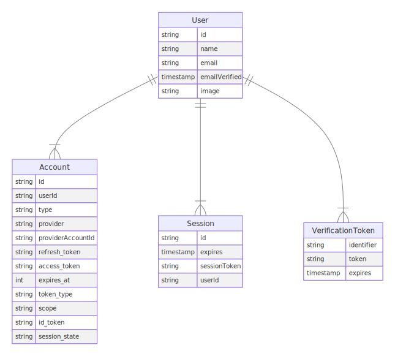

[NextJs学习-AuthJS](#top)

- [Concepts of OAuth in AuthJs](#concepts-of-oauth-in-authjs)
  - [How OAuth work](#how-oauth-work)
  - [Session strategies](#session-strategies)
- [Database models in AuthJS](#database-models-in-authjs)
- [Setup AuthJS for nextjs](#setup-authjs-for-nextjs)
  - [Env of Authentication of github](#env-of-authentication-of-github)
  - [Env of Authentication of google](#env-of-authentication-of-google)
- [Session Management of AuthJS](#session-management-of-authjs)
  - [Signin and Signout](#signin-and-signout)
    - [Page Server Side](#page-server-side)
    - [Page Client Side](#page-client-side)
  - [Get Session](#get-session)
- [date-fns](#date-fns)

--------------------------------------
## Concepts of OAuth in AuthJs

### How OAuth work

- Authentication Providers in 'Auth.js' are **predefined** OAuth configurations that allow your users to sign in with pre-existing logins at their favorite service
- [Configuring an OAuth provider](https://authjs.dev/guides/configuring-oauth-providers)
- the OAuth Authorization Code flow we support generally has 6 parts:
  1. The application requests authorization to access service resources from the user
  2. If the user authorized the request, the application receives an authorization grant
  3. The application requests an access token from the authorization server (API) by presenting authentication of its own identity, and the authorization grant
  4. If the application identity is authenticated and the authorization grant is valid, the authorization server (API) issues an access token to the application. Authorization is complete.
  5. The application requests the resource from the resource server (API) and presents the access token for authentication
  6. If the access token is valid, the resource server (API) serves the resource to the application
- 
  - from https://authjs.dev/concepts/oauth
- 
  - from https://aaronparecki.com/oauth-2-simplified/

### Session strategies

- configure the session strategy using the `session.strategy` option in the main 'Auth.js' config file
- Auth.js supports 2 main session strategies
  - the JWT-based session and
  - Database session

## Database models in AuthJS



- User
  - **OAuth sign in**: If the first sign-in is via the `OAuth Provider`, the default data saved is `id`, `name`, `email` and `image`
  - **Magic links sign in**: If the first sign-in is via the `Email Provider`, then the saved user will have `id`, `email`, `emailVerified`, where `emailVerified` is the timestamp of when the user was created
- Account
  - A single User can have multiple Account(s), but each Account can only have one User
- Session
- VerificationToken: used to store tokens for email-based `magic-link sign in`

[⬆ back to top](#top)

## Setup AuthJS for nextjs

- [AuthJS for nextjs](https://authjs.dev/getting-started/installation?framework=next.js)
1. `npm install next-auth@beta`
2. Setup Environment  -> `npx auth secret`
   1. will generate new file: '.env.local' in root directory
3. create new file: 'src\auth.ts'
4. Add a Route Handler under '/app/api/auth/[...nextauth]/route.ts'
5. 2. Setup github/google Provider:
   1. adding Provider to 'src\auth.ts' file
   2. Add the handlers to 'api/auth/[...nextauth]/route.ts' file
8. Add Signin Button
9. [Prisma Adapter](https://authjs.dev/getting-started/adapters/prisma): connect to MongoDB
   1.  `npm install @prisma/client @auth/prisma-adapter`
   2.  `npm install prisma --save-dev`
   3.  adding adapter to 'src\auth.ts' file

```ts
//src\auth.ts
import NextAuth from "next-auth"
import GitHub from "next-auth/providers/github";
import Google from "next-auth/providers/google";
import { PrismaAdapter } from "@auth/prisma-adapter"
import { prisma } from "@/prisma";
export const { handlers, signIn, signOut, auth } = NextAuth({
  adapter: PrismaAdapter(prisma),
  providers: Google({
      clientId: process.env.GOOGLE_CLIENT_ID,
      clientSecret: process.env.GOOGLE_CLIENT_SECRET,
    }),
    Github({
      clientId: process.env.GITHUB_CLIENT_ID,
      clientSecret: process.env.GITHUB_CLIENT_SECRET,
    }),
})
```

[⬆ back to top](#top)

### Env of Authentication of github

- [Setup Authentication Methods](https://authjs.dev/getting-started/authentication/oauth)
   1. [Authentication of github](https://authjs.dev/getting-started/authentication/oauth)
   2. go to your github page --> your head icon --> setting -->  Developer settings  --> OAuth App
   3. 
   4. Setup Environment Variables: add a `Client ID` and `Client Secret` to '.env.local' file

[⬆ back to top](#top)

### Env of Authentication of google

1. go to `https://console.cloud.google.com/`
2. create new prject
   - 
3. search 'apis & services'
   - 
4. choose 'OAuth consent screen' from left menu -> check 'External' -> 'CREATE' button
   1. 
   2. 
   3. no need modify 'scope' and 'Test users' --> click 'SAVE AND CONTINUE' to end
5. choose 'Credentials' from left menu -> check 'External' -> 'CREATE CREDENTIALS' button on the top --> choose 'OAuth client ID'
   1. 
   2. 
6. copy 'client ID' and 'client secret'

[⬆ back to top](#top)

## Session Management of AuthJS

### Signin and Signout

- https://authjs.dev/getting-started/session-management/login

#### Page Server Side

```ts
import { signIn, signOut } from "@/auth.ts"
export function SignIn() {
  return (
    <form action={async () => {
        "use server"
        await signIn()
      }}>
      <button type="submit">Sign in</button>
    </form>
  )
}
export function SignOut() {
  return (
    <form action={async () => {
        "use server"
        await signOut()
      }}>
      <button type="submit">Sign Out</button>
    </form>
  )
}
```

#### Page Client Side

```ts
import { signIn, SignOut } from "next-auth/react"
export function SignIn() {
  return <Button onClick={() => signIn()}>Sign In</Button>
}
export function SignOut() {
  return <button onClick={() => signOut()}>Sign Out</button>
}
```

[⬆ back to top](#top)

### Get Session

- https://authjs.dev/getting-started/session-management/get-session
- Page Server Side  -->
  - `import { auth } from "@/auth";`  --> `const session = await auth();`
- Page Client Side  -->
  - `import { useSession } from "next-auth/react"` --> `const session = useSession()`

[⬆ back to top](#top)

## date-fns

- `npm install date-fns -D`
- [date-fns](https://date-fns.org/docs/Getting-Started): Modern JavaScript date utility library
- `<p className="text-sm font-light ml-auto">{formatDistance(new Date(postData.createAt), new Date())}</p>`

[⬆ back to top](#top)

> References
- https://github.com/machadop1407/nextjs-15-authentication-next-auth
- [NextJS 15 Authentication Tutorial - Learn Next-Auth in 30 Minutes](https://www.youtube.com/watch?v=n-fVrzaikBQ)
