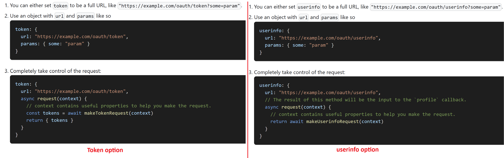

## OPTIONS

```
// pages/api/auth/[...nextauth].js
interface OAuthConfig {
  /**
   * OpenID Connect (OIDC) compliant providers can configure
   * this instead of `authorize`/`token`/`userinfo` options
   * without further configuration needed in most cases.
   * You can still use the `authorize`/`token`/`userinfo`
   * options for advanced control.
   *
   * [Authorization Server Metadata](https://datatracker.ietf.org/doc/html/rfc8414#section-3)
   */
  wellKnown?: string
  /**
   * The login process will be initiated by sending the user to this URL.
   *
   * [Authorization endpoint](https://datatracker.ietf.org/doc/html/rfc6749#section-3.1)
   */
  authorization: EndpointHandler<AuthorizationParameters>
  /**
   * Endpoint that returns OAuth 2/OIDC tokens and information about them.
   * This includes `access_token`, `id_token`, `refresh_token`, etc.
   *
   * [Token endpoint](https://datatracker.ietf.org/doc/html/rfc6749#section-3.2)
   */
  token: EndpointHandler<
    UrlParams,
    {
      /**
       * Parameters extracted from the request to the `/api/auth/callback/:providerId` endpoint.
       * Contains params like `state`.
       */
      params: CallbackParamsType
      /**
       * When using this custom flow, make sure to do all the necessary security checks.
       * This object contains parameters you have to match against the request to make sure it is valid.
       */
      checks: OAuthChecks
    },
    { tokens: TokenSet }
  >
  /**
   * When using an OAuth 2 provider, the user information must be requested
   * through an additional request from the userinfo endpoint.
   *
   * [Userinfo endpoint](https://www.oauth.com/oauth2-servers/signing-in-with-google/verifying-the-user-info)
   */
  userinfo?: EndpointHandler<UrlParams, { tokens: TokenSet }, Profile>
  type: "oauth"
  /**
   * Used in URLs to refer to a certain provider.
   * @example /api/auth/callback/twitter // where the `id` is "twitter"
   */
  id: string
  version: string
  profile(profile: P, tokens: TokenSet): Awaitable<User>
  checks?: ChecksType | ChecksType[]
  clientId: string
  clientSecret: string
  /**
   * If set to `true`, the user information will be extracted
   * from the `id_token` claims, instead of
   * making a request to the `userinfo` endpoint.
   *
   * `id_token` is usually present in OpenID Connect (OIDC) compliant providers.
   *
   * [`id_token` explanation](https://www.oauth.com/oauth2-servers/openid-connect/id-tokens)
   */
  idToken?: boolean
  region?: string
  issuer?: string
  client?: Partial<ClientMetadata>
  allowDangerousEmailAccountLinking?: boolean
  /**
   * Object containing the settings for the styling of the providers sign-in buttons
   */
  style: ProviderStyleType
}
```

> [OAuth-nextAuth.js](https://next-auth.js.org/configuration/providers/oauth)

## Sample

```ts
import { NextApiRequest, NextApiResponse } from 'next';
import GithubProvider from "next-auth/providers/github";
import TwitterProvider from "next-auth/providers/twitter";
import NextAuth, { Account, AuthOptions, Session } from 'next-auth';
import { JWT } from 'next-auth/jwt';
import { MTOPermission, MTOUser } from '@/models/auth';
import axios from 'axios';

async function refreshAccessToken(token: any) {
    try {
        const url = `${process.env.XXX_SECURE_PROFILE_MANAGE_URI || ''}/oauth2/rest/token?${new URLSearchParams(
            {
                client_id: process.env.XXX_SECURE_CLIENTID || '',
                client_secret: process.env.XXX_SECURE_CLIENTSECRET || '',
                grant_type: 'refresh_token',
                refresh_token: token.refreshToken,
            }
        )}`;
        const response = await fetch(url, {
            method: 'POST',
            headers: {
                'Content-Type': 'application/x-www-form-urlencoded',
                charset: 'UTF-8',
                'X-OAUTH-IDENTITY-DOMAIN-NAME': `${process.env.XXX_SECURE_DOMAIN}`,
            },
        });
        const refreshedTokens = await response.json();
        if (!response.ok) {
            throw refreshedTokens;
        }
        return {
            ...token,
            accessToken: refreshedTokens.access_token,
            accessTokenExpires: Date.now() + (refreshedTokens.expires_in ?? 0) * 1000,
            refreshToken: refreshedTokens.refresh_token ?? token.refreshToken, // Fall back to old refresh token
        };
    } catch {
        return {
            ...token,
            error: "RefreshAccessTokenError",
        };
    }
}

export const AUTH_OPTIONS: AuthOptions = {
  secret: process.env.NEXTAUTH_SECRET || '',
  // Configure one or more authentication providers
  //built-in OAuth Provider (e.g Github, Twitter, Google, etc...)
  providers: [
    GithubProvider({
      clientId: process.env.GITHUB_ID || '',
      clientSecret: process.env.GITHUB_SECRET || '',
    }),
    TwitterProvider({
     clientId: process.env.TWITTER_ID || '',
     clientSecret: process.env.TWITTER_SECRE || ''
    }),
    // custom OAuth Provider
    {
        id: 'xxx',
        name:'xxx',
        type: 'oauth',
        clientId: 'xxx',
        clientSecret: 'xxx',
        wellKnown: `${process.env.XXX_SECURE_ISSUER}/.well-known/openid-configuration`,
        authorization: {
            params: {
            response_type: 'code',
                domain: process.env.XXX_SECURE_DOMAIN,
                scope: 'openid email profile',
                redirect_uri: process.env.XXX_SECURE_CALLBACK_URI,
            }
        },
        idToken: true,
        profile(profile: any) {
            return {
                ...profile,
                name: `${profile.given_name} ${profile.family_name}`,
                id: profile.email
            };
        },
        token: {
            async request(context) {
                const body = {
                    grant_type: 'AUTHORIZATION_CODE',
                    redirect_uri: `${process.env.XXX_SECURE_CALLBACK_URI}`,
                    code: context.params.code || 'undefined',
                    client_id: process.env.XXX_SECURE_CLIENTID || 'undefined',
                    client_secret: process.env.XXX_SECURE_CLIENTSECRET || 'undefined',
                };
                const data = new URLSearchParams(body).toString();
                try {
                    const r = await axios({
                        method: 'POST',
                            headers: {
                                'Content-Type': 'application/x-www-form-urlencoded',
                                charset: 'UTF-8',
                                'X-OAUTH-IDENTITY-DOMAIN-NAME': `${process.env.XXX_SECURE_DOMAIN}`,
                            },
                            data,
                            url: `${process.env.XXX_SECURE_PROFILE_MANAGE_URI}/oauth2/rest/token?`,
                    });
                    return { tokens: r.data };
                } catch (err: any) {
                    console.error({ token: err });
                        throw new Error(err);
                }
            }
        },
        userinfo: {
            params: { schema: 'openid' },
            async request(context) {
                try {
                    const r = await axios({
                        method: 'GET',
                            url: `${process.env.XXX_SECURE_PROFILE_MANAGE_URI}/oauth2/rest/userinfo?schema=openid`,
                            headers: {
                                Authorization: `Bearer ${context.tokens.access_token}`,
                                'X-OAUTH-IDENTITY-DOMAIN-NAME': `${process.env.XXX_SECURE_DOMAIN}`,
                            },
                    })
                    return r.data;
                } catch (err: any) {
                    console.error({ userInfo: err });
                    throw new Error(err);
                }
            }
        },
    }
  ],
  session: {
    maxAge: parseInt(process.env.NEXTAUTH_SESSION_DURATION ?? '1200', 10), // default 20 min
  },
  callback: {
    async jwt({ token, user, account, trigger, session } : {
        token: JWT;
        user?: MTOUser;
        account?: Account | null;
        trigger?: 'signIn' | 'signUp' | 'update';
        session?: any; // this will be updated in session payload
    }) {
        if (account && user) {
            const permissionActivities: MTOPermission = {
                active: true,
                ban: false,
                register: true,
                superAdmin: false,
                isOfficeAdmin: false,
                isOfficeRequestor: false,
            };
            try {
                    const response = await getUAMActivities(
                        account.access_token || '',
                        user.email || ''
                    );
                    const { rolePermissions, superAdmin, userName } = response.data as PermissionActivityResponse;
                    permissionActivities.ban = rolePermissions.ban;
                    permissionActivities.active = rolePermissions.active;
                    permissionActivities.register = rolePermissions.register;
                    permissionActivities.superAdmin = superAdmin || false; // coming from backend ..
                    permissionActivities.userName = userName; // comming from backend
                    permissionActivities.isOfficeAdmin = isOfficeAdmin(
                        superAdmin,
                        rolePermissions.screenName as string[]
                    );
                    permissionActivities.isOfficeRequestor = isOfficeRequestor(
                        superAdmin,
                        rolePermissions.screenName as string[]
                    );
                    token = {
                        ...token,
                        accessToken: account.access_token,
                        accessTokenExpires: (account.expires_at ?? 0) * 1000,
                        refreshToken: account.refresh_token,
                        idToken: account.id_token,
                        error: '',
                        user: {
                            ...user,
                            permission: {
                                ...permissionActivities,
                            },
                        },
                    };
                } catch (ex) {
                    console.error({ UAMError: ex });
                    return {
                        ...token,
                        accessToken: account.access_token,
                        accessTokenExpires: (account.expires_at ?? 0) * 1000,
                        refreshToken: account.refresh_token,
                        idToken: account.id_token,
                        error: ErrorType.GetUamActivityError,
                    };
                }
            }
            // update session when office change
            if (trigger === 'update' && session?.permissionActivities) {
                //@ts-ignore
                token.user.permission = session.permissionActivities;
            }
            // Return previous token if the access token has not expired yet
            if (Date.now() < (token.accessTokenExpires as number)) {
                return token;
            }
            // Access token has expired, try to update it
            return refreshAccessToken(token);
    },
    async session({ session, token }: { session: Session | any; token: JWT }) {
        session.user = token.user as MTOUser;
        session.accessToken = token.accessToken;
        session.refreshToken = token.refreshToken; // this is needed only during debugging
        session.idToken = token.idToken;
        session.error = token.error;
        return session;
    }
  },
  event: {
    async signOut({ token }: { token: any }) {
        if(!token) {
            return;
        }
        const response = await fetch(
                `${process.env.XXX_SECURE_ISSUER || ''}/oauth2/rest/token/revoke`,
                {
                    headers: {
                        'Content-Type': 'application/x-www-form-urlencoded',
                        Authorization: `Basic ${btoa(
                            `${process.env.XXX_SECURE_CLIENTID}:${process.env.XXX_SECURE_CLIENTSECRET}`
                        )}`,
                    },
                    body: new URLSearchParams({
                        token: token.refreshToken,
                        token_type_hint: 'refresh_token',
                    }),
                    method: 'POST',
                }
        );
        if (!response.ok) {
            console.error(
                'Token not revoked. Status: ',
                `${response.status} ${response.statusText}`
            );
        }
    }
  },
  pages: {
    signIn: `${process.env.XXX_APP_BASE_PATH}/auth/signin`
  },
  debug: process.env.NODE_ENV === 'development',
}

const NextAuthFunc = (req: NextApiRequest, res: NextApiResponse<any>) =>
    NextAuth(req, res, AUTH_OPTIONS);

export default NextAuthFunc;
```
