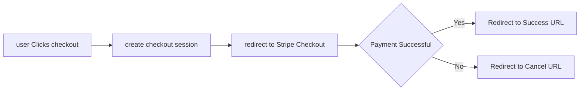
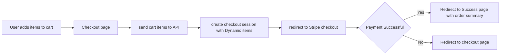
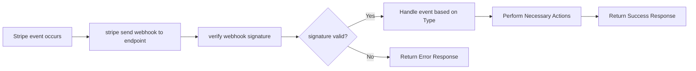

- **to-do list(not finished)**

|Payment for Next.js||
|---|---|
|[stripe](https://stripe.com/in)| @stripe/react-stripe-js|
|paypal|- `@paypal/react-paypal-js` for frontend  - `@paypal/checkout-server-sdk` for backend|
|[Paddle](https://www.paddle.com/)|Next.js `Script` component to load Paddle's JavaScript SDK and set it up in your application|
|Wise||
|[Payoneer](https://www.payoneer.com/developers/)||
|[Razorpay](https://razorpay.com/docs/api/)|US, india, Malysia, Singapore|
|P24|Poland|
|Lemon Squeezy|Ideal for developers selling digital products|
|Eartho||
|Square||

- Part 1: Stripe Checkout and Webhooks in Next.js (Pages Router)
    - Setting up Stripe in a Next.js project
    - Creating checkout sessions for static products and dynamic carts
    - Handling successful/failed payments
    - Implementing webhooks for real-time event processing
- Part 2: Stripe Subscriptions in Next.js (App Router)
    - Setting up subscription products in Stripe
    - Implementing a subscription sign-up flow
    - Managing subscriptions with Stripe's Customer Portal
    - Handling subscription lifecycle events
- Frontend:
    - 'Next.js'
    - 'react-stripe-js' for Checkout and Elements
- Backend
    - Next.js **Route Handlers** and **Server Actions**
    - 'stripe-node' with TypeScript

-----------------------------------------------------
## Setting up

1. Setting up a Stripe Account in [Stripe website](https://stripe.com/), get your **API keys (publishable key and secret key)** from the [Stripe Dashboard](https://stripe.com/docs/development#api-keys), adding to '.env.local' file
   1. `NEXT_PUBLIC_STRIPE_PUBLISHABLE_KEY=pk_12345`
   2. `STRIPE_SECRET_KEY=sk_12345`
2. `npx create-next-app --example with-typescript my-stripe-project && cd my-stripe-project`
3. `npm install stripe @stripe/stripe-js`

## Integrating Stripe for a Simple Product

|function|file|
|---|---|
|1. Create a Stripe Checkout session from our Next.js API route|pages/api/checkout-sessions/create.ts|
|2. Redirect the user to Stripe with the session ID created| pages/checkout.js|
|3. Handle successful payments by redirecting the user back to our website’s success URL|
|4. Handle failed payments by redirecting the user back to our website’s cancel URL|

**Stripe Checkout process for a simple product**

[🚀back to top](#top)

## Checkout for a Shopping Cart

[🚀back to top](#top)

## Handling Stripe Events with Webhooks

[🚀back to top](#top)

> References
- [stripe offical-payments Stripe-hosted page-next](https://docs.stripe.com/checkout/quickstart?client=next)
- [How to add Stripe payments to ANY Next.js 14 App! (Easy Tutorial for Beginners)](https://www.youtube.com/watch?v=fgbEwVWlpsI)
  - https://github.com/sonnysangha/stripe-payment-elements-with-https-nextjs-14-demo
- [Stripe+next Integration Series](https://www.pedroalonso.net/blog/stripe-integration-nextjs/)
- [Stripe Checkout and Webhook in a Next.js 15 (2025)](https://medium.com/@gragson.john/stripe-checkout-and-webhook-in-a-next-js-15-2025-925d7529855e)
- [React Stripe.js and the Payment Element](https://www.youtube.com/watch?v=e-whXipfRvg)
  - https://github.com/matthewling-stripe/react-stripe-payment-element/
- https://github.com/stripe-samples
- [Vercel-Getting started with Next.js, TypeScript, and Stripe Checkout](https://vercel.com/kb/guide/getting-started-with-nextjs-typescript-stripe)
  - https://github.com/vercel/next.js/tree/canary/examples/with-stripe-typescript
  - **Stripe Checkout**
    - Custom Amount Donation with redirect to Stripe Checkout:
        - Server Component: 'app/donate-with-checkout/page.tsx'
        - Server Action: 'app/actions/stripe.ts'
        - Checkout Session 'success' page fetches the Checkout Session object from Stripe: 'donate-with-checkout/result/page.tsx'
    - **Stripe Elements**
        - Custom Amount Donation with Stripe Payment Element & PaymentIntents:
            - Server Component: 'app/donate-with-elements/page.tsx'
            - Server Action: 'app/actions/stripe.ts'
            - Payment Intent 'success' page (via returl_url) fetches the Payment Intent object from Stripe: 'donate-with-elements/result/page.tsx'
    - **Webhook handling** for [post-payment events](https://docs.stripe.com/webhooks/handling-payment-events)
        - Route Handler: 'app/api/webhooks/route.ts'
