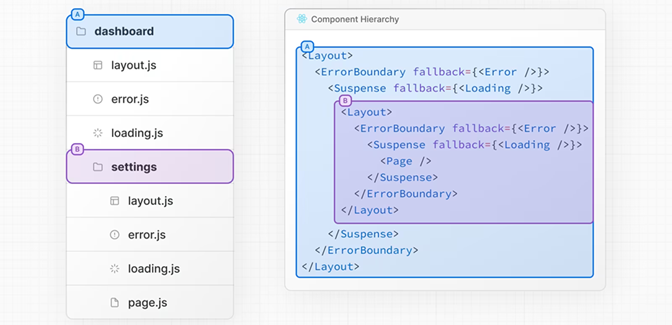

[nextjs学习小结2024](#top)

- [Roles of Folders and Files](#roles-of-folders-and-files)
  - [The app Router](#the-app-router)
  - [File Conventions](#file-conventions)
  - [Component Hierarchy](#component-hierarchy)
- [Dynamic Route \&\& API](#dynamic-route--api)
- [Enabling CORS in a Next.js App](#enabling-cors-in-a-next-app)

## Roles of Folders and Files

### The app Router

- The App Router works in a new directory named **app**. The app directory works alongside the **pages** directory to allow for incremental adoption
- supports shared layouts, nested routing, loading states, error handling, and more
- By default, components inside app are **React Server Components**

### File Conventions

|||
|---|---|
|layout|	Shared UI for a segment and its children|
|page|	Unique UI of a route and make routes publicly accessible|
|loading|	Loading UI for a segment and its children|
|not-found|	Not found UI for a segment and its children|
|error|	Error UI for a segment and its children|
|global-error|	Global Error UI|
|route|	Server-side API endpoint|
|template|	Specialized re-rendered Layout UI|
|default|	Fallback UI for Parallel Routes|

### Component Hierarchy




[⬆ back to top](#top)

## Dynamic Route && API


- server component  -->  `params`, `searchParams`
- client component  -->  `usePathname`, `useSearchParams`, `useParams`
- `http://localhost:3000/profile/setting?search=profile1`

```ts
//API in Server component- src\app\posts\page.js
//searchParams
async function getData() {
  const res = await fetch("https://dummyjson.com/posts", {
    cache: 'no-cache'     //force-cache
  });
  if(!res.ok) {
    throw new Error('Failed to fetch data');
  }
  return res.json();
}
const PostsPage = async () => {      //use getData() directly, need async
  const data = await getData();      //use getData() directly
  return (
    <div>{data.posts.map((post, id) => (
      <div key={post.id}>
        <Link href={`/posts/${post.id}`}>{post.title}</Link>
      </div>
    ))}</div>
  )
}
export default PostsPage
//API in client component- src\app\posts\[postid]\page.js
// useParams, useState, useEffect
'use client';
import { useParams } from 'next/navigation';
import React, { useEffect, useState } from 'react'
const SinglePostPage = () => {
  const params = useParams();
  const [loading, setLoading] = useState(false);
  const [post, setPost] = useState([]);
  async function getData() {
    try {
      setLoading(true);
      const data = await fetch(`https://dummyjson.com/posts/${params.postid}`);
      const post = await data.json();
      if(post?.title) {
        setPost(post);
        setLoading(false);
      }
    } catch (error) {
      setPost([]);
      setLoading(false);
    }
  }
  useEffect(() => { getData(); }, []);    // using useEffect for fetch
  if(loading) return <>loading...</>
  return (
    <div>{post?.title && <div>{post.title}</div>}</div>
  )
}
export default SinglePostPage
```

[⬆ back to top](#top)

## Enabling CORS in a Next App

- [Using CORS in Next.js to handle cross-origin requests](https://blog.logrocket.com/using-cors-next-js-handle-cross-origin-requests/)
- modify 'next.config.js'

```js
/** @type {import('next').NextConfig} */
const nextConfig = {
  async headers() {
    return [
      {
        // matching all API routes
        source: "/api/chat/:path*",
        headers: [
          { key: "Access-Control-Allow-Credentials", value: "true" },
          { key: "Access-Control-Allow-Origin", value: "*" },
          { key: "Access-Control-Allow-Methods", value: "GET,OPTIONS,PATCH,DELETE,POST,PUT" },
          { key: "Access-Control-Allow-Headers", value: "X-CSRF-Token, X-Requested-With, Accept, Accept-Version, Content-Length, Content-MD5, Content-Type, Date, X-Api-Version" },
        ]
      }
    ]
  }
};
export default nextConfig;
```

[⬆ back to top](#top)
