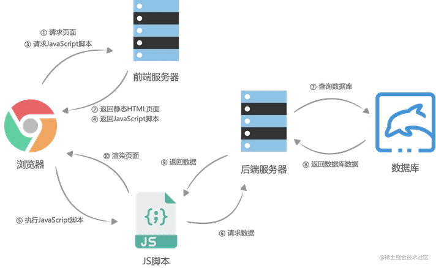
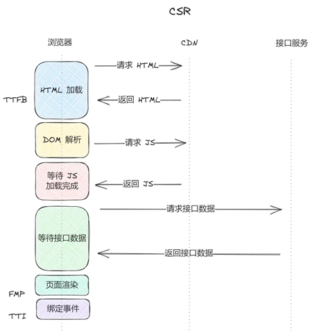
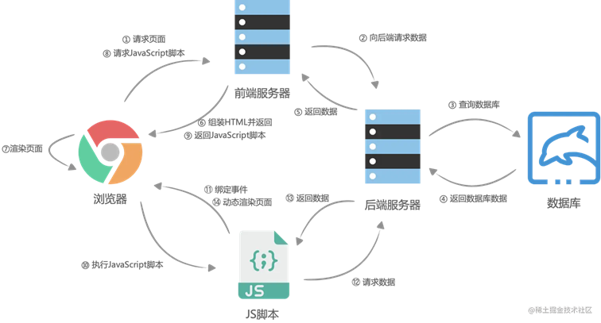

[前端基础渲染模式-CSR、SSR、同构、静态化](#top)

- [客户端渲染CSR（Client Side Rendering）](#客户端渲染csrclient-side-rendering)
- [服务端渲染SSR（Server Side Rendering）](#服务端渲染ssrserver-side-rendering)
- [同构渲染（Isomorphic render）](#同构渲染isomorphic-render)
- [静态站点生成SSG（Static Site Generation）](#静态站点生成ssgstatic-site-generation)
----------------------------------------------------------------

- 可以单纯的把渲染理解为：渲染就是将页面数据和页面模版组装成html的过程
- 

## 客户端渲染CSR（Client Side Rendering）

- CSR在浏览器上执行 JavaScript 以生成 DOM 并显示内容的渲染方法， 其大致流程如下
  1. 浏览器向前端服务器请求 html 和 js
  2. html 页面为空，初始加载不显示任何内容，通过执行 js 渲染内容
  3. 通过后端暴露的 API 进行交互
- 
- 
- 优势
  - 过程在客户端进行，服务器直接转发静态html资源|服务器压力小，只用进行转发较小的静态页面
  - 前后端分离，代码逻辑更清晰，不需要考虑代码能不能在服务端运行，不需要考虑服务端的一些注意事项
  - 可以进行局部刷新，无需每次请求完整页面、交互好可实现各种效果
- 劣势
  - 不利于 SEO：网络爬虫可能看不到完整的程序源码，获取不到页面关键信息。不过现在有的搜索引擎也可以了
  - 首屏渲染慢：渲染前需要下载一堆js和css等，而且很多并不是首页需要的js和css，不过按需加载也可以加快首屏加载，下载js和解析js的时间成本都不太低

## 服务端渲染SSR（Server Side Rendering）

- 过程在服务端进行，客户端不需要渲染页面， SSR 的流程大致如下：
  1. 后端服务通过数据层进行查询用户所需内容
  2. 处理业务逻辑
  3. 使用模板拼接页面
  4. 将渲染好的 HTML 字符串返回给客户端
  5. 前端渲染并加载 JS 脚本完成剩余交互
- 
- 优势
  - 首屏渲染快
  - 利于SEO
  - 可以生成缓存片段
  - 生成静态化文件
  - 客户端资源更小，对用户来说更节能（对比客户端渲染的耗电）
- 劣势
  - 传统服务端渲染的用户体验较差、不容易维护，通常前端改了部分html或者css，后端也需要修改
  - 服务器压力大，可以用静态化来解决
  - 需要考虑服务端的一些注意事项

[⬆ back to top](#top)

## 同构渲染（Isomorphic render）

- SSR一般指的是首屏服务端渲染或同构渲染（Isomorphic render），即新开页面访问 SSR 应用时，首屏会返回完整的 html，浏览器通过注水（hydrate）成为 React 或 Vue 应用，后续用户进行跳转等操作时不会再向服务端请求 html，而是以类似单页应用的方式进行
  - **脱水（dehydrate）**: 将组件树序列化成静态的 HTML 片段，能直接看到初始视图，不过已经无法与之交互了，但这种便携的形态尤其适合网络传输。这个脱去动态数据，成为风干标本一样的静态快照的过程被称为脱水
  - **注水（hydrate）**:与脱水相反，将这个 html 躯干复活为 Vue 应用的过程称为注水。客户端并不重新生成 HTML 组件，而是重用服务器发送给它的 HTML，并附加「数据」与「交互性」，构建成完整的 Vue 应用，这个过程被称为注水
- **同构**是指写一份代码但可同时在浏览器和服务器中运行的应用。为了同时拥有 ssr 和 csr 的特点，当前流行的方案就是 ssr + csr 同构，比如现在比较流行的的 Next.js
  -
- **同构渲染**也就是指：在服务端先进行渲染一次（SSR，组装页面html内容），客户端拿到代码后，再进行渲染一次（CSH（client-side hydration），也就是 hydrate，主要对 html 进行事件绑定和内容校验，如果 hydrate 发现内容不一致的话，会在开发环境提示警告），后续页面的所有操作和渲染行为都和 CSR 一致（didMount后的更新页面内容都属于正常的CSR了）
- 在服务端渲染中，有两种页面渲染的方式：
  - 后端服务器获取数据并组装 HTML 返回给浏览器解析渲染页面
  - 浏览器在交互过程中，请求新的数据并动态更新渲染页面

[⬆ back to top](#top)

## 静态站点生成SSG（Static Site Generation）

> references
- [Next.js](https://nextjs.org/)
- [Next.js中文网](https://www.nextjs.cn/)
- [一文带你了解前端渲染模式演进史](https://juejin.cn/post/7293500966212583465)

