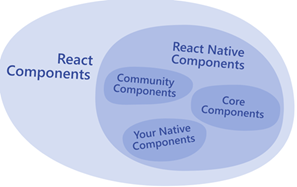
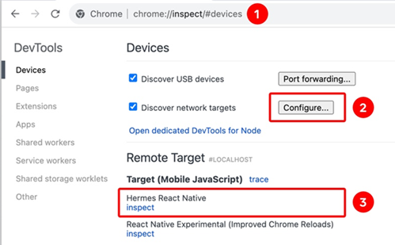

[React Native学习之1-基础2024](#top)

- [The Basic](#the-basic)
  - [Native Components](#native-components)
  - [built-in Core Components](#built-in-core-components)
- [Platform-Specific Code - cross Platform](#platform-specific-code---cross-platform)
- [Debugging](#debugging)
  - [Simulator - the Dev Menu](#simulator---the-dev-menu)
  - [Hermes Debugger - Expo projects](#hermes-debugger---expo-projects)
  - [React DevTools](#react-devtools)
  - [Performance Monitor](#performance-monitor)
- [Using TypeScript](#using-typescript)
- [Testing](#testing)
  - [Static Analysis](#static-analysis)
  - [Jest testing framework](#jest-testing-framework)
- [expo go](#expo-go)
  - [Basic](#basic)
  - [expo-image-picker](#expo-image-picker)
  - [gestures](#gestures)
- [Use animated components](#use-animated-components)

## The Basic

- [Core Components documentary](https://reactnative.dev/docs/components-and-apis)
- 

|category||
|---|---|
|Basic Components|View, Text, Image, TextIput, ScrollView, StyleSheet|
|User Interface|Button, Switch|
|List Views|FlatList, SctionList|
|Android-specific|BackHandler, DrawerlayoutAndroid, PermissionsAndroid, ToastAndroid|
|iOS-specific|ActionSheetIOS|
|Others|ActivityIndicator, Alert, Animated, Dimensions, KeyboardAvoidingView, Linking, Modal, PixelRatio, RefreshControl, StatusBar|

### Native Components

- android and IOS native components
- Android: Kotlin or Java
- OOS: Swift or Objective-C
- React Native Components can be invoked with JavaScript using React components
- community-contributed components

### built-in Core Components

|React Native UI Component|Android View	|iOS View	|Web Analog|	Description|
|---|---|---|---|---|
|`<View>`	|`<ViewGroup>`|`<UIView>`|A non-scrolling `<div>`|A container that supports layout with flexbox, style, some touch handling, and accessibility controls|
|`<Text>`	|`<TextView>`|	`<UITextView>`|	`<p>`|Displays, styles, and nests strings of text and even handles touch events|
|`<Image>`	|`<ImageView>`|	`<UIImageView>`	|``	|Displays different types of images
|`<ScrollView>`|	`<ScrollView>`|	`<UIScrollView>`	|`<div>`	|A generic scrolling container that can contain multiple components and views|
|`<TextInput>`	|`<EditText>`	|`<UITextField>`|	`<input type="text">`	|Allows the user to enter text|

- <mark>TextInput component</mark>: Handling Text Input
  - `onChangeText` prop that takes a function to be called every time the text changed
  - `onSubmitEditing` prop that takes a function to be called when the text is submitted
- <mark>ScrollView component</mark>:scroll both vertically and horizontally
  - `pagingEnabled` props that configured to allow paging through views using swiping gestures
  - **Android**: swiping horizontally between views by using the `ViewPager` component
  - **iOS**: ScrollView with a single item can be used to allow the user to zoom content
  - using`maximumZoomScale` and `minimumZoomScale` props
- all the elements and views of a ScrollView are rendered, even if they are not currently shown on the screen
  - If you have a long list of items which cannot fit on the screen, you should use a `FlatList` instead
- <mark>List Views</mark>
  - <mark>FlatList component</mark>: displays a scrolling list of changing, but similarly structured, data
  - <mark>SectionList component</mark>: render a set of data broken into logical sections, maybe with section headers

```jsx
const [text, setText] = useState('');
<TextInput style={{height: 40}}
    onChangeText={newText => setText(newText)}
    defaultValue={text}
/>
```

[⬆ back to top](#top)

## Platform-Specific Code - cross Platform

- Using the `Platform` module:
- `import {Platform } from 'react-native';`
- Using platform-specific file extensions
- `import BigButton from './BigButton';`

```jsx
// 1. platform-specific components
import {Platform, StyleSheet} from 'react-native';
const Component = Platform.select({
ios: () => require('ComponentIOS'),
android: () => require('ComponentAndroid'),
})();
<Component />;
// 2. Detecting the Android version
import {Platform} from 'react-native';
if (Platform.Version === 25) {
console.log('Running on Nougat!');
}
// 3. Detecting the iOS version
import {Platform} from 'react-native';
const majorVersionIOS = parseInt(Platform.Version, 10);
if (majorVersionIOS <= 9) {
console.log('Work around a change in behavior');
}
```

[⬆ back to top](#top)

## Debugging

### Simulator - the Dev Menu

- run `adb shell input keyevent 82` in your terminal
- iOS Simulator: `Cmd ⌘ + D` (or Device > Shake)
- Android emulators: `Cmd ⌘ + M` (macOS) or `Ctrl + M` (Windows and Linux)

### Hermes Debugger - Expo projects

1. In a Chrome browser window, navigate to `chrome://inspect`   -->
2. "Configure..." button to add the dev server address (typically localhost:8081) -->
3. "Hermes React Native" target with an "inspect" link. Click this to open the debugger
- 

### React DevTools

- `npx react-devtools`
- [React DevTools guide](https://reactnative.dev/docs/react-devtools)
- [React Developer Tools on react.dev](https://react.dev/learn/react-developer-tools)

### Performance Monitor

- select "Perf Monitor" in the' Dev Menu'
- [Performance Overview](https://reactnative.dev/docs/performance)

[⬆ back to top](#top)

## Using TypeScript

- `npx create-expo-app -t with-typescript`
- Adding TypeScript to an Existing Project
1. `npm install -D @tsconfig/react-native @types/jest @types/react @types/react-test-renderer typescript`
2. Add a TypeScript config file. Create a 'tsconfig.json' in the root of your project
3. Rename a JavaScript file to be '*.tsx'

```ts
// tsconfig.json
{
"extends": "@tsconfig/react-native/tsconfig.json"
}
```

[⬆ back to top](#top)

## Testing

### Static Analysis

- **Linters** analyze code to catch common errors  (or vice versa, depending on your configuration)
- [ESLint](https://eslint.org/)
- **Type checking** ensures that the construct you’re passing to a function matches what the function was designed to accept, preventing passing a string to a counting function that expects a number
- [Using TypeScript](https://reactnative.dev/docs/typescript)

### Jest testing framework


[⬆ back to top](#top)

## expo go

### Basic

- [expo go tutorial](https://docs.expo.dev/tutorial/introduction/)
- `<Pressable>` component.
- a core component wrapper that can detect various stages of interactions, from basic single-tap events to advanced events such as a long press

### expo-image-picker

1. `npx expo install expo-image-picker`
2. `pickImageAsync()` function is responsible for invoking `ImagePicker.launchImageLibraryAsync()` and then handling the result. The `launchImageLibraryAsync()` method returns an object containing information about the selected image.

```js
const pickImageAsync = async () => {
  let result = await ImagePicker.launchImageLibraryAsync({
    allowsEditing: true,
    quality: 1,
  });

  if (!result.canceled) {
    console.log(result);
  } else {
    alert('You did not select any image.');
  }
};
// returns object  - result
{
"assets": [
  {
    "assetId": null,
    "base64": null,
    "duration": null,
    "exif": null,
    "height": 4800,
    "rotation": null,
    "type": "image",
    "uri": "file:///data/user/0/host.exp.exponent/cache/ExperienceData/%username%252Fsticker-smash-47-beta/ImagePicker/77c4e56f-4ccc-4c83-8634-fc376597b6fb.jpeg",
    "width": 3200
  }
],
"canceled": false
}
```

[⬆ back to top](#top)

### gestures

- `npx expo install react-native-gesture-handler react-native-reanimated`
- replace the root level `<View>` component in the 'App.js' with `<GestureHandlerRootView>`
- Add a tap gesture: 'components\EmojiSticker.js'

```js
// components\EmojiSticker.js
import { View, Image } from 'react-native';
import { Gesture, GestureDetector } from 'react-native-gesture-handler';
import Animated, { useAnimatedStyle, useSharedValue, withSpring } from 'react-native-reanimated';
export default function EmojiSticker({ imageSize, stickerSource }) {
const scaleImage = useSharedValue(imageSize);
const imageStyle = useAnimatedStyle(() => {
  return {
    width: withSpring(scaleImage.value),
    height: withSpring(scaleImage.value),
  };
});
const doubleTap = Gesture.Tap()
  .numberOfTaps(2)
  .onStart(() => {
    if (scaleImage.value !== imageSize * 2) {
      scaleImage.value = scaleImage.value * 2;
    }
  });
const translateX = useSharedValue(0);
const translateY = useSharedValue(0);
const drag = Gesture.Pan()
  .onChange((event) => {
    translateX.value += event.changeX;
    translateY.value += event.changeY;
  });
const containerStyle = useAnimatedStyle(() => {
  return {
    transform: [
      { translateX: translateX.value },
      { translateY: translateY.value },
    ],
  };
});

return (
  <GestureDetector gesture={drag}>  <!-- pan gesture -->
    <Animated.View style={[containerStyle, { top: -350 }]}>
      <GestureDetector gesture={doubleTap}>  <!--tap gesture -->
        <Animated.Image source={stickerSource}  resizeMode="contain"
          style={[imageStyle, { width: imageSize, height: imageSize }]}
        />
      </GestureDetector>
    </Animated.View>
  </GestureDetector>
);
}
```

[⬆ back to top](#top)


## Use animated components

1. `import Animated from 'react-native-reanimated';`
2. Replace the `<Image>` component with `<Animated.Image>`
3. [createAnimatedComponent](https://docs.swmansion.com/react-native-reanimated/docs/core/createAnimatedComponent/)


[⬆ back to top](#top)


