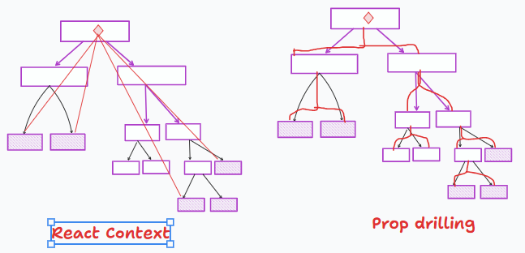

[React学习-Context](#top)

- [Step 1 - Create a Context](#step-1---create-a-context)
- [Step 2 - Wrap App with Context Provider](#step-2---wrap-app-with-context-provider)
- [Step 3 - Consume the Context in Components](#step-3---consume-the-context-in-components)
- [Sample - Theme-Switching](#sample---theme-switching)

-----------------------------------------------



## Step 1 - Create a Context

```ts
import { createContext } from 'react';
const MyContext = createContext();
export default MyContext;
```

## Step 2 - Wrap App with Context Provider

```ts
import MyContext from './MyContext';

const App = () => {
  const sharedValue = 'This is a shared value';
  return (
    <MyContext.Provider value={sharedValue}>
      {/* Your components go here */}
    </MyContext.Provider>
  );
};
export default App;
```

## Step 3 - Consume the Context in Components

```ts
import MyContext from './MyContext';

const MyComponent = () => {
  const sharedValue = useContext(MyContext);
  return <p>{sharedValue}</p>;
};
export default MyComponent;
```

[⬆ back to top](#top)

## Sample - Theme-Switching

```ts
// step 1 - ThemeContext.js
import React, { createContext, useContext, useState } from 'react';
     // 1) creating a context - ThemeContext
const ThemeContext = createContext();       
     // 2)ThemeProvider component
const ThemeProvider = ({ children }) => {
  const [theme, setTheme] = useState('light');
  const toggleTheme = () => {
    setTheme((prevTheme) => (prevTheme === 'light' ? 'dark' : 'light'));
  };
  return (
       // <ThemeContext.Provider> wraps the children,
       //making the props passed to it available to every component within its subtree
    <ThemeContext.Provider value={{ theme, toggleTheme }}>  
      {children}
    </ThemeContext.Provider>
  );
};
   // 3) useTheme component is a custom hook that uses useContext() to consume the ThemeContext context
const useTheme = () => {
  return useContext(ThemeContext);
};
   // 4) export custom component
export { ThemeProvider, useTheme };
// Step 2 - ThemedComponent.js 
import { useTheme } from './context/ThemeContext';
const ThemedComponent = () => {
  const { theme, toggleTheme } = useTheme();
  return (
    <div style={{ background: theme === 'light' ? '#fff' : '#333', color: theme === 'light' ? '#333' : '#fff' }}>
      <h2>Themed Component</h2>
      <p>Current Theme: {theme}</p>
      <button onClick={toggleTheme}>Toggle Theme</button>
    </div>
  );
};
export default ThemedComponent;
// step 3 - App.js
import { ThemeProvider } from './context/ThemeContext';
import ThemedComponent from './ThemedComponent.js';
const App = () => {
  return (
    <ThemeProvider>
      <div>
        <h1>Themed App</h1>
        <ThemedComponent />
      </div>
    </ThemeProvider>
  );
};
export default App;
```

[⬆ back to top](#top)

> References
- [Official React Documentation on Context API](https://react.dev/reference/react/createContext)
- [React Context and Hooks - Video Tutorial](https://www.youtube.com/watch?v=6RhOzQciVwI)
