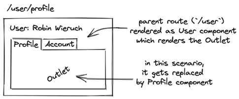

[Nested Routes](#top)
  
- [static Nested Routes](#static-nested-routes)
- [dynamic Nested Routes](#dynamic-nested-routes)

---------------------------------------------------------------------------------------------

## static Nested Routes



```javascript
const App = () => {
  return (
    <>
      <h1>React Router</h1>
      <nav>
        <Link to="/home">Home</Link>
        <Link to="/user">User</Link>
      </nav>
      <Routes>
        <Route index element={<Home />} />
        <Route path="home" element={<Home />} />
        <Route path="user" element={<User />}>
          // the default route will be the /profile route
          <Route index element={<Profile />} />
          <Route path="profile" element={<Profile />} />
          <Route path="account" element={<Account />} />
          <Route path="*" element={<NoMatch />} />
        </Route>
        <Route path="*" element={<NoMatch />} />
      </Routes>
    </>
  );
};
// user.tsx
import { Routes, Route, Link, Outlet } from 'react-router-dom';
const User = () => {
  return (
    <>
      <h1>User</h1>
      <nav>
        <Link to="profile">Profile</Link>
        <Link to="account">Account</Link>
      </nav>
      <Outlet />   //the crucial Outlet component
    </>
  );
};
```

[⬆ back to top](#top)

## dynamic Nested Routes

- sample 2: useParams
- sample 3:
  - 

```javascript
// sample 1
const App = () => {
  const users = [
    { id: '1', fullName: 'Robin Wieruch' },
    { id: '2', fullName: 'Sarah Finnley' },
  ];
  return (
    <>
      <h1>React Router</h1>
      <nav>
        <Link to="/home">Home</Link>
        <Link to="/users">Users</Link>
      </nav>
      <Routes>
        <Route element={<Layout />}>
          <Route index element={<Home />} />
          <Route path="home" element={<Home />} />
          <Route path="users" element={<Users users={users} />} />
          <Route path="*" element={<NoMatch />} />
        </Route>
      </Routes>
    </>
  );
};
// user.tsx
const Users = ({ users }) => {
  return (
    <>
      <h2>Users</h2>
      <ul>
        {users.map((user) => (
          <li key={user.id}>
            <Link to={user.id}> {user.fullName}</Link>
          </li>
        ))}
      </ul>
      <Outlet />
    </>
  );
};
// sample 2- pass url params
const App = () => {
  const users = [
    { id: '1', fullName: 'Robin Wieruch' },
    { id: '2', fullName: 'Sarah Finnley' },
  ];
  return (
    <h1>React Router</h1>
    <nav>...</nav>
    <Routes>
      <Route element={<Layout />}>
        <Route index element={<Home />} />
        <Route path="home" element={<Home />} />
        <Route path="/users/:userId" element={<User />} />
        <Route path="*" element={<NoMatch />} />
      </Route>
    </Routes>
  );
};
//
import {useParams} from 'react-router-dom';
const User = () => {
  const { userId } = useParams();
  return (
    <>
      <h2>User: {userId}</h2>
      <Link to="`/users/${userId}`">Back to Users</Link>
    </>
  );
};

// sample 3
const App = () => {
  const transactions = [
    { id: '1', details: 'Transaction 1' },
    { id: '2', details: 'Transactions 2' },
  ];
return (
    <Router>
      <h1>React Router</h1>
      <nav>
        <Link to="/home">Home</Link>
        <Link to="/user">User</Link>
      </nav>
      <Routes>
        <Route element={<Layout />}>
          <Route index element={<Home />} />
          <Route path="home" element={<Home />} />
          <Route path="user" element={<User />}>
            <Route index element={<Profile />} />
            <Route path="profile" element={<Profile />} />
            <Route path="transactions" element={<Transactions transactions={transactions} />} />
            <Route path="*" element={<NotFound />} />
          </Route>
          <Route path="*" element={<NotFound />} />
        </Route>
      </Routes>
    </Router>
  );
}
// 
const Transactions = ({ transactions }) => {
 return (
  <>
   <h2>Transactions</h2>
      <ul>
        {transactions.map((transaction) => (
          <li key={transaction.id}>
            <Link to={transaction.id}> {transaction.details} </Link>
          </li>
        ))}
      </ul>
  </>
 )
}
```

> [React Router 6: Nested Routes](https://www.robinwieruch.de/react-router-nested-routes/)
> [How to create nested dynamic routes using React Router v6](https://jnpiyush.medium.com/how-to-create-nested-dynamic-routes-using-react-router-v6-96edc4daa061)

[⬆ back to top](#top)
