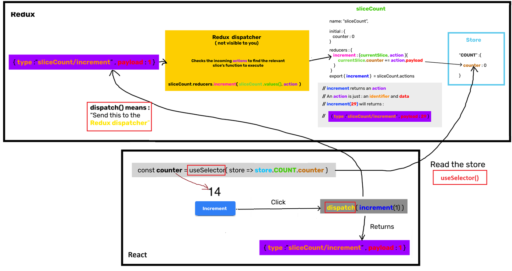

[React学习-Reduce-2023年](#top)

- [setup](#setup)
- [read, write data by using redux](#read-write-data-by-using-redux)
- [Pesisting the store](#pesisting-the-store)
- [Redux middleware](#redux-middleware)

--------------------------------------------------------

## setup

1. create store folder under src
2. create a new file 'store.tsx' under store folder
3. modify 'main.tsx'

```
├── src/
│   ├── containers/                     - using in components, read store, calculate store, call action
│   │     └── expenseInput/
│   │           └── expenseInput.tsx
│   ├── store/                          - define store, write to store
│   │     └── expense/
│   │            └── expenseSlice.tsx
│   └── main.tsx
```

```typescript
//store.tsx
import { configureStore } from "@reduxjs/toolkit";
const store = configureStore({
    reducer: {
        EXPENSE: expenseSlice.reducer,
        AUTH: authSlice.reducer
    }
});
export { store }
//main.tsx
import { Provider } from'react-redux'
import { store } from './store/index';
<React.StrictMode>
    <Provider store={store}>
      <App />
    </Provider>
  </React.StrictMode>,
)
// 
```

[⬆ back to top](#top)

## read, write data by using redux



```typescript
/* 1. define- such as in xxx-slice.tsx  */
/* eslint-disable @typescript-eslint/no-var-requires */
const { createSlice } = require('@reduxjs/toolkit');
export const expenseSlice = createSlice({
    name: 'expenseSlice',
    initialState: {
        expenseList: [],
    },
    reducers: {
        addExpenseAction: (currentSlice: any, action: any ) => {
            currentSlice.expenseList.push(action.payload);
        },
    }
})
export const { addExpenseAction  } = expenseSlice.actions
/* 2.  read the store by using useSelector() -such as in ExpenseList.tsx */
import { useSelector } from "react-redux";
import { List } from "../../components/List/List";
export function ExpenseList() {
    const expenseList = useSelector((store) => store.EXPENSE.expenseList);
    return (
        <List items={expenseList} />
    )
}
/* 3.  write into store  by using useDispatch, dispatch() -such as in ExpenseInput.tsx */
import { addExpenseAction } from '../../store/expense/expense-slice';
import { useDispatch } from "react-redux";
import { useState } from "react";
export function ExpenseInput() {
    const dispatch = useDispatch();
    const [price, setPrice] = useState();
    const [expenseName, setexpenseName] = useState();
    function submit(e) {
        e.preventDefault();
        dispatch(addExpenseAction({ name: expenseName, price}));     // call dispatch to write to store
        console.log('sub')
    }
    return (
        <form onSubmit={submit}>
            <div className='col-12 col-sm-5 col-md-4 col-lg-4 mb-2'>
                <input type='text' className='form-control' placeholder='Ex: "Apple"'
                    onChange={(e) => setexpenseName(e.target.value)} />
            </div>
        </form>
    )
}
```

[⬆ back to top](#top)

## Pesisting the store

- `npm i redux-persist`
- modify 'main.tsx' in the root folder and 'store.tsx' in the store directory

```typescript
//todo
```

[⬆ back to top](#top)

## Redux middleware

- [createListenerMiddleware](https://redux-toolkit.js.org/api/createListenerMiddleware)

[⬆ back to top](#top)
