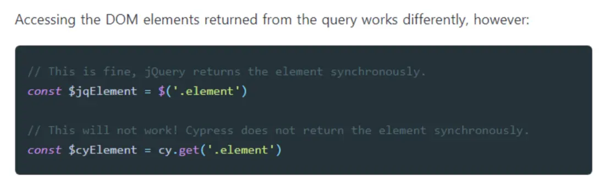

[React学习-cypress](#top)

- [install and setup cypress](#install-and-setup-cypress)
- [Folder structure](#folder-structure)
- [Cypress Core Concepts](#cypress-core-concepts)
  - [Querying Elements](#querying-elements)
  - [Subject Management](#subject-management)
  - [Interacting With Elements](#interacting-with-elements)
  - [Assertions](#assertions)
- [Cypress component testing](#cypress-component-testing)
  - [Input component testing](#input-component-testing)
  - [Button component testing](#button-component-testing)
  - [Form component testing](#form-component-testing)
- [Custom Mount Commands](#custom-mount-commands)
  - [React Router testing](#react-router-testing)
  - [Redux testing](#redux-testing)

-----------------------------------------------------------

## install and setup cypress

- [react-vite-ts official github](https://github.com/cypress-io/cypress-component-testing-apps/tree/main/react-vite-ts)
- [Cypress Component Testing setup](https://docs.cypress.io/guides/component-testing/getting-started)
- `npm install cypress`
- Open Cypress at first time, need configuration
  - `npx cypress open`: Open Cypress, following instruction in opening dialog
  - 
  - Test file such as 'xxx.cy.tsx' will be generated automatically
- Open Cypress in graph GUI
  - adding following in package.json
  - `"cyopen": "cypress:open"`
- Running the Test in command line
  - adding following in package.json
  - `"cyrun": "cypress run --config video=false --component"`
  - [Cypress command line](https://docs.cypress.io/guides/guides/command-line)
- **note**: can launch Cypress for a specific Testing Type using either `--e2e` or `--component`

[⬆ back to top](#top)

## Folder structure

- for typescript

```
E2E:
/cypress.config.ts
/cypress/fixtures/example.json
/cypress/support/commands.ts
/cypress/support/e2e.ts

Component:
/cypress.config.ts
/cypress/fixtures/example.json
/cypress/support/commands.ts
/cypress/support/component.ts
/cypress/support/component-index.html

Both:
/cypress.config.ts
/cypress/fixtures/example.json
/cypress/support/commands.ts
/cypress/support/e2e.ts
/cypress/support/component.ts
/cypress/support/component-index.html
```

[⬆ back to top](#top)

## Cypress Core Concepts

- https://docs.cypress.io/guides/core-concepts/introduction-to-cypress

### Querying Elements

- Cypress is Like jQuery and can use chains of commands
  - `cy.get('.my-selector')`
  - `cy.get('#main-content').find('.article').children('img[src^="/static"]').first()`
- Querying by Text Content: `cy.get('.main').contains('New Post')`
- When Elements Are Missing: `cy.get('.my-slow-selector', { timeout: 10000 })`
- 
  - jQuery是同步访问机制
  - Cypress是异步操作，导致待读取的元素真正可用时，其结果才会被作为参数，传入回调函数
- how is cypress work

```javascript
//1. The element is found
cy.get('#element')    // cy.get() looks for '#element', repeating the query until...
  // ...it finds the element!
  // You can now work with it by using .then
  .then(($myElement) => {
    doSomething($myElement)
  })
//2. The element is not found, A set timeout is reached
   // cy.get() looks for '#element-does-not-exist', repeating the query until...
   // ...it doesn't find the element before its timeout.
   // Cypress halts and fails the test.
cy.get('#element-does-not-exist')    
  // ...this code is never run...
  .then(($myElement) => {
    doSomething($myElement)
  })
```

**Cypress also bundles the following tools on the cypress object**

|Querying commands|bundles|
|---|---|
|`Cypriss._`|lodash|
|`Cypriss.$`|jquery|
|`Cypriss.minimatch`|minimatch.js|
|`Cypriss.Blob`|Blob utils|
|`Cypriss.Promise`|Bluebird|

- **Aliasing自定义变量**：将元素引用保存下来，以备将来之用
  - `cy.get('.my-selector').as('myElement').click()`- `as` 命令将`get`返回的元素存储到自定义变量 myElement 中
  - `cy.get('@myElement').click()` - 通过`@`引用自定义变量
- 可使用`then`来对前一个命令`yield`的目标进行操作

```javascript
cy.get('#some-link')
  .then(($myElement) => {
    const href = $myElement.prop('href')
    return href.replace(/(#.*)/, '')
  })
  .then((href) => {
    // href is now the new subject
  })
```

### Subject Management

A new Cypress chain always starts with `cy.[command]`, where what is yielded by the command establishes what other commands can be called next (chained)
- `cy.clearCookies()` yields `null`
- `cy.contains()` yields 'a DOM element'
- `.click()` yields the same subject it was originally given

```javascript
cy.clearCookies() // Yields null
  .visit('/fixtures/dom.html') // Does not care about the previous subject.
cy.get('.main-container') // Yields an array of matching DOM elements
  .contains('Headlines') // Yields the first DOM element containing content
  .click() // Yields same DOM element from previous command.
```

### Cypress的异步执行特性

- Cypress不同于其他前端自动测试框架的特别之处：直到测试函数退出，Cypress才会触发浏览器的自动执行逻辑
- 另一个例子是类似`while`的loop语句

```javascript
it('does not work as we expect', () => {
  cy.visit('/my/resource/path') // Nothing happens yet
  cy.get('.awesome-selector') // Still nothing happening
    .click() // Nope, nothing, so it need to place code inside the .then() ensures
    .then(() => {
      let el = Cypress.$('.new-el')  // it runs after the cypress commands 'execute'
      if (el.length) {
        cy.get('.another-selector')
      } else {
        cy.get('.optional-selector')
      }
    )}
})
// 网页显示随机数，当随机数跳到数字 7 时，让测试停下来。 如果随机数不是数字 7，重新加载页面，继续测试
const checkAndReload = () => {
  // get the element's text, convert into a number
  cy.get('#result')
    .should('not.be.empty')
    .invoke('text')
    .then(parseInt)
    .then((number) => {
      if (number === 7)   // if the expected number is found,  stop adding any more commands
        cy.log('lucky **7**')
        return
      }
      cy.wait(500, { log: false })   //insert more Cypress commands by calling the function after reload
      cy.reload()
      checkAndReload()
    })
}
cy.visit('public/index.html')
checkAndReload()
```

[⬆ back to top](#top)

### Interacting With Elements

|action commands|function|
|---|---|
|`.blur()`|Make a focused DOM element blur|
|`.focus()`  |Focus on a DOM element|
|`.clear()`|Clear the value of an input or textarea|
|`.check()` |Check checkbox(es) or radio(s)|
|`.uncheck()` |Uncheck checkbox(es)|
|`.select()` |Select an <option> within a <select>|
|`.dblclick()` |Double-click a DOM element|
|`.rightclick()` |Right-click a DOM element|

```javascript
it('when button is clicked, should call onClick', () => {
    cy.mount(<Button onClick={cy.spy().as('onClick')}>Click Me</Button>);
    cy.get('button').contains('Click Me').click();
    cy.get('@onClick').should('have.been.called');
  });
```

[⬆ back to top](#top)

### Assertions

- Cypress bundles Chai, Chai-jQuery, and Sinon-Chai to provide built-in assertions. You can see a comprehensive list of them in the list of assertions reference. You can also write your own assertions as Chai plugins and use them in Cypress

|Type of asserting|command|sample|
|---|---|---|
|Implicit Assertions|`should(`) or `and()`|`cy.get('tbody tr:first').should('have.class', 'active')`<br>`.and('have.attr', 'href', '/users')`|
|Mocha Assertions|`expect()`|`expect(true).to.be.true`|
|Complex Assertions|||

```typescript
cy.get('p').should(($p) => {
  let texts = $p.map((i, el) => {  // jQuery map returns jQuery object
    return Cypress.$(el).text()
  }) 
  texts = texts.get()   // .get() converts this to an array
  expect(texts).to.have.length(3)   // array should have length of 3
  expect(texts).to.deep.eq([
    'Some text from first p',
    'More text from second p',
    'And even more text from third p',
  ])
})
```

[⬆ back to top](#top)

## Cypress component testing

1. Mounting a Component:   `cy.mount()`
2. Passing Data to a Component: `cy.mount(<Stepper initial={100} />)`
3. Testing Event Handlers: Pass a Cypress `spy()` to an event prop and validate it was called
- [Cypress Component Testing](https://docs.cypress.io/guides/component-testing/getting-started#Your-First-Component-Test)


```javascript
it('clicking + fires a change event with the incremented value', () => {
  const onChangeSpy = cy.spy().as('onChangeSpy')
  cy.mount(<Stepper onChange={onChangeSpy} />)
  cy.get('[data-cy=increment]').click()
  cy.get('@onChangeSpy').should('have.been.calledWith', 1)
})
```

### Input component testing
### Button component testing
### Form component testing

- https://github.com/cypress-io/cypress-component-testing-apps/tree/main/react-vite-ts

[⬆ back to top](#top)

## Custom Mount Commands

### React Router testing

- uses MemoryRouter to wrap the component
- pass in props that will get passed to MemoryRouter in the options

```typescript 
//Typing.tsx
declare global {
  namespace Cypress {
    interface Chainable {
      mount(
        component: React.ReactNode,
        options?: MountOptions & { routerProps?: MemoryRouterProps }
      ): Cypress.Chainable<MountReturn>
    }
  }
}
//cypress/support/component.js
Cypress.Commands.add('mount', (component, options = {}) => {
  const { routerProps = { initialEntries: ['/'] }, ...mountOptions } = options
  // uses MemoryRouter to wrap the component
  // pass in props that will get passed to MemoryRouter in the options.
  const wrapped = <MemoryRouter {...routerProps}>{component}</MemoryRouter>
  return mount(wrapped, mountOptions)
})
// xxx.component.cy.tsx
it('home link should be active when url is "/"', () => {
  // No need to pass in custom initialEntries as default url is '/'
  cy.mount(<Navigation />)
  cy.get('a').contains('Home').should('have.class', 'active')
})
it('login link should be active when url is "/login"', () => {
  cy.mount(<Navigation />, { routerProps: { initialEntries: ['/login'], },
})
cy.get('a').contains('Login').should('have.class', 'active')
})
```

### Redux testing

- create a mount command that will wrap your component in a Redux Provider

```typescript 
//Typing.tsx
declare global {
  namespace Cypress {
    interface Chainable {
      mount(
        component: React.ReactNode,
        options?: MountOptions & { reduxStore?: EnhancedStore<RootState> }
      ): Cypress.Chainable<MountReturn>
    }
  }
}
//cypress/support/component.js
Cypress.Commands.add('mount', (component, options = {}) => {
  // Use the default store if one is not provided
  const { reduxStore = getStore(), ...mountOptions } = options
  const wrapped = <Provider store={reduxStore}>{component}</Provider>
  return mount(wrapped, mountOptions)
})
// xxx.component.cy.tsx

```

> [cypress-example-recipes](https://github.com/cypress-io/cypress-example-recipes)
