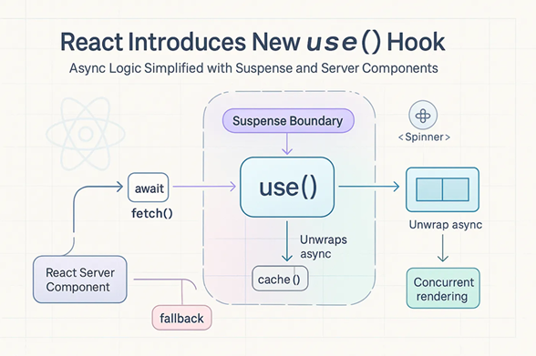

[React学习-use hook](#top)

- [Replacing Old Patterns with Cleaner Code](#replacing-old-patterns-with-cleaner-code)
- [Usage of use](#usage-of-use)
  - [Reading context with use](#reading-context-with-use)
  - [Streaming data from the server to the client](#streaming-data-from-the-server-to-the-client)
- [Combining use() with Fetching and Caching](#combining-use-with-fetching-and-caching)
- [Combining use() with Suspense and ErrorBoundary](#combining-use-with-suspense-and-errorboundary)
- [Common Pitfalls](#common-pitfalls)
- [pdf-lib](#pdf-lib)
- [html2canvas](#html2canvas)
- [permission](#permission)

--------------------------------------------------------------------------

- use is a React API that lets you read the value of a resource like a `Promise` or `context`
- **use()** hook: version 19+
- 

## Replacing Old Patterns with Cleaner Code

```ts
// before
function UserProfile({ userId }) {
  const [user, setUser] = useState(null);
  const [loading, setLoading] = useState(true);
   useEffect(() => {
      setLoading(true);
      fetch(`/api/users/${userId}`)
         .then(res => res.json())
         .then(data => {
         setUser(data);
         setLoading(false);
         });
   }, [userId]);
   if (loading) return <Spinner />;
   return <h1>{user.name}</h1>;
}
// use hook
const fetchUser = async (id) => {
  const res = await fetch(`/api/user/${id}`);
  return res.json();
};
const userPromise = useMemo(() => fetchUser(userId), [userId]);
    //...
function UserProfile({ userPromise }) {
  const user = use(userPromise);
  return <h1>{user.name}</h1>;
}
```

[🚀back to top](#top)

## Usage of use

### Reading context with use

```ts
import { use } from 'react';
function Button() {
  const theme = use(ThemeContext);
  // ...
```

[🚀back to top](#top)

### Streaming data from the server to the client

- Client component takes the Promise it received as a prop and passes it to the use API
- Client component is wrapped in `Suspense`, the fallback will be displayed until the Promise is resolved. When the Promise is resolved, the value will be read by the use API and the Message component will replace the `Suspense` fallback

```ts
import { fetchMessage } from './lib.js';
import { Message } from './message.js';
export default function App() {
  const messagePromise = fetchMessage();
  return (
    <Suspense fallback={<p>waiting for message...</p>}>
      <Message messagePromise={messagePromise} />
    </Suspense>
  );
}
// message.js(client component)
'use client';
import { use } from 'react';
export function Message({ messagePromise }) {
  const messageContent = use(messagePromise);
  return <p>Here is the message: {messageContent}</p>;
}
```

[🚀back to top](#top)

## Combining use() with Fetching and Caching

- note: cache is only for use with **React Server Components**

```ts
import { cache } from 'react';
const fetchUser = cache(async (id) => {
  const res = await fetch(`/api/user/${id}`);
  return res.json();
});
export default async function Page({ params }) {
  const user = use(fetchUser(params.id));
  return <h1>{user.name}</h1>;
}
```

[🚀back to top](#top)

## Combining use() with Suspense and ErrorBoundary

```ts
// app.ts
import { useState } from "react";
import { MessageContainer } from "./message.js";
function fetchMessage() {
  return new Promise((resolve, reject) => setTimeout(reject, 1000));
}
export default function App() {
  const [messagePromise, setMessagePromise] = useState(null);
  const [show, setShow] = useState(false);
  function download() {
    setMessagePromise(fetchMessage());
    setShow(true);
  }
  if (show) {
    return <MessageContainer messagePromise={messagePromise} />;
  } else {
    return <button onClick={download}>Download message</button>;
  }
}
// message.ts
"use client";

import { use, Suspense } from "react";
import { ErrorBoundary } from "react-error-boundary";
export function MessageContainer({ messagePromise }) {
  return (
    <ErrorBoundary fallback={<p>⚠️Something went wrong</p>}>
      <Suspense fallback={<p>⌛Downloading message...</p>}>
        <Message messagePromise={messagePromise} />
      </Suspense>
    </ErrorBoundary>
  );
}
function Message({ messagePromise }) {
  const content = use(messagePromise);
  return <p>Here is the message: {content}</p>;
}
```

[🚀back to top](#top)

## Common Pitfalls

- resolve error: <mark>**“Suspense Exception: This is not a real error!”**</mark>
1. If calling use inside a try–catch block, **wrap** your component in an **Error Boundary**, or call the Promise’s **catch** to catch the error and resolve the Promise with another value
2. If calling use outside a React Component or Hook function, move the use call to a React Component or Hook function

```ts
/* 1. If calling use inside a try–catch block, **wrap** your component in an **Error Boundary**, or call the Promise’s **catch** to catch the error and resolve the Promise with another value */
export default function App() {
  const messagePromise = new Promise((resolve, reject) => {
    reject();
  }).catch(() => {
    return "no new message found.";
  });
  return (
    <Suspense fallback={<p>waiting for message...</p>}>
      <Message messagePromise={messagePromise} />
    </Suspense>
  );
}
/* 2. If calling use outside a React Component or Hook function, move the use call to a React Component or Hook function */
// ❌
function MessageComponent({messagePromise}) {
  function download() {
    // ❌ the function calling `use` is not a Component or Hook
    const message = use(messagePromise);
    // ...
// ✅
function MessageComponent({messagePromise}) {
  // ✅ `use` is being called from a component.
  const message = use(messagePromise);
  // ...
```

[🚀back to top](#top)


- [use API-official](https://react.dev/reference/react/use)
- [React Introduces New use() Hook in Latest Version](https://medium.com/@roman_fedyskyi/react-introduces-new-use-hook-in-latest-version-ed83ef4c3c50)
