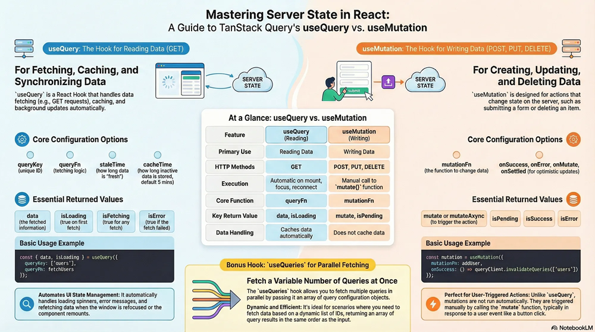
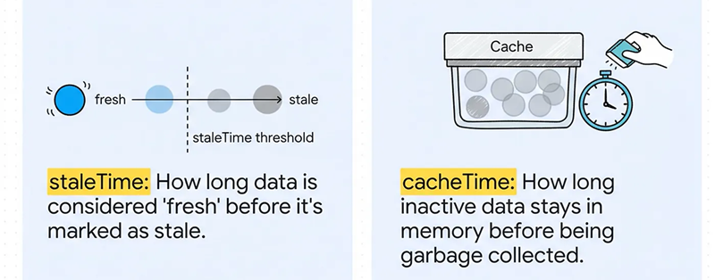

- [usequery vs usemutation](#usequery-vs-usemutation)
- [useQuery](#usequery)
  - [Key Options for useQuery](#key-options-for-usequery)
  - [Returned Values](#returned-values)
- [useMutation](#usemutation)

----------------------------------------------------------------------------------------------
```
- server-side data: react query
- client-side data: zustand
```

## usequery vs usemutation

|Feature|useQuery|useMutation|
|---|---|---|
|Primary Purpose|Fetching and reading data (e.g., GET).|Modifying or writing data (e.g., POST, PUT, DELETE).|
||simplifies data fetching, caching, and syncing|handles data changes safely and efficiently|
|Execution|Declarative: Runs automatically when the component mounts.|Imperative: Only runs when explicitly triggered by an event (like a button click).|
|Caching|Caches data automatically based on a unique queryKey.|Does not cache responses.|
|Trigger Mechanism|Refetches on window focus, remount, or manual invalidation.|Triggered manually using the returned mutate or mutateAsync function.|
|Retry Behavior|Retries failed requests automatically by default.|Does not retry failed operations by default to prevent duplicate data changes.|
|case|when your application needs to fetch a specific dataset without modifying anything on the backend. <br>Global cache: so multiple components can request the exact same data without duplicating network requests| when your user performs an action that changes data on the server, such as submitting a form or deleting a post. <br>Because it does not run automatically, you must destruct the mutate function and map it to an interation|

```ts
export const useUpdateDLRenewal = () => {
    const queryClient = useQueryClient();
    const dviService = useDviService();
    const loggedInUserDetails = useGetLoggedInUserDetails();
    return useMutation({
        mutationFn: async (body: any) => {
            const requestBody = {
                ...body,
                loggedInUserDetails,
            };
            const result: any = await dviService.updateDLRenewlOrder(requestBody);
            if (result?.statusCode && result.statusCode >= 400) {
                throw new Error(result.message ?? 'Something went wrong!');
            }
            return result?.data;
        },
        onSuccess: () => {
            // Invalidate the cache to force useQuery to pull fresh data
            queryClient.invalidateQueries({ queryKey: [queryKeys.updateDLRenewalProduct, 'update-DLRenewal-product'] });
        },
    });
};
```

[🚀back to top](#top)



## useQuery

- a React Hook that handles data fetching, caching, and background updates automatically

```ts
const { data, isLoading, isError, error, refetch } = useQuery({
    queryKey: ['users'],
    queryFn: () => fetch('/api/users').then(res => res.json()),
    staleTime: 0,              // Data is immediately considered stale
    cacheTime: 300000,         // Cached for 5 minutes(data stays in cache for 5 minutes after no use)
    refetchOnMount: 'always',  // Always refetch on mount, every time the component mounts, it refetches
    refetchOnWindowFocus: true,
    retry: 2,
})
```

### Key Options for useQuery

|||
|---|---|
|queryKey: |A unique key that identifies the query and its cached data.|
|queryFn|The function used to fetch data (usually a fetch or axios call).|
|staleTim|:How long (in ms) the data stays “fresh” before being considered stale. Example: staleTime: 10000 means data is fresh for 10s.|
|cacheTime|How long (in ms) inactive data remains in memory before it’s garbage-collected. Default is 5 minutes (300000 ms).|
|refetchOnMount|Controls refetching when the component mounts. Can be 'always', 'mount', or false|
|refetchOnWindowFocus|Whether to refetch when the window regains focus. Default: true.|
|enabled|If false, the query won’t run automatically until refetch() is called.|
|retry| Number of retry attempts when a request fails (default: 3).|
|refetchInterval |Interval (in ms) to refetch data automatically. Useful for live updates.|
|onSuccess / onError| Callback functions that trigger after success or failure.|

- 

### Returned Values

|||
|---|---|
|data| The fetched data (or cached data if available).|
|isLoading| true while fetching data for the first time.|
|isFetching| true during any active fetch, including background refetches.|
|isError| true if the fetch failed. error The error object (if any).|
|refetch| A function to manually trigger a refetch|

[🚀back to top](#top)

## useMutation

- useMutation is used for creating, updating, or deleting data on the server — actions that change state

```ts
import { useMutation, useQueryClient } from '@tanstack/react-query'
function AddUser() {
  const queryClient = useQueryClient()
  const mutation = useMutation({
    mutationFn: (newUser) => fetch('/api/users', {
      method: 'POST',
      headers: { 'Content-Type': 'application/json' },
      body: JSON.stringify(newUser),
    }),
    onSuccess: () => {
      // Invalidate and refetch the 'users' query
      queryClient.invalidateQueries(['users'])
    },
  })
  return (
    <button onClick={() => mutation.mutate({ name: 'John' })}>
      Add User
    </button>
  )
}
```

[🚀back to top](#top)
