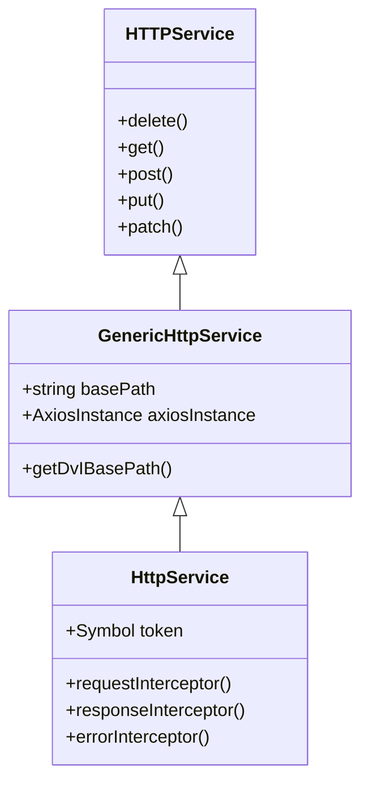

## axios + tsyringe

```
- src\services\http-service\http-service.interface.ts   --> HttpService interface(CRUD)               --> 
- src\services\http-service\generic-http-service.ts     --> GenericHttpService(auth, CRUD)            --> 
- src\services\http-service\http.service.ts             --> HttpService, interceptor(Global error)    -->
- src\services\http-service\register-service.ts         --> DI
  - `import { container, instanceCachingFactory } from 'tsyringe';`
  - `registerService, registerAndResolveService`

others service   <-- 

- `constructor() { this.api = registerAndResolveService<DviApiService>(DviApiService) }`
- `asynic getxxxAttributes() {...}`

hooks   <--
- `import { container, instanceCachingFactory } from 'tsyringe';`
- `export function usexxxService(){ return container.resolve<DviService>(DviService.TOKEN); }`
```


