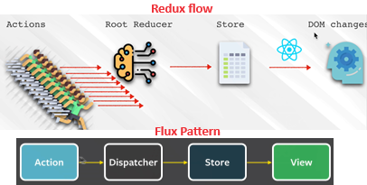
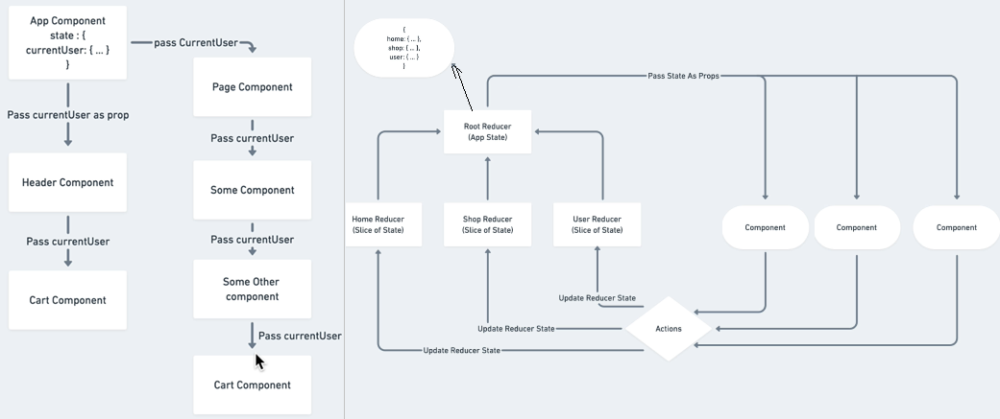
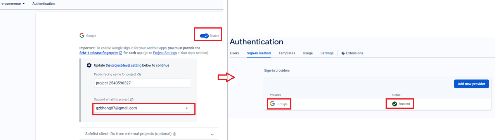

[Common useful](#top)

- [create a react project](#create-a-react-project)
- [React router](#react-router)
- [Redux using Redux Toolkit-ts](#redux-using-redux-toolkit-ts)
  - [Create a Redux Store](#create-a-redux-store)
  - [Provide the Redux Store to React](#provide-the-redux-store-to-react)
  - [Create a Redux State Slice](#create-a-redux-state-slice)
  - [using redux in component](#using-redux-in-component)
- [Redux Persist + Redux Toolkit](#redux-persist--redux-toolkit)
  - [adding persistReducer and persistStore to store](#adding-persistreducer-and-persiststore-to-store)
  - [wrap root component with PersistGate](#wrap-root-component-with-persistgate)
- [using bootstrap](#using-bootstrap)
- [using shadcn for nextjs project](#using-shadcn-for-nextjs-project)
- [install and setup tailwindcss3](#install-and-setup-tailwindcss3)
  - [using Tailwind CSS in Vite](#using-tailwind-css-in-vite-1)
- [updating whole packages to latest version](#updating-whole-packages-to-latest-version)
- [using context](#using-context)
- [using SCSS](#using-scss)
- [OAuth using firebase](#oauth-using-firebase)
  - [Add Firebase to project](#add-firebase-to-project)
  - [using google email authentication 1](#using-google-email-authentication-1)
  - [using google email authentication 2](#using-google-email-authentication-2)
- [Theme toggle - using user-defined Provider + tailwindcss](#theme-toggle---using-user-defined-provider--tailwindcss)
- [Display page as requirement- Admin dashboard](#display-page-as-requirement--admin-dashboard)
- [i18n](#i18n)
- [Tab effect using urlParams](#tab-effect-using-urlparams)
- [install and setup msw](#install-and-setup-msw)

--------------------------------------------------------------------------------

## create a react project

|project type|CLI|
|---|---|
| typescript project| `npx create-react-app myproject --template typescript`<br>`npx create-react-app . --template typescript`在本目录创建|
|Next.js全栈式的 React 框架<br>Next.js的App Router是对 Next.js API的重新设计，<br>旨在实现 React 团队的全栈架构愿景。它让你在异步组件中获取数据，这些组件甚至能在服务端构建过程中运行<br>Next.js 只支持React 16+| `npx create-next-app@latest`<br>`npx create-next-app --example with-redux my-app`<br>https://redux-toolkit.js.org/usage/nextjs|
|Vite|`npm create vite@latest`|
|Remix 具有嵌套路由的全栈式 React 框架|`npx create-remix`|
|Gatsby 快速的支持 CMS 的网站的 React 框架|`npx create-gatsby`|
|Expo 具有真正原生 UI 的应用，包括 Android、iOS，以及 Web 应用| `npx create-expo-app`|

VSCode shotword

|shotword|CLI|
|---|---|
|rafce   | component|

[⬆ back to top](#top)

## React router

```javascript
//1. npm i react-router-dom
//2.
import { BrowserRouter, Routes, Route, Link } from "react-router-dom";
//3. 
<BrowserRouter>
   <nav>
      <ul>
         <li> <Link to="/">Home</Link> </li>
         <li> <Link to="/basic">Basic</Link> </li>
      </ul>
   </nav>
   <Routes>
      <Route path="/basic" element={<Basic />}></Route>
      <Route path="/" element={<Home />}></Route>
   </Routes>
</BrowserRouter>
```

[⬆ back to top](#top)

## Redux using Redux Toolkit-ts

- principles of redux state
  - Single source of truth
  - state is read only
  - Changes using pure function
- 
- design state of project
  - 
- [Redux Toolkit](https://redux-toolkit.js.org/tutorials/quick-start)
- chrome extension
  - React Developer Tools
  - redux Devtools
- Create project with redux:  `npx create-next-app --example with-redux my-app`
- `npm i @reduxjs/toolkit react-redux`
- `npm i --save-dev @types/node` - for using require in store

### Create a Redux Store

```javascript
//store.tsx
import { configureStore } from '@reduxjs/toolkit'
export const store = configureStore({
  reducer: { 
    counter: counterReducer,
    noteSlice: noteReducer
  },
})
// Infer the `RootState` and `AppDispatch` types from the store itself
export type RootState = ReturnType<typeof store.getState>
// Inferred type: {posts: PostsState, comments: CommentsState, users: UsersState}
export type AppDispatch = typeof store.dispatch
```

[⬆ back to top](#top)

### Provide the Redux Store to React

```javascript
import { store } from './app/store'
import { Provider } from 'react-redux'
ReactDOM.render(
  <Provider store={store}>
    <App />
  </Provider>,
  document.getElementById('root')
)
```

[⬆ back to top](#top)

### Create a Redux State Slice

```javascript
//note-slice.tsx
import { createSlice } from "@reduxjs/toolkit";
import type { PayloadAction } from '@reduxjs/toolkit'
export interface NotesState {
  noteList: string[]
}
const initialState: NotesState = {
  value: 0,
}
export const noteSlice = createSlice({
    name: "noteSlice",
    initialState,
    // Redux Toolkit allows us to write "mutating" logic in reducers. It
    // doesn't actually mutate the state because it uses the Immer library,
    // which detects changes to a "draft state" and produces a brand new
    // immutable state based off those changes
    reducers: {
        setNoteList: (currentSlice, action: PayloadAction<string>) => {
            currentSlice.noteList = action.payload;
        },
        addNote: (currentSlice, action) => {
            currentSlice.noteList.push(action.payload);
        },
        //...
    },
});
export const { setNoteList, addNote } = noteSlice.actions;
export const noteReducer = noteSlice.reducer;
// Action creators are generated for each case reducer function
```

[⬆ back to top](#top)

### using redux in component

- `useSelector`: read data from the store
- `useDispatch`: dispatch actions

```javascript
// note.tsx
import { useDispatch, useSelector } from "react-redux";
import type { RootState } from '../../app/store'
import { updateNote, deleteNote } from "../../store/note-slice";
export function Note() {
   const note = useSelector(state: RootState => 
      store.noteSlice.noteList.find(note => note.id === id)
   );
    const dispatch = useDispatch();
    const submit = async (formValues) => {
        const updatedNote = await NoteAPI.updateById(note.id, formValues);
        dispatch(updateNote(updatedNote));
        setIsEditable(false);
         //...
     }
   return (
        <>{ note && (
            <NoteForm 
                isEditable={isEditable}
                title={note.title}
                note={note}
                onClickDelete={deleteNote_} 
                onClickEdit={() => setIsEditable(!isEditable)}
                onSubmit={isEditable && submit}/>
            )}
        </>
    )
}
```

[⬆ back to top](#top)

## Redux Persist + Redux Toolkit

- `npm install redux-persist`

### adding persistReducer and persistStore to store

```javascript
import { combineReducers, configureStore } from "@reduxjs/toolkit";
import storage from 'redux-persist/lib/storage';
//import storageSession from 'redux-persist/lib/storage/session';  //sessionStorage
import { persistReducer, persistStore } from 'redux-persist';
// Nested persists using Redux Persist
const rootReducer = combineReducers({
    userSlice: userReducer, 
    cartSlice: cartReducer 
});
const persistConfig = {
    key: 'root',
    storage,      //using localStorage
    whitelist: ["cartSlice"],
}
const persistedReducer = persistReducer(persistConfig, rootReducer)
export const store = configureStore({
    reducer: persistedReducer, 
    // middleware to prevent some serialize error
    middleware: (getDefaultMiddleware) =>
      getDefaultMiddleware({
        serializableCheck: {
          ignoredActions: [FLUSH, REHYDRATE, PAUSE, PERSIST, PURGE, REGISTER],
        },
    }),
});
export const persistor = persistStore(store);
export type RootState = ReturnType<typeof store.getState>;
export type AppDispatch = typeof store.dispatch;
```

[⬆ back to top](#top)

### wrap root component with PersistGate

```javascript
import { PersistGate } from 'redux-persist/integration/react'
import { persistor, store } from './store/store';

<React.StrictMode>
    <Provider store={store}>
      <PersistGate loading={null} persistor={persistor}>
        <App />
      </PersistGate>
    </Provider>
</React.StrictMode>,
```

- [Redux Persist official](https://github.com/rt2zz/redux-persist)
- [Persist state with Redux Persist using Redux Toolkit in React](https://blog.logrocket.com/persist-state-redux-persist-redux-toolkit-react/)
  
[⬆ back to top](#top)

## using bootstrap

```html
<link href="https://fonts.cdnfonts.com/css/maximum-impact" rel="stylesheet">
<link href="https://fonts.googleapis.com/css2?family=Roboto:ital,wght@0,100;0,300;0,400;0,500;0,700;0,900;1,100;1,300;1,400;1,500;1,700;1,900&display=swap" rel="stylesheet">    
<script src="https://cdn.jsdelivr.net/npm/bootstrap@5.2.0/dist/js/bootstrap.bundle.min.js" integrity="sha384-A3rJD856KowSb7dwlZdYEkO39Gagi7vIsF0jrRAoQmDKKtQBHUuLZ9AsSv4jD4Xa" crossorigin="anonymous"></script>
<link rel="stylesheet" href="https://cdn.jsdelivr.net/npm/bootstrap@5.2.0/dist/css/bootstrap.min.css"/>
```

[⬆ back to top](#top)

## using shadcn for nextjs project

1. `npx shadcn@latest init`
  - ✔ Updating CSS variables in app\globals.css
  - ✔ Created 1 file: --> lib\utils.ts 
3. `npx shadcn@latest add button`
4. `import { Button } from "@/components/ui/button"`, `<Button>Click me</Button>`
5. Icon: `import { Search } from "lucide-react";`
  - https://lucide.dev/icons/
6. https://ui.shadcn.com/

[⬆ back to top](#top)

## updating whole packages to latest version

- remove yarn.lock: `rm -rf yarn.lock`
- update all dependencies: `npm update -D`
- `npm audit fix`
- `npm i`

[⬆ back to top](#top)

## install and setup tailwindcss3

- [tailwindcss install-using postcss](https://tailwindcss.com/docs/installation/using-postcss)
- `npm i tailwindcss postcss autoprefixer --save-dev`
- `npx tailwindcss init -p`
   - [Vite PostCSS module error when building app in Svelte](https://stackoverflow.com/questions/73136479/vite-postcss-module-error-when-building-app-in-svelte)
- adding following to 'postcss.config.js' and 'tailwind.config.js'
- adding three lines in 'index.css' file

```javascript
//postcss.config.js
 plugins: {
    tailwindcss: {},
    autoprefixer: {},
  },
//tailwind.config.js
prefix: "ui-",
content: ["./src/**/*.{html,tsx,ts}"],
//index.css
@tailwind base;
@tailwind components;
@tailwind utilities;
```

[⬆ back to top](#top)

### using Tailwind CSS in Vite

- [using Tailwind CSS in Vite](https://tailwindcss.com/docs/installation/using-vite)
   1. `npm install tailwindcss @tailwindcss/vite`
   2. Configure the Vite plugin -> add `plugins: [tailwindcss()],` to 'vite.config.js`
   3. add `@import "tailwindcss";` to 'index.css'

[⬆ back to top](#top)

## using context

```typescript
//themeContext.js
export const ThemeModeContext = createContext('light');
export const THEME ={
   light: {},
   dark: {}
}
//App.jsx
const initialThemeMode = useContext(ThemeModeContext);
const [themeMode,setThememode] = useState(initialThemeMode);
<ThemeModeContext.provider value={{themeMode, setThememode}}>
   <div style={{ color: THEME[themeMode].textcolor}}></div>
</ThemeModeContext.provider>
// level5.jsx
const [themeMode,setThememode] = useContext(ThemeModeContext);
function toggleThemeMode() {
   setThememode(themeMode  === 'light' ? 'dark' : 'light');
}
<ThemeModeContext.Consumer>
   <button onClick={toggleThemeMode}></button>
</ThemeModeContext.Consumer>
```

[⬆ back to top](#top)

## using SCSS 

- `npm install --save-dev postcss postcss-scss`
- modify `postcss.config.js`

```javsscript
// postcss.config.js
module.exports = {
  syntax: 'postcss-scss',
  plugins: {
    …
  }
}
```

[⬆ back to top](#top)

## OAuth using firebase

### Add Firebase to project

- `npm install firebase`
- create 'e-commerce' project in [firebase console](https://console.firebase.google.com/)
  - [Add Firebase to your JavaScript project](https://firebase.google.com/docs/web/setup)
- create 'src\firebase\firebase.utils.tsx'

```javascript
//firebase.utils.tsx
//Before: version 8
// import firebase from 'firebase/app';
// import 'firebase/auth';
// import 'firebase/firestore';
// v9 compat packages are API compatible with v8 code
import firebase from "firebase/compat/app";
import 'firebase/compat/auth';
import 'firebase/compat/firestore';
const firebaseConfig = {
    apiKey: "xxxxxxxx",
    authDomain: "xxxxxxxx",
    projectId: "xxxxxxxxx",
    storageBucket: "xxxxxxxxx",
    messagingSenderId: "2540590327",
    appId: "1:xxxxxxxx:web:xxxxxxxxxxx",
    measurementId: "G-xxxxxxxxxxxxxxx"
};
firebase.initializeApp(firebaseConfig);
```

[⬆ back to top](#top)

### using google email authentication 1

- enable google email sign-in in firebase console
- 
- add codes in 'src\firebase\firebase.utils.tsx' and component.tsx

```javascript
//1. src\firebase\firebase.utils.tsx
export const auth = firebase.auth();
export const firestore = firebase.firestore();
const provider = new firebase.auth.GoogleAuthProvider();
provider.setCustomParameters({ prompt: 'select_account' });
export const signInWithGoogle = () => auth.signInWithPopup(provider);
export default firebase;
//2. src\components\sign-in\Signin.tsx
<CustomButton onClick={signInWithGoogle}> Sign in with Google</CustomButton> 
```

-  **Cross-Origin-Opener-Policy policy** would block the window closed call error while using google auth
-  changed the method from `signInWithPopup` to `signInWithRedirect`. But with this method, need to handle this redirect with "useEffect" hook
- https://stackoverflow.com/questions/76446840/cross-origin-opener-policy-policy-would-block-the-window-closed-call-error-while

[⬆ back to top](#top)

### using google email authentication 2

```ts
//firebase.js
import { initializeApp } from 'firebase/app';
const firebaseConfig = {
    apiKey: "xxxxxxxx",
    authDomain: "xxxxxxxx",
    projectId: "xxxxxxxxx",
    storageBucket: "xxxxxxxxx",
    messagingSenderId: "2540590327",
    appId: "1:xxxxxxxx:web:xxxxxxxxxxx",
    measurementId: "G-xxxxxxxxxxxxxxx"
};
export const app = initializeApp(firebaseConfig);
// OAuth.tsx  -using provider
import { GoogleAuthProvider, signInWithPopup, getAuth } from 'firebase/auth';

const auth = getAuth(app);
const handleGoogleClick = async () => {
  const provider = new GoogleAuthProvider();
  provider.setCustomParameters({ prompt: 'select_account' });
  const resultsFromGoogle = await signInWithPopup(auth, provider);
  //...
}
```

[⬆ back to top](#top)

## Theme toggle - using user-defined Provider + tailwindcss

```ts
//1. define a Provider: ThemeProvider.tsx
import { useSelector } from 'react-redux'
import { RootState } from '../redux/store';
export function ThemeProvider({ children }: { children: React.ReactElement }) {
  const { theme } = useSelector((state: RootState) => state.themeSlice);
  return (
    <div className={theme}>
      <div className='bg-white text-gray-700 dark:text-gray-200 dark:bg-[rgb(16,23,52)] min-h-screen'>
        { children }
      </div>
    </div>
  )
}
export default ThemeProvider;
// main.tsx
<ThemeProvider>
  <App />
</ThemeProvider>
// using in Header.tsx
<Button className="w-12 h-10 sm:inline" color='grey' pill onClick={() => dispatch(toggleTheme())}>
  {theme === 'light' ?  <FaSun /> : <FaMoon />}
</Button>
```

[⬆ back to top](#top)

## Display page as requirement- Admin dashboard

- create `PrivateRoute.tsx` and `OnlyAdminPrivateRoute.tsx`
- add `PrivateRoute` and `OnlyAdminPrivateRoute` in `App.tsx`

```ts
// src/components/PrivateRoute.tsx
function PrivateRoute() {
  const { currentUser } = useSelector((state: RootState) => state.userSlice);
  return currentUser.email !== '' ? <Outlet /> : <Navigate to='/sign-in' />
}
export default PrivateRoute
// src/components/OnlyAdminPrivateRoute.tsx
function OnlyAdminPrivateRoute() {
  const { currentUser } = useSelector((state: RootState) => state.userSlice);
  return (currentUser.email !== '' && currentUser.isAdmin) ? <Outlet /> : <Navigate to='/sign-in' />
}
export default OnlyAdminPrivateRoute
// App.tsx
<Route element={<PrivateRoute />}>
  <Route path='/dashboard' element={<Dashboard />} />
</Route>
<Route element={<OnlyAdminPrivateRoute />}>
  <Route path='/create-note' element={<CreateNote />} />
  <Route path='/update-note/:noteId' element={<UpdateNote />} />
</Route>
```

[⬆ back to top](#top)

## i18n

- `npm install react-i18next i18next --save`
  - https://react.i18next.com/guides/quick-start
- create folder 'locales' 'locales\en\' and 'locales\fr\'
- create file 'locales\i18n-config.ts'
- create file 'locales\en\home.json' and 'locales\fr\home.json'
- using in components: `{t("greetings")}`
- `npm install i18next-browser-languagedetector`- 检查浏览器的语言并设置转换为该语言
  - [i18next-browser-languagedetector](https://github.com/i18next/i18next-browser-languageDetector)
- 'my-portofolio'

```ts
//src/locales/i18n-config.tsx
import i18n from "i18next";
import { initReactI18next } from "react-i18next";
import LanguageDetector from 'i18next-browser-languagedetector';
import homeEN from "./en/home.json";
import homeFR from "./fr/home.json";

const resources = {
  en: { home: homeEN },
  fr: { home: homeFR }
};
i18n
  .use(initReactI18next) // passes i18n down to react-i18next
  .use(LanguageDetector)
  .init({ resources, lng: "en", 
    interpolation: {
      escapeValue: false // react already safes from xss
    },
});
//header.tsx- toggle language
import { useTranslation } from "react-i18next";
function Header() {
  const { t, i18n } = useTranslation("home");
  const switchLanguage = () => {
    i18n.changeLanguage(i18n.language === "en" ? "fr" : "en"); 
  }
 return (
  <Link href="mailto: xxx?subject=Contacting you from your portfolio" 
        fontSize="large" fontWeight="bold">
          {t("hireme")}
  </Link>
  <Image pl={20} h={8} cursor="pointer"
    src={i18n.language === "en" ? flagENImg : flagFRImg} 
    onClick={switchLanguage} />
}
//landing page
import { useTranslation } from "react-i18next";
function Landing() {
  const { t } = useTranslation("home");
  //...
  {t("greetings")}
}
```

[⬆ back to top](#top)

## Tab effect using urlParams

- `useLocation.search()`
- `URLSearchParams`
- `useEffect`

```ts
const Dashboard = () => {
  const location = useLocation();
  const [tab, setTab] = useState('');
  useEffect(() => {
    const urlParams = new URLSearchParams(location.search);
    const tabFromUrl = urlParams.get('tab');
    console.log(tabFromUrl)
    if(tabFromUrl) {
      setTab(tabFromUrl);
    }
  }, [location.search]);
  return (
    <div className='min-h-screen flex flex-col md:flex-row'>
      <div className='md:w-56'>
        <DashSidebar />
      </div>
      {/* profile... */}
      { tab === 'profile' && <DashProfile /> }
      {/* posts... */}
      { tab === 'notes' && <DashNotes /> }
      {/* users */}
      { tab === 'users' && <DashUsers /> }
    </div>
  )
}
```

[⬆ back to top](#top)

## install and setup msw

- [msw](https://mswjs.io/docs): Mock Service Worker (MSW) is an API mocking library for browser and Node.js. With MSW, you can intercept outgoing requests, observe them, and respond to them using mocked responses.
- `npm install msw --save-dev`
