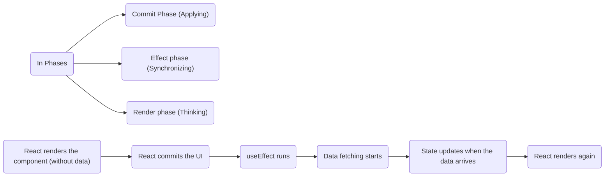
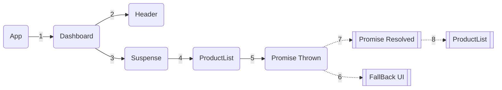
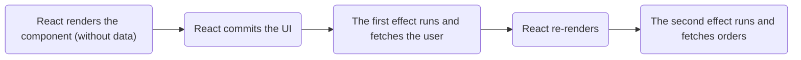

[Supspense Pattern - Data Fetching Pattern with react Suspense](#top)

- [Supsense](#supsense)
  - [Render-as-you-Fetch methodology- Supsense](#render-as-you-fetch-methodology--supsense)
  - [Fetch-On-Render methodology- useEffect](#fetch-on-render-methodology--useeffect)
- [Implementation with TypeScript and use()](#implementation-with-typescript-and-use)
- [Implementation with TypeScript and a Data Fetching Library](#implementation-with-typescript-and-a-data-fetching-library)
  - [using TanStack Query (React Query)](#using-tanstack-query-react-query)
  - [using SWR](#using-swr)
- [ErrorBoundary](#errorboundary)
  - [using 'react-error-boundary' library](#using-react-error-boundary-library)
  - [Custom Class Component (Native React API)](#custom-class-component-native-react-api)
- [Benefit](#benefit)

## Supsense

- React works in phases. It doesn’t do everything at once. At a high level, every update in React goes through three distinct phases:
  - **Render phase** – React figures out what the UI should look like
  - **Commit phase** – React applies those changes to the DOM
  - **Effect phase** – React synchronises with the outside world



### Render-as-you-Fetch methodology- Supsense

- Supsense is a **rendering** coordination mechanism
  - React pauses rendering for that part of the tree and shows a fallback UI until the required data becomes available
  - Suspense enables <mark>Render-as-you-Fetch</mark>: Data fetching can begin before React attempts to commit the UI, and rendering simply waits until the data is ready
  - while `useEffect` runs after React has already committed the UI to the DOM
- With Suspense, **need** to wrap the component that handles the <mark>asynchronous call</mark>



### Fetch-On-Render methodology- useEffect

```ts
useEffect(() => {
  fetchUser().then(setUser);
}, []);
useEffect(() => {
  if (!user) return;
  fetchOrders(user.id).then(setOrders);
}, [user]);
```



- **hidden waterfalls**: Effects run after the commit phase, which means data fetching is always a reaction to rendering, never a prerequisite for it. As applications grow, this creates **render-fetch-re-render loops**, and **loading logic spread across components**

[back to top](#🚀)

###　React Suspense vs. React Query

|Suspense|React Query|
|---|---|
|handles asynchronous rendering|manages caching, background updates, and API synchronization, providing full control over data fetching, state management, and mutations|
|manage loading states for asynchronous operations, including API data fetching and lazy-loaded components|specifically designed for handling API data fetching, offering advanced features like caching, automatic retries, and background updates|
|works with React Server Components (RSC) and supports streaming UI|designed for client-side data fetching|
|relies on react-error-boundary to handle errors|provides fine-grained control over loading, error, and refetching states without requiring Suspense|

[back to top](#🚀)

## Implementation with TypeScript and use()

- `use()` is an API introduced in **React 19** that accepts a promise and returns its resolved value
  - `const data = use(promise);`
  - `use()` is called during renderm No `useEffect`, no loading state
- If the promise hasn’t resolved yet, React doesn’t continue rendering. It suspends(rendering pauses)
- If the promise fails, React throws an error
- Both cases are handled declaratively by Suspense and Error Boundaries

```ts
import { Suspense, use } from "react";
const userPromise = fetch("/api/user").then(res => res.json());
function Profile() {
  const user = use(userPromise);
  return <h2>Welcome, {user.name}</h2>;
}
export default function App() {
  return (
    <ErrorBoundary>
      <Suspense fallback={<p>Loading profile...</p>}>
        <Profile />
      </Suspense>
    </ErrorBoundary>
  );
}
```

- Multiple fetch sample

```ts
//1. create resources  --> api/index.ts
export function fetchUser() {
  return new Promise((resolve) => {
    setTimeout(() => {
      resolve({ id: 1, name: "Tapas" });
    }, 1500);
  });
}
export function fetchOrders(userId) {
  return new Promise((resolve, reject) => {
    setTimeout(() => {
      resolve([
          `Order A for user ${userId}`,
          `Order B for user ${userId}`
      ]);
    }, 1500);
  });
}
export function fetchAnalytics(userId) {
  //...
}
// 2. Create a Centralised User Resource --> resources/userResource.ts
import { fetchAnalytics, fetchOrders, fetchUser } from "../api";
let userPromise;
let ordersPromise;
let analyticsPromise;
export function createUserResources() {
  userPromise = fetchUser();
  ordersPromise = userPromise.then(user =>
    fetchOrders(user.id)
  );
  analyticsPromise = userPromise.then(user =>
    fetchAnalytics(user.id)
  );
}
export function getUserResources() {
  return {
    userPromise,
    ordersPromise,
    analyticsPromise
  };
}
// 3. usage in component  -->Profile.tsx
import { use } from "react";
import { getUserResources } from "../resources/userResource";
const Profile => () {
    const { userPromise } = getUserResources();
    const user = use(userPromise);     //use()
    return <h2 className="text-3xl">Welcome, {user.name}</h2>;
}
export default Profile;
// 4. working with Suspense
// --> components/Skeletons.tsx
export const ProfileSkeleton = () => <p className="text-3xl m-2">Loading user...</p>;
export const OrdersSkeleton = () => <p className="text-3xl m-2">Loading orders...</p>;
export const AnalyticsSkeleton = () => <p className="text-3xl m-2">Loading analytics...</p>;
// --> Dashboard.tsx
<ErrorBoundary>
  <Suspense fallback={<ProfileSkeleton />}>
    <Profile />
  </Suspense>
  </ErrorBoundary>
<ErrorBoundary>
  <Suspense fallback={<OrdersSkeleton />}>
      <Orders />
  </Suspense>
</ErrorBoundary>
<ErrorBoundary>
  <Suspense fallback={<AnalyticsSkeleton />}>
      <Analytics />
  </Suspense>
</ErrorBoundary>
```

[back to top](#🚀)

## Implementation with TypeScript and a Data Fetching Library

- data-fetching library like [TanStack Query (React Query)](https://tanstack.com/query/v5/docs/react/guides/suspense) or [SWR](https://dev.to/dunedev/react-suspense-for-data-fetching-36dg) which are designed to work with `Suspense`
1. Create a fetcher function
2. Create the component using the useSWR/React-query hook
3. Wrap the component in a Suspense boundary

### using TanStack Query (React Query)

```ts
import { useQuery, QueryClient, QueryClientProvider } from '@tanstack/react-query';
import { Suspense } from 'react';
// 1.
const queryClient = new QueryClient({
  defaultOptions: {
    queries: {
      suspense: true, // Enables Suspense for queries
    },
  },
});
const fetchUser = async () => {
  const res = await fetch('https://dummyjson.com/users/1');
  if (!res.ok) throw new Error('Network response was not ok');
  return res.json();
};
// 2.
function UserComponent() {
  const { data } = useQuery({ queryFn: fetchUser });
  return (
    <div>
      <h2>{data.firstName} {data.lastName}</h2>
      <p>Email: {data.email}</p>
      <p>Age: {data.age}</p>
    </div>
  );
}
//3.
export default function App() {
  return (
    <QueryClientProvider client={queryClient}>
      <ErrorBoundary fallback={<div>An error occurred while fetching user details...</div>}>
        <Suspense fallback={<div>Loading user details...</div>}>
          <UserComponent />
        </Suspense>
      <ErrorBoundary>
    </QueryClientProvider>
  );
}
```

[back to top](#🚀)

### using SWR

```ts
// 1. Create a fetcher function
interface User {
  firstName: string;
  email: string;
}
const fetcher = async (url: string): Promise<User> => {
  const res = await fetch(url);
  if (!res.ok) {
    throw new Error('Network response was not ok');
  }
  return res.json();
};
// 2. Create the component using the hook with suspense
import useSWR from 'swr';
function UserDetails() {
  // Data is guaranteed to be available when the component renders, no need for null checks
  const { data } = useSWR<User>('https://dummyjson.com/users/1', fetcher, { suspense: true });
  return (
    <div>
      <h4>Welcome, {data!.firstName}</h4>
      <p>{data!.email}</p>
    </div>
  );
}
// 3. Wrap the component in a Suspense boundary
import { Suspense } from 'react';
Import an ErrorBoundary component     //you would need to implement or use a library one
import { ErrorBoundary } from './ErrorBoundary';
function App() {
  return (
    <ErrorBoundary fallback={<div>Error loading user data</div>}>
      <Suspense fallback={<p>Fetching user details...</p>}>
        <UserDetails />
      </Suspense>
    </ErrorBoundary>
  );
}
```

[back to top](#🚀)

## ErrorBoundary

### using 'react-error-boundary' library

```ts
import { Suspense } from 'react';
import { ErrorBoundary, FallbackProps } from 'react-error-boundary';
// 1. Define a Fallback Component with TypeScript types
const ErrorFallback = ({ error, resetErrorBoundary }: FallbackProps) => {
  // Log the error to an error reporting service here if needed
  // componentDidCatch can be used for logging in class components
  return (
    <div role="alert">
      <h2>Something went wrong:</h2>
      <pre>{error.message}</pre>
      <button onClick={resetErrorBoundary}>Try Again</button>
    </div>
  );
};
// 2. A component that might suspend (e.g., during data fetching)
// Data fetching libraries like TanStack Query can throw errors and suspend
const SuspendingComponent = () => {
  // Imagine a hook here that uses 'use' and can suspend or throw an error
  // e.g., const data = use(fetchDataPromise());
  return <div>Data loaded successfully!</div>;
};
// 3. Wrap your components with ErrorBoundary and Suspense
const App = () => {
  return (
    <ErrorBoundary FallbackComponent={ErrorFallback} onReset={() => {
        // Optional: call a function to reset the state of your app or data
        // This is useful for re-initiating failed async resources
    }}>
      <Suspense fallback={<div>Loading...</div>}>
        <SuspendingComponent />
      </Suspense>
    </ErrorBoundary>
  );
};

export default App;
```

### Custom Class Component (Native React API)

- https://react.dev/reference/react/Component#catching-rendering-errors-with-an-error-boundary

```ts
import React, { Component, ErrorInfo, ReactNode } from 'react';
interface ErrorBoundaryProps {
  children: ReactNode;
  fallback: ReactNode;
}
interface ErrorBoundaryState {
  hasError: boolean;
  error: Error | null;
}
class ErrorBoundary extends React.Component<ErrorBoundaryProps, ErrorBoundaryState> {
  constructor(props: ErrorBoundaryProps) {
    super(props);
    this.state = { hasError: false, error: null };
  }
  // Update state so the next render will show the fallback UI
  static getDerivedStateFromError(error: Error) {
    return { hasError: true, error };
  }
  // Use componentDidCatch to log the error to a service
  componentDidCatch(error, info) {
    logErrorToMyService(
      error,
      // Example "componentStack":
      //   in ComponentThatThrows (created by App)
      //   in ErrorBoundary (created by App)
      //   in div (created by App)
      //   in App
      info.componentStack,
      React.captureOwnerStack(), // Warning: `captureOwnerStack` is not available in production.
    );
  }
  render() {
    if (this.state.hasError) {
      return this.props.fallback;  // Render any custom fallback UI
    }
    return this.props.children;
  }
}
// usage with suspense
const AppWithNativeBoundary = () => {
  return (
    <ErrorBoundary fallback={<h1>Failed to load data.</h1>}>
      <Suspense fallback={<div>Loading application...</div>}>
        {/* Your components that use Suspense-enabled features go here */}
      </Suspense>
    </ErrorBoundary>
  );
};
```

[back to top](#🚀)

## Benefit

- **Cleaner Code**: Components receive data as if it were synchronous, eliminating isLoading checks and manual state management
- **Better UX**: The Suspense boundary manages the loading state, allowing you to coordinate loading of multiple components and avoid UI flickering

> References
- [The Modern React Data Fetching Handbook: Suspense, use(), and ErrorBoundary Explained](https://www.freecodecamp.org/news/the-modern-react-data-fetching-handbook-suspense-use-and-errorboundary-explained)
  - [15 Days of React Design Patterns -youtube](https://www.youtube.com/playlist?list=PLIJrr73KDmRyQVT__uFZvaVfWPdfyMFHC)
  - https://github.com/tapascript/15-days-of-react-design-patterns/tree/main/day-16
- [How to handle data fetching with React Suspense](https://blog.logrocket.com/react-suspense-data-fetching)
- [Use React 18 Suspense features with Apollo Client](https://www.apollographql.com/docs/react/data/suspense)
