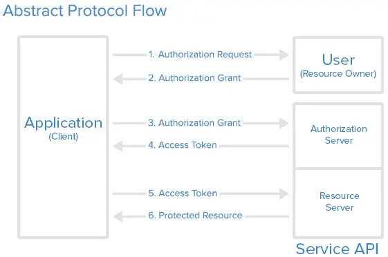
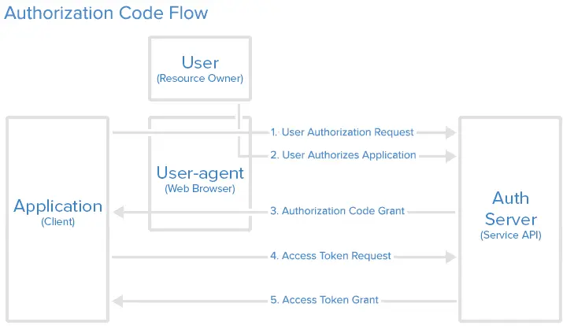
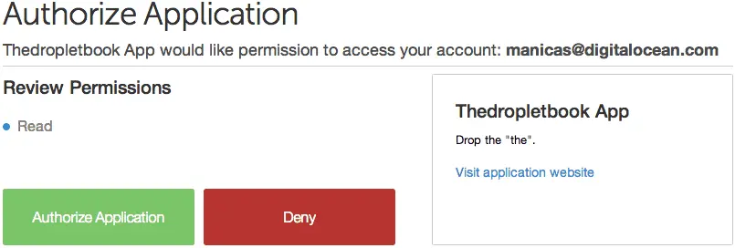
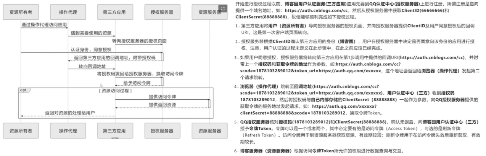

[OAuth2原理](#top)

- [OAuth Roles](#oauth-roles)
- [Abstract Protocol Flow](#abstract-protocol-flow)
- [Application Registration](#application-registration)
- [Authorization Grant](#authorization-grant)
- [Authorization Code授权码](#authorization-code授权码)
  - [Step 1 — Authorization Code Link 构建获取授权码请求链接](#step-1--authorization-code-link-构建获取授权码请求链接)
  - [Step 2 — User Authorizes Application 用户授权给第三方应用](#step-2--user-authorizes-application-用户授权给第三方应用)
  - [Step 3 — Application Receives Authorization Code 服务端给客户端返回授权码](#step-3--application-receives-authorization-code-服务端给客户端返回授权码)
  - [Step 4 — Application Requests Access Token 第三方应用请求服务端获取access token](#step-4--application-requests-access-token-第三方应用请求服务端获取access-token)
  - [Step 5 — Application Receives Access Token 第三方应用接收access token](#step-5--application-receives-access-token-第三方应用接收access-token)

--------------------------------------------------------------

- OAuth 2.0 is an authorization protocol, it enables applications — such as Facebook, GitHub — to obtain limited access to user accounts on an HTTP service 
- OAuth 2.0 uses Access Tokens
- OAuth 2 是一种授权框架，允许第三方应用通过用户授权的形式访问服务中的用户信息，最常见的场景是授权登录；再复杂一点的比如第三方应用通过 Github 给开发者提供的接口访问权限内的用户信息或仓库信息。OAuth2 广泛应用于web 、桌面应用、移动 APP 的第三方服务提供了授权验证机制，以此实现不同应用间的数据访问权限

## OAuth Roles

|Role|角色|说明|
|---|---|---|
|**Resource Owner**|**资源拥有者**|The resource owner is the user who authorizes an application to access their account. The application’s access to the user’s account is limited to the scope of the authorization granted (e.g. read or write access)|
|**Client**|**客户端**|The client is the application that wants to access the user’s account. Before it may do so, it must be authorized by the user, and the authorization must be validated by the API|
|**Resource Server**|**资源服务器**| The resource server hosts the protected user accounts|
| **Authorization Server**|**授权服务器**|The authorization server verifies the identity of the user then issues access tokens to the application|

[⬆ back to top](#top)

## Abstract Protocol Flow



|Step|说明|
|---|---|
|1. The application requests authorization to access service resources from the user |用户点击客户端提供的授权请求|
|2. If the user authorized the request, the application receives an authorization grant| 客户端请求服务的授权页面呈现给用户，用户点击确认授权后服务端返回授权许可凭证给客户端|
|3. The application requests an access token from the authorization server (API) by presenting authentication of its own identity, and the authorization grant |客户端通过步骤二接收到的授权许可凭证及在服务端注册的应用信息请求服务端|
|4. If the application identity is authenticated and the authorization grant is valid, the authorization server (API) issues an access token to the application. Authorization is complete. |如果步骤三验证通过服务端则返回 access token 给客户端|
|5. The application requests the resource from the resource server (API) and presents the access token for authentication |客户端通过第四步获取的 access token 请求服务端获取资源|
|6. If the access token is valid, the resource server (API) serves the resource to the application| 如果服务端校验 access token 成功，则返回指定资源给客户端|

[⬆ back to top](#top)

## Application Registration

在平台的注册页面至少得提供如下信息: 
- Application Name 应用名称
- Application Website 应用网址
- Redirect URI or Callback URL 回调链接: 用户点击同意按钮之后，服务端向客户端返回授权码或 access token ,当然如果是禁止操作也需回调告知客户端结果

在 OAuth 2 服务提供平台新建一个应用之后，平台会提供一对**客户端 ID 和密码**(Client credentials)作为客户端凭证。客户端 ID 是可以公开的字符串，用以构建授权请求链接；用户授权之后，客户端使用服务端的授权码和平台分配的密码获取**access token**。密码应当妥善保管以免泄漏

[⬆ back to top](#top)

## Authorization Grant

前四步包含了获取授权许可获取 access token ,授权许可有四种类型，服务端返回哪种类型取决于客户端在请求链接中构建的 response_type 参数: 
- **Authorization Code授权码**: used with server-side Applications, 通过授权码，服务端通过 Ajax 把 access token 返回给客户端, 是 OAuth2 授权最广泛的方式
- **Client Credentials用户密码凭证**: used with Applications that have API access, 同一个公司不同系统之间内部账户互联互通，比如国内某社区的代码托管系统通过社区的账户也可以登录
- **Device Code客户端凭证**: used for devices that lack browsers or have input limitations, 第三方应用自身服务访问提供 OAuth2 服务提供的平台资源
- **Implicit Flow隐式**：用于移动 APP 或 web 应用（应用运行在用户的设备上）

[⬆ back to top](#top)

## Authorization Code授权码



### Step 1 — Authorization Code Link 构建获取授权码请求链接

第一步是构建一个请求Auth Server获取授权码的链接，向服务端发起请求, 如 https://xxx.com/v1/oauth/authorize?response_type=code&client_id=CLIENT_ID&redirect_uri=CALLBACK_URL&scope=read
- `client_id` 平台分配给第三方应用的 ID
- `redirect_uri=CALLBACK_URL` 第三方开发者在平台新建第三方应用时填写的回调 URL
- `response_type=code` 指定服务端返回授权码
- `scope=read` 指定第三方应用请求权限类型

### Step 2 — User Authorizes Application 用户授权给第三方应用

当用户点击第一步构建的链接之后，在用户已经登录服务端之后才能点击确认授权（譬如想通过微信登录某个第三方网址，你必须首先已经登录微博）。这是平台会给用户提供一个页面给用户确认是否授权。


### Step 3 — Application Receives Authorization Code 服务端给客户端返回授权码

当用户点击同意授权之后，服务端发起一个请求重定向到第三方平台填写的回调链接，且请求链接中同时包含了服务端生成的授权码, 如https://xxx.com/callback?code=AUTHORIZATION_CODE

### Step 4 — Application Requests Access Token 第三方应用请求服务端获取access token

客户端获取到服务端返回的授权码之后，接着使用授权码和平台分配的密码请求服务端获取服务端的 access token 。第三方应用后端代码拼接的 URL 格式形似：
- https://cloud.xxx.com/v1/oauth/token?client_id=CLIENT_ID&client_secret=CLIENT_SECRET&grant_type=authorization_code&code=AUTHORIZATION_CODE&redirect_uri=CALLBACK_URL
- 注意**client_secret** 、没有暴露出去，在第三方应用后端代码中拼接请求链接
- **redirect_uri**不是在平台新建应用时填写的回调链接，而是第三方应用已经实现的另一个action处理服务端返回 access token 的请求

### Step 5 — Application Receives Access Token 第三方应用接收access token

如果第四部客户端发送的信息被服务端校验成功，服务端则返回 access token ，有一些平台同时也同时传递 refresh token 。返回的 json 信息形似

```
{
  "access_token":"ACCESS_TOKEN",
  "token_type":"bearer",
  "expires_in":2592000,
  "refresh_token":"REFRESH_TOKEN",
  "scope":"read",
  "uid":100101,
  "info":
    {
      "name":"Mark E. Mark",
      "email":"mark@thefunkybunch.com"
    }
}
```



[⬆ back to top](#top)

> References
- [An Introduction to OAuth 2](https://www.digitalocean.com/community/tutorials/an-introduction-to-oauth-2)
- [OAuth 2 详解](https://zhuanlan.zhihu.com/p/30720675)
- [【IT老齐211】说人话讲明白OAuth2经典授权码模式](https://www.bilibili.com/video/BV1ja411379W/?spm_id_from=333.788&vd_source=bad1d35f8fbfa2b52a4d43328c042500)
- [angular-oauth2-oidc](https://github.com/manfredsteyer/angular-oauth2-oidc)
