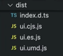

- [Context for mocking](#context-for-mocking)
- [Decorator](#decorator)
  - [Story decorator](#story-decorator)
  - [Global decorator](#global-decorator)
- [Play function and testing](#play-function-and-testing)
- [Setup Up a Component Library](#setup-up-a-component-library)
  - [cleanup files](#cleanup-files)
  - [configuration](#configuration)
----------------------------------------------

## Context for mocking

- args - the story arguments. You can use some args in your decorators and drop them in the story implementation itself.
- argTypes- Storybook's argTypes allow you to customize and fine-tune your stories args.
globals - Storybook-wide globals. In particular you can use the toolbars feature to allow you to change these values using Storybook’s UI.
- hooks - Storybook's API hooks (e.g., useArgs).
- parameters- the story's static metadata, most commonly used to control Storybook's behavior of features and addons
  - Available parameters are listed in the [parameters API](https://storybook.js.org/docs/api/parameters#available-parameters) reference
- viewMode- Storybook's current active window (e.g., canvas, docs)

```ts
export const options = {
  colors: ['primary', 'secondary'],
  sizes: ['sm', 'lg'],
  isClickable: false,
  isDragable: false
}
argTypes: {
    color: {
      description: '**options:**',
      table: {
        type: { summary: options.colors.map(o => `'${o}'`).join('|') }
      },
      control: { type: 'select', options: options.colors}
    },
}
```

[⬆ back to top](#top)

## Decorator

### Story decorator

```js
//card.stories.ts
const meta = {
  title: 'Components/Card1',
  component: Card1,
  decorators: [
    (Story) => (
      <div style={styles}> <Story /> </div>
    )
  ],
  //...
}
```

[⬆ back to top](#top)

### Global decorator

```js
//.storybook/preview.ts

```

[⬆ back to top](#top)

## Play function and testing

- `npm i @storybook/jest -D` or `npx playwright install chromium`
- `canvas.getByLabelText()`
- `canvas.getByText()`
- `canvas.getByRole()`
- `canvas.queryByText()`
- `canvas.getByPlaceholderText()`

```ts
import { within, userEvent } from '@storybook/test';
export const Email: Story = {
  args: {
    placeholder: 'email@xxx.xom',
    type: 'email'
  },
  play: async ({ canvasElement }) => {
    const canvas = within(canvasElement);
    const emailInput = await canvas.getByPlaceholderText('email@xxx.xom');
    await userEvent.click(emailInput);
    await userEvent.keyboard('sand@email.com');
    //expect(await canvas.getAllRole('row').length).toBe(7);
  },
};
```

```ts
// components/Form/FormD.stories.tsx
export const InvalidEmail: Story = {
  play: async ({ canvasElement }) => {
    const canvas = within(canvasElement);
    const submitButton = canvas.getByRole('button', { name: /Post/i });
    const email = canvas.getByLabelText(/email/i);
    await userEvent.type(email, 'i-am-not-an-email');
    await userEvent.click(submitButton);
    await expect(canvas.getByText(/valid email/i)).toBeInTheDocument();
    await expect(canvas.getByText(/enter a question/i)).toBeInTheDocument();
  },
};
```

[⬆ back to top](#top)

## Setup Up a Component Library

### cleanup files

- delete 'index.html'
- delete 'public' folder
- delete 'src/App.tsx', 'src/App.css', 'src/main.tsx', 'src/index.css'
- create 'src/components' folder

```
├── 📂src/
|    ├── 📂components/
|    |      ├── 📂Card/
|    |      |     ├── 📄Card.tsx
|    |      |     ├── 📄Card.stories.tsx
|    |      |     └─  📄index.ts
|    |      └─ 📂Input/
```

- `npm i vite-plugin-dts -D`
- edit `vite.config.ts`

```ts
import dts from 'vite-plugin-dts'
export default defineConfig({
  plugins: [
    react(),
    dts({ exclude: [ "**/*.stories.tsx", "**/*.test.tsx"]})
  ],
})
```

### configuration

1. create a new 'src/index.ts' file
2. modify 'vite.config.ts'
3. modify 'package.json'

```ts
//src/index.ts
export { Card } from './components/Card'
// vite.config.ts
import { peerDependencies } from './package.json'
// https://vitejs.dev/config/
export default defineConfig({
  plugins: [
    react(),
    dts({ exclude: [ "**/*.stories.tsx", "**/*.test.tsx"]})
  ],
  build: {
    lib: {
      entry: './src/index.ts',
      name: 'ui',
      fileName: (format) => `ui.${format}.js`,
      formats: ['es', 'cjs', 'umd']
    },
    rollupOptions: {
      external: Object.keys(peerDependencies),
      output: { globals: { react: 'react', 'react-dom': 'ReactDOM'}}
    },
  }
})
//package.json
"peerDependencies": {
   "react": "^18.2.0",
   "react-dom": "^18.2.0",
}
```

4. `npm run build`,  
5. adding following to 'package.json'

```js
"types": "dist/index.d.ts",
"exports": {
    ".": {
      "import": "./dist/ui.es.js",
      "require": "./dist/ui.umd.js"
    }
},
"files": ["dist"],
```

[⬆ back to top](#top)

-----------------------------------------------
> GIthub
- [React Admin Dashboard App | React, Material UI, Data Grid, Light & Dark Mode](https://github.com/ed-roh/react-admin-dashboard/tree/master)
- [Vue 3 + Ts + Vite + storybook](https://github.com/baobaomi900901/storybook8/tree/main)
- [next14-storybook8-mui5-custom-theming-template](https://github.com/zautke/next14-storybook8-mui5-custom-theming-template)
- [Storybook-Mui](https://github.com/panntod/Storybook-Mui/tree/master)

> Create an Angular Component Library w/ StoryBook
- [Create an Angular Component Library w/ StoryBook](https://peakup.org/blog/create-an-angular-component-library-w-storybook/)
- https://github.com/marcelorl/angular-lib-storybook
