- [API design](#api-design)
  - [API Design Principles](#api-design-principles)
  - [The API Design Process](#the-api-design-process)
  - [Design Approaches](#design-approaches)
  - [API Lifecycle management](#api-lifecycle-management)
- [API Protocol](#api-protocol)
  - [HTTP](#http)
- [REST vs GraphQL](#rest-vs-graphql)
- [REST/GraphGL Example](#restgraphgl-example)
- [Authentication and Authorization](#authentication-and-authorization)
  - [Authentication](#authentication)
  - [Authorization](#authorization)

-------------------------

## API design

|Web browser| Mobile App|
|---|---|
|The server handles business logic, data storage, and presentation usng HTML, CSS and Typescript|Request data from the server using API calls. Response are typically in JSON format|

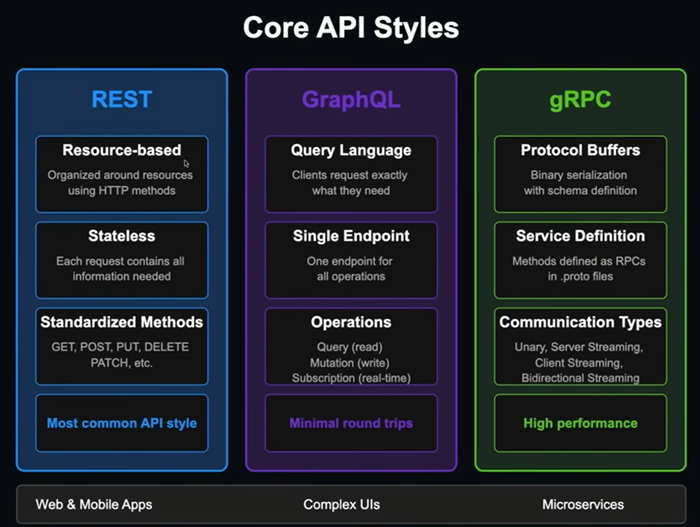

### API Design Principles

- **Consistency**
  - Consistent naming
  - Consistent patterns
- **Simplicity**
  - Focus on core use cases
  - Intuitive design
- **Security**
  - Authentication
  - Authorization
  - Input validation
  - Rate limiting
- **Performance**
  - Caching strategies
  - Pagination
  - Minimize payloads
  - Reduce round trips

### The API Design Process

- Identify core use cases and user stories
- Define scope and boundaries
- Determine performance requirements
- Consider security constraints

### Design Approaches

- **Top-down:** Start with high-level requirements and workflows
- **Bottom-up:** Begin with existing data models and capabilities
- **Contract-first:** Define the API contract before implementation

### API Lifecycle management

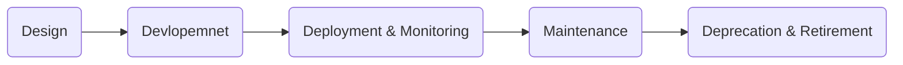

[🚀back to top](#top)

## API Protocol

- 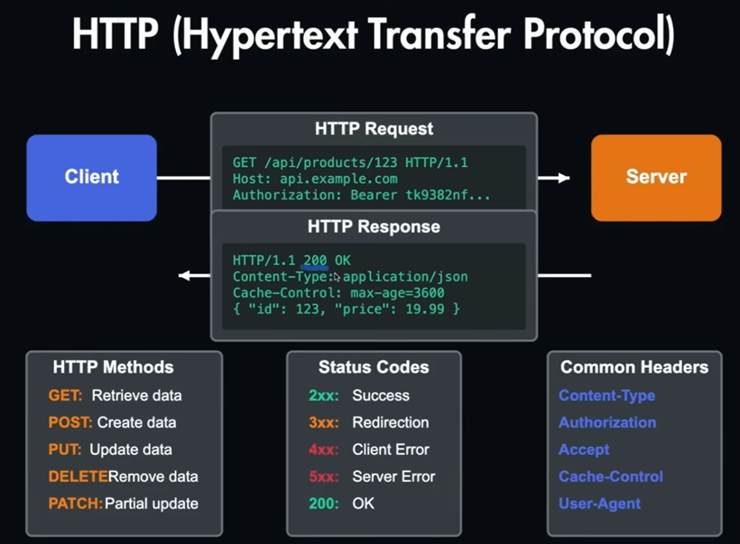
- 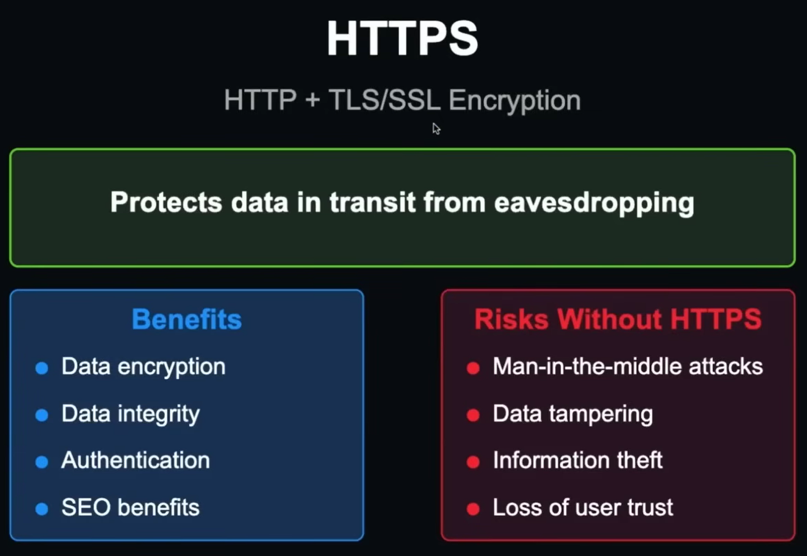
- 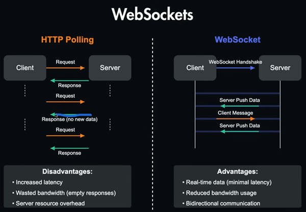
- 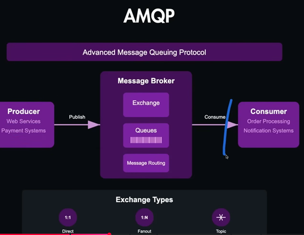
- 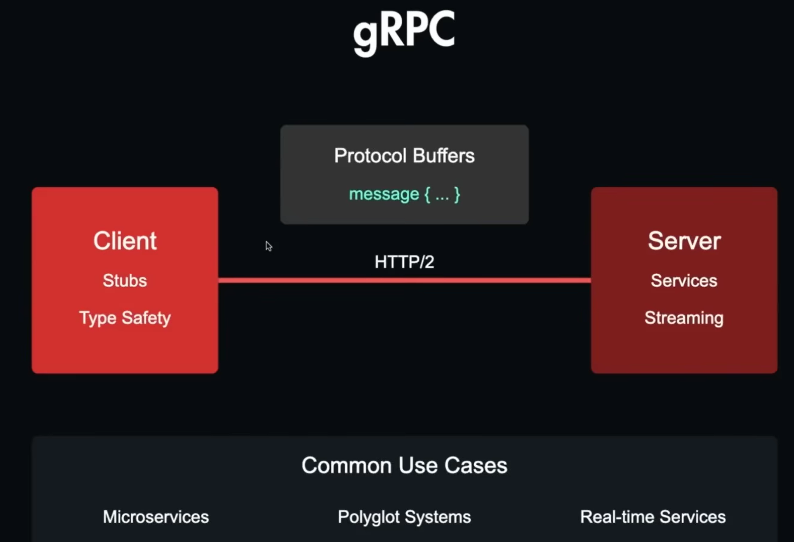
- Choosing the right Protocol
  - Interaction Patterns: request-response vs real-time
  - Peformance: speed and efficiency
  - Client compactibility: browser, mobile, legacy
  - Payload size: data volume and encoding
  - Security Needs: authentication, encryption
  - Developer experiences: tooling and documentation

### HTTP

|Status Code|||
|---|---|---|
|2xx|Success|- 200 OK<br>- 201 Created<br>- 204 No Content|
|3xx|Redirection||
|4xx|Client Errors|- 400 Bad Request<br>- 401 Unauthorized<br>- 404 Not Found|
|5xx|Server Errors||

## REST vs GraphQL

| REST | GraphQL|
|---|---|
|- Resource-based endpoints|- Single endpoint for all operations|
|- Multiple requests for related data|- Single request for precise data|
|- HTTP methods define operations|- Query language defines operations|
|- Fixed response structures|- Client*specifies response structure|
|- Explicit versioning (`/v1`, `/v2`)|- Schema evolution without versioning|
|- Built-in HTTP caching|- application-level caching|

## REST/GraphGL Example

```http
GET /api/v1/users/123
GET /api/v1/users/123/posts
GET /api/v1/users/123/followers
/* Three separate requests
each with fixed response structure */
```

```graphql
query {
  u*er(id: "123") {
    name
    posts*{
      title
      content
    }
*   followers {
      name
    }
  *
}
```

[🚀back to top](#top)

## Authentication and Authorization

### Authentication

- 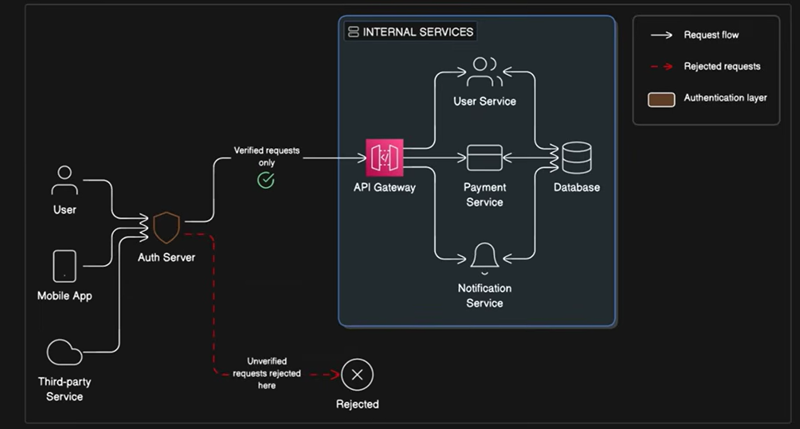
- Authentication-methods
  - Basic Auth methods
    - Basic --> Digest --> API keys --> Session
  - Token-based Auth methods
    - Bearer & JWT Tokens --> Access & Refresh tokens
  - OAuth2 and OICD
    - OAuth2 --> OpenID Connect
  - SSO & Identity Protocols
    - SSO(SAML, OIDC, OAuth2)

- Basic Authentication flow

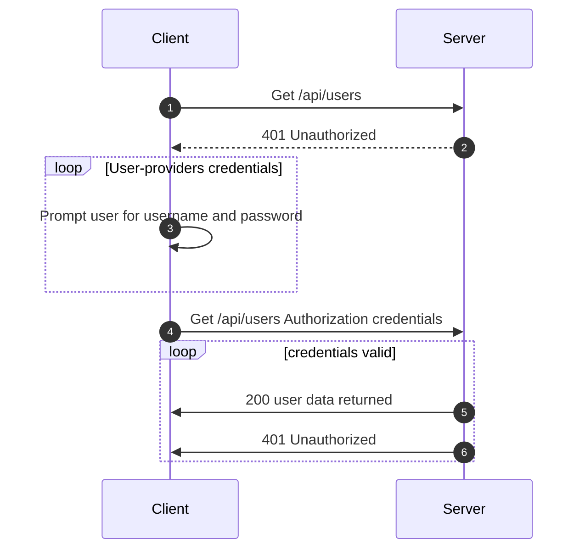

### Authorization

- 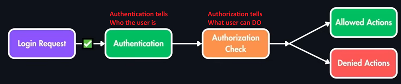

|Model|Description|
|---|---|
|RBAC(Role-Based Access Control)|Assign roles like admin or editor<br>Most common approach|
|ABAC(Attribute-Based Access Control)|Based on user/resource attributes<br>More flexible, more complex|
|ACL(Access Control List)|Each resource has its own permission list<br>such as Google Docs sharing|
|Real system ofen combine multiple models||

- 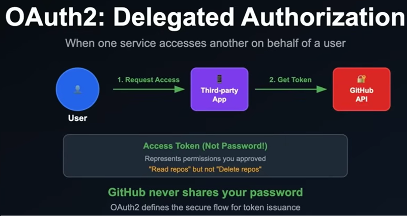
- 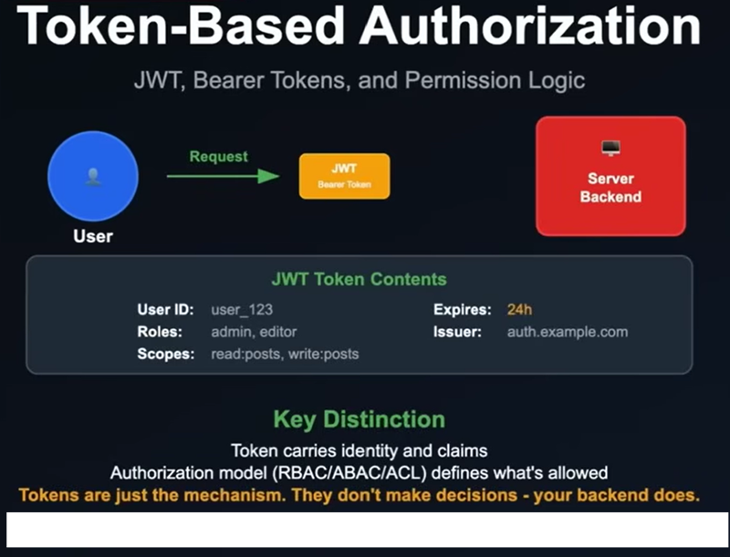

[🚀back to top](#top)
