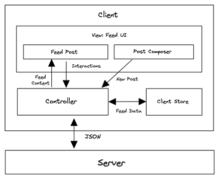

[Application Design -News Feed Application](#top)

- [Requirements exploration](#requirements-exploration)
- [Architecture / high-level design](#architecture--high-level-design)
  - [Component responsibilities](#component-responsibilities)
  - [Rendering approach](#rendering-approach)
- [Data model](#data-model)
  - [Advanced: Normalized store](#advanced-normalized-store)
- [API definitions](#api-definitions)
  - [Offset-based pagination](#offset-based-pagination)
  - [Cursor-based pagination](#cursor-based-pagination)
  - [pagination to use for news feed](#pagination-to-use-for-news-feed)
- [Optimizations and deep dive](#optimizations-and-deep-dive)
  - [General optimizations](#general-optimizations)
  - [Error states](#error-states)
  - [Feed list optimizations](#feed-list-optimizations)
  - [Feed composer optimizations](#feed-composer-optimizations)
  - [Accessibilty:](#accessibilty)

-------------------------------------

Design a news feed application that contains a list of feed posts users can interact with, e.g. Facebook

## Requirements exploration

- What are the core features to be supported?
  - Browse news feed containing posts by the user and their friends
  - Liking and reacting to feed posts
  - Creating and publishing new posts
  - Commenting and sharing posts
- What kind of posts are supported?
  - types of posts, primarily text or image-based posts
- What pagination UX should be used for the feed?
  - **Infinite scrolling**, meaning more posts will be added when the user reaches the end of their feed
- Will the application be used on mobile devices?

## Architecture / high-level design

### Component responsibilities

|||
|---|---|
|Server|Provides HTTP APIs to fetch feed posts and to create new feed posts|
|Controller|Controls the flow of data within the application and makes network requests to the server|
|Client store|Stores data needed across the whole application|
|Feed UI|Contains a list of feed posts and the UI for composing new posts - **Feed posts**: Presents the data for a feed post and contains buttons to interact with the post (like/react/share) -**Post composer**: WYSIWYG (what you see is what you get) editor for users to create new feed posts|
|Rendering approach|- Server-side rendering (SSR) - Client-side rendering (CSR)|

### Rendering approach

- <mark>Server-side rendering (SSR)</mark>: Rendering the HTML on the server side, which is the most traditional way. Best for static content that require SEO and does not require heavy user interaction. **Websites like blogs, documentation sites, e-commerce websites are built using SSR**.
- <mark>Client-side rendering (CSR)</mark>: Rendering in the browser, by dynamically adding DOM elements into the page using JavaScript. Best for interactive content. Applications like **dashboards, chat apps are built using CSR**
- <mark>Hybrid</mark>: news feed applications are somewhere in-between, there's a good amount of static content but they also require interaction. In reality, Facebook uses a hybrid approach which gives the best of both worlds: a fast initial load with SSR then hydrating the page to attach event listeners for user interactions. Subsequent content (e.g. more posts added once the user reaches the end of their feed) and page navigation will use CSR
- more:
  - [Rendering on the web](https://web.dev/rendering-on-the-web/)
  - [Rebuilding our tech stack for the new Facebook.com](https://engineering.fb.com/2020/05/08/web/facebook-redesign/)

[⬆ back to top](#top)

## Data model

|Entity|	Source	|Belongs to	|Fields|
|---|---|---|---|
|Feed	|Server	|Feed UI	|`posts` (list of Posts), `pagination` (pagination metadata)|
|Post|	Server|	Feed post|	`id`, `created_time`, `content`, `author`, `reactions`, `image_url`|
|User	|Server|	Client store|	`id`, `name`, `profile_photo_url`|
|NewPost	|User input (Client)|Post composer UI	|`message`, `image`|

### Advanced: Normalized store

- In a nutshell, normalized data stores:
  - Resemble databases where each type of data is stored in its own table
  - Each item has a unique ID
  - References across data types use IDs (like a foreign key) instead of having nested objects
- The benefits of having a normalized store are:
  - **Reduced duplicated data**: Single source of truth for the same piece of data that could be presented in multiple instances on the UI. E.g. if many posts are by the same author, we're storing duplicated data for the author field in the client store
  - **Easily update all data for the same entity**: In the scenario that the feed post contains many posts authored by the user and that user changes their name, it'd be good to be able to immediately reflect the updated author name in the UI. This will be easier to do with a normalized store than a store that just stores the server response verbatim
- Both Facebook and Twitter use a normalized client side store
  - Facebook uses **Relay** (which can normalize the data by virtue of knowing the GraphQL schema) while Twitter uses **Redux** as seen from the "[Dissecting Twitter's Redux Store](https://medium.com/statuscode/dissecting-twitters-redux-store-d7280b62c6b1)" blog post
- <mark>don't really need to use a normalized store for a news feed</mark> because:
  - With the exception of the user/author fields, there isn't much duplicated data.
  - News feed is mostly for consuming information, there aren't many use cases to update data. Feed user interactions such as liking only affect data within a feed post
- Further reading
  - [Redux's documentation on normalizing state shape](https://redux.js.org/usage/structuring-reducers/normalizing-state-shape)
  - [Making Instagram.com faster: Part 3 — cache first](https://instagram-engineering.com/making-instagram-com-faster-part-3-cache-first-6f3f130b9669)

[⬆ back to top](#top)

## API definitions

|Source|	Destination|	API type|	Functionality|
|---|---|---|---|
|Server|	Controller|	HTTP|	Fetch feed posts|
|Controller|	Server|	HTTP	|Create new post|
|Controller|	Feed UI|	JavaScript	|Pass feed posts data, Reactions|
|Post composer|	Controller	|JavaScript	|Pass new post data|

|HTTP Method| Path|Description| Parameters|
|---|---|---|---|
|POST|`/posts`| Creates a new post| `{ body: '...'. media: '...'}`|
|...|...|...|...|

### Offset-based pagination

- Offset-based pagination involves using an offset to specify where to start retrieving data and a limit to specify the number of items to retrieve
- `SELECT * FROM posts LIMIT 5 OFFSET 0; -- First page`
- `SELECT * FROM posts LIMIT 5 OFFSET 5; -- Second page`

|Parameter	|Type	|Description|
|---|---|---|
|size	|number|	Number of items per page|
|page|	number	|Page number to fetch|
|cursor	|string|	An identifier for the last item fetched. The database query will make use of this identifier|

### Cursor-based pagination

- Cursor-based pagination uses a pointer (the cursor) to a specific record in a dataset
- `SELECT * FROM table WHERE id > cursor LIMIT 5`
- Reference: [Evolving API Pagination at Slack](https://slack.engineering/evolving-api-pagination-at-slack)

### pagination to use for news feed

- **Offset-based** is simpler and better for static or small datasets where direct access to pages is important.
- **Cursor-based** is more efficient and reliable for large, dynamic datasets where the data sequence is important and changes frequently
- For an <mark>infinite scrolling news feed</mark>, so **cursor-based pagination** is clearly superior and should be used for a news feed
  - New posts can be added frequently to the top of the feed
  - Newly fetched posts are appended to the end of the feed
  - Table size can grow pretty quickly
- Reference: [Evolving API Pagination at Slack](https://slack.engineering/evolving-api-pagination-at-slack)

[⬆ back to top](#top)

## Optimizations and deep dive

### General optimizations

- Code splitting JavaScript for faster performance
- Code splitting is a technique to split code needed on a page into separate files so that they can be loaded in parallel or when they're needed
- Code splitting can be done on two levels
  - **Split on the page level**: Each page will only load the JavaScript and CSS needed on that page
  - **Lazy loading resources within a page**: Load non-critical resources only when needed or after the initial render, such as code that's only needed lower down on the page, or code that's used only when interacted with (e.g. modals, dialogs)(https://engineering.fb.com/2020/05/08/web/facebook-redesign/)
- For news feed application, there's only a single page, so page-level code splitting is not too relevant; **Lazy loading** is most relevant to the **feed post UI**
  - reference: [Rebuilding our tech stack for the new Facebook.com" blog post]

[⬆ back to top](#top)

### Error states

- Clearly display error states if any network requests have failed, or when there's no network connectivity

### Feed list optimizations

- **Infinite scrolling**: A way to reduce or entirely eliminate the waiting time is to load the next set of feed posts before the user hits the bottom of the page so that the user never has to see any loading indicators
  - **Listen for the scroll event**: Add a `scroll` event listener (ideally throttled) to the page or a timer (via `setInterval`) that checks whether the position of the marker element is within a certain threshold from the bottom of the page. The position of the marker element can be obtained using [Element.getBoundingClientRect](https://developer.mozilla.org/en-US/docs/Web/API/Element/getBoundingClientRect)
  - **Intersection Observer API**: [Intersection Observer API | MDN](https://developer.mozilla.org/en-US/docs/Web/API/Intersection_Observer_API) monitor when the marker element is entering or exiting another element or intersecting by a specified amount
- **Virtualized lists**: Virtualized lists is a technique to render only the posts that are within the viewport
- **Loading indicators**:
- References:
  - [General optimizations](https://www.greatfrontend.com/questions/system-design/news-feed-facebook#general-optimizations)
  - [Feed list optimizations](https://www.greatfrontend.com/questions/system-design/news-feed-facebook#feed-list-optimizations)
  - [Feed post optimizations](https://www.greatfrontend.com/questions/system-design/news-feed-facebook#feed-post-optimizations)
  - [Feed composer optimizations](https://www.greatfrontend.com/questions/system-design/news-feed-facebook#feed-composer-optimizations)

[⬆ back to top](#top)

### Feed composer optimizations

- Rich text for hashtags and mentions
- Lazy load dependencies

[⬆ back to top](#top)

### Accessibilty:
  
- [Making Facebook.com accessible to as many people as possible](https://engineering.fb.com/2020/07/30/web/facebook-com-accessibility/)

[⬆ back to top](#top)

> References
- [System design- News Feed (e.g. Facebook)](https://www.greatfrontend.com/questions/system-design/news-feed-facebook)
- [Rebuilding our tech stack for the new Facebook.com](https://engineering.fb.com/2020/05/08/web/facebook-redesign/)
- [Making Facebook.com accessible to as many people as possible](https://engineering.fb.com/2020/07/30/web/facebook-com-accessibility/)
- [How we built Twitter Lite](https://blog.twitter.com/engineering/en_us/topics/open-source/2017/how-we-built-twitter-lite)
- [Building the new Twitter.com](https://blog.twitter.com/engineering/en_us/topics/infrastructure/2019/buildingthenewtwitter)
- [Dissecting Twitter's Redux Store](https://medium.com/statuscode/dissecting-twitters-redux-store-d7280b62c6b1)
- [Twitter Lite and High Performance React Progressive Web Apps at Scale](https://medium.com/@paularmstrong/twitter-lite-and-high-performance-react-progressive-web-apps-at-scale-d28a00e780a3)
- [Making Instagram.com faster: Part 1](https://instagram-engineering.com/making-instagram-com-faster-part-1-62cc0c327538)
- [Making Instagram.com faster: Part 2](https://instagram-engineering.com/making-instagram-com-faster-part-2-f350c8fba0d4)
- [Making Instagram.com faster: Part 3 — cache first](https://instagram-engineering.com/making-instagram-com-faster-part-3-cache-first-6f3f130b9669)
- [Evolving API Pagination at Slack](https://slack.engineering/evolving-api-pagination-at-slack)
