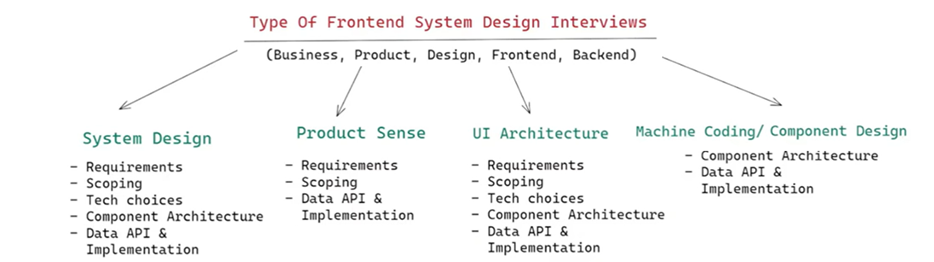
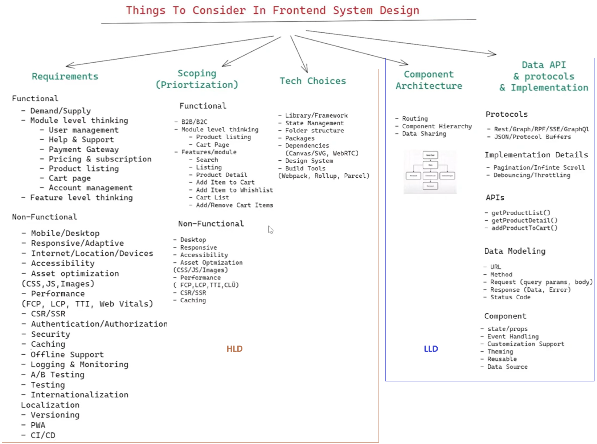
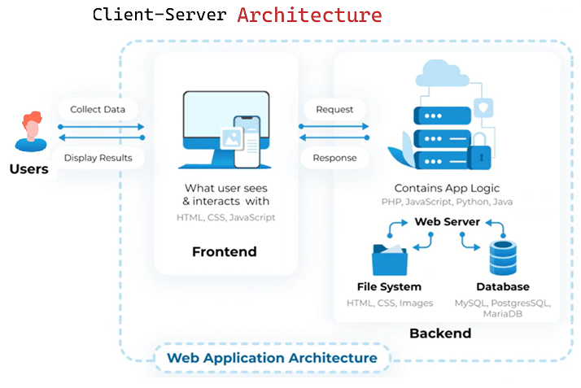
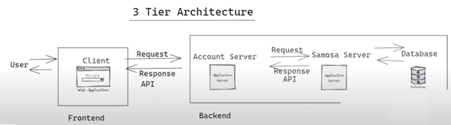
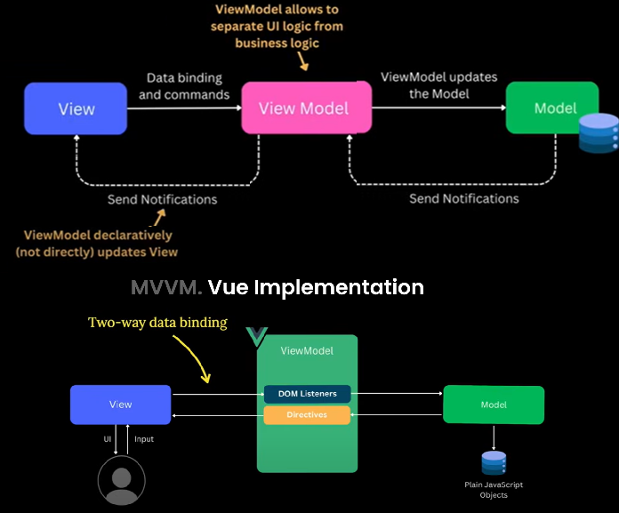
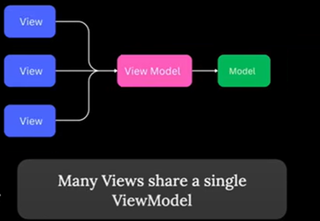

[Frontend System Design](#top)

- [General](#general)
- [Frontend System Design Components](#frontend-system-design-components)
- [MVVM (Model-View-ViewModel)](#mvvm-model-view-viewmodel)
- [Hierarchical MVC (HMVC)](#hierarchical-mvc-hmvc)
- [MVVM-C (with Coordinator)](#mvvm-c-with-coordinator)
- [VIPER Architecture](#viper-architecture)
- [Clean Architecture](#clean-architecture)
- [Hexagonal Architecture](#hexagonal-architecture)
- [Screaming Architecture](#screaming-architecture)
- [Tools](#tools)
-----------------------------------------------

## General

- Types of System Design
  - Product Design(HLD or Hign-Level Design)
  - Component Design(LLD)
- Types of System Design Interviews
- 
- Things to consider In Front end System Design
  - requirements
  - scoping(Prioritization)
  - Tech choices
  - Component Architecture
  - Data API & protocols & Implementation
- 
  
## Frontend System Design Components

- Architectural Patterns
  - Iframe
  - Web components
  - Module Federation
  - MicroApps / Route based
- Communication Protocols
  - REST/GraphQL/inMemory
- Availability
  - offline support: Sevice Worker
- Accessibility
- Consistency
  - CSS propeties --> Polyfills
- Credibility & Trust
  - SEO
- Logging & Monitoring
  - Error logging, user tracking, User activity, Feature usuage, Infra/capcity monitoring
- Databases/Caching
  - HTTP cachings, Apollo caching, 
  - statement management(Redux, context)
  - local storage
  - Session storage
  - Cookie
  - IndexedDB
- Security
  - Authentication/Authorization
  - CORS, CSP
- Performancy & Optimization
  - Assets optimization
  - Delivery option
  - SSR
  - Service worker
- Testing: 
  - unit test, Intergration testing, end to end testing
  - Jest, Cypress




## MVVM (Model-View-ViewModel)

- MVVM separats the view logic from business logic
  - Business Logic
    - Change username
    - make a transaction
    - remove an item from the basket
  - View Logic
    - Close/open modal window
    - Disabel button
    - Update download status




```
               Pros                                      |                   Cons
---------------------------------------------------------|---------------------------------------------------------
- Layer seperation. Clear separation between UI(View),   | - Stepper learning curve. Harder to understand
business logic(Model), and presentation Logic(ViewModel) |   and develop
- Scalability. Easier to test, maintain and scale        | - Inexpressiveness. MVVM adds space to store presentation
                                                         |   logic but doesn't help us organize other parts of the
                                                         |   application like API requests, etc.
```

[⬆ back to top](#top)

## Hierarchical MVC (HMVC)

[⬆ back to top](#top)

## MVVM-C (with Coordinator)

[⬆ back to top](#top)

## VIPER Architecture

[⬆ back to top](#top)

## Clean Architecture

[⬆ back to top](#top)

## Hexagonal Architecture

[⬆ back to top](#top)

## Screaming Architecture

[⬆ back to top](#top)


## Tools

- Draw.io
- Gliffy.com
- Lucidchart.com
- Miro.com
- One note(Microsoft)
- Jamboard(Google)

> references
- [14 Front End System Design Concepts Explained in 10 Minutes](https://www.youtube.com/watch?v=YO7R0rYWDl8)
- [Frontend System Design: The 2025 Web Performance Roadmap](https://www.youtube.com/watch?v=KUdqbIHn8Ic)
- [Frontend Architecture Patterns You Need to Know in 2025](https://www.youtube.com/watch?v=ixee55xm_d8)x
- [Frontend System Design | Chakde](https://www.youtube.com/playlist?list=PL4CFloQ4GGWICE0Tz6iXKfN3XWkXRlboU)x
- [Frontend System Design Framework-github sample](https://github.com/wasteCleaner/frontend-system-design-framework?)


monolithic
