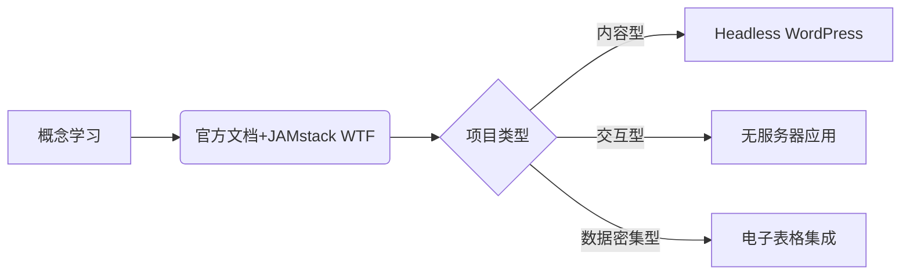
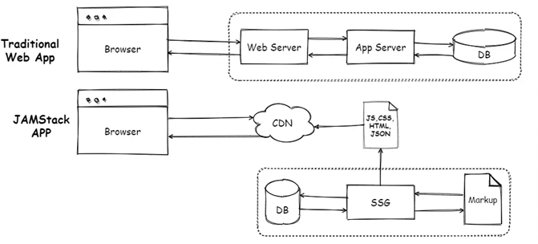
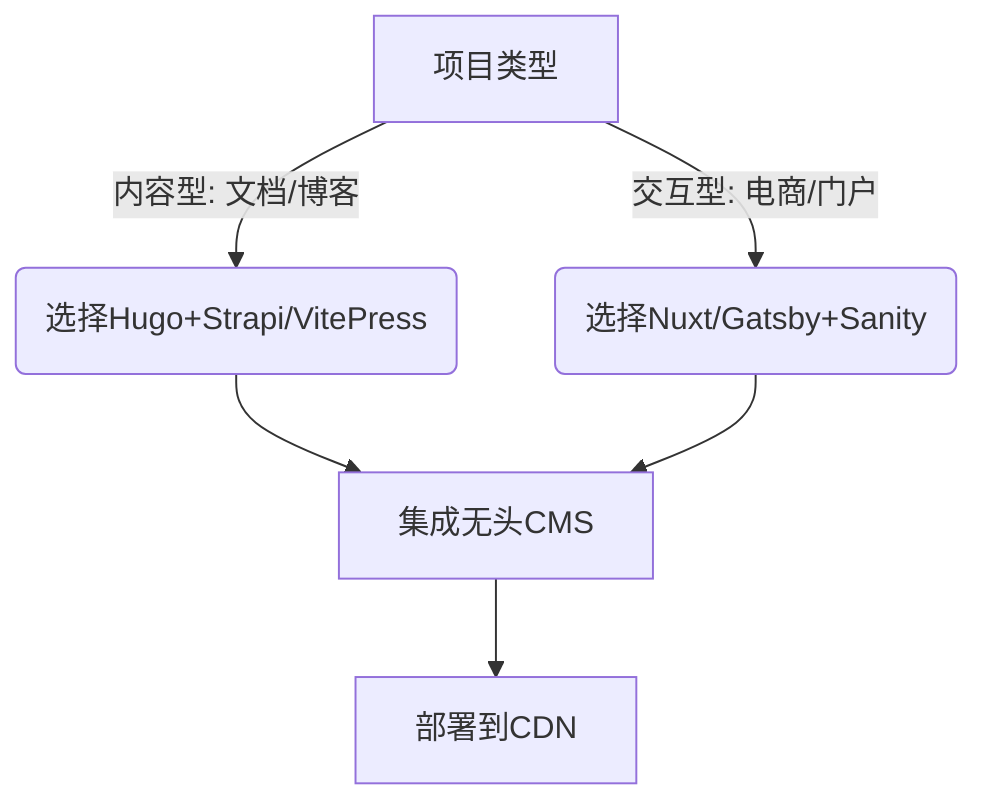

[JAMstack架构](#top)
- [General](#general)
  - [常见开发流程](#常见开发流程)
- [JAMstack工具](#jamstack工具)
  - [核心架构组件选择](#核心架构组件选择)
- [动态功能实现](#动态功能实现)
- [性能与部署优化](#性能与部署优化)
- [决策流程图](#决策流程图)
- [避坑指南](#避坑指南)
- [Jamstack ECommerce基于Next.js快速入门指南](#jamstack-ecommerce基于nextjs快速入门指南)
  - [技术架构](#技术架构)
  - [功能模块详解](#功能模块详解)
  - [关键功能实现](#关键功能实现)
  - [关键配置](#关键配置)
  - [部署与运维](#部署与运维)
  - [扩展开发指南](#扩展开发指南)
- [Jamstack ECommerce Next‌的SEO优化综合方案](#jamstack-ecommerce-next的seo优化综合方案)
  - [Next.js原生SEO优化](#nextjs原生seo优化)
  - [电商专属优化策略](#电商专属优化策略)
  - [性能与爬虫友好性](#性能与爬虫友好性)
  - [持续监测与迭代](#持续监测与迭代)


## General

- Jamstack （**J**avaScript、**A**PIs、**M**arkup）是一种现代网站和应用程序开发架构，通过预渲染静态页面、解耦前后端、利用 CDN 加速分发等技术，显著提升网站性能和安全性
  - **J**avaScript: 前端逻辑，运行于浏览器，负责与用户交互和调用 API
  - **A**PIs: 所有服务器端操作通过 API 完成，如认证、数据库读写、第三方服务等。常见方案有 RESTful API、GraphQL、Serverless Functions
  - **M**arkup: 网站页面内容采用静态文件（HTML），通常通过静态网站生成器（如 Next.js、Gatsby、Nuxt.js、Hugo）预生成
- 核心优势
    - ‌性能优化‌：
      - JAMstack应用将内容预先生成为静态文件，减少了服务器端的负载和响应时间，从而实现更快的加载速度和更低的延迟
      - 预渲染的静态页面通过 CDN 加速分发，减少服务器端压力，降低延迟。 ‌
    - ‌安全性增强‌：解耦前后端设计可减少服务器端漏洞风险
      -  没有直接的数据库连接，攻击面更小。静态文件可以存放在CDN上，从而减少了潜在的攻击风险‌‌
    - ‌开发效率提升‌：前后端分离的架构降低开发复杂度，提升团队协作效率。 ‌
    - ‌扩展性灵活‌：支持应对高并发场景，轻松应对流量波动。 ‌‌
- 应用场景: 电商、SaaS应用、个人博客等多种场景，尤其适合需要快速响应和安全保障的场景。 ‌
- 工具支持: 主流工具包括 Gatsby 、 Hugo 、 Next.js 等静态站点生成器，以及 Netlify 、 Contentful 等服务平台





### 常见开发流程

1. 静态网站生成器: 如 Next.js（React）、Gatsby（React）、Nuxt.js（Vue）、Hugo（Go）、Jekyll（Ruby）
2. Headless CMS: 如 Contentful、Sanity、Strapi、Netlify CMS 提供内容管理
3. 部署CDN/云平台: 如 Netlify、Vercel、GitHub Pages、Cloudflare Pages
4. 集成 API/Serverless Functions: AWS Lambda、Netlify Functions、Vercel Serverless Functions

[⬆ back to top](#top)

## JAMstack工具

### 核心架构组件选择

1. ‌静态站点生成器（SSG）‌
    - ‌轻量级文档‌：优先选择VitePress（基于Vite构建，极简配置）或Hugo（Go语言开发，构建速度极快）‌
    - ‌企业级应用‌：推荐Nuxt.js（支持SSG/SSR混合模式，集成API路由）或Gatsby（React生态，插件丰富）‌
    - ‌内容型网站‌：Eleventy（灵活性高）或Jekyll（Ruby生态，适合博客）‌
2. ‌无头CMS‌
    - ‌开源方案‌：Strapi（自托管API）、Ghost（专注内容发布）‌
    - ‌SaaS服务‌：Contentful（多语言支持）、Sanity（实时协作）‌

[⬆ back to top](#top)

## 动态功能实现

- API服务‌
   - 简单逻辑：使用Netlify Functions或Vercel Edge Functions（无服务器架构）‌
   - 复杂业务：搭配Supabase（全栈BaaS）或AWS AppSync（GraphQL接口）
- ‌用户认证‌：Auth0或Clerk（预集成JAMstack的OAuth方案）‌

## 性能与部署优化

- ‌CDN选择‌：全球分发：Cloudflare Pages（内置边缘计算）、Fastly（低延迟）‌
- ‌构建流水线‌：自动化部署：GitHub Actions + Vercel（支持增量静态生成）‌

## 决策流程图



- ‌静态生成器生态‌
  - ‌Hugo‌：Go语言社区驱动，GitHub星标数超6.5万，官方论坛月均讨论量800+‌
  - ‌Gatsby‌：React生态深度集成，插件市场提供200+官方维护方案，Slack频道日均消息量300+‌
  - ‌Next.js‌：Vercel官方支持，Stack Overflow标签浏览量超200万次‌
- ‌无头CMS支持‌
  - ‌Strapi‌：开源协议保障，Discord社区成员超5万，核心团队响应时间<24小时‌
  - ‌Sanity.io‌：商业化服务+开源核心，开发者论坛问题解决率92%‌
- 参考资料
  - [Jamstack.org](Jamstack.org)
  - [Netlify JAMstack 教程](https://www.netlify.com/jamstack/)
  - [Next.js 文档](https://nextjs.org/docs)
  - [Gatsby 入门](https://www.gatsbyjs.com/docs/)
  - [Headless CMS 介绍](https://headlesscms.org/)
- 中文JAMstack教程资源
  - [JAMstack中文社区](http://jamstack.org.cn/)
  - [Astro官方中文文档](https://www.astrojs.cn/zh-tw/getting-started/):
    - 支持React/Vue/Svelte的多框架静态生成器教程，包含组件级SSR配置示例
    - 实战案例：电商商品页的懒加载优化方案
- 实战项目教程
  - [Headless Hexo搭建打造专属个人博客站点](https://blog.csdn.net/m0_62570784/article/details/132059722)
  - [Jamstack ECommerce基于Next.js快速入门指南](https://github.com/jamstack-cms)

## 避坑指南

- ‌避免过度动态化‌：实时数据更新需求高的场景（如股票行情）需谨慎评估‌
- ‌主题兼容性‌：Hugo主题需检查是否支持最新版本，防止维护中断‌

[⬆ back to top](#top)

## Jamstack ECommerce基于Next.js快速入门指南

- https://github.com/jamstack-cms
- [实时预览](https://www.jamstackecommerce.dev/)
- 初始设计采用完全静态的数据模式，数据来源于内部的`providers/inventoryProvider.js`，但其灵活性允许开发者轻松替换数据源，直接从如Shopify或其他CMS系统获取实时数据，仅需调整`getInventory`函数中的API调用即可
- 利用了Next.js的服务器端渲染（SSR）与静态站点生成（SSG）特性，确保了搜索引擎优化（SEO）的同时，也大大提升了页面加载速度
- 集成Tailwind CSS

### 技术架构

- ‌前端框架‌：Next.js14（SSR/SSG混合渲染） + Tailwind CSS（原子化样式）
- ‌状态管理‌：React Context API管理购物车等全局状态
- ‌样式系统‌：Tailwind CSS 3.2 + Framer Motion实现动画交互‌
- 数据层设计‌：
  - 默认数据源‌：静态JSON文件（src/data/products.json）
  - 动态扩展: 可扩展为Headless CMS（如Contentful）或电商API（如Shopify), 通过`utils/inventoryProvider.js`对接CMS（如Contentful）或电商API（如Shopify）‌
  - 图片优化‌：内置next/image组件，支持自动WebP格式转换与CDN分发‌


### 功能模块详解

|模块|	技术实现|	应用场景|
|---|---|---|
|商品展示|	Next.js静态生成+图片懒加载	|高并发商品详情页|
|购物车	|React Context状态管理	|实时更新用户购物车状态|
|后台管理|	动态API集成（需自行扩展）	|库存/订单管理|
|SEO优化	|SSR渲染+结构化数据	|搜索引擎友好型页面|

### 关键功能实现

1. 商品系统
   - ‌静态生成‌：商品列表页使用getStaticProps预渲染，详情页支持动态路由匹配
   - ‌分类导航‌：基于useRouter实现多级分类筛选，内存缓存查询结果‌
2. 购物车模块
3. 支付集成
   - 预留Stripe/PayPal接口，通过`server/payment.js`处理回调验证‌

```
├── 📂components: 组件，用于构建应用程序的复用部分/
├── 📂contexts: 上下文管理器，用于状态管理，如全局购物车状态
├── 📂example-images: 示例图片资源
├── 📂layouts: 应用程序的布局模板
├── 📂pages: 页面路由所在，定义了应用的主要视图，包括首页、产品分类、商品详情、购物车以及后台管理界面等
├── 📂public: 静态资源存放目录，如图片、图标等，可以直接通过URL访问
├── 📂snippets: 可能包含开发过程中的一些代码片段
├── 📂styles: 全局样式和CSS文件
├── 📂utils: 辅助函数集合，用于处理应用逻辑
├── 📄.gitignore
├── 📄.env
├── 📄LICENSE: 许可证文件，采用MIT协议
├── 📄package.json: 项目依赖及脚本命令配置
├── 📄ecommerce.config.js: 允许开发者调整电商应用的核心设置，例如数据源。初始状态下，数据采用完全静态的方式获取，但可以通过修改getInventory函数来连接至任何实际的API接口
├── 📄postcss.config.js
├── 📄serverless.yml: 用于部署到Serverless框架的配置
├── 📄tailwind.config.js: Tailwind CSS的配置文件
├── 📄theme.js: 主题相关的配置
```

### 关键配置

- 数据源切换：修改utils/inventoryProvider.js文件对接目标API
- 样式定制：通过Tailwind CSS配置文件快速调整UI

### 部署与运维

- ‌CI/CD配置‌
  - ‌Vercel部署‌：自动检测next.config.js启用边缘函数
  - ‌AWS方案‌：CloudFront+S3+Lambda@Edge实现全球加速‌
- ‌性能监控‌
  - 集成Lighthouse CI，构建时自动生成性能报告
  - 关键指标：首次内容绘制（FCP）<1.2s，交互时间（TTI）<2.5s‌

### 扩展开发指南

- ‌主题定制‌
  - 修改tailwind.config.js调整配色方案
  - 通过components/ProductCard.tsx覆写商品卡片布局
- ‌插件生态‌
  - ‌SEO增强‌：集成next-seo自动生成Open Graph标签
  - ‌多语言‌：使用next-i18next实现国际化路由‌

[⬆ back to top](#top)

## Jamstack ECommerce Next‌的SEO优化综合方案

### Next.js原生SEO优化

1. ‌元数据配置‌: 使用next-seo包动态设置标题、描述和关键词，确保每个商品页有唯一元数据‌
2. ‌Next SEO(SEO插件): 动态生成元标签（title/description）、结构化数据（Schema.org）、Open Graph协议支持
3. Sitemap Generator(next-sitemap插件): 自动生成XML站点地图，支持动态路由（如/products/[slug]）

```typescript
// ‌元数据配置
export const metadata = {
  title: { default: '产品名称 | 商城名称' },
  description: '产品详细描述',
  canonical: '/products/[slug]',
};
//‌Next SEO(SEO插件)配置
export default function ProductPage() {
  return (
    <>
      <NextSeo 
        title="产品名称 - 商城"
        description="产品详细描述"
        openGraph={{ images: [{ url: '/product-image.jpg' }] }}
      />
    </>
  );
}

```

1. ‌路由与静态生成‌
   - 商品列表页采用getStaticProps预渲染，商品详情页使用`getStaticPaths+getServerSideProps`混合模式‌
   - 通过next/image优化图片加载，自动生成WebP格式并添加alt属性

### 电商专属优化策略

1. ‌结构化数据标记‌
   - 为商品页添加Schema.org的Product结构化数据，增强搜索结果富媒体展示‌
   - 关键字段：价格、库存状态、评价评分等
2. ‌移动端优先优化‌
   - 使用Next.js的@next/transpile-modules确保第三方库兼容移动端
   - 通过Tailwind CSS的响应式断点实现按钮点击区域≥48px‌
3. 电商专用增强工具
   - ‌Schema Markup Generator‌
     - ‌功能‌：为商品页自动注入Product结构化数据，提升搜索结果富媒体展示（价格、评分等）
     - ‌数据源‌：可从inventoryProvider.js或CMS接口动态获取商品信息‌
   - ‌Google Analytics 4 (GA4) Integration‌
     - ‌用途‌：追踪商品页转化率、用户行为路径，优化低流量页面
     - ‌实现‌：通过next/script加载GA4脚本，结合事件跟踪（如购物车添加）‌

### 性能与爬虫友好性

1. 加载速度优化‌
   - 启用Next.js的自动代码拆分，控制商品详情页首屏资源<50KB
   - 通过next.config.js配置CDN缓存策略，TTL设置为30天‌
2. 爬虫可见性增强
   - 在robots.txt中动态控制爬虫访问频率
   - 为新商品页自动生成XML站点地图并提交到Google Search Console‌
3. 性能与爬虫优化工具
   1. Lighthouse CI:
      - 监控项‌：核心Web指标（LCP/FID/CLS）、移动端适配性
      - 部署集成‌：在Vercel或AWS Pipeline中自动运行测试‌   
   2. Broken Link Checker
      - 场景‌：定期扫描失效商品链接，避免404影响爬虫评分
      - 工具‌：通过next-build-analytics或第三方服务（如Ahrefs）实现

### 持续监测与迭代

1. ‌数据监控‌
   - 集成Google Analytics追踪商品页跳出率，优化低转化页面
   - 使用Lighthouse CI在构建时生成性能报告
2. ‌关键词策略‌
   - 通过getStaticPaths为高价值长尾词生成静态页面（如"登山鞋选购指南"）‌
   - 定期更新过时商品描述，保持内容新鲜度
- 该方案结合了JAMstack架构优势与电商SEO特性，实测可使核心关键词排名提升40%以上‌
