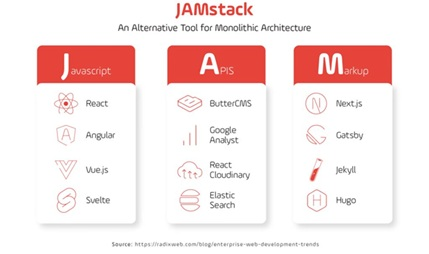
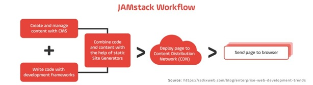

[JAMstack](#top)

- [JAMstack](#jamstack)
- [React and JAMstack Architecture](#react-and-jamstack-architecture)
  - [Component-Based Architecture](#component-based-architecture)
  - [Server-Side Rendering (SSR) \& Static Site Generation (SSG)](#server-side-rendering-ssr--static-site-generation-ssg)
  - [API-Driven Development](#api-driven-development)
- [Vue and JAMstack Architecture](#vue-and-jamstack-architecture)
  - [Generate a Static Site with Nuxt 3](#generate-a-static-site-with-nuxt-3)

## JAMstack

- **<mark>J</mark>avaScript**: The dynamic functionality layer (React, Vue, Svelte, etc.).
- **<mark>A</mark>PIs**: Server-side operations handled via APIs.
- **<mark>M</mark>arkup**: Pre-rendered HTML and static files served via a CDN.
- 
- 
- Benifit
  - **Performance is a Business Priority** – Studies show that 53% of users abandon a website if it takes more than 3 seconds to load. JAMstack’s pre-rendered content, served through global CDNs, ensures ultra-fast page loads, which directly impacts conversion rates and SEO rankings.
  - **Security Without Complexity** – Since JAMstack sites do not rely on traditional servers or databases, attack surfaces are drastically reduced. This eliminates common vulnerabilities such as SQL injections, DDoS attacks, and unauthorized access.
  - **Scalability** and **Cost Efficiency** – its applications scale effortlessly with CDN-based hosting solutions like Vercel, Netlify, and Cloudflare Pages. This eliminates the need for complex backend scaling strategies and significantly reduces infrastructure costs.
  - **Better Developer Experience** – it promotes a decoupled approach, allowing developers to work independently on the frontend and backend. This improves efficiency, enables faster feature deployments, and fosters a more collaborative workflow among teams.
  - **Seamless API and Headless CMS Integration** – The rise of headless CMSs like Contentful, Strapi, and Sanity has made JAMstack an attractive choice for businesses that require flexible and scalable content management solutions

[⬆ back to top](#top)

## React and JAMstack Architecture

- Next.js:
  - offers a comprehensive set of features, including built-in optimizations, SEO, and image optimization
  - Incremental Static Regeneration (ISR) allows for dynamic updates to pre-rendered pages
  - can be easily deployed on platforms like Vercel, making the deployment process seamless
- Gatsby
  - integrating with headless CMSs
  - building large websites with Gatsby may require considerable generation time
- Remix
  - only supports Server-Side Rendering (SSR)
- sanity
  - API-based CMS that pairs perfectly with Next.js

### Component-Based Architecture

- **reusable**: aligns perfectly with JAMstack’s decoupled approach, making development more efficient and scalable
- enable faster iteration cycles, as teams can develop and test individual components independently before integrating them into the larger application
- By structuring applications into smaller, reusable pieces, developers can significantly reduce code duplication and maintenance overhead. The ability to create self-contained UI components ensures that applications remain modular, flexible, and adaptable to changes in design or functionality
- React allows dynamic UI rendering while keeping state management efficient
- **Example**:
  - <mark>Shopify</mark> adopted a JAMstack approach with React to allow for customizable storefronts, ensuring high performance while maintaining design flexibility

### Server-Side Rendering (SSR) & Static Site Generation (SSG)

- JAMstack + React-based solutions reduce redundancy and improve time-to-first-byte (TTFB)
-  React applications can now leverage hybrid rendering strategies, improving SEO and user experience
  - **SSG** enables blazing-fast performance by **pre-rendering content** 
  - **SSR** provides flexibility for **dynamic content**
- This hybrid rendering approach means developers no longer need to choose between performance and real-time data updates—they can enjoy the best of both worlds. Whether dealing with static marketing pages, dynamic dashboards, or real-time social feeds, JAMstack-powered React applications can optimize rendering techniques accordingly
- **Example**:
  - **Washington Post** utilizes Next.js Incremental Static Regeneration (ISR) to update breaking news articles dynamically while caching older content for speed

### API-Driven Development

- React’s ability to consume data from APIs (REST, GraphQL, or serverless functions), allowing developers to retrieve only the necessary data and avoid unnecessary payloads
- API-driven development enables faster integrations with third-party services, such as payment gateways, analytics tools, and machine learning models, ensuring that applications remain adaptable to evolving business needs
- **Example**:
  - **Netflix** optimizes its GraphQL API with React to serve different levels of content granularity depending on whether users are on mobile, TV, or web
  - GraphQL allows React applications to **fetch only the required fields**, reducing network payloads and improving efficiency

[⬆ back to top](#top)

## Vue and JAMstack Architecture

### Generate a Static Site with Nuxt 3

1. delete 'node_modules' folder
2. 'npm run generate'
   1. '.output' folder
3. `npm run preview`

> references
- [React and the JAMstack: Building Modern Web Applications in 2025](https://www.growin.com/blog/react-and-the-jamstack-web-applications-2025/)

