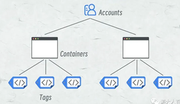
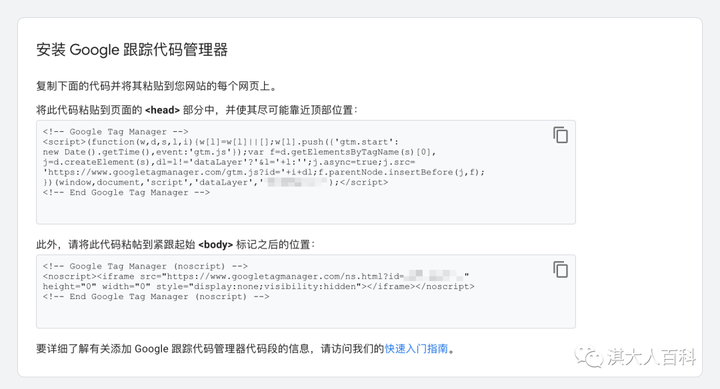

[Google Tag Manager](#top)

- [基本简介](#基本简介)
- [如何在网站设置 Google Tag Manager](#如何在网站设置-google-tag-manager)
- [举例](#举例)

-----------------------------------

## 基本简介

- Google Tag Manager是Google 推出的跟踪代码管理器，简称 GTM，它可以让你轻松的更换网站的跟踪代码，自定义事件分析埋点等等，对于从事网站分析，营销的用户，尤其是面向海外用户的营销分析尤为实用
- Google Tag Manager由分析人员来把控跟踪代码的安装与上线，开发人员只需要设置一次 GTM 代码，后续都可以由网站分析人员来进行营销代码的管理
- Google Tag Manager 账号体系包括以下几个层级账号
- 
  - Accounts: 最高层级，一般一个公司只需要注册一个账号，如果涉及多个账号管理角色，可以通过授权不同 Google 账号权限实现多角色管理
  - 容器（Containers）: 如果有多个网站，则可以设置多个容器来单独管理，一般来说一个网站对应一个容器即可，用于管理该网站下的全部代码
  - 代码（Tags）: 用于独立管理每一个营销平台的代码，如常见的 Google Analytics, Google Ads, Meta Ads 等
  - 触发器（Triggers）

## 如何在网站设置 Google Tag Manager

1. 首先需要在[Google Tag Manager](https://tagmanager.google.com/#/home)登陆 Google 账号，没有 Google 账号可以自行注册或购买
2. 完成注册之后，页面提供两段代码，接下来只需要让网站开发人员将代码添加到整站的页面上，就可以完成设置
  - 
  - 如果网站恰好使用WordPress来搭建，那么这里推荐一个插件WPCode
  - 检查一下是否正确安装了，可以使用Chrome插件：Ghostery, 在谷歌浏览器中安装Ghostery后，打开刚才安装代码的网站，在Detailed View部分，如果出现Google Tag Manager就是GTM部署成功了
3. 在完成部署后，可以在Chrome应用商店安装Tag Assistant这个插件

## 举例

- [举例：怎么用Google Tag Manager（GTM）做Google Ads转化跟踪](https://zhuanlan.zhihu.com/p/98471830)
- 在wordpress网站跟踪点击操作，比如提交表单，点击邮件链接, [怎么用Google Tag Manager跟踪点击（事件跟踪）](https://zhuanlan.zhihu.com/p/348041743)
