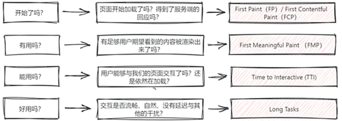
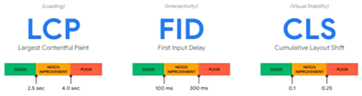
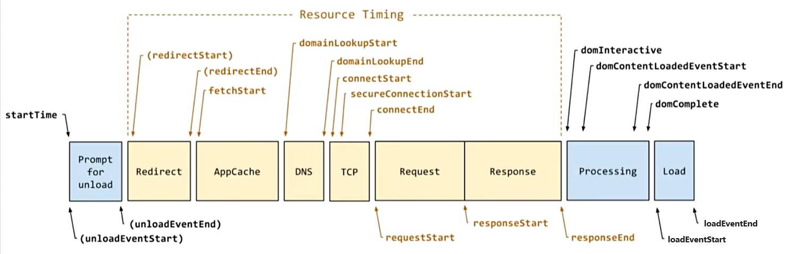

[前端性能优化概述](#top)

- [性能分析的两个阶段](#性能分析的两个阶段)
- [性能优化指标与测量工具](#性能优化指标与测量工具)
  - [常用的性能优化指标](#常用的性能优化指标)
  - [性能测量工具](#性能测量工具)
- [优化](#优化)
  - [异步加载](#异步加载)
  - [传输加载优化](#传输加载优化)
  - [资源优化](#资源优化)
  - [渲染优化](#渲染优化)
  - [代码优化](#代码优化)
  - [HTML 优化](#html-优化)
- [编译优化](#编译优化)
  - [加快构建速度(打包速度)](#加快构建速度打包速度)
  - [减少打包文件体积](#减少打包文件体积)
  - [Vite](#vite)
- [部署](#部署)
- [框架\&代码](#框架代码)

---------------------------------------------------
## 性能分析的两个阶段

- 分析阶段
  - 通过分析器(Profiler)找出重新渲染的组件、重新渲染的次数、以及重新渲染耗费的资源与时间
  - 变动检测，通过分析器我们可以知道：什么被重新渲染？重新渲染的代价？变动检测要回答的问题就是： 为什么这些进行了重新渲染？
- 优化阶段
  - 1、前端通用优化
  - 2、各大框架自身优化
  - 3、提交阶段优化

## 性能优化指标与测量工具

### 常用的性能优化指标



- Speed Index（lighthouse，速度指数）
- TTFB（Network，第一个请求响应时间）
- 页面加载时间
- 首次渲染, FID(First Input Delay)
- 交互动作的反馈时间
- 帧率FPS（动画 ctrl+shift+p）
- 异步请求完成时间

### 性能测量工具

|Chrome DevTools|Lighthouse|WebPageTest|[Performance API]()/PerformanceObserver API|
|---|---|---|---|
|开发调试、性能评测|网站整体质量评估|测试多地点(球各地的用户访问你的网站的性能情况)|console -> `performance`|
|Audit(Lighthouse)|还可以提出优化建议|全面性能报告（first view,repeat view,waterfall chart 等等）|`performance.getEntities()`|
|Throttling 调整网络吞吐||WebPageTest 还可以进行本地安装||
|Performance 性能分析||https://webpagetest.org/||
|Network 网络加载分析||||



```js
performance.getEntries()
performance.getEntriesByType('navigation')  // 页面导航时间
performance.getEntriesByType('resource')    // 静态资源
performance.getEntriesByType('paint')       // 绘制
performance.getEntriesByName('https://clode.tencent.com/developer/api/user/session')
// PerformanceObserver, 用于监测性能度量事件, 在浏览器的性能时间轴记录新的 performance entry 的时候将会被通知
PerformanceObserver.supportedEntryTypes
// 方法1
var observer = new PerformanceObserver(function(list, obj) {
  var entries = list.getEntries();
  for(var i= 0; i < entries.length; i++) {
    //
  }
});
observer.observe({entryTypes: ["navigation", "resource"]});
// 方法2
function perf_observer(list, object) {
  //console.log(list, object)
}
var observer2 = new PerformanceObserver(perf_observer);
observer2.observe({entryTypes: ["longtask"]});
```

[⬆ back to top](#top)

## 优化

### 异步加载

- 动态添加script标签
- async/defer
- 通过XHR异步加载js

### 传输加载优化

- 减少 HTTP 请求
- 启用 Gzip 压缩
- 启用 Keep Alive 长连接（默认）
- HTTP 资源缓存
- Service workers
  - 加速重复访问
  - 离线支持
  - 需要注意延长了首屏加载时间，但是页面总加载时间减少
- 启用 HTTP2
- 考虑用SSR技术
- 异步无阻塞加载JS（defer，async）

### 资源优化

- 资源压缩与合并
- 图片格式优化，选择合适的图片格式
- 图片加载优化（懒加载，渐进式加载，响应式图片，雪碧图）
- 字体优化
  - 字体未下载完成时，浏览器隐藏或自动降级，导致字体闪烁
  - font-display
  - @font-face 字符集拆分
  - ajax + base64

[⬆ back to top](#top)

### 渲染优化

- 避免回流与重绘
- 避免布局抖动（FastDom防止布局抖动利器）
- 将动画和经常变化的元素提到单独的图层

### 代码优化

- Code splitting 代码拆分，按需加载
- Tree shaking 代码减重
- Scope Hoisting 模块合并
- 去除 console
- 避免长任务
- 避免超过 1kb 的行间脚本
- 大量事件绑定使用事件委托
- 适时使用防抖和节流
- 避免内存泄漏
- 使用 rAF 和 rIC 进行时间调度（react时间调度原理）
- 配合 V8 有效优化代码
  - 源码 -> 抽象语法树 -> 字节码Bytecode -> 机器码
  - 编译过程会进行优化（脚本流、字节码缓存、懒解析等）
  - 运行时可能会发生反优化
- 对象优化可以做哪些
  - 以相同顺序初始化对象成员，避免隐藏类的调整
  - 实例化后避免添加新属性
  - 尽量使用 Array 代替 array-like 对象
  - 避免读取超过数组的长度
  - 避免元素类型转换

### HTML 优化

- 减少 iframes 使用，延迟加载 iframe，父文档加载完毕后再给 iframe 的 src 赋值
- 压缩空白符
- 避免节点深层级嵌套
- 避免 table 布局
- 删除注释
- CSS&Javascript尽量外链
- 删除元素默认属性

[⬆ back to top](#top)

## 编译优化

### 加快构建速度(打包速度)

- 缩小文件的搜索范围(配置include/exclude resolve.modules resolve.mainFields alias noParse extensions)
  - 通过 exclude、include 配置来确保转译尽可能少的文件
  - 优化 resolve.modules 配置
  - 优化 resolve.mainFields 配置
  - alias
  - noParse
  - extensions
- 缓存
  - cache-loader  --> 指向性的缓存, 在一些性能开销较大的 loader 之前添加，将结果缓存中磁盘中
  - terser-webpack-plugin
- 使用 happypack 开启多进程打包
  - 也可以使用 thread-loader 开启多进程打包 loader
- 使用 HardSourceWebpackPlugin 为模块提供中间缓存，第二次构建可大量节约时间
- 使用 IgnorePlugin 忽略第三方包指定目录，例如 moment 的本地语言包
- 使用 webpack-parallel-uglify-plugin 开启 JS 多进程压缩
- 使用 **speed-measure-webpack-plugin** 插件可以测量各个插件和loader所花费的时间，量化打包速度，判断优化效果

[⬆ back to top](#top)

### 减少打包文件体积

- purifycass-webpack  --> 未执行的css
- optimize-css-assets-webpack-plugin  --> css管理压缩
- 使用 externals 配置，然后将 JS 文件、CSS 文件和存储在 CDN
- 使用 DllPlugin（动态链接库）将 bundles 拆分，使用 DllReferencePlugin(索引链接) 对 manifest.json 引用，让一些基本不会改动的代码先打包成静态资源，避免反复编译浪费时间
- 使用 optimization.splitChunks 配置抽离公共代码
- 使用 IgnorePlugin 忽略第三方包指定目录，例如 moment 的本地语言包（重复）
- 使用 url-loader 或 image-webpack-loader 对图片进行转化或者压缩处理
- 优化 SourceMap，开发环境推荐： cheap-module-eval-source-map，生产环境推荐： cheap-module-source-map
- 按需加载，项目中的路由懒加载
- cleanWebpackplugin    --> 自动清理无用文件
- webpack自身的优化：
  - tree-shaking，在生产环境下，会自动移除没有使用到的代码
  - scope hosting 作用域提升，变量提升，可以减少一些变量声明
  - babel 配置的优化，配置 @babel/plugin-transform-runtime，重复使用 Babel 注入的帮助程序，以节省代码大小的插件

### Vite

|Webpack|Vite|
|---|---|
|编译支撑打包|路由劫持+实时编译|
|src => 打包生成bundle => 启动dev-server|启动dev-server => 直接请求所需模块路由并实时编译|
|hmr把改动的模块以及相关依赖全部编译|hmr只需要让浏览器重新请求该模块优化资源|

[⬆ back to top](#top)

## 部署

1. 寻址 --> <link pre-fetch>  -->  重新预构建
2. 静态资源加载优化  -->  CDN(Content Delivery Network)
3. SSR

[⬆ back to top](#top)

## 框架&代码

```js
// 网络层浪费
// 防抖 debounce
function debounce(func, wait) {
  let timeout;
  return function() {
    let context = this;
    let args = arguments;
    if(timeout) {
      clearTimeout(timeout);
    }
    timeout = setTimeout(() > {
      func.apply(context, args)
    }, wait)
  }
}
window.onscroll = debounce(function() {
  console.log('debounce')
}, 1000);
// 节流
function throttle(fn, delay) {
  let prevTime = Date.now();
  return function() {
    let curTime = Date.now();
    if(curTime - prevTime > delay) {
      fn.apply(this, argument);
    }
  }
}
const throttleScroll = throttle(function() {
  console.log('throttle')
}, 1000);
window.onscroll = throttleScroll;
```

> References
- [小墨鱼的面试笔记](https://cchroot.github.io/interview/)
- https://www.bilibili.com/video/BV1CZ421M7t2
