[UML图详解](#top)

- [用例图 UseCase Diagrams](#用例图-usecase-diagrams)
- [类图 Class Diagrams](#类图-class-diagrams)
- [对象图 Object Diagrams](#对象图-object-diagrams)
- [包图](#包图)
- [部署图 Deployment Diagrams](#部署图-deployment-diagrams)
- [时序图 Sequence Diagrams](#时序图-sequence-diagrams)
- [通信图/协作图 Collaboration Diagrams](#通信图协作图-collaboration-diagrams)
- [状态机图 Statechart Diagrams](#状态机图-statechart-diagrams)
- [活动图 Activity Diagrams](#活动图-activity-diagrams)
- [构件图 Component Diagrams](#构件图-component-diagrams)

---------------------------------------------

- UML（Unified Modeling Language）是一种统一建模语言，为面向对象开发系统的产品进行说明、可视化、和编制文档的一种标准语言。下面将对UML的九种图+包图的基本概念进行介绍以及各个图的使用场景
- UML图分类
  - 静态图分为：用例图，类图，对象图，包图，构件图，部署图
  - 动态图分为：状态图，活动图，协作图，序列图

| UML |说明 |
|---|---|
|UML图分类||
|软件的各个开发阶段需要的UML图||
|UML使用人员图||

## 用例图 UseCase Diagrams

- 用例图是编写需求说明时经常用到的需求表达方式，用于向开发、测试同事说明需求中用户与系统功能单元之间的关系。
- 用例图的三大组成元素：**参与者、用例、参与者**与用例之间的关系
- 参与者与用例之间的关系（4种）：**关联、归纳（泛化）、包含、拓展和依赖**
- 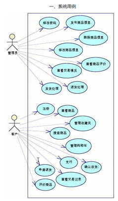  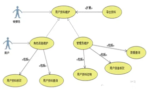

[⬆ back to top](#top)

## 类图 Class Diagrams

- 用于描述系统中所包含的类以及它们之间的相互关系
- 类图的两个重要元素：类，以及类之间的关系
- 类的关系（6种）：
  - **依赖Dependency、继承/泛化Generalization、实现Realization、关联Association、聚合Aggregation、组合Composition**
- 各种关系的强弱顺序： **泛化 = 实现 > 组合 > 聚合 > 关联 > 依赖**
- 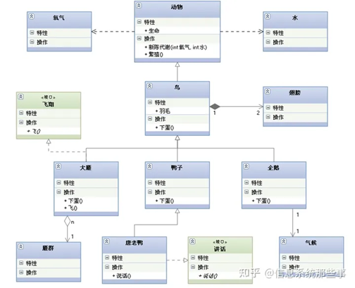

| 类的关系 | 图例  |说明|
|---|---|---|
| 泛化Generalization| 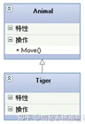  |指定了子类如何继承父类的所有特征和行为|
|实现Realization|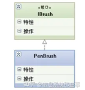|一种类与接口的关系，表示类是接口所有特征和行为的实现|
|关联Association|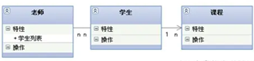|是一种拥有的关系，它使一个类知道另一个类的属性和方法，代码体现：成员变量|
|聚合Aggregation|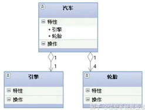|是整体与部分的关系，且部分可以离开整体而单独存在，代码体现：成员变量|
|组合Composition|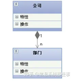|是整体与部分的关系，但部分不能离开整体而单独存在，带实心菱形的实线，菱形指向整体|
|依赖Dependency|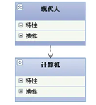|一种使用的关系，即一个类的实现需要另一个类的协助，所以要尽量不使用双向的互相依赖，如局部变量、方法的参数或者对静态方法的调用，-带箭头的虚线，指向被使用者|

[⬆ back to top](#top)

## 对象图 Object Diagrams

- 用于描述某一时刻的一组对象及它们之间的关系。
- 对象图的组成元素：**对象、链**
- 对象图可以视作类图的实例，用来表达各个对象在某一时刻的状态
- 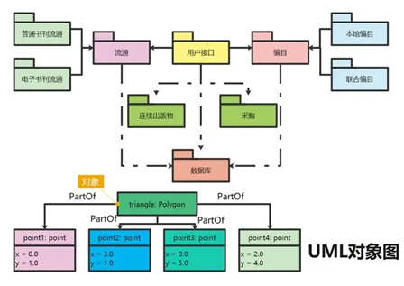

[⬆ back to top](#top)

## 包图

- 包图通常用于描述系统的逻辑架构——层、子系统、包等。层可以建模为UML包。UML包用一大一小两个矩形组合而成。如果内部显示了其成员，则包名称标在上面的小矩形内，否则可以标在包内
- 包拥有的元素：**类、接口、组件、节点、协作、用例、图以及其他包**
- 包的可见性用来控制包外界的元素对包内元素的可访问权限。这种可见性它分为3种，即公有访问、保护访问和私有访问
- 包之间可以有两种关系：**依赖、泛化**
- 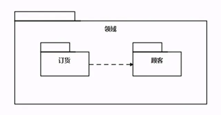

[⬆ back to top](#top)

## 部署图 Deployment Diagrams

- 部署图是用来显示系统中软件和硬件的物理架构。使用部署图不仅可以显示运行时系统的结构，还能够传达构成应用程序的硬件和软件元素的配置和部署方式。
- 部署图的组成元素：**结点、构件（因此部署图也经常和构件图一起使用）、接口、连接**
- 部署模型的目的：描述一个具体应用的主要部署结构，通过对各种硬件，在硬件中的软件以及各种连接协议的显示，可以很好的描述系统是如何部署的；平衡系统运行时的计算资源分布；可以通过连接描述组织的硬件网络结构或者是嵌入式系统等具有多种硬件和软件相关的系统运行模型
- 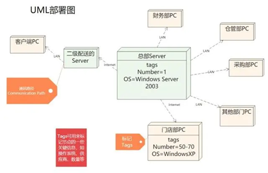

[⬆ back to top](#top)

## 时序图 Sequence Diagrams

- 顺序图，又名序列图、时序图。用于描述对象之间的传递消息的时间顺序（包括发送消息、接收消息、处理消息、返回消息等）
- 顺序图的主要用途是把用例表达的需求，转化为进一步、更加正式层次的精细表达。用例常常被细化为一个或者更多的序列图。同时序列图更有效地描述如何分配各个类的职责以及各类具有相应职责的原因
- 顺序图的组成元素：**对象、生命线、消息**
  - 其中消息又分为**同步消息、异步消息、返回消息、自关联消息**
- 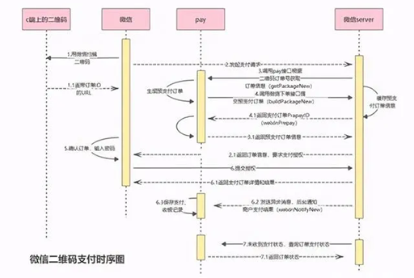

| 元素| 图例 |
|---|---|
|生命线|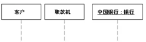|
|同步消息|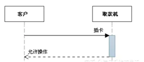|
|异步消息|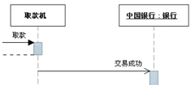|
|注释|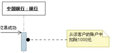|
|约束|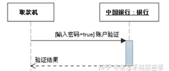|

[⬆ back to top](#top)

## 通信图/协作图 Collaboration Diagrams

- 通信图描述的是对象和对象之间的调用关系，体现的是一种组织关系。
- 通信图组成元素：**对象、链接、消息**
- 时序图按照时间顺序布图，而写作图按照空间结构布图，通信图中的时间顺序可以从消息序号中获得。在语义上这两个图是等价的可以互相转换而不会丢失信息
- 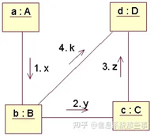

[⬆ back to top](#top)

## 状态机图 Statechart Diagrams

- 状态机图描述一个对象在其生命周期中的各种状态以及状态的转换
- 状态机主要由**状态、转换、事件、动作、活动**5部分组成。
- 顺序图、通信图：描述多个对象间的交互 
- 状态机图：描述单个对象的状态及引起状态变化的原因
- 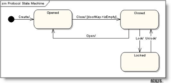

[⬆ back to top](#top)

## 活动图 Activity Diagrams

- 活动图描述活动的顺序，展现从一个活动到另一个活动的控制流，它本质上是一种流程图。
- 组成元素：**起点、终点、活动名称、判断条件、分支与合并、接收信号、发送信号、泳道**
- 交互图强调的是对象到对象的控制流，而活动图则强调的是从活动到活动的控制流
- 活动图分类：
  - 活动图 
  - 带泳道的活动图：泳道表明每个活动是由哪些人或哪些部门负责完成
  - 带对象流的活动图：把涉及到的对象放置在活动图中，并用一个依赖将其连接到进行创建、修改和撤销的动作状态或者活动状态上，对象的这种使用方法就构成了对象流，**对象流用带有箭头的虚线表示** 
- 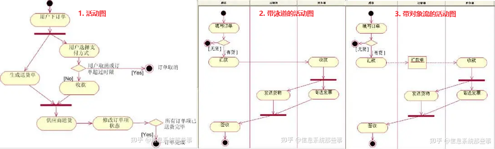
- 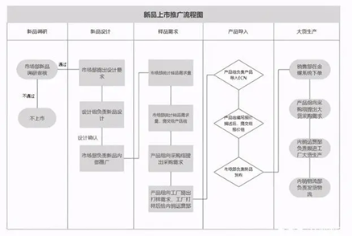

[⬆ back to top](#top)

## 构件图 Component Diagrams

- 构件图是用来表示系统中构件与构件之间，类或接口与构件之间的关系图。其中，构建图之间的关系表现为依赖关系，定义的类或接口与类之间的关系表现为依赖关系或实现关系
- 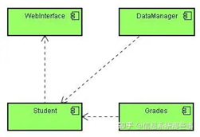

[⬆ back to top](#top)

> Reference
- [浅谈UML中常用的9种图](https://baijiahao.baidu.com/s?id=1700899956563526148&wfr=spider&for=pc)
- [UML 各种图总结精华](https://zhuanlan.zhihu.com/p/553294482)
