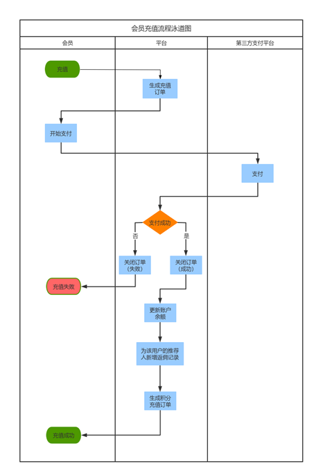
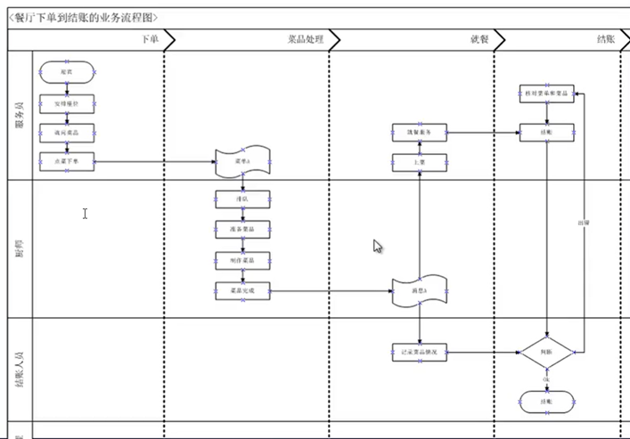
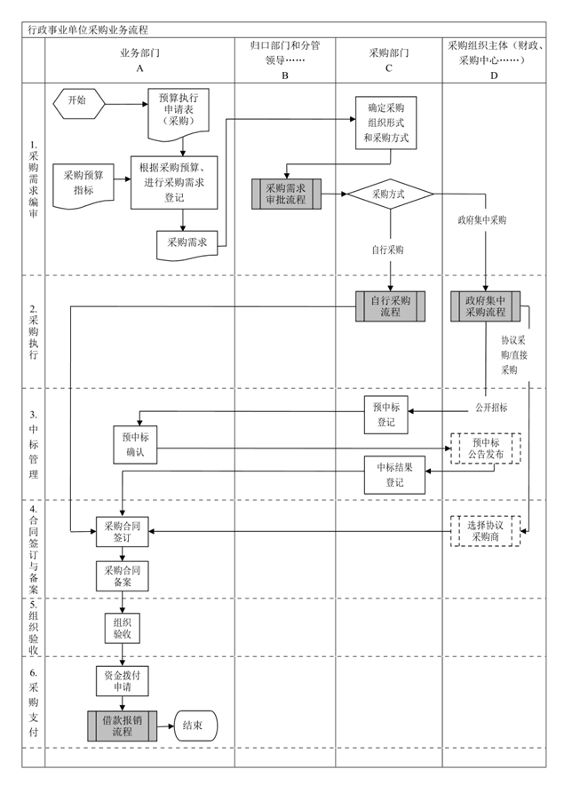
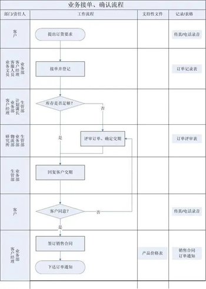

```
├── 📂System-Design+Algrithm+performances
|    ├── 📂DesignPattern-Algrithm/
|    |   ├── 依赖注入模式.md
|    |   ├── 背包问题-javascript动态规划.md
|    |   └──
|    ├── 📂Performance/
|    │   ├── 📄Front End performance案例分析.md
|    │   ├── 📄Google Tag Manager简介.md
|    │   ├── 📄Performance Sample.docx
|    │   ├── 📄browser-render-optimization.md
|    │   ├── 📄optimizing-Rendering-Performance.md
|    │   ├── 📄performance-checklist-1.2.pdf
|    │   ├── 📄requestAnimationFrame优化动画.md
|    │   ├── 📄resources.md
|    │   ├── 📄前端性能优化-gzip压缩.md
|    │   └── 📄浏览器缓存机制.md
|    ├── Frontend System Design.md
|    └── UML图详解.md
```

- [图解算法数据结构](https://github.com/krahets/LeetCode-Book)
- https://www.patterns.dev/#patterns

## 泳道图Swim Lane-Microsoft Visio

- 
- 
- 
- 
- 
