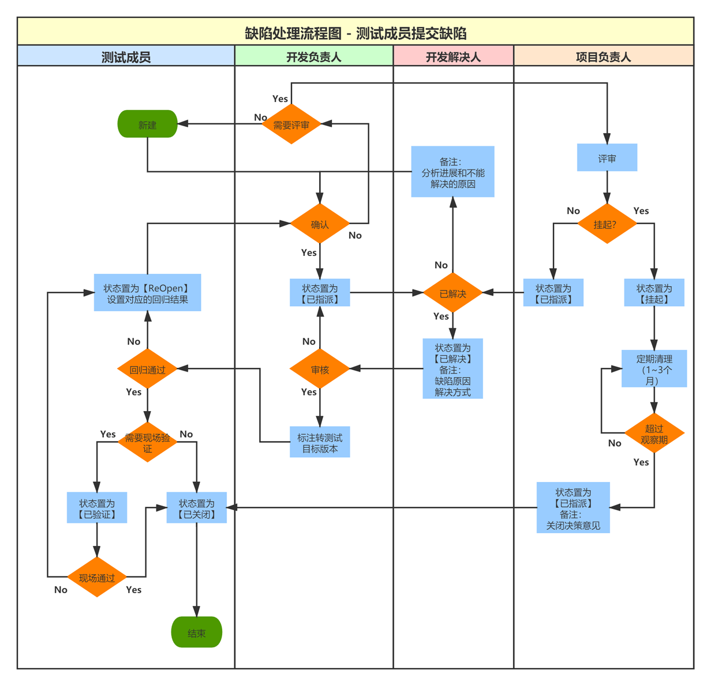

```
├── DesignPattern-Algrithm/
|    ├── UML图详解.md
|    ├── 依赖注入模式.md
|    ├── 背包问题-javascript动态规划.md
|    └── 
```

- [图解算法数据结构](https://github.com/krahets/LeetCode-Book)
- https://www.patterns.dev/#patterns

## 泳道图Swim Lane-Microsoft Visio

- 
- 
- 
- 
- 
