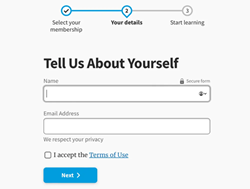
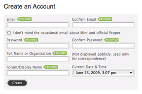
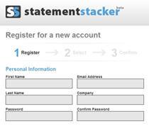

[UI Design Patterns Sample](#top)

- [Common UI Design Patterns](#common-ui-design-patterns)
  - [Breadcrumbs](#breadcrumbs)
  - [Lazy Registration](#lazy-registration)
  - [Progressive Disclosure](#progressive-disclosure)
  - [Required Field Marker](#required-field-marker)
  - [Steps Left](#steps-left)
- [Mobile UX Design Patterns](#mobile-ux-design-patterns)

## Common UI Design Patterns

- **Breadcrumbs**: Use linked labels to provide secondary navigation that shows the path from the front to the current site page in the hierarchy.
- **Lazy Registration**: Forms can put users off registration. So, use this sign-up pattern to let users sample what your site/app offers for free or familiarize themselves with it. Then, you show them a sign-up form. For example, Amazon allows unrestricted navigation and cart-loading before it prompts users to register for an account. Note:
  - When content is accessible only to registered users or users must keep entering details, offer them **simplified/low-effort sign-up forms**.
  - Minimize/Avoid optional information fields. Use the Required Field Markers pattern to guide users to enter needed data.
- **Forgiving Format**: Let users enter data in various formats (e.g., city/town/village or zip code).
- **Clear Primary Actions**: Make buttons stand out with color so users know what to do (e.g., “Submit”). You may have to decide which actions take priority.
- **Progressive Disclosure**: Show users only features relevant for the task at hand, one per screen. If you break input demands into sections, you’ll reduce cognitive load (e.g., “Show More”)
- **Hover Controls**: Hide nonessential information on detailed pages to let users find relevant information more easily
- **Steps Left**: Designers typically combine this with a wizard pattern. It shows how many steps a user has to take to complete a task. You can use gamification (an incentivizing design pattern) here to enhance engagement.
- **Subscription Plans**: Offer users an options menu (including “Sign-up” buttons) for joining at certain rates.
- **Leaderboard**: You can boost engagement if you use this social media pattern
  - 
- **Dark Patterns**: Some designers use these to lead or trick users into performing certain actions, typically in e-commerce, so they spend more or surrender personal information. Dark patterns range in harmfulness. Some designers leave an unchecked opt-out box as a default to secure customer information. Others slip items into shopping carts. To use dark patterns responsibly, you must be ethical and have empathy with your users. Dark patterns are risky because user mistrust and feedback can destroy a brand’s reputation overnight

### Breadcrumbs

- Breadcrumbs show the path from the front page of the site to the current location of th users in the website’s page hierarchy
- helps users understand the hierarchy and structure of the website
- Breadcrumbs start with the home page and end with the page currently being viewed
- Breadcrumbs can appear simply as text links separated by the “>” sign, or they can be graphic elements, like the breadcrumbs on Apple’s website:
  - 

[⬆ back to top](#top)

### Lazy Registration

- This pattern is meant to allow users to use your system and take action before registering
  - When users are allowed to try out your website product or service before making a decision (which not every website permits, though)
  - When it is important to familiarize users with your system before they sign up, which can be a crucial step in their process of deciding whether to register
- Good sample
  - The shopping cart is a good example of this pattern: users can browse and choose products and only have to register when they proceed to check out
  - Picnik is was another good example of lazy registration. Users can use all of the service’s functions to edit their photos online. They are asked to register only before saving their work

[⬆ back to top](#top)

### Progressive Disclosure 

- to show only the information or features relevant to the user’s current activity and to delay other information until it is requested
- Good sample
  - A simple “Show more” link that reveals more information is one of the simplest forms of progressive disclosure
  - YouTube uses progressive disclosure when users customize the look of the video player. When a user clicks the icon, customization features open up below

[⬆ back to top](#top)

### Required Field Marker

- The purpose of these markers is to alert the user to information they will need to provide. This way, users won’t feel they have to fill out the entire form to avoid seeing an error message
- 

[⬆ back to top](#top)

### Steps Left

- This pattern is widely implemented when users have to fill in data in multiple steps. The purpose of this pattern is to:
  - Guide users
  - Explain the scope of the process by clearly stating how many steps are needed to complete it
  - Show the user’s current position in the process by visually highlighting the current step
- 
- This pattern is usually combined with the well-known “wizard” pattern to create a multi-step process, such as for registration or a shopping cart
  
[⬆ back to top](#top)

## Mobile UX Design Patterns

- Gesture
- Integration
- Navigation: such as should come back
- Search

[⬆ back to top](#top)

- [10 UI Design Patterns You Should Be Paying Attention To](https://www.smashingmagazine.com/2009/06/10-ui-design-patterns-you-should-be-paying-attention-to/)
- [10 Useful Techniques To Improve Your User Interface Designs](https://www.smashingmagazine.com/2008/12/10-useful-techniques-to-improve-your-user-interface-designs/)
