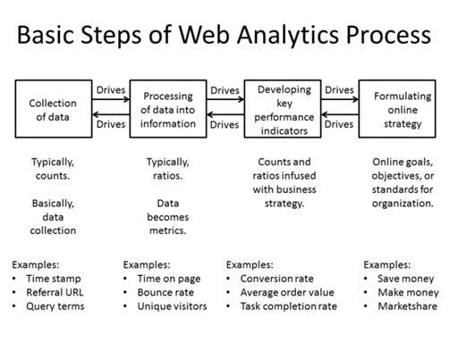
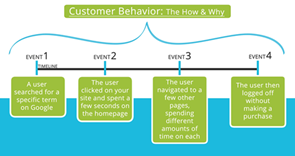

[UI Design Patterns](#top)

- [UX tools](#ux-tools)
- [UX AI tools](#ux-ai-tools)
- [STAR Principle：](#star-principle)
- [Common UI Design Patterns](#common-ui-design-patterns)
- [Mobile UX Design Patterns](#mobile-ux-design-patterns)
- [Some Research Terms](#some-research-terms)
- [产品开发生命周期：](#产品开发生命周期)
- [the list of some popular libraries:](#the-list-of-some-popular-libraries)

------------------------------------------------------------

## UX tools

category|tools
---|---
Designing Tools| sketch, Adobe Illustrator
Wireframing Tools| Balsamiq, InVision, Figma
Prototyping Tools|InVision, Proto.io, Adobe XD
Free UX Designer Tools| Figma, Justinmind, GIMP (GNU Image Manipulation Program),Origami Studio
画界面|sketch、figma、即时设计
运营视觉|Ps、c4d、Ai、Ae
流程图|figma、飞书
素材收集|eagle、花瓣
在线协同|飞书、腾讯文档、稿定设计
AIGC|Midjourney、stable diffuion

## Common UI Design Patterns

- **Breadcrumbs**: Use linked labels to provide secondary navigation that shows the path from the front to the current site page in the hierarchy.
- **Lazy Registration**: Forms can put users off registration. So, use this sign-up pattern to let users sample what your site/app offers for free or familiarize themselves with it. Then, you show them a sign-up form. For example, Amazon allows unrestricted navigation and cart-loading before it prompts users to register for an account. Note:
  - When content is accessible only to registered users or users must keep entering details, offer them **simplified/low-effort sign-up forms**.
  - Minimize/Avoid optional information fields. Use the Required Field Markers pattern to guide users to enter needed data.
- **Forgiving Format**: Let users enter data in various formats (e.g., city/town/village or zip code).
- **Clear Primary Actions**: Make buttons stand out with color so users know what to do (e.g., “Submit”). You may have to decide which actions take priority.
- **Progressive Disclosure**: Show users only features relevant for the task at hand, one per screen. If you break input demands into sections, you’ll reduce cognitive load (e.g., “Show More”)
- **Hover Controls**: Hide nonessential information on detailed pages to let users find relevant information more easily
- **Steps Left**: Designers typically combine this with a wizard pattern. It shows how many steps a user has to take to complete a task. You can use gamification (an incentivizing design pattern) here to enhance engagement.
- **Subscription Plans**: Offer users an options menu (including “Sign-up” buttons) for joining at certain rates.
- **Leaderboard**: You can boost engagement if you use this social media pattern
  - 
- **Dark Patterns**: Some designers use these to lead or trick users into performing certain actions, typically in e-commerce, so they spend more or surrender personal information. Dark patterns range in harmfulness. Some designers leave an unchecked opt-out box as a default to secure customer information. Others slip items into shopping carts. To use dark patterns responsibly, you must be ethical and have empathy with your users. Dark patterns are risky because user mistrust and feedback can destroy a brand’s reputation overnight

[⬆ back to top](#top)

## Mobile UX Design Patterns

- Gesture
- Integration
- Navigation: such as should come back
- Search

[⬆ back to top](#top)

## Some Research Terms

|Principles|details|
|---|---|
|3次点击法则 3 Click Rule|如果用户点击三次仍无法访问他们想要的页面，他们将离开网站|
|5秒测试 5 Second Test|向用户展示应用程序或网站界面5秒钟，然后用户回想他们刚才看到的内容。这是一个评价关键视觉效果，以及判断用户的关注点是否符合预期影响的好方法|
|二八法则|由帕累托原则(Pareto principle)引出 ，适用于任何网站，网页app或软件环境，即80％的结果是由20％的功能和特征所承担|
|A/B测试|将两个不同版本的线上内容提供给用户，来观察他们更倾向于哪一个|
|可访问性 Accessibility|一个网站或app是否可以被轻松使用和理解，以及该网站/app对残疾人或其他人群的特殊需要是否考虑完善，比如通过配色设计使色盲者也能轻松阅读|
|主动倾听|一种采访技巧，即采访者通过认真倾听和及时的做出一些反应，来使交流更好地进行下去|
|数据分析|网站/app的流量信息，它告诉你流量从何而来，以及用户主要在哪里停留|
|卡片分类法|一种帮助设计或评估站点信息架构的方法。在一个卡片分类会话中，参与者按自己的理解将细目分成不同的组，也可能需要给这些组贴上一定的标签|
|点击流分析|在网站分析中收集和分析用户会去访问哪些页面，以及以什么顺序去访问等这类数据的过程。访问者在网站访问的路径称为点击流|
|竞争者分析|对当前和潜在竞争对手的优势和劣势的一种评估|
|使用情境分析|使用情境分析涉及收集和分析以下信息：目标用户、任务、支持其目标的工具、产品使用的物理环境、技术约束及其他会影响用户体验的因素|
|转换率|转化率是指在线完成目标交易的访问者的所占比。在电子商务中，转化营销是指将网站访问者转化为付费客户的行为。提高转化率的过程称为转化率优化|
|日记分析|日记分析是一种收集有关用户行为，活动和经验的定性数据的研究方法。通常情况下，用户定期进行主动报告活动以创建活动日志，日记分析周期可以从几天到一个多月|
|最终用户|使用网站/app或参与、研究课题的人|

[⬆ back to top](#top)

## 产品开发生命周期：

- **头脑风暴（Brainstorm）**：围绕用户及其潜在需求或挑战产生创意。在此阶段，团队产生解决问题的想法，了解他们为谁设计，并确定受众可能遇到的需求或挑战。研究在此阶段发挥关键作用
- **定义（Define）**：利用头脑风暴阶段的见解，缩小关注范围。在定义阶段，团队确定产品将如何影响用户，并开始考虑产品的具体细节，如产品的受众，产品将做什么，以及产品需要包含哪些功能以取得成功
- **设计（Design）**：UX设计师开始积极开发创意，并确保定义阶段的所有规格都是现实的。利用前两个阶段的见解，UX设计师以用户为中心生成设计。此阶段将创建诸如故事板、线框或原型等多种资产
- **测试（Test）**：团队根据潜在用户的反馈评估产品设计。测试有助于识别需要优化或改进设计的领域。此阶段也帮助UX设计师考虑设计的交互性。这一阶段需要UX设计师与前端工程师紧密合作，共同确定如何创造出满足用户需求且实用的最终产品
- **上线（Launch）**：在产品开发生命周期的最后一个阶段，团队会向公众分享产品的最终版本。这可能包括将应用程序发布到Google Play商店或Apple App Store，使网站上线，或将实体产品上架。上线阶段可以让您和团队了解设计在现实世界中的表现。然而，产品在发布后的工作并未完全完成。您可能还会发现改进设计的机会，或根据反馈更深入地了解用户体验。这可能涉及回到设计或测试阶段，找出如何生产更优化的产品版本

[⬆ back to top](#top)

## the list of some popular libraries:

- https://goodui.org/  - a huge library of patterns, which was created based on A/B testing;
- [UI Patterns](http://uipatterns.io/good-defaults) - the list of numerous solutions to common design problems for developers and designers with interactive examples and downloadable source code to use for web and mobile apps 
- [Web UI Design Patterns](https://www.uxpin.com/studio/ebooks/web-ui-design-trends-2017/) - 63 patterns with cases of their use from the guys who created UXPin, a popular designing tool. 
- [Inspired UI](https://inspired-ui.com/) - a database of patterns for Android, iPhone, and iPad that is easy to use thanks to a simple drop-down menu
- [pttrns](https://pttrns.com/) - a neatly organized pattern base containing the coolest UI patterns since 2012
- [Mobile UI Design Patterns](https://www.uxpin.com/studio/ebooks/mobile-design-patterns/) - an e-book with 46 of the most successful mobile UI patterns. There are detailed explanations for their use along with the cases.

[⬆ back to top](#top)

> References
- [作为UX设计师你需要知道的52个专业术语](https://zhuanlan.zhihu.com/p/26646653)
- [52 Research Terms you need to know as a UX Designer](https://uxplanet.org/51-research-terms-you-need-to-know-as-a-ux-designer-fac0d40a59d7)
- [UX Design Patterns to Make Designer’s Work Simpler and Your Product More Intuitive](https://www.eleken.co/blog-posts/ux-design-patterns-to-make-designers-work-simpler-and-your-product-more-intuitive)
------------------------------------------------------------

