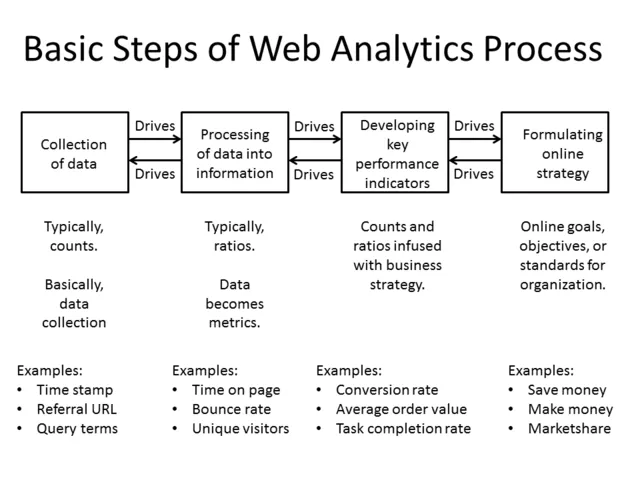
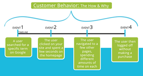

[UI Design Patterns](#top)

- [UX tools](#ux-tools)
- [UX AI tools](#ux-ai-tools)
- [STAR Principle：](#star-principle)
- [Some Research Terms](#some-research-terms)
- [产品开发生命周期：](#产品开发生命周期)
- [the list of some popular libraries:](#the-list-of-some-popular-libraries)

------------------------------------------------------------

## UX tools

category|tools
---|---
Designing Tools| sketch, Adobe Illustrator
Wireframing Tools| Balsamiq, InVision, Figma
Prototyping Tools|InVision, Proto.io, Adobe XD
Free UX Designer Tools| Figma, Justinmind, GIMP (GNU Image Manipulation Program),Origami Studio
画界面|sketch、figma、即时设计
运营视觉|Ps、c4d、Ai、Ae
流程图|figma、飞书
素材收集|eagle、花瓣
在线协同|飞书、腾讯文档、稿定设计
AIGC|Midjourney、stable diffuion

## Some Research Terms

|Principles|details|
|---|---|
|3次点击法则 3 Click Rule|如果用户点击三次仍无法访问他们想要的页面，他们将离开网站|
|5秒测试 5 Second Test|向用户展示应用程序或网站界面5秒钟，然后用户回想他们刚才看到的内容。这是一个评价关键视觉效果，以及判断用户的关注点是否符合预期影响的好方法|
|二八法则|由帕累托原则(Pareto principle)引出 ，适用于任何网站，网页app或软件环境，即80％的结果是由20％的功能和特征所承担|
|A/B测试|将两个不同版本的线上内容提供给用户，来观察他们更倾向于哪一个|
|可访问性 Accessibility|一个网站或app是否可以被轻松使用和理解，以及该网站/app对残疾人或其他人群的特殊需要是否考虑完善，比如通过配色设计使色盲者也能轻松阅读|
|主动倾听|一种采访技巧，即采访者通过认真倾听和及时的做出一些反应，来使交流更好地进行下去|
|数据分析|网站/app的流量信息，它告诉你流量从何而来，以及用户主要在哪里停留|
|卡片分类法|一种帮助设计或评估站点信息架构的方法。在一个卡片分类会话中，参与者按自己的理解将细目分成不同的组，也可能需要给这些组贴上一定的标签|
|点击流分析|在网站分析中收集和分析用户会去访问哪些页面，以及以什么顺序去访问等这类数据的过程。访问者在网站访问的路径称为点击流|
|竞争者分析|对当前和潜在竞争对手的优势和劣势的一种评估|
|使用情境分析|使用情境分析涉及收集和分析以下信息：目标用户、任务、支持其目标的工具、产品使用的物理环境、技术约束及其他会影响用户体验的因素|
|转换率|转化率是指在线完成目标交易的访问者的所占比。在电子商务中，转化营销是指将网站访问者转化为付费客户的行为。提高转化率的过程称为转化率优化|
|日记分析|日记分析是一种收集有关用户行为，活动和经验的定性数据的研究方法。通常情况下，用户定期进行主动报告活动以创建活动日志，日记分析周期可以从几天到一个多月|
|最终用户|使用网站/app或参与、研究课题的人|

[⬆ back to top](#top)

## 产品开发生命周期：

- **头脑风暴（Brainstorm）**：围绕用户及其潜在需求或挑战产生创意。在此阶段，团队产生解决问题的想法，了解他们为谁设计，并确定受众可能遇到的需求或挑战。研究在此阶段发挥关键作用
- **定义（Define）**：利用头脑风暴阶段的见解，缩小关注范围。在定义阶段，团队确定产品将如何影响用户，并开始考虑产品的具体细节，如产品的受众，产品将做什么，以及产品需要包含哪些功能以取得成功
- **设计（Design）**：UX设计师开始积极开发创意，并确保定义阶段的所有规格都是现实的。利用前两个阶段的见解，UX设计师以用户为中心生成设计。此阶段将创建诸如故事板、线框或原型等多种资产
- **测试（Test）**：团队根据潜在用户的反馈评估产品设计。测试有助于识别需要优化或改进设计的领域。此阶段也帮助UX设计师考虑设计的交互性。这一阶段需要UX设计师与前端工程师紧密合作，共同确定如何创造出满足用户需求且实用的最终产品
- **上线（Launch）**：在产品开发生命周期的最后一个阶段，团队会向公众分享产品的最终版本。这可能包括将应用程序发布到Google Play商店或Apple App Store，使网站上线，或将实体产品上架。上线阶段可以让您和团队了解设计在现实世界中的表现。然而，产品在发布后的工作并未完全完成。您可能还会发现改进设计的机会，或根据反馈更深入地了解用户体验。这可能涉及回到设计或测试阶段，找出如何生产更优化的产品版本

[⬆ back to top](#top)

## the list of some popular libraries:

- https://goodui.org/  - a huge library of patterns, which was created based on A/B testing;
- [UI Patterns](http://uipatterns.io/good-defaults) - the list of numerous solutions to common design problems for developers and designers with interactive examples and downloadable source code to use for web and mobile apps 
- [Web UI Design Patterns](https://www.uxpin.com/studio/ebooks/web-ui-design-trends-2017/) - 63 patterns with cases of their use from the guys who created UXPin, a popular designing tool. 
- [Inspired UI](https://inspired-ui.com/) - a database of patterns for Android, iPhone, and iPad that is easy to use thanks to a simple drop-down menu
- [pttrns](https://pttrns.com/) - a neatly organized pattern base containing the coolest UI patterns since 2012
- [Mobile UI Design Patterns](https://www.uxpin.com/studio/ebooks/mobile-design-patterns/) - an e-book with 46 of the most successful mobile UI patterns. There are detailed explanations for their use along with the cases.

[⬆ back to top](#top)

> References
- [作为UX设计师你需要知道的52个专业术语](https://zhuanlan.zhihu.com/p/26646653)
- [52 Research Terms you need to know as a UX Designer](https://uxplanet.org/51-research-terms-you-need-to-know-as-a-ux-designer-fac0d40a59d7)
- [UX Design Patterns to Make Designer’s Work Simpler and Your Product More Intuitive](https://www.eleken.co/blog-posts/ux-design-patterns-to-make-designers-work-simpler-and-your-product-more-intuitive)
------------------------------------------------------------

