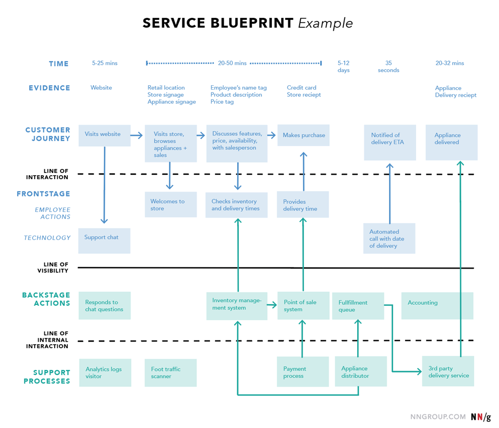

[UX设计图例总结](#top)

- [服务蓝图（Service Blueprint）](#服务蓝图service-blueprint)
- [消费者旅程地图（Consumer Journey Map）](#消费者旅程地图consumer-journey-map)
- [用户画像（Personas）](#用户画像personas)
- [生态系统图（Ecosystem Map）](#生态系统图ecosystem-map)
- [竞争分析（Competitive Audit）](#竞争分析competitive-audit)
- [价值主张（Value Proposition）](#价值主张value-proposition)
- [利益相关者访谈（Stakeholders Interviews）](#利益相关者访谈stakeholders-interviews)
- [关键绩效指标（KPI）](#关键绩效指标kpi)
- [头脑风暴（Brainstorming）](#头脑风暴brainstorming)
- [情绪板（Moodboards）](#情绪板moodboards)
- [故事板（Storyboards）](#故事板storyboards)
- [用户流程（User Flow）](#用户流程user-flow)
- [任务分析（Task Analysis）](#任务分析task-analysis)
- [分类管理（Taxonomies）](#分类管理taxonomies)
- [内容审核（Content Audit）](#内容审核content-audit)
- [启发式分析（Heuristic Analysis）](#启发式分析heuristic-analysis)
- [站点地图（Sitemap）](#站点地图sitemap)
- [产品/功能路线图（Product/Feature Roadmap）](#产品功能路线图productfeature-roadmap)
- [用例和场景（Use Cases and Scenarios）](#用例和场景use-cases-and-scenarios)
- [指标分析（Metrics Analysis）](#指标分析metrics-analysis)
- [用户访谈和焦点小组（User Interviews \& Focus Groups）](#用户访谈和焦点小组user-interviews--focus-groups)
- [定量调查（Quantitative Surveys）](#定量调查quantitative-surveys)
- [可用性测试（Usability Testing](#可用性测试usability-testing)
- [卡片分类（Card Sorting）](#卡片分类card-sorting)
- [A/B测试（A/B Test）](#ab测试ab-test)
- [眼动跟踪（Eyetracking）](#眼动跟踪eyetracking)
- [可访问性分析（Accessibility Analysis）](#可访问性分析accessibility-analysis)
- [草图（Sketches）](#草图sketches)
- [线框图（Wireframes）](#线框图wireframes)
- [原型（Prototypes）](#原型prototypes)
- [模式库和设计系统（Pattern Libraries \& Design Systems）](#模式库和设计系统pattern-libraries--design-systems)
- [日志研究（Diary Studies）](#日志研究diary-studies)
- [心理模型（Mental Models）](#心理模型mental-models)

------------------------------------------------------------------------------------------

## 服务蓝图（Service Blueprint）

- 通过一张地图来显示消费者与品牌的所有接触点，以及其中涉及的关键内外部流程，有助于将消费者跨多个渠道所遵循的路径进行可视化帮助后续更好的改进使用流程
- 
- 

[⬆ back to top](#top)

## 消费者旅程地图（Consumer Journey Map）

- 消费者旅程地图是用来探索消费者在使用各个服务时采取的多个步骤（有时是不可见的）的可视化图表。它有助于设计师在用户旅程的每个步骤中构建消费者的动机和需求模型，创建适合每个步骤的设计解决方案
- 

[⬆ back to top](#top)

## 用户画像（Personas）

- 用户画像是目标受众的相关快照，通过创建虚构角色来突出人口统计、行为、需求和动机等角色特征，可以帮助设计团队在整个设计过程中更容易与消费者产生共鸣
- 

[⬆ back to top](#top)

## 生态系统图（Ecosystem Map）

- 生态系统图是将公司数字资产之间的联系以及它们在整体企业战略策略中的目的进行可视化，可以帮助提供有关如何协调现有资产和未来资产来实现品牌业务目标的见解
- 

[⬆ back to top](#top)

## 竞争分析（Competitive Audit）

- 对竞争对手产品的综合分析，以可比较的方式描绘出其现有功能，帮助团队了解行业标准并确定在特定领域进行创新的机会
- 

[⬆ back to top](#top)

## 价值主张（Value Proposition）

- 产品早期定义阶段的简化过程，它能够勾勒出产品的关键方面，它是什么、它将服务谁以及它在何时/何地会被使用，可以帮助团队缩小范围并就产品的核心能力达成共识
- 

## 利益相关者访谈（Stakeholders Interviews）

- 用于采访项目内部和外部主要利益相关者以收集他们相关目标见解的沟通，它有助于确定功能的优先级并定义关键指标 (KPI)。

[⬆ back to top](#top)

## 关键绩效指标（KPI）

- 预先设定的标准，用于衡量实现战略目标或维护运营目标的进展。 KPI 有助于在整个过程中为设计决策提供信息，并且是衡量设计工作和成效的工具
- 

## 头脑风暴（Brainstorming）

- 头脑风暴是针对某一主题产生无约束想法的集体思考过程，可以将广泛的设计解决方案提前进行可视化

## 情绪板（Moodboards）

- 图片和设计参考的集合，最终演变为产品视觉风格的设计指南，可以帮助在设计过程中对产品的外观保持一致
- 

[⬆ back to top](#top)

## 故事板（Storyboards）

- 故事板用来描述消费者在使用产品时采取一系列行动的连环过程，将功能转化为现实生活中的真实情况，帮助设计师在了解产品功能范围的同时与消费者产生共鸣
- 

## 用户流程（User Flow）

- 用户在产品内完成任务的流程可视化展示，这是从用户的视角切入，可以更轻松地确定哪些步骤可以改进或重新设计
- 

[⬆ back to top](#top)

## 任务分析（Task Analysis）

- 任务分析是指完成一项任务所需的信息和行动的拆分，可以帮助设计人员和开发人员了解当前系统及信息的流转
- 

## 分类管理（Taxonomies）

- 对内容和数据进行分类的探索，如新闻站点中的主题、电子商务中的产品类别等，可以协助设计人员更好定义内容架构以支持用户和组织的目标
- 

[⬆ back to top](#top)

## 内容审核（Content Audit）

- 内容审核是指提前列出网站上所有可访问内容以帮助后续推进，如定义内容策略、检查页面细节等
- 

## 启发式分析（Heuristic Analysis）

- 使用已知的交互设计原则作为设计指导，对产品进行详细的设计分析，帮助可视化产品在可用性、效率和体验有效性方面的当前状态
- 

[⬆ back to top](#top)

## 站点地图（Sitemap）

- 站点地图按照网站层次进行组织，它能帮助可视化网站的基本结构，使导航变得更容易。

## 产品/功能路线图（Product/Feature Roadmap）

- 产品/功能路线图是具有优先级排序的产品迭代计划，它可以是电子表格、图表、完整记录的待办事项或一系列简单的事务便签，有助于在团队内分享产品策略以及实现产品目标所需的道路
- 

[⬆ back to top](#top)

## 用例和场景（Use Cases and Scenarios）

- 用户与产发生交互时发生所有场景的完整列表，需要确保彻底考虑到所有可能的操作，以及每个场景中的系统行为
- 

## 指标分析（Metrics Analysis）

- 数据指标分析是指通过数据分析工具对用户如何与产品进行交互的数字指标进行可视化展示，如点击次数、导航时间、搜索查询等
- 

## 用户访谈和焦点小组（User Interviews & Focus Groups）

- 一群人聚集在一起讨论特定主题或问题，接受用户的感受、意见反馈

## 定量调查（Quantitative Surveys）

- 提供确切的定量数字，定量调查是收集用户满意度和产品的相关反馈的快速方法
- 

[⬆ back to top](#top)

## 可用性测试（Usability Testing

采用一对一访谈形式，要求用户在原型或产品中执行一系列任务，验证并收集有关流程、设计和功能的反馈。

## 卡片分类（Card Sorting）

要求用户将内容和功能分组到开放或封闭的类别中，可以帮助组织内容的层次结构。

## A/B测试（A/B Test）

- 向不同用户提供产品的不同功能版本，并比较使用结果，了解哪一个版本被更好的执行
- 

[⬆ back to top](#top)

## 眼动跟踪（Eyetracking）

一种通过界面分析用户眼球运动的技术，了解用户的阅读流程发掘他们感兴趣的内容

## 可访问性分析（Accessibility Analysis）

- 旨在衡量网站是否可以被所有人使用的研究——包括有视力、听力、运动、认知和其他类型残疾的人
- 

[⬆ back to top](#top)

## 草图（Sketches）

使用纸张和笔或数字软件等可视化工具的快速出图的方式，用于快速验证产品概念和设计概念

## 线框图（Wireframes）

用低保真设计稿来表示页面结构，以展示其层次结构和关键元素，可以推动团队成员和客户的想法讨论，并协助设计师和开发人员的工作。

## 原型（Prototypes）

原型是产品导航和功能的模拟，通常采用可点击交互的设计稿。在正式开发产品之前，它可以用来测试和验证产品流程和使用体验。

[⬆ back to top](#top)

## 模式库和设计系统（Pattern Libraries & Design Systems）

- 提供在整个生态产品可以复用的交互设计模式和组件，它不仅可以极大促进一致性，还可以根据不同需求更容易地改善和维护设计元素
- 

## 日志研究（Diary Studies）

- 日志研究是一种从用户处收集数据的方法。以规定的时间间隔返回他们的行为、问题，意见、诉求等
- 

[⬆ back to top](#top)

## 心理模型（Mental Models）

- 心理模型是用户如何看待世界的解释，可以帮助设计者从概念设计的角度转换到用户体验的角度
- 

[⬆ back to top](#top)

> [UX设计师的工具清单](https://zhuanlan.zhihu.com/p/393164453)
