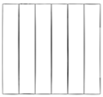

## between pages transition animation - next project

1. create 'PageTransition.tsx' which wrappes with `AnimatePresence`
2. add 'PageTransition' to '\app\layout.tsx'

```ts
// \app\layout.tsx
<Header />
<StairEffect />
<PageTransition>
  {children}
</PageTransition>

// components\PageTransition.tsx
"use client";
import { motion, AnimatePresence } from 'motion/react';
import { usePathname } from 'next/navigation';
import { ReactNode } from 'react';

const PageTransition = ({children}:{ children: ReactNode}) => {
  const pathname = usePathname();
  return (
    <AnimatePresence>
        <div key={pathname}>
            {/* animation transition div */}
            <motion.div
                initial={{ opacity: 1 }}
                animate= {{
                    opacity: 0,
                    transition: { delay: 0.3, duration: 0.4, ease:"easeInOut"},
                }}
                className="h-screen w-screen fixed bg-black top-0 pointer-events-none"
            ></motion.div>
            {children}
        </div>
    </AnimatePresence>
  )
}
export default PageTransition
```

## stair animation effect

- 'components\StairEffect.tsx' -> wrap 'tairs' with `AnimatePresence`
- 'components\Stairs.tsx'
const reverseIndex = (index: number) => {
  - -> six vertical div with white vertical background, animate by delay according to `reverseIndex`
  - 

```ts
// 'components\StairEffect.tsx'
"use client";
import { motion, AnimatePresence } from 'motion/react'
import { usePathname } from 'next/navigation';
import Stairs from './Stairs';
const StairEffect = () => {
  const pathname = usePathname();
  return (
    <>
        <AnimatePresence mode='wait'>
            <div key={pathname}>
                <div className='h-screen w-screen fixed top-0 left-0 right-0 pointer-events-none z-40 flex'>
                    <Stairs />
                </div>
                {/* optional div */}
                <motion.div
                    initial={{ opacity: 1 }}
                    animate={{
                        opacity: 0,
                        transition: { duration: 1, ease: "easeInOut", delay: 1,}
                    }}
                    className='h-screen w-screen fixed bg-black top-0 pointer-events-none'
                />
            </div>
        </AnimatePresence>
    </>
  )
}
export default StairEffect
//  components\Stairs.tsx
"use client";
import { motion } from 'motion/react'
const stairAnimation = {
    initial: { top: "0%" },
    animate: { top: "100%" },
    exit: { top: ["100%", "0%"] }
};
const reverseIndex = (index: number) => {
    const totalsteps = 6;
    return totalsteps - index - 1;
}
const Stairs = () => {
  return (
    <>
        {/* render 6 motion divs, each will have the same animation by stairAnimation object. The delay for each div is  */}
        {[...Array(6)].map((_, index) => {
            return (
                <motion.div
                    key={index}
                    variants={stairAnimation}
                    initial="initial"
                    animate="animate"
                    exit="exit"
                    transition={{
                        duration: 0.4,
                        ease: "easeInOut",
                        delay: reverseIndex(index) * 0.1,
                    }}
                    className='h-full w-full bg-white relative'
                />
            )
        })}
    </>
  )
}
export default Stairs
```
