[D3之d3-selection 原理](#top)

- [Selection](#selection)
  - [select 为何不涉及 group](#select-为何不涉及-group)
  - [空元素](#空元素)
- [Data](#data)
- [data-join](#data-join)
- [Enter, Update, Exit](#enter-update-exit)

-------------------------------------------------

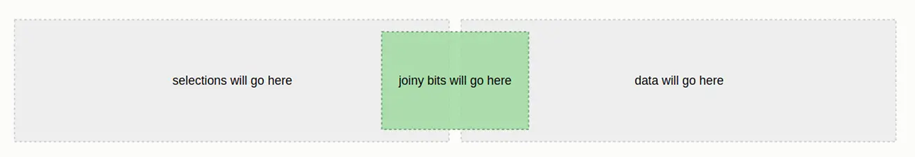

## Selection

- selection是Array的子类
  - array的子类提供了一些操作选中元素的方法: `selection.attr`, `selection:style`). 
  - selection同样继承了array的一些方法, 比如 `array.forEach`, `array.map`. 然而, 并不会经常使用这些从 array 继承来的方法, 因为D3 提供了一些方便的替代方法(比如 `selection.each`). 并且, 有一些 array 的方法为了符合 selection 的逻辑而被 overridden, 比如 `selection.filter` 和 `selection.sort`
    - `selection.append(type)` 创建新元素并返回该元素
    - `selection.remove()` 从DOM中移除当前元素
    - `selection.attr(name[,value])` 取得或设置属性的值
    - `selection.style(name[,value[,priority]])` 取得或设置元素的样式
- selection是group的数组, 而group才是DOM元素的数组
    - 每一个group都有一个parentNode 属性, 这个属性存储了group中所有元素的父节点. 父节点属性会在 group 被创建时就被赋值. 因
      - 如调用 d3.selectAll("tr").selectAll("td") , 返回的 group 数组, 他们的父节点就是 tr
      - 而d3.select 和 d3.selectAl 返回的 group, 他们的父节点就是 html
    - 当对selection 调用 `selection.attr` 或者 `selection.style` 的时候, selection 中的所有 group 的所有子元素都会被调用. 而group存在的唯一影响是: 在 `selection.attr('attrName', function(data, i))`时, 第二个参数i是元素在 **group中的索引**而不是在整个selection中的索引

|code example| selection|Additional|
|---|---|---|
|`var selection = d3.select('body')`|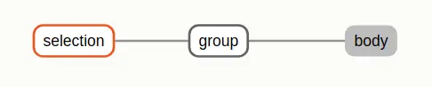|
|`d3.select(selector)` 返回匹配选择器的第一个元素|`d3.selectAll(selector)` 返回匹配选择器所有元素
|`d3.selectAll('h2')`|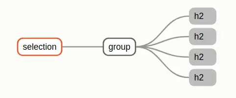|
|`d3.selectAll('tr').selectAll('td')`|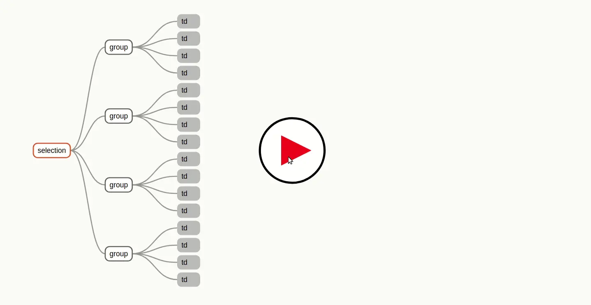|
|`d3.selectAll('tr').selectAll('td').selectAll('span')`|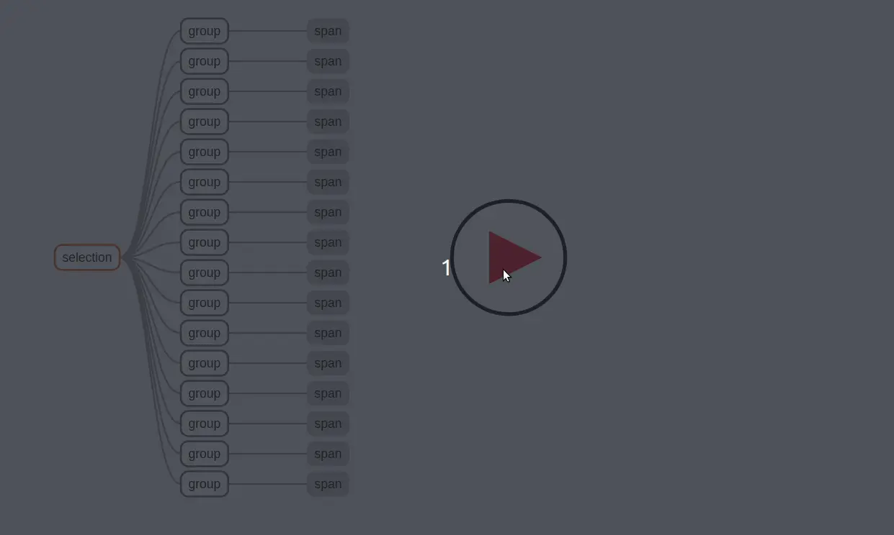|

[⬆ back to top](#top)

### select 为何不涉及 group

- 只有 selectAll 会涉及到 group 元素, select 会保留当前已有的 group. select 方法之所以不同, 是因为在老的 selection 中的每个元素都只会在新的 selection 中对应一个新的元素. 因此 select 操作会直接把数据从父元素传递给子元素 (因此也根本没有 data-join 的过程)
- append 方法和 insert 方法都被挂载到了 selection 上, 这两个方法都会自动维护 group 的结构, 并且自动传递数据

|code example| selection|Additional|
|---|---|---|
|`d3.selectAll('section')`|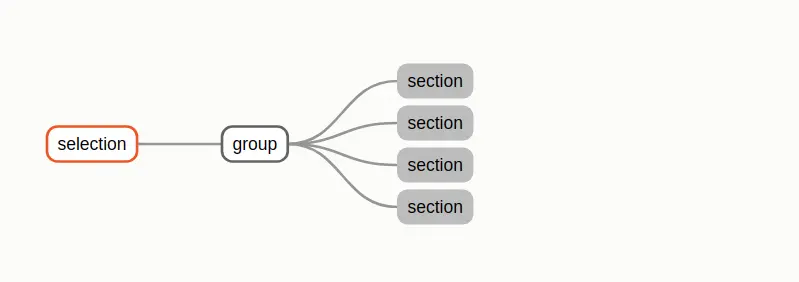|
|`d3.selectAll('section').append('p')`|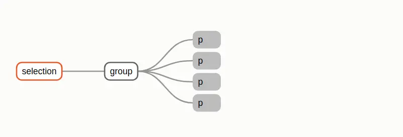|

[⬆ back to top](#top)

### 空元素

- group 中可以保存 Null 元素, 用来声明元素的缺失. Null 会被大部分的操作所忽略, 比如: D3 会在 selection.attr 和 selection.style 的时候自动忽略 Null 元素.
- Null 元素会在 selection.select 无法找到符合要求的子元素时被创建. 因为 select 方法会维护 group 的结构, 所以它会在缺失元素的地方填上 Null, Null 元素是确实存在于 group 的结构当中的, 并且会在计算 index 时被考虑进来
- 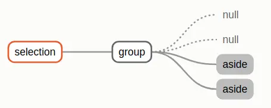

[⬆ back to top](#top)

## Data

- 在 D3 中, 数据可以是装有基础数据类型数据的数组, 或者是对象数组, 甚至是矩阵(由数组组成的数组)
- `selection.data()` 的 function 会有两个参数: parentNode 和 groupIndex. 然后根据这两个参数, 返回对应的数据. 因此,这里传入的 function 相当于是持有父级的数据, 然后根据 parentNode 和 groupIndex 将父级数据拆分为每个 group 的子级数据
- 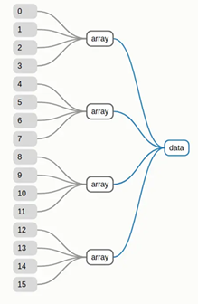

```javascript
selection.data(function(parentNode, groupIndex) {
  return data[groupIndex]
})
```

[⬆ back to top](#top)

## data-join 

- `d3.selectAll('div').data(numbers)`,  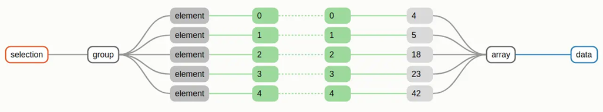
- 如果数据和 DOM 元素的顺序恰好相同(或者对顺序并不在意)时, 通过下标索引作为 key 值是非常方便的. 但是, 一旦数据的顺序发生变化, 通过下表索引作为 key值就变得不可行了. 这时, 需要手动设置一个 **key functon**, 将这个 function 作为第二个参数传入 `selection.data(data, keyFunction)`. 这个keyFunction 需要根据当前的数据, 返回一个对应的key值, 

```javascript
var letters = [
  { name: 'A', frequency: 0.08167 },
  { name: 'B', frequency: 0.01492 },
  { name: 'C', frequency: 0.0278 },
  { name: 'D', frequency: 0.04253 },
  { name: 'E', frequency: 0.12702 }
]
function name(d) {
  return d.name
}
```

|code example| selection|Additional|
|---|---|---|
|`selection.data(data, name)`|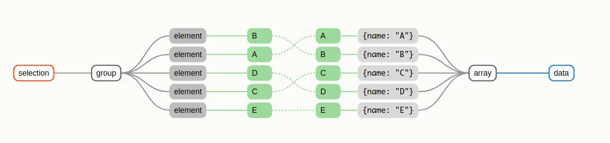|
|`selection.data(data, name)`|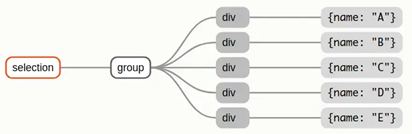|
|当有多个 group时, 每一个group会独立的进行 join 操作. 因此只需要关心如何在一个group中保持key值的唯一性即可|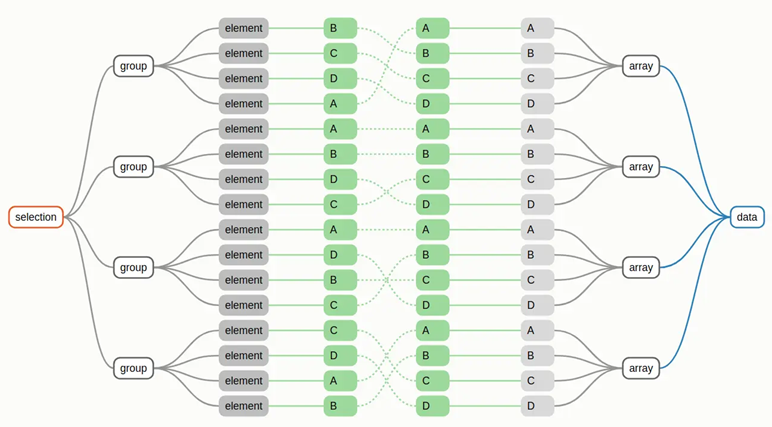|

[⬆ back to top](#top)

## Enter, Update, Exit

- Update选择集==>  跟新属性和样式
- Enter选择集 ==>  创建新 DOM 元素, 为新元素跟新属性和样式
- Exit选择集  ==>  移除 DOM 元素
- 现在有一个柱状图, 柱状图有 5 列, 分别对应的 ABCDE 这五个字母. 现在你想将柱状图对应的数据从 ABCDE 切换成 YEAOI. 你可以通过设置一个 key function 来为此这五个字母和五列柱状图之间的关系, 数据转换的过程如图: ABCDE ==> YEAOI
  - 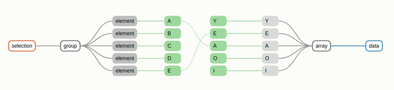
  - 需要先调用 `selection.selectAll` 再调用 `selection.data` : 因为我们要为 Enter 选择集的 group 指定好用于插入新元素的父节点

|选择集| selection|Additional|
|---|---|---|
|Update 选择集| A 和 E, `var div = d3.selectAll('div').data(vowels, name)`|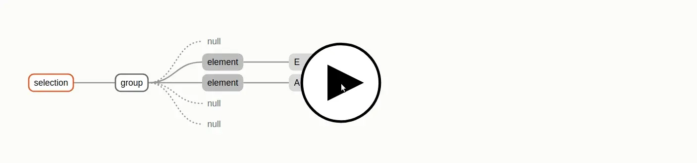|
|Exit 选择集| B, C, D, `div.exit()`|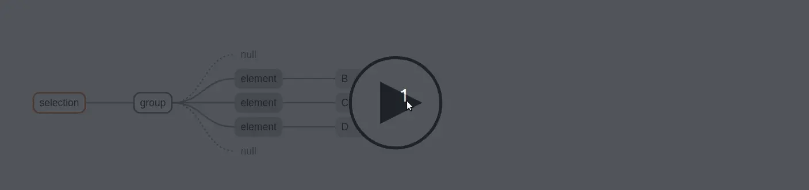|
|Enter 选择集| 新加入的三个字母: Y, O, I , `div.enter()`|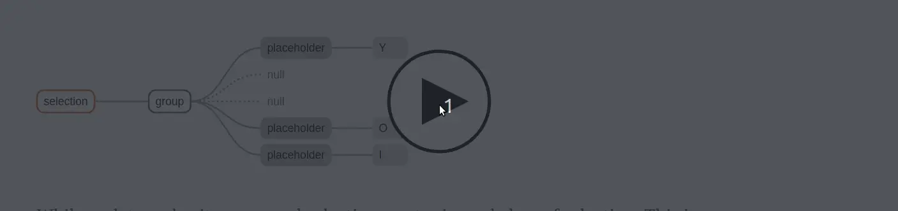|

- 对于 Enter 选择集和 Update 选择集的操作, 经常会有重复的部分, 比如更新 DOM 元素的坐标, 更新 DOM 元素的 style 样式. 为了减少这部分冗余的代码, selection 提供了 `merge` 方法, 使用方法如下

```javascript
var updateSelection = div
div
  .enter()
  .append('text')
  .text(d => d)
  .merge(updateSelection)        // merge
  .attr('x', function(d, i) {
    return i * 10
  })
  .attr('y', 10)
```

[⬆ back to top](#top)

> References
- [How Selections Works](https://link.juejin.cn/?target=https%3A%2F%2Fbost.ocks.org%2Fmike%2Fselection%2F)
- [[译]D3.js 之 d3-selection 原理](https://juejin.cn/post/6844903629611089927)
