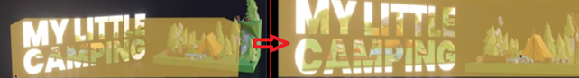

[Tips of react three fiber](#top)

- [using typescript](#using-typescript)
- [covert glb Model file](#covert-glb-model-file)
- [using glb model in react](#using-glb-model-in-react)
- [transform and load glb model](#transform-and-load-glb-model)
- [远模糊近清晰的动画效果](#远模糊近清晰的动画效果)
- [reflection plane反射地面(平面)](#reflection-plane反射地面平面)
- [物体reflection plane反射效果](#物体reflection-plane反射效果)
- [Bloom亮闪闪效果](#bloom亮闪闪效果)
- [HTML overLay and css over model](#html-overlay-and-css-over-model)
- [摄影机推进到某个位置效果fit to a position](#摄影机推进到某个位置效果fit-to-a-position)
- [UI(HTML) button over screen and interaction effect](#uihtml-button-over-screen-and-interaction-effect)

-------------------------------------------------------------------------------
- `npm i three @react-three/drei @react-three/fiber`
------------------------------------------------------------------------------

## using typescript

- `npm install @types/three`
- `const { nodes, materials, animations } = useGLTF('/models/tenhun_falling_spaceman_fanart.glb') as unknown as GLTFResult;`  -> <mark>as unknown as GLTFResult</mark>
- https://r3f.docs.pmnd.rs/getting-started/introduction
- https://r3f.docs.pmnd.rs/api/typescript

##  covert glb Model file

1. method 1
   1. `npx gltfjsx public/models/WawaOffice.glb` -> it will generate 'WawaOffice.jsx' in root directory
      1. `npx gltfjsx --types public/models/WawaOffice.glb`  <-- <mark>add typescript type</mark>
   2. create 'src\components\Office.jsx/tsx` and copy all 'WawaOffice.jsx/tsx' code in it
   3. https://github.com/pmndrs/gltfjsx
2. method 2:
   1. https://gltf.pmnd.rs/
   2. note: you can choose typescript

[🚀back to top](#top)

## using glb model in react

- using `<Supspense>` of 'react'
- using `<Float>`, `Html`, `useProgress` of '@react-three/drei'

```js
import { OrbitControls, Float, Preload } from '@react-three/drei';
import { Suspense } from "react";
//...
<Canvas camera={{ position: [0, 1, 3] }}>
   <Suspense fallback={<Loader />}>
      <Float>
         <Astronaut scale={1} position={[1, -1.5, 0]} />
         <OrbitControls />
      </Float>
   </Suspense>
   <Preload all />
</Canvas>
// Loader.jsx
"use client";
import { Html, useProgress } from "@react-three/drei";
const Loader = () => {
  const { progress } = useProgress();
  return (
    <Html center className="text-xl font-normal text-center">
      {progress}% Loaded
    </Html>
  );
};
export default Loader;
```

[🚀back to top](#top)

## transform and load glb model

1. `npx gltfjsx public/models/Camping.glb -o src/components/Camping1.jsx -k -K -r public` ： need install `gltfjsx@6.2.16`
   - `npx gltfjsx public/models/Camping.glb --transform`  ： no need install gltfjsx@6.2.16
2. or transform on line https://gltf.pmnd.rs/
3. not solve - [GLB export doesn’t include mesh names](https://discourse.threejs.org/t/glb-export-doesnt-include-mesh-names/41680)

[⬆ back to top](#top)

## 远模糊近清晰的动画效果

- `<fog attach="fog" args={["#171720", 10, 30]} />` in 'app.jsx'

## reflection plane反射地面(平面)

- refer to 'Experience.jsx in 'react-three-fiber-vite-boilerplate' project

```javascript
<mesh>
   <planeGeometry />
   <MeshReflectorMaterial/>
</mesh>
<Environment preset="sunset" />
```

[⬆ back to top](#top)

## 物体reflection plane反射效果

- 在物体内部加入meshBasicMaterial和RenderTexture
  
 ```javascript
<Text font={"fonts/Poppins-Black.ttf"} position={[-1.3, -0.5, 1]} lineHeight={0.8} textAlign="center" rotation-y= {degToRad(30)} anchorY={"bottom"}>
   MY LITTLE{"\n"}CAMPING
   <meshBasicMaterial color={bloomColor} toneMapped={false}>
       //reflection animation effect of Text by using RenderTexture
      <RenderTexture attach={"map"}>
         <color attach="background" args={["#fff"]} />   // white background
         <Environment preset="sunset" />
         // animation
         <Float floatIntensity={4} rotationIntensity={5}>
            <Camping1 scale={1.6} rotation-y={degToRad(25)} rotation-x={degToRad(40)} position-y={-0.5} />
         </Float>
    </RenderTexture>
  </meshBasicMaterial>
</Text>
```

## Bloom亮闪闪效果

- 'react-three/postprocessing': This [library](https://github.com/pmndrs/react-postprocessing) provides an EffectPass which automatically organizes and merges any given combination of effects
- `npm i @react-three/postprocessing`
- 需要配合物体reflection plane反射效果使用

```javascript
// 1. add following in app.jsx
<EffectComposer>
   <Bloom intensity={1.2} mipmapBlur/>          //mip贴图模糊      
</EffectComposer>
// 2. add bloom color in experience.jsx
const bloomColor = new Color("#fff");  // 
bloomColor.multiplyScalar(1.5);        //trigger bloom
// 3. add color={bloomColor} toneMapped={false} to meshBasicMaterial which relecting envrionment
<meshBasicMaterial color={bloomColor} toneMapped={false} ref={textMaterial}>
```

[⬆ back to top](#top)

## HTML overLay and css over model

```javascript
const OverlayItem = ({props}) => {
  return (
    <Html>
      <div>
        <h2 className="font-bold">{title}</h2>
        <p>{description}</p>
      </div>
      <button>Add to cart</button>
    </Html>
  );
};
export function Camping1({html, ...props}) {
   //...
   <group>
      <mesh />
      { html && ( <OverlayItem/> )}
   </group>
   //...
};
```

[⬆ back to top](#top)

## 摄影机推进到某个位置效果fit to a position

- create `mesh` as a position object（参照目标）, it need `CameraControls`
- create two refs
-  

```javascript
const controls = useRef();  // CameraControls'ref
const meshFitCameraHome = useRef(); //参照目标'ref

const fitCamera = async () => {
   controls.current.smoothTime = 1.6;
   controls.current.fitToBox(meshFitCameraHome.current, true);  // fitToBox
}
// responsive 
useEffect(() => {
    fitCamera();
    window.addEventListener("resize", fitCamera);
    return window.removeEventListener("resize", fitCamera);
}, []);
//
<CameraControls ref={controls} />
<mesh ref={meshFitCameraHome} position-z={1.5} visible={false}>
   <boxGeometry args={[7.5, 2, 2]} />
   <meshBasicMaterial color="orange" transparent opacity={0.5} />
</mesh>
```

[⬆ back to top](#top)

## UI(HTML) button over screen and interaction effect

- effect:
   - it will show button at the beginning
   - when button is clicked, 推进到场景模型的tent处
   - 本效果需要上面‘摄影机推进到某个位置效果fit to a position’的知识
- by using atom hook of [jotai](https://jotai.org/): store interface that can be used outside of React
- `npm i jotai`
- Using `HTML` in '@react-three/drei'
- refer to 'Camping1.jsx' in 'react-three-fiber-vite-boilerplate' project

```javascript
//UI.jsx
import { atom, useAtom } from "jotai";
export const currentPageAtom = atom("intro");  //define a atom hook intro
export const UILayer = () => {
  const [currentPage, setCurrentPage] = useAtom(currentPageAtom);  // useAtom hook
  return (
    <div className="fixed inset-0 pointer-events-none">
      <section className={`flex w-full h-full flex-col items-center justify-center duration-500 
               ${currentPage === "home" ? "" : "opacity-0"}`} >   //when button clicked, it will disappear
        <div className="h-[66%]"></div>
         //when button clicked, 摄像机推进到store
        <button onClick={() => setCurrentPage("store")}
          className="pointer-events-auto py-4 px-8 bg-orange-400 text-white font-black rounded-full hover:bg-orange-600 cursor-pointer transition-colors duration-500" >
          ENTER
        </button>
      </section>
    </div>
  );
};
//Experience.jsx
const [currentPage, setCurrentPage] = useAtom(currentPageAtom);
const intro = async () => {
    controls.current.dolly(-22); 
    controls.current.smoothTime = 1.6;
    //controls.current.dolly(22, true);
    setTimeout(() => { setCurrentPage("home"); }, 1200)
    fitCamera();
};
//animation camera
const fitCamera = async () => {
    if (currentPage === "store") {
      controls.current.smoothTime = 0.8;
      controls.current.fitToBox(meshFitCameraStore.current, true);
    } else {
      controls.current.smoothTime = 1.6;
      controls.current.fitToBox(meshFitCameraHome.current, true);
    }
}
useEffect(() => {
   intro();
}, []);
<CameraControls ref={controls} />
//modify and add ref meshFitCameraStore
<mesh ref={meshFitCameraHome} position-z={1.5} visible={false}>
   <boxGeometry args={[7.5, 2, 2]} />
   <meshBasicMaterial color="orange" transparent opacity={0.5} />
</mesh>
//...
<group rotation-y={degToRad(-25)} position-x={3}>
   <Camping1 scale={0.6} html />
      <mesh ref={meshFitCameraStore} visible={false}>   //modify and add ref meshFitCameraStore
         <boxGeometry scale={0.6} />
         <meshBasicMaterial color="red" transparent opacity={0.5} />
      </mesh>
      //...
</group>
```

[⬆ back to top](#top)
