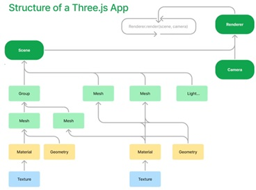

```
│   ├── 📂ThreeJS/
│   │   ├── 📂Project-demo/
│   │   ├── 📂demo-elementary-r73-2018-10/
│   │   ├── 📄ThreeJS-study-notebook-2023版.md
│   │   ├── 📄problems-react-three-fiber.md
│   │   ├── 📄react-three-fiber-tip.md
│   │   └── 
```



## tools

- Element-Plus:https://element-plus.gitee.io/zh-CN/
- 模型下载网站 https://sketchfab.com/feed
- 贴图素材网站 https://polyhaven.com/
- 图片格式转换网站 https://onlineconvertfree.com/zh/convert/hdr/

## References

- [Three.js中文网]([http://www.webgl3d.cn/](http://www.webgl3d.cn/pages/aac9ab/)http://www.webgl3d.cn/pages/aac9ab/)
- [Three.js](https://threejs.org/)
- [threejs 官方文档](https://threejs.org/docs/#manual/zh/introduction/Creating-a-scene)
- [Three.js中文教程](https://techbrood.com/threejs/docs/)
- [Three.js and TypeScript Tutorials](https://sbcode.net/threejs/)
- [Migration Guide](https://github.com/mrdoob/three.js/wiki/Migration-Guide)
- [threejs+angular 实现面积测量](https://blog.csdn.net/u013172864/article/details/89704868)
- [使用React+Three.js 封装一个三维地球](https://blog.csdn.net/future_todo/article/details/78072615)
- [Three.js 快速上手以及在 React 中运用[转]](https://www.cnblogs.com/mazhenyu/p/11834700.html)- https://github.com/zrysmt/react-threejs-app
- [Hello React And Three.js](https://zhuanlan.zhihu.com/p/450900050)

## github

- https://github.com/mrdoob/three.js/tree/dev/examples
- [mdn-webgl-examples](https://github.com/idofilin/webgl-by-example/tree/master)
- https://github.com/Sean-Bradley
- https://github.com/pmndrs/react-three-fiber

## youtube

- [Three.js 101 Crash Course: Beginner’s Guide to 3D Web Design (7 HOURS!)](https://www.youtube.com/watch?v=KM64t3pA4fs)
