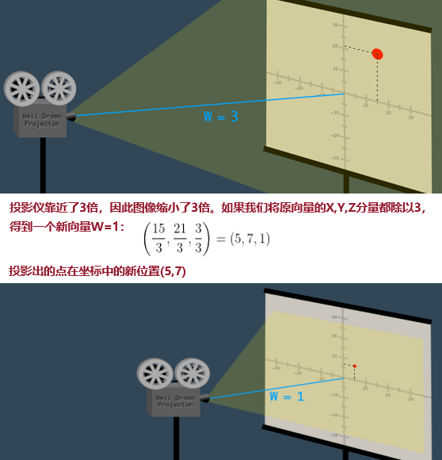
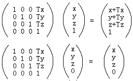
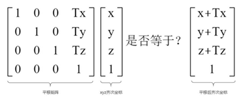
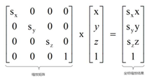
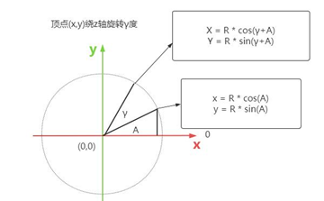
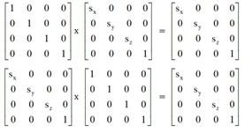

[3D几何变换数学基础](#top)

- [齐次坐标homogeneous coordinate](#齐次坐标homogeneous-coordinate)
  - [3D计算机图形学中的透视](#3d计算机图形学中的透视)
  - [homogeneous coordinate](#homogeneous-coordinate)
- [矩阵运算-平移、旋转、缩放矩阵](#矩阵运算-平移旋转缩放矩阵)
- [变换矩阵Transform Matrix](#变换矩阵transform-matrix)
- [单位矩阵](#单位矩阵)

## 齐次坐标homogeneous coordinate

**“齐次坐标表示是计算机图形学的重要手段之一，它既能够用来明确区分向量和点，同时也更易用于进行仿射（线性）几何变换。”—— F.S. Hill, JR**

### 3D计算机图形学中的透视

- 在3D计算机图形学中，透视是通过变换矩阵改变向量的W分量来实现的
- 在变换到观察空间后（对向量应用了观察矩阵）但还没进行投影变换（还没有对向量应用投影矩阵），每个向量的Z分量表示了距离相机的距离。因此，Z分量越大，矢量应该越小。W分量影响这个缩放，所以投影矩阵用Z分量的值改变W分量的值
- 在3D计算机图形学中，透视是通过投影矩阵变换，改变每一个向量中W分量的值来实现透视的
- 

### homogeneous coordinate

- 就是在原有的坐标维度上再添加一个维度w，将一个原本是n维的向量用一个n+1维向量来表示
- 如：欧几里得几何学中的三维空间(X,Y,Z)，除了X,Y,Z分量外，增加一个W分量，这个四维空间(X,Y,Z,W)叫做“投影空间”，在四维空间中的坐标叫做“齐次坐标”
- 显然一个向量的齐次表示是不唯一的，齐次坐标的h取不同的值都表示的是同一个点，比如齐次坐标[10,4,2]、[5,2,1]表示的都是二维点[5,2]
- 齐次坐标使用了4个分量来表达3D概念，使得平移变换可以使用矩阵进行
  - 矩阵加法 --> 平移
  - 矩阵乘法 --> 旋转和缩放
- 

**普通坐标(Ordinary Coordinate)和齐次坐标(Homogeneous Coordinate)的转换**

- 从普通坐标转换成齐次坐标时：
  - 如果(x,y,z)是个点，则变为(x,y,z,1);
  - 如果(x,y,z)是个向量，则变为(x,y,z,0)
- 从齐次坐标转换成普通坐标时：
  - 如果是(x,y,z,1)，则知道它是个点，变成(x,y,z);
  - 如果是(x,y,z,0)，则知道它是个向量，仍然变成(x,y,z)
- 

[⬆ back to top](#top)

## 矩阵运算-平移、旋转、缩放矩阵

**矩阵乘法**

$$
\left[
\begin{matrix}
a & b \\
c & d 
\end{matrix} \right]
\times
\left[
\begin{matrix}
x \\
y 
\end{matrix} \right] = 
\left[
\begin{matrix}
ax + by \\
cx + dy 
\end{matrix} \right]
$$

$$
\left[
\begin{matrix}
a & b \\
c & d 
\end{matrix} \right]
\times
\left[
\begin{matrix}
2 & 3 \\
4 & 5 
\end{matrix} \right] = 
\left[
\begin{matrix}
2a + 4b & 3a + 5b \\
2c + 4d & 3c + 5d 
\end{matrix} \right] 
$$

**平移矩阵**

- 一个点的坐标是(x,y,z),假设沿着X、Y、Z轴分别平移Tx、Ty、Tz，毫无疑问平移后的坐标是(x+Tx,y+Ty,z+Tz)
- 坐标是(x,y,z)转化为齐次坐标坐标是(x,y,z,1),可以用4x1矩阵表示，这种特殊形式，也可以称为**列向量**，在webgpu顶点着色器代码中也可以用**四维向量vec4**表示


**缩放矩阵**

- 通过缩放矩阵可以对顶点的齐次坐标进行缩放


**旋转矩阵**

- 
- 假设一个点的坐标是(x,y,z),经过旋转变换后的坐标为(X,Y,Z)
- 绕Z轴旋转γ角度,z的坐标不变不变，x、y的坐标发生变化，旋转后的坐标：$ X = x\cos\gamma - y\sin\gamma, Y = x\sin\gamma + y\cos\gamma $

```javascript
// 假设旋转前角度A，对应x和y的值
x = R * cos(A)
y = R * sin(A)
// 假设旋转了γ度，对应X和Y的值
X = R * cos(γ+A)
  = R * (cos(γ)cos(A)-sin(γ)sin(A))
  = R*cos(A)cos(γ) - R*sin(A)sin(γ)
  = xcosγ-ysinγ
Y = R * sin(γ+A)
  = R * (sin(γ)cos(A)+cos(γ)sin(A))
  = R*cos(A)sin(γ) + R*sin(A)cos(γ)
  = xsinγ+ycosγ
```

|旋转|说明|公式|
|---|---|---|
|绕X轴旋转α角度|x的坐标不变，y、z的坐标发生变化<br>Y=ycosα-zsinα,Z=ysinα+zcosα||
|绕Y轴旋转β角度|y的坐标不变，z、x的坐标发生变化<br>Z=zsinβ+xcosβ,X=zcosβ-xsinβ||
|绕Z轴旋转γ角度|z的坐标不变不变，x、y的坐标发生变化<br>X=xcosγ-ysinγ,Y=xsinγ+ycosγ||

[⬆ back to top](#top)

## 变换矩阵Transform Matrix

- 变换矩阵就是平移矩阵、旋转矩阵、缩放矩阵的统称，或者说模型矩阵是平移、缩放、旋转矩阵相乘得到的复合矩阵
- 注意：**几何变换顺序不同结果不同**， 假设一个顶点原始坐标(2,0,0)
  - 先平移2、后缩放10：如果先沿着x轴平移2，变为(4,0,0)，再x轴方向缩放10倍，最终坐标是(40,0,0)
  - 先缩放10、后平移2：如果先x轴方向缩放10倍，变为(20,0,0)，再沿着x轴平移2，最终坐标是(22,0,0)


[⬆ back to top](#top)

## 单位矩阵

对角线上都为1，其它为0的矩阵

  $$\left[
\begin{matrix}
1 & 0 & 0 \\
0 & 1 & 0 \\
0 & 0 & 1
\end{matrix} \right] $$
  - 单位矩阵乘其它矩阵，或者其它矩阵成单位矩阵，新矩阵都和其它矩阵一样，不受范围矩阵影响，单位矩阵有点类似自然数加减乘除的1
  

[⬆ back to top](#top)

> references
- [齐次坐标及其相关内容的解释（转载](https://blog.csdn.net/qq_38234381/article/details/108697802)
- [Games101计算机图形学入门基础之一：向量变换、矩阵变换、视图变换、欧拉角与四元数](https://blog.csdn.net/superheromen/article/details/125961135)
- [数学】齐次坐标、三维点/向量的平移、缩放、旋转](https://freesouth.blog.csdn.net/article/details/112532952)
- [计算机图形学入门基础之一：向量变换、矩阵变换、齐次坐标、欧拉角与四元数](https://blog.csdn.net/superheromen/article/details/125961135)
