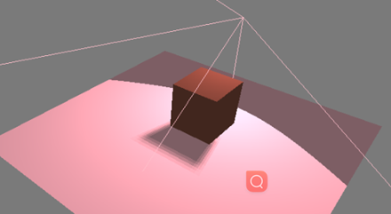

[Treejs学习](#top)

- [概览](#概览)
- [Three.js制作3D的五要素](#threejs制作3d的五要素)
- [场景（scene）](#场景scene)
- [相机（camera）](#相机camera)
    - [正投影相机（OrthographicCamer）](#正投影相机orthographiccamer)
  - [透视相机（PerspectiveCamera）](#透视相机perspectivecamera)
    - [1）位置属性position](#1位置属性position)
    - [2) 观察目标lookAt()](#2-观察目标lookat)
    - [3）up属性，结果朝向](#3up属性结果朝向)
    - [4）相机视野范围：视椎体](#4相机视野范围视椎体)
  - [立体相机（StereoCamera）](#立体相机stereocamera)
  - [摄像机阵列（ArrayCamera）](#摄像机阵列arraycamera)
- [渲染器（renderer）](#渲染器renderer)
- [光源（light）](#光源light)
  - [1）环境光AmbientLight](#1环境光ambientlight)
  - [2）其他发光光源：点光源、平行光、聚光](#2其他发光光源点光源平行光聚光)
  - [3）点光源辅助PointLightHelper](#3点光源辅助pointlighthelper)
  - [生成阴影](#生成阴影)
- [材质](#材质)
  - [网格属性](#网格属性)
  - [网格材质](#网格材质)
  - [高级材质](#高级材质)
  - [材质注意事项：](#材质注意事项)
- [物体（object）](#物体object)
  - [顶点概念、几何体结构](#顶点概念几何体结构)
  - [几何体对象、三维建模](#几何体对象三维建模)
  - [二维几何体](#二维几何体)
    - [PlaneGeometry](#planegeometry)
    - [CircleGeometry](#circlegeometry)
    - [ShapeGeometry](#shapegeometry)
  - [三维几何体](#三维几何体)
  - [文本几何体](#文本几何体)
  - [材质对象](#材质对象)
- [模型对象](#模型对象)
- [纹理贴图](#纹理贴图)
- [其他](#其他)
  - [精灵模型、粒子系统](#精灵模型粒子系统)
  - [模型文件导出\&导入](#模型文件导出导入)
  - [后期处理](#后期处理)

-----------------------------------------------------------

## 概览

1. Three.JS是基于WebGL的Javascript开源框架，简言之，就是能够实现3D效果的JS库
2. WebGL WebGL是一种Javascript的3D图形接口，把JavaScript和OpenGL ES 2.0结合在一起
3. OpenGL OpenGL是开放式图形标准，跨编程语言、跨平台，Javascript、Java 、C、C++ 、 python 等都能支持OpenGL，OpenGL的Javascript实现就是WebGL，另外很多CAD制图软件都采用这种标准。OpenGL ES 2.0是OpenGL的子集，针对手机、游戏主机等嵌入式设备而设计
4. Canvas Canvas是HTML5的画布元素，在使用Canvas时，需要用到Canvas的上下文，可以用2D上下文绘制二维的图像，也可以使用3D上下文绘制三维的图像，其中3D上下文就是指WebGL


[⬆ back to top](#top)

## Three.js制作3D的五要素

- 桌面浏览器兼容性: 基本上所有的现代浏览器都支持
  - Firefox：4.0 版本后开始支持
  - Chrome：9.0 版本后开始支持
  - Safari：5.1 版本后开始支持
  - Opera：12.00 版本后开始支持
  - IE：IE11 起才开始支持（唯一一个很长时间都不支持 WebGL 的浏览器）
- 移动设备兼容性
  - Android：Android原生的浏览器是不支持WebGL的。如果想在Android上运行WebGL，需要安装最新的移动版本的Chrome、Firefox 或者Opera
  - iOS：从iOS8起就开始支持
  - Windows mobile：从8.1版本后开始支持
- 渲染器（render）, 场景（scene）, 照相机（camera）, 光源（light）, 物体（object）


## 场景（scene）

`const scene = new THREE.Scene();`
  
|函数/属性|描述|
|---|---|
|add(object)|在场景中添加对象|
|children|返回一个场景中所有对象的列表，包括light，camera|
|getChildByName(name)||
|remove(object)|在场景中删除对象|
|traverse(function)|children属性返回一个场景中所有对象的列表，通过traverse函数可以传入一个回调函数访问这些对象|
|fog|设置场景的雾化效果，可以为整个场景添 效果 一个物体离得越远，就越模糊<br>`scene.fog = new THREE.Fog('pink',0.5,30) // (颜色，雾的显示近处的浓度，far远处)`|
|overrideMeterial|强制场景中所有物体都用相同的材质<br>`scene.overrideMaterial = new THREE.MeshLambertMaterial({ color:'pink' })`|

[⬆ back to top](#top)

## 相机（camera）

#### 正投影相机（OrthographicCamer）

- 也叫正交相机，使用正投影相机，所有方块渲染出来的尺寸都是一样的，对象与相机之间的距离不会影响渲染的结果，通常应用在二维游戏中。
- 正投影不关心使用的什么样的长宽比，或者以什么样的视角观察场景
- 
- `OrthographicCamera ( left, right, top, bottom, near, far )`

```typescript
var camera = new THREE.OrthographicCamer(75, window.innerWidth / window.innerHeight, 0.1, 1000)
camera.position.set(3, 1, 2)
```

- `setViewOffset（fullWidth : Float, fullHeight : Float, x : Float, y : Float, width : Float, height : Float )`

|参数|描述|
|---|---|
|`fullWidth`|多视图的全宽设置|
|`fullHeight`|多视图的全高设置|
|`x`|副摄像机的水平偏移|
|`y`|副摄像机的垂直偏移|
|`width`|副摄像机的宽度|
|`height`|副摄像机的高度|
|`.clearViewOffset()`|清除任何由setViewOffset设置的偏移量|
|`.updateProjectionMatrix()`|更新摄像机投影矩阵，在任何参数改变以后必须被调用|
|`.toJSON()`|使用json格式来返回摄像机数据|

### 透视相机（PerspectiveCamera）

- 透视相机被用来模拟人眼所看到的景象，它是3D场景的渲染中使用得最普遍的投影模式
  - **远小近大，距离越远看着越小，距离越近看着越大**
- 
- `PerspectiveCamera (fov,aspect,near,far)`

```typescript
const camera = new THREE.PerspectiveCamera( 45, width / height, 1, 1000 );
scene.add( camera );
```

#### 1）位置属性position

```typescript
// 相机在Three.js三维坐标系中的位置
// 根据需要设置相机位置具体值(x,y,z)
camera.position.set(200, 200, 200);
```

#### 2) 观察目标lookAt()

- 相机正对的画布的位置（焦点），具体说相机镜头对准哪个物体或说哪个坐标。对于threejs相机而言，就是设置`lookAt()`方法的参数，指定一个3D坐标
- **注意：如果OrbitControls有target属性，则相机的lookAt属性就失效了**

```typescript
/相机观察目标指向Threejs 3D空间中某个位置
camera.lookAt(0, 0, 0); //坐标原点
camera.lookAt(mesh.position);//指向mesh对应的位置
```

#### 3）up属性，结果朝向

```typescript
//默认是( 0, 1, 0 )，默认是y轴朝上
//现在改成z轴朝上
camera.up.set(0, 0, 1)
```

#### 4）相机视野范围：视椎体

- 透视投影相机的四个参数**fov, aspect, near, far**构成一个四棱台3D空间，被称为视锥体，只有视锥体之内的物体，才会渲染出来，视锥体范围之外的物体不会显示在Canvas画布上
- 

```typescript
// width和height用来设置Three.js输出的Canvas画布尺寸(像素px)
const width = 800; //宽度
const height = 500; //高度
//构造器(视野角度fov：默认50, Canvas画布宽高比aspect：默认是1, 近裁截面距离near：默认0.1, 远裁截面距离far：默认2000)
const camera = new THREE.PerspectiveCamera(30, width / height, 1, 3000);
```

[⬆ back to top](#top)

### 立体相机（StereoCamera）

双透视摄像机（立体相机）常被用于创建3D立体影像或者Parallax Barrier（视差效果）

### 摄像机阵列（ArrayCamera）

ArrayCamera 用于更加高效地使用一组已经预定义的摄像机来渲染一个场景。这将能够更好地提升VR场景的渲染性能

[⬆ back to top](#top)

## 渲染器（renderer）

- threejs就需要WebGL渲染器`WebGLRenderer`
- 渲染器`WebGLRenderer`执行渲染方法`.render()`就可以生成一个Canvas画布(照片)，并把三维场景Scene呈现在canvas画布上面
- 创建可见的场景步骤
  1. `const renderer = new THREE.WebGLRenderer()`
  2. `renderer.setSize(3 / 4 * window.innerWidth, 3 / 4 * window.innerHeight)`
     - **补充**: 如果以较低的分辨率来渲染, 调用setSize时，给updateStyle（第三个参数）传入false, `setSize(window.innerWidth/2, window.innerHeight/2, false)`将使得你的应用程序以一半的分辨率来进行渲染
  3. `renderer.setClearColor('pink', 1)`
  4. `requestAnimationFrame(animate);`   - 
     - requestAnimationFrame()调用一个函数不是立即调用而是向浏览器发起一个执行某函数的请求， 什么时候会执行由浏览器决定，一般默认保持60FPS的频率，大约每16.7ms调用一次requestAnimationFrame()方法指定的函数
  5. `renderer.render(scene, camera)`

```typescript
// 创建渲染器对象
const renderer = new THREE.WebGLRenderer();
// 定义threejs输出画布的尺寸(单位:像素px)
const width = 800; //宽度
const height = 500; //高度
renderer.setSize(width, height); //设置three.js渲染区域的尺寸(像素px)

renderer.render(scene, camera); //执行渲染操作
//Canvas画布插入到div元素中
document.getElementById('webgl').appendChild(renderer.domElement);
/* 渲染器锯齿模糊设置 */
// 获取你屏幕对应的设备像素比.devicePixelRatio告诉threejs,以免渲染模糊问题
// 不同硬件设备的屏幕的设备像素比window.devicePixelRatio值可能不同
renderer.setPixelRatio(window.devicePixelRatio);//设置设备像素比
renderer.setClearColor(0x444444, 1); //设置背景颜色
renderer.antialias = true,  //抗锯齿，平滑
```

[⬆ back to top](#top)

## 光源（light）

- 
- 光源对象
  - 
  - 环境光：没有特定的方向，只有颜色。不会产生阴影，可以理解为全局的背景色
  - 点光源：由一个点散发的光，类似于蜡烛，可以设置阴影
  - 平行光：从一个方向平行照射的光，类似于阳光，可以设置阴影

```javascript
 //生成平面, 平面使用漫反射网格材质受光影响，所以没有光的话会呈现一片黑色，而几何体的材质不受光的影响，正常显示
  const addPlant = () => {
    let plantGeo = new THREE.PlaneGeometry(60, 60, 1, 1);
    const plantMaterial = new THREE.MeshLambertMaterial({
      color: 'pink',
    });
    const plane = new THREE.Mesh(plantGeo, plantMaterial);
    plane.receiveShadow = true;
    // 设置平面位置
    plane.rotation.x = -0.5 * Math.PI;
    plane.position.set(15, 0, 0);
    scene.add(plane);
  }
```

### 1）环境光AmbientLight

环境光AmbientLight没有特定方向，只是整体改变场景的光照明暗, 也不会影响阴影的生成

```typescript
//环境光:没有特定方向，整体改变场景的光照明暗
const ambient = new THREE.AmbientLight(0xffffff, 0.4);
scene.add(ambient);
```

### 2）其他发光光源：点光源、平行光、聚光

- PointLight点光源不会产生阴影，原因是点光源会向所有的方向发射光线，在这种情况下计算阴影对cpu来说是一个沉重的负担
  - **注意**：threejs 不稳定，点光源在某些版本不生效，解决办法--将版本退回到155之前的版本
  - 
  - 
- DirectinalLight平行光： 被方向光光源照亮的整个区域接收到的光强是一样的， 包围对象的空间定义得越紧密，其投影的效果越好
  - 
- SpotLight聚光灯光源大概会是最常用到的光源（特别是想要生成阴影时）
  - 
  - 

```typescript
/* 点光源：两个参数分别表示光源颜色和光照强度 */
// 参数1：0xffffff是纯白光,表示光源颜色
// 参数2：1.0,表示光照强度，可以根据需要调整
const pointLight = new THREE.PointLight(0xffffff, 1.0);
//点光源位置
pointLight.position.set(400, 0, 0);//点光源放在x轴上
pointLight.intensity = 0.5; //光照强度
pointLight.dispose = 10;//光源照射距离
pointLight.castShadow = true;//生成阴影（阴影的形成是双向的，需要物体加入接受阴影的属性）
scene.add(directionalLight); //点光源添加到场景中
// 可以加入点光源的辅助工具，以便更好得定位到点光源的位置
const heapler = new THREE.PointLightHelper(pointLight)
scene.add(heapler);
/* 平行光 */
const directionalLight = new THREE.DirectionalLight(0xffffff, 1);
// 设置光源的方向：通过光源position属性和目标指向对象的position属性计算
directionalLight.position.set(80, 100, 50);
directionaLight.castShadow = true;
// 方向光指向对象网格模型mesh，可以不设置，默认的位置是0,0,0
directionalLight.target = mesh;
scene.add(directionalLight);
/* 聚光灯光 */
const spotLight = new THREE.SpotLight('pink');
spotLight.position.set(30, 20, 0);
scene.add(spotLight);
const spotLightHelper = new THREE.SpotLightHelper(spotLight);
scene.add(spotLightHelper);
```

### 3）点光源辅助PointLightHelper

```typescript
// 光源辅助
const pointLightHelper = new THREE.PointLightHelper(pointLight, 10);
scene.add(pointLightHelper);
```

[⬆ back to top](#top)

### 生成阴影 

three默认生成的几何体们不产生阴影，因为计算阴影需要耗费大量的计算资源，所以如果想要展示阴影的话需要额外多几步操作

1. 首先告诉renderer（渲染器）需要阴影

`renderer.shadowMap.enabled = true;`

2. 明确定义哪个物体投射投影，哪个物体接受投影

```typescript
投射投影对象.castShadow = true
接受投影对象.receiveShadow = true
// 
const geometry2 = new THREE.BoxGeometry(10, 10, 10);
const material2 = new THREE.MeshLambertMaterial({ color: 0x00ff00 });
const cube2 = new THREE.Mesh(geometry2, material2);
cube2.receiveShadow = true;
cube2.castShadow = true;
cube2.position.set(20, 5, 0);
scene.add(cube2);
```

3. 定义场景中哪个光源可以产生阴影（不是所有的光源都能产生阴影）

```javascript
const spotLight = new THREE.SpotLight('pink');
spotLight.position.set(30, 20, 0);
spotLight.castShadow = true;
scene.add(spotLight);
const spotLightHelper = new THREE.SpotLightHelper(spotLight);
scene.add(spotLightHelper);
```

- 
- 阴影有几个属性可以调节形状与映射大小
  - `light.shadow.mapSize` 阴影贴图尺寸属性(提升边缘渲染效果)
  - `light.shadow.radius` 弱化模糊阴影边缘

|参数|效果|
|---|---|
|`spotLight.shadow.mapSize.width = 100;`<br>`spotLight.shadow.mapSize.height = 100;`||
|`spotLight.shadow.radius = 5;`||

- 控制阴影的渲染范围: 
- 构造摄像机时，以透视相机举例：
`PerspectiveCamera( fov : Number, aspect : Number, near : Number, far : Number )`
  - fov — 摄像机视锥体垂直视野角度，从视图的底部到顶部，以角度来表示。默认值是50
  - aspect — 摄像机视锥体长宽比,通常是使用画布的宽/画布的高
  - near — 摄像机视锥体近端面,其有效值范围是0到当前摄像机  far远端面）的值之间
  - far — 摄像机视锥体远端面，该值必须大于near plane（摄像机视锥体近端面）的值
- 通过调整以上数值，形成一个长方形的盒子，即阴影的形成范围，可以做出漂亮的符合实际的阴影
- 好看的阴影是需要调整的，阴影的属性、光源的位置、光源的类型都会影响到阴影的形成，所以有点耐心
- 

```javascript
spotLight.shadow.camera.near = 20;
spotLight.shadow.camera.far = 4000;
spotLight.shadow.camera.fov = 40;
```

[⬆ back to top](#top)

## 材质

- 

### 网格属性

- 基础属性: 控制物体不透明度、是否可用、自定义名称或者ID等
- 融合属性: 控制物体如何与背景融合
- 高级属性: 控制底层WEBGL上下文对象渲染物体的方式

|属性|参数|
|---|---|
|基础属性||
|融合属性||
|高级属性||

### 网格材质

- threejs提供的网格材质，有的受光照影响，有的不受光照影响
  - 基础网格材质[MeshBasicMaterial](https://threejs.org/docs/index.html?q=MeshBasicMaterial#api/zh/materials/MeshBasicMaterial)不会受到光照影响(有光源和没有光源，它都会显示颜色和材质)。
  - 漫反射网格材质[MeshLambertMaterial](https://threejs.org/docs/index.html?q=MeshLambertMaterial#api/zh/materials/MeshLambertMaterial)会受到光照影响(如果没有光源，它就是暗的，不会显示颜色和材质)，该材质也可以称为Lambert网格材质，音译为兰伯特网格材质。不同面和光线夹角不同，立方体不同面就会呈现出来不同的明暗效果。
  - 高光(镜面)网格材质[MeshPhongMaterial]()可以提供一个高光反射效果。在太阳下面观察一辆车，你会发现在特定角度和位置，可以看到车表面某个局部区域非常高亮。（高光亮度属性.shininess，高光颜色属性.specular），模拟玻璃金属效果
  - 

|网格材质|说明|
|---|---|
|MeshBasicMaterial||
|MeshDepthMaterial||
|MeshNormalMaterial|一种法向量材质，该材质拥有的属性与THREE.MeshDepthMaterial 相同|

[⬆ back to top](#top)

### 高级材质

- MeshLambertMaterial: 用于暗淡不光亮表面的材质，会对光源产生反应<br>这种材质的物品会根据光的方向和亮度做出相应反应
- MeshPhongMaterial: 创建一种光亮的材质，基本属性与MeshLambertMaterial属性一一致，其余可使用属性
- ShaderMaterial: 最丰富最复杂的一种材质, 着色器可以将three中的JavaScript对象转化为屏幕上的像素，通过这些自定义的着色器，可以明确指定对象如何渲染和遮盖，或者修改three默认值
  - 要使用ShaderMaterial材质，必须要传入两个不同的着色器
    - `vertexShader`：`vertexShader`会在几何体的每一个顶点上执行，可以用这个着色器通过改变顶点的位置来对几何体进行变换
    - `framentShader`：`framentShader`还在几何体的每一个像素上执行，在vertexShader里，会返回这个特定像素应该显示的颜色
- 线段几何体: 该分类有两种材质，这两种材质只能用于特定的几何体：THREE.Line（线段），线段上只有两个顶点，不包含任何面
  - LineBasicMaterial: 通过线段基础材质可以设置线段的颜色、宽度、端点、和连接点属性
  - LineDashedMaterial: 跟LineBasicMaterial一样的属性外还有几个额外属性

|网格材质|参数|效果|
|---|---|---|
|MeshLambertMaterial|||
|MeshPhongMaterial|||
|ShaderMaterial|||
|LineBasicMaterial|||
|LineDashedMaterial|||

```javascript
// LineBasicMaterial
    const lineMaterial = new THREE.LineBasicMaterial({ color: 0x0000ff });
    const points = [];
    points.push(new THREE.Vector3(-10, 0, 0));
    points.push(new THREE.Vector3(0, 10, 0));
    points.push(new THREE.Vector3(10, 0, 0));
    const lineGeometry = new THREE.BufferGeometry().setFromPoints(points);
    const line = new THREE.Line(lineGeometry, lineMaterial);
    scene.add(line);
// LineDashedMaterial
    const lineMaterial = new THREE.LineDashedMaterial({
      color: 0x0000ff,
      dashSize: 0.1,
      gapSize: 0.1,
      scale: 0.1,
    });
    const points = [];
    points.push(new THREE.Vector3(-10, 0, 0));
    points.push(new THREE.Vector3(0, 10, 0));
    points.push(new THREE.Vector3(10, 0, 0));
    const lineGeometry = new THREE.BufferGeometry().setFromPoints(points);
    const line = new THREE.Line(lineGeometry, lineMaterial);
    line.computeLineDistances();//显示线段为虚线
    scene.add(line);
```

[⬆ back to top](#top)

### 材质注意事项：

1. 如果要创造一种透明的材质，仅仅设置opacity是不够的，还要将transparent属性设置为true
3. 可以为几何体赋予多种材质，但这么做会复制几何体，从而创造出多个网格
4. THREE.Line几何体不可以用普通材质覆盖，只能用LineBasicMaterial和 LineDashedMaterial

[⬆ back to top](#top)

## 物体（object）

### 顶点概念、几何体结构

- 顶点概念
  - ThreeJs中有个物体元素的基类，通过设置顶点的个数来呈现不同的几何体，一个顶点一般是三个参数即xyz的坐标点，如果设置两个参数，则z轴默认为0 
  - ThreeJs中所有的模型都是通过顶点来构成的。比如：线模型（两个顶点），网格模型的基本单位三角形（三个顶点）
  - 同时顶点可以有颜色值，还有顶点法向量（光照影响）
- 几何体结构：立方体网格模型Mesh是由立方体几何体geometry和材质material两部分构成，立方体几何体BoxGeometry本质上就是一系列的顶点构成，只是Threejs的APIBoxGeometry把顶点的生成细节封装了，用户可以直接使用

```typescript
var geometry = new THREE.BoxGeometry(100, 100, 100); //创建一个立方体几何对象Geometry
var material = new THREE.MeshLambertMaterial({
  color: 0x0000ff
}); //材质对象Material
var mesh = new THREE.Mesh(geometry, material); //网格模型对象Mesh
```

**几何体对象**

|几何体对象|区别|场景|
|---|---|---|
|Geometry|顶点数据用一个对象表示|适用于一般案例场景|
|BufferGeometry|顶点数据使用类型化数组集中表示<br>是面片、线或点几何体的有效表述。<br>包括顶点位置，面片索引、法相量、颜色值、UV 坐标和自定义缓存属性值|适用于实际应用场景，使用 BufferGeometry 可以有效减少向 GPU 传输上述数据所需的开销|
|BufferAttribute|用于存储与BufferGeometry相关联的 attribute|利用 BufferAttribute，可以更高效的向GPU传递数据|

- `BufferAttribute(array : 缓存中的数据, itemSize : 队列中与顶点相关的数据值的大小, normalized : 指明缓存中的数据如何与GLSL代码中的数据对应-boolean)`
- 

```javascript
 _geomery = new THREE.BufferGeometry(); //创建一个Buffer类型几何体对象
        let vertices = new Float32Array([
          //类型数组创建顶点数据
          0, 0, 0,
          2, 0, 0,
          0, 1, 0, 
 
          0, 0, 0,
          0, 0, 1, 
          2, 0, 0,
        ]);
        // 创建属性缓冲区对象,目的是为了创建各种各样顶点数据
        let attribue = new THREE.BufferAttribute(vertices, 3); //3个为一组，表示一个顶点的xyz坐标
        _geomery.attributes.position = attribue;
```

### 几何体对象、三维建模

|类型|Geometry|BufferGeometry|
|---|---|---|
|长方体|BoxGeometry|BoxBufferGeometry|
|圆柱体|CylinderGeometry|CylinderBufferGeometry|
|球体|SphereGeometry|SphereBufferGeometry|
|圆锥|SphereGeometry|SphereBufferGeometry|
|正四面体|TetrahedronGeometry|TetrahedronBufferGeometry|
|正八面体|OctahedronGeometry|OctahedronBufferGeometry|
|正十二面体|OctahedronGeometry|OctahedronBufferGeometry|
|正二十面体|DodecahedronGeometry|DodecahedronBufferGeometry|
|圆平面|CircleGeometry|CircleBufferGeometry|
|矩形平面|PlaneGeometry|PlaneBufferGeometry|

[⬆ back to top](#top)

### 二维几何体

#### PlaneGeometry

- `new THREE.PlaneGeometry(width height, widthSegments, heightSegments);`|
- 如预显示双面材质，加入side属性
- 

```javascript
let _material = new THREE.MeshNomalMaterial({
  color: 'pink',
  side: THREE.DoubleSide,
})
```

#### CircleGeometry

- `new THREE.CircleGeometry(radius,segments,thetaStart,thetaLength)`
- 

#### ShapeGeometry

- ShapeGeometry可以创建一个自定义的二维图形
- 借助`THREE.Shape()`绘图函数:
- 

```javascript 
 let _material = new THREE.MeshNormalMaterial({
      color: 'pink',
      side: THREE.DoubleSide,
    });
    let _geomery = '';
 const shape = new THREE.Shape();
 // .lineTo(100, 0)绘制直线线段，线段起点：.currentPoint，线段结束点：(100,0)
 shape.lineTo(10, 0);
 shape.lineTo(10, 10);
 shape.lineTo(0, 10);
 const path1 = new THREE.Path(); // 圆孔1
 path1.absarc(2, 2, 1);
 const path2 = new THREE.Path(); // 圆孔2
 path2.absarc(8, 2, 1);
 const path3 = new THREE.Path(); // 方形孔
 path3.moveTo(5, 5);//将画笔移动到指定位置
 path3.lineTo(8, 5);//开始画线
 path3.lineTo(8, 8);
 path3.lineTo(5, 8);
 shape.holes.push(path1, path2,path3);//将三个洞加入图形
 _geomery = new THREE.ShapeGeometry(shape);
 let thisGeometry = new THREE.Mesh(_geomery, _material);
 thisGeometry.receiveShadow = true;
 thisGeometry.castShadow = true;
 thisGeometry.position.set(20, 20, 20);
 scene.add(thisGeometry);
```

[⬆ back to top](#top)

### 三维几何体 

|三维几何体|编码|
|---|---|
|BoxGeometry|`new THREE.BoxGeometry(10 ,10,10);`|
|SphereGeometry|`new THREE.SphereGeometry(10,10,10)`|
|CylinderGeometry|`new THREE.CylinderGeometry(radiusTop,radiusBottom,height,segmentsX,segmentsY)`|
|TorusGeometry|`new TorusGeometry(radius,tube,radialSegments,tubularSegments,arc )`|
|TorusKnotGeometry|`new TorusKnotGeometry(radius,tube,radialSegments,tubularSegments,p,q,heightScale)`|
|PolyhedronGemotry|多面体是只有平面和直边的几何体<br>要创建一个PolyhedronGemotry对象，<br>需要传入vertices（定点）、face（面）、radius（半径）和detail参数|

|三维几何体|属性|
|---|---|
|BoxGeometry||
|SphereGeometry||
|CylinderGeometry||
|TorusGeometry||
|TorusKnotGeometry||
|PolyhedronGemotry||

```javascript
// 圆环没有放在three的默认导出中，如果使用需要额外引入
import { TorusGeometry } from 'three/src/geometries/TorusGeometry';
// TorusKnotGeometry环面扭结，看上去就像是一根管子绕着他自己旋转了几圈, 如果使用需要额外引入
import { TorusKnotGeometry } from 'three/src/geometries/TorusKnotGeometry';
```

[⬆ back to top](#top)

### 文本几何体

```javascript
// 响应的字体生成类与字体库需要引入
import { FontLoader } from 'three/examples/jsm/loaders/FontLoader';
import fontJSON from 'three/examples/fonts/gentilis_regular.typeface.json';
import { TextGeometry } from 'three/examples/jsm/geometries/TextGeometry';
var loader = new FontLoader();
let font = loader.parse(fontJSON);
_geomery = new TextGeometry('hello,hello', {
    font: font,      //THREE.Font实例对象
    size: 30,        //字体大小，默认100
    height: 5,       //挤出文本的厚度，默认50
    curveSegments: 12, //曲线上点的数量，默认12
    bevelEnabled: true, //是否开启斜角，默认FALSE
    bevelThickness: 10, //文本上斜角的深度，默认20
    bevelSize: 8,       //斜角与原始文本轮廓之间的延伸距离，默认8
    bevelSegments: 6,    //斜角的分段数，默认3
});
```

[⬆ back to top](#top)

### 材质对象

材质就像是物体的皮肤，决定物体外表的样子，例如物体的颜色，看起来是否光滑，是否有贴图等等。

- 本质： 顶点着色器、片元着色器代码、unifomrs数据
- 分类：点材质、线材质、网格材质、精灵材质、自定义着色器材质
- 常用网格材质：
  - 网格基础材质(MeshBasicMaterial) 该材质不受光照的影响，不需要光源即可显示出来，设置颜色后，各个面都是同一个颜色
  - 网格法向材质(MeshNormalMaterial) 该材质不受光照的影响，不需要光源即可显示出来，并且每个方向的面的颜色都不同，同但一个方向的面颜色是相同的，该材质一般用于调试。
  - 网格朗博材质(MeshLambertMaterial)  该材质会受到光照的影响，没有光源时不会显示出来，用于创建表面暗淡，不光亮的物体
  - 网格 Phong 材质(MeshPhongMaterial)  该材质会受到光照的影响，没有光源时不会显示出来，用于创建光亮的物体

```typescript
var material = new THREE.MeshPhongMaterial({
      color: "yellow" //设置颜色为yellow
});
//创建物体
var cube = new THREE.Mesh(geometry, material);
```

[⬆ back to top](#top)

## 模型对象

|类型|特性|渲染方式|
|---|---|---|
|点模型|几何体的每个顶点，可以设置大小|每个顶点对应位置都会渲染出来一个方形的点区域|
|线模型|两个顶点构成一线条，可以设置大小，变换位置|从第一个点开始到最后一个点，依次连成线|
|网格模型|三个顶点构成一个三角面，可以设置大小，变换位置|顶点每三个顶点为一组可以确定一个三角形，顶点可以重复使用|

[⬆ back to top](#top)

## 纹理贴图

- 贴图是通过将图像应用到对象的一个或多个面，来为3D对象添加细节的一种方法, 而无需将这些细节建模到我们的3D对象中，从而大大精简3D模型的多边形边数，提高模型渲染性能
- 
- 应用场景：
  - 全景贴图，比如：3D地球贴图，天空盒子贴图
  - 添加文字，视频 比如：在大楼上加横幅，地板上加文字之类的，通过canvas绘制好图，通过uv映射原理贴到几何体上面。
  - 3D美术贴图，流程：3D美术创建好模型和纹理贴图--->程序员解析3D美术导出的资源-→纹理映射到几何体上面（一般美术导出的模型都会解析好，程序员只用解析显示就好了）

[⬆ back to top](#top)

## 其他

### 精灵模型、粒子系统

- 精灵模型对象Sprite
  - 效果：无论相机如何变化，始终平行于桌面的矩形区域，等价于一个PlaneGeometry创建的矩形网格模型，正面永远朝着屏幕
  - 模型对比：不包含几何体geometry参数
  - 应用：大数据可视化，通过大量的精灵对象近似模拟下雨，下雪等特效。
  - 粒子系统：足够多精灵对象构成一个粒子系统
  - 缩放：和网格模型受正投影、透视投影相机的影响一样

### 模型文件导出&导入

- 可导出模型：几何体、网格模型、材质、光源、相机...
- 导出方法：toJSON()
- 导出一个json的过程：threejs对象-->从threejs对象提取数据-->执行toJSON方法得到一个对象-->将JSON对象转为字符串→HTML5的文件保存模块
- 几种可导入模型类型：
  - JSON文件，和上面的json导出模型对应。
  - stl文件 ，3d美术导出文件，适用于几何体、材质、贴图
  - obj文件，3d美术导出文件，适用于几何体、材质、贴图
  - FBX并解析骨骼动画，3d美术导出文件，主要适用于骨骼动画这块。

### 后期处理

- THREEJS 中的后期处理通道（ShaderPass）以及特效合成器（effectComposer）
  - 后期处理通道（Pass），每个通道都是一个ShaderPass，也就是一个Shader，熟悉 GLSL 的 learner 都可以自定义ShaderPass，每个通道就类似于美图秀秀的滤镜的功能，能给你的画面一些特效，比如发光、褐色、清新之类的
  - 特效合成器（effectComposer）就会把叠加在这个画面上的所有通道（一个画面可以叠加多个通道，类似于一个图片用多个滤镜）的结果计算并渲染出来，所以特效合成器也算是一个render

```javascript
//案例：让场景模型点击发光。
this.composer = new EffectComposer(this.renderer)
var renderPass = new RenderPass(this.scene, this.camera)
this.composer.addPass(renderPass)
this.outlinePass = new OutlinePass(
    new THREE.Vector2(window.innerWidth, window.innerHeight),
    this.scene,
    this.camera
)
this.outlinePass.edgeStrength = 5 //包围线浓度
this.outlinePass.edgeGlow = 0.5 //边缘线范围
this.outlinePass.edgeThickness = 2 //边缘线浓度
this.outlinePass.pulsePeriod = 2 //包围线闪烁频率
this.outlinePass.visibleEdgeColor.set('#ffffff') //包围线颜色
this.outlinePass.hiddenEdgeColor.set('#190a05') //被遮挡的边界线颜色
this.composer.addPass(this.outlinePass)
```

[⬆ back to top](#top)

> references
- [threeJs官网](https://threejs.org/)
- [threeJs源码github](https://github.com/mrdoob/three.js)
- [threeJs官方API文档](https://threejs.org/docs/index.html#manual/zh/introduction/Creating-a-scene)
- [threeJs官方入门教程](https://threejs.org/manual/#zh/fundamentals)
- [threeJs官网案例](https://threejs.org/examples/#webgl_animation_keyframes)
- [threeJs零基础入门教程(更新中)](http://www.webgl3d.cn/)
- [WebGL零基础入门教程](http://www.webgl3d.cn/WebGL/)
- [three.js教程1-快速入门](https://www.cnblogs.com/tiandi/p/17053774.html)
- [three.js学习笔记（react版](https://blog.csdn.net/Pluto_fxy/article/details/132826336)
- [threejs看这里就行了](https://blog.csdn.net/qq_24073885/article/details/117667697)
