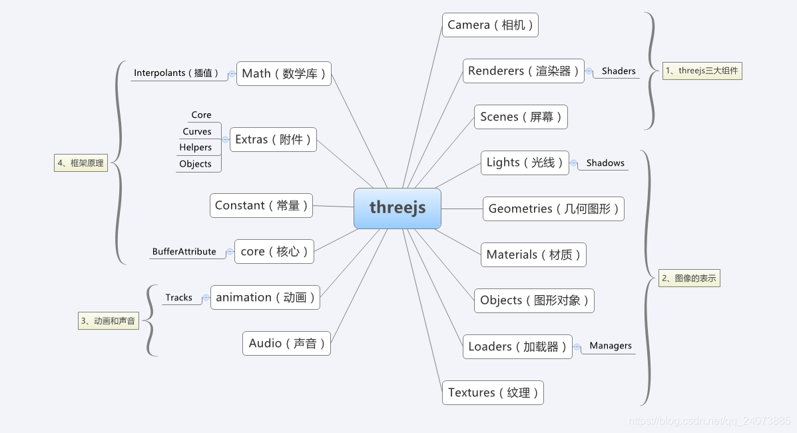
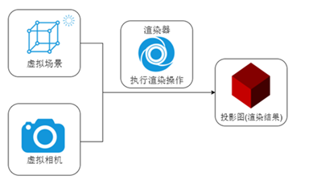
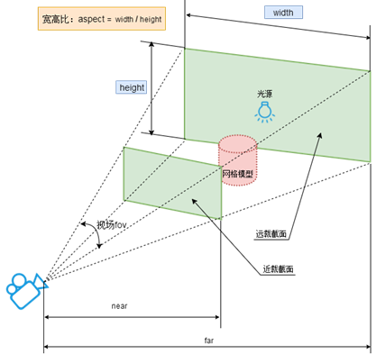
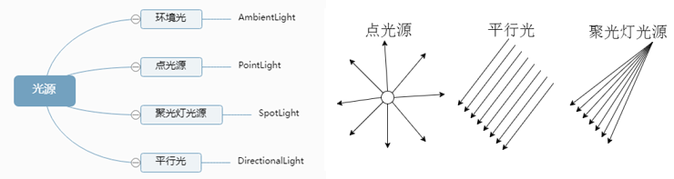

[Treejs学习](#top)

- [概览](#概览)
- [Three.js制作3D的五要素](#threejs制作3d的五要素)
  - [场景（scene）](#场景scene)
  - [相机（camera）](#相机camera)
    - [1）位置属性position](#1位置属性position)
    - [2) 观察目标lookAt()](#2-观察目标lookat)
    - [3）up属性，结果朝向](#3up属性结果朝向)
    - [4）相机视野范围：视椎体](#4相机视野范围视椎体)
  - [渲染器（renderer）](#渲染器renderer)
  - [光源（light）](#光源light)
    - [1）环境光AmbientLight](#1环境光ambientlight)
    - [2）其他发光光源：点光源、平行光、聚光](#2其他发光光源点光源平行光聚光)
    - [3）点光源辅助PointLightHelper](#3点光源辅助pointlighthelper)
  - [物体（object）](#物体object)
    - [顶点概念、几何体结构](#顶点概念几何体结构)
    - [几何体对象、三维建模](#几何体对象三维建模)
    - [材质对象](#材质对象)
  - [模型对象](#模型对象)
  - [纹理贴图](#纹理贴图)
- [ThreeJS and Angular](#threejs-and-angular)

-----------------------------------------------------------
demo-elementary-r73-2018-10

## 概览

1. Three.JS是基于WebGL的Javascript开源框架，简言之，就是能够实现3D效果的JS库
2. WebGL WebGL是一种Javascript的3D图形接口，把JavaScript和OpenGL ES 2.0结合在一起
3. OpenGL OpenGL是开放式图形标准，跨编程语言、跨平台，Javascript、Java 、C、C++ 、 python 等都能支持OpenGL，OpenGL的Javascript实现就是WebGL，另外很多CAD制图软件都采用这种标准。OpenGL ES 2.0是OpenGL的子集，针对手机、游戏主机等嵌入式设备而设计
4. Canvas Canvas是HTML5的画布元素，在使用Canvas时，需要用到Canvas的上下文，可以用2D上下文绘制二维的图像，也可以使用3D上下文绘制三维的图像，其中3D上下文就是指WebGL



[⬆ back to top](#top)

## Three.js制作3D的五要素

- 桌面浏览器兼容性: 基本上所有的现代浏览器都支持
  - Firefox：4.0 版本后开始支持
  - Chrome：9.0 版本后开始支持
  - Safari：5.1 版本后开始支持
  - Opera：12.00 版本后开始支持
  - IE：IE11 起才开始支持（唯一一个很长时间都不支持 WebGL 的浏览器）
- 移动设备兼容性
  - Android：Android原生的浏览器是不支持WebGL的。如果想在Android上运行WebGL，需要安装最新的移动版本的Chrome、Firefox 或者Opera
  - iOS：从iOS8起就开始支持
  - Windows mobile：从8.1版本后开始支持
- 渲染器（render）, 场景（scene）, 照相机（camera）, 光源（light）, 物体（object）



### 场景（scene）

`const scene = new THREE.Scene();`

[⬆ back to top](#top)

### 相机（camera）

-  实例化一个透视投影相机对象: `const camera = new THREE.PerspectiveCamera();`
   - 模拟人眼观察这个世界的规律，远小近大，距离越远看着越小，距离越近看着越大
- （1）位置属性position

#### 1）位置属性position

```typescript
// 相机在Three.js三维坐标系中的位置
// 根据需要设置相机位置具体值(x,y,z)
camera.position.set(200, 200, 200);
```

#### 2) 观察目标lookAt()

- 相机拍照你需要控制相机的拍照目标，具体说相机镜头对准哪个物体或说哪个坐标。对于threejs相机而言，就是设置`lookAt()`方法的参数，指定一个3D坐标
-** 注意：如果OrbitControls有target属性，则相机的lookAt属性就失效了**

```typescript
/相机观察目标指向Threejs 3D空间中某个位置
camera.lookAt(0, 0, 0); //坐标原点
camera.lookAt(mesh.position);//指向mesh对应的位置
```

#### 3）up属性，结果朝向

```typescript
//默认是( 0, 1, 0 )，默认是y轴朝上
//现在改成z轴朝上
camera.up.set(0, 0, 1)
```

#### 4）相机视野范围：视椎体

- 透视投影相机的四个参数**fov, aspect, near, far**构成一个四棱台3D空间，被称为视锥体，只有视锥体之内的物体，才会渲染出来，视锥体范围之外的物体不会显示在Canvas画布上
- 

```typescript
// width和height用来设置Three.js输出的Canvas画布尺寸(像素px)
const width = 800; //宽度
const height = 500; //高度
//构造器(视野角度fov：默认50, Canvas画布宽高比aspect：默认是1, 近裁截面距离near：默认0.1, 远裁截面距离far：默认2000)
const camera = new THREE.PerspectiveCamera(30, width / height, 1, 3000);
```

[⬆ back to top](#top)

### 渲染器（renderer）

- threejs就需要WebGL渲染器`WebGLRenderer`
- 渲染器`WebGLRenderer`执行渲染方法`.render()`就可以生成一个Canvas画布(照片)，并把三维场景Scene呈现在canvas画布上面

```typescript
// 创建渲染器对象
const renderer = new THREE.WebGLRenderer();
// 定义threejs输出画布的尺寸(单位:像素px)
const width = 800; //宽度
const height = 500; //高度
renderer.setSize(width, height); //设置three.js渲染区域的尺寸(像素px)

renderer.render(scene, camera); //执行渲染操作
//Canvas画布插入到div元素中
document.getElementById('webgl').appendChild(renderer.domElement);
/* 渲染器锯齿模糊设置 */
// 获取你屏幕对应的设备像素比.devicePixelRatio告诉threejs,以免渲染模糊问题
// 不同硬件设备的屏幕的设备像素比window.devicePixelRatio值可能不同
renderer.setPixelRatio(window.devicePixelRatio);//设置设备像素比
renderer.setClearColor(0x444444, 1); //设置背景颜色
renderer.antialias = true,  //抗锯齿，平滑
```

[⬆ back to top](#top)

### 光源（light）

- threejs提供的网格材质，有的受光照影响，有的不受光照影响
  - 基础网格材质[MeshBasicMaterial](https://threejs.org/docs/index.html?q=MeshBasicMaterial#api/zh/materials/MeshBasicMaterial)不会受到光照影响(有光源和没有光源，它都会显示颜色和材质)。
  - 漫反射网格材质[MeshLambertMaterial](https://threejs.org/docs/index.html?q=MeshLambertMaterial#api/zh/materials/MeshLambertMaterial)会受到光照影响(如果没有光源，它就是暗的，不会显示颜色和材质)，该材质也可以称为Lambert网格材质，音译为兰伯特网格材质。不同面和光线夹角不同，立方体不同面就会呈现出来不同的明暗效果。
  - 高光(镜面)网格材质[MeshPhongMaterial]()可以提供一个高光反射效果。在太阳下面观察一辆车，你会发现在特定角度和位置，你可以看到车表面某个局部区域非常高亮。（高光亮度属性.shininess，高光颜色属性.specular）
  - 
- 光源对象
  - 环境光：没有特定的方向，只有颜色。不会产生阴影，可以理解为全局的背景色
  - 点光源：由一个点散发的光，类似于蜡烛，可以设置阴影
  - 平行光：从一个方向平行照射的光，类似于阳光，可以设置阴影
- 

#### 1）环境光AmbientLight

环境光AmbientLight没有特定方向，只是整体改变场景的光照明暗

```typescript
//环境光:没有特定方向，整体改变场景的光照明暗
const ambient = new THREE.AmbientLight(0xffffff, 0.4);
scene.add(ambient);
```

#### 2）其他发光光源：点光源、平行光、聚光

```typescript
//点光源：两个参数分别表示光源颜色和光照强度
// 参数1：0xffffff是纯白光,表示光源颜色
// 参数2：1.0,表示光照强度，可以根据需要调整
const pointLight = new THREE.PointLight(0xffffff, 1.0);
//点光源位置
pointLight.position.set(400, 0, 0);//点光源放在x轴上
scene.add(directionalLight); //点光源添加到场景中
// 平行光
const directionalLight = new THREE.DirectionalLight(0xffffff, 1);
// 设置光源的方向：通过光源position属性和目标指向对象的position属性计算
directionalLight.position.set(80, 100, 50);
// 方向光指向对象网格模型mesh，可以不设置，默认的位置是0,0,0
directionalLight.target = mesh;
scene.add(directionalLight);
```

#### 3）点光源辅助PointLightHelper

```typescript
// 光源辅助
const pointLightHelper = new THREE.PointLightHelper(pointLight, 10);
scene.add(pointLightHelper);
```

[⬆ back to top](#top)

### 物体（object）

#### 顶点概念、几何体结构

- 顶点概念
  - ThreeJs中有个物体元素的基类，通过设置顶点的个数来呈现不同的几何体，一个顶点一般是三个参数即xyz的坐标点，如果设置两个参数，则z轴默认为0 
  - ThreeJs中所有的模型都是通过顶点来构成的。比如：线模型（两个顶点），网格模型的基本单位三角形（三个顶点）
  - 同时顶点可以有颜色值，还有顶点法向量（光照影响）
- 几何体结构：立方体网格模型Mesh是由立方体几何体geometry和材质material两部分构成，立方体几何体BoxGeometry本质上就是一系列的顶点构成，只是Threejs的APIBoxGeometry把顶点的生成细节封装了，用户可以直接使用

```typescript
var geometry = new THREE.BoxGeometry(100, 100, 100); //创建一个立方体几何对象Geometry
var material = new THREE.MeshLambertMaterial({
  color: 0x0000ff
}); //材质对象Material
var mesh = new THREE.Mesh(geometry, material); //网格模型对象Mesh
```

**几何体对象**

|几何体对象|区别|场景|
|---|---|---|
|Geometry|顶点数据用一个对象表示|适用于一般案例场景|
|BufferGeometry|顶点数据使用类型化数组集中表示|适用于实际应用场景，使用 BufferGeometry 可以有效减少向 GPU 传输上述数据所需的开销|

**几何体结构**

|几何体结构|属性|旋转、缩放、平移|
|---|---|---|
|Geometry|vertices（位置），colors（颜色），face3（每个三角面属性）|改变几何体的顶点位置数据|
|BufferGeometry|attributes（属性，包括position，color，normal... ），index （索引，便于重复使用顶点）|改变几何体的顶点位置数据|

#### 几何体对象、三维建模

- 基类Geometry：BoxGeometry、CylinderGeometry、SphereGeometry

|类型|Geometry|BufferGeometry|
|---|---|---|
|长方体|BoxGeometry|BoxBufferGeometry|
|圆柱体|CylinderGeometry|CylinderBufferGeometry|
|球体|SphereGeometry|SphereBufferGeometry|
|圆锥|SphereGeometry|SphereBufferGeometry|
|正四面体|TetrahedronGeometry|TetrahedronBufferGeometry|
|正八面体|OctahedronGeometry|OctahedronBufferGeometry|
|正十二面体|OctahedronGeometry|OctahedronBufferGeometry|
|正二十面体|DodecahedronGeometry|DodecahedronBufferGeometry|
|圆平面|CircleGeometry|CircleBufferGeometry|
|矩形平面|PlaneGeometry|PlaneBufferGeometry|

[⬆ back to top](#top)

#### 材质对象

材质就像是物体的皮肤，决定物体外表的样子，例如物体的颜色，看起来是否光滑，是否有贴图等等。

- 本质： 顶点着色器、片元着色器代码、unifomrs数据
- 分类：点材质、线材质、网格材质、精灵材质、自定义着色器材质
- 常用网格材质：
  - 网格基础材质(MeshBasicMaterial) 该材质不受光照的影响，不需要光源即可显示出来，设置颜色后，各个面都是同一个颜色
  - 网格法向材质(MeshNormalMaterial) 该材质不受光照的影响，不需要光源即可显示出来，并且每个方向的面的颜色都不同，同但一个方向的面颜色是相同的，该材质一般用于调试。
  - 网格朗博材质(MeshLambertMaterial)  该材质会受到光照的影响，没有光源时不会显示出来，用于创建表面暗淡，不光亮的物体
  - 网格 Phong 材质(MeshPhongMaterial)  该材质会受到光照的影响，没有光源时不会显示出来，用于创建光亮的物体

```typescript
var material = new THREE.MeshPhongMaterial({
      color: "yellow" //设置颜色为yellow
});
//创建物体
var cube = new THREE.Mesh(geometry, material);
```

[⬆ back to top](#top)

### 模型对象

|类型|特性|渲染方式|
|---|---|---|
|点模型|几何体的每个顶点，可以设置大小|每个顶点对应位置都会渲染出来一个方形的点区域|
|线模型|两个顶点构成一线条，可以设置大小，变换位置|从第一个点开始到最后一个点，依次连成线|
|网格模型|三个顶点构成一个三角面，可以设置大小，变换位置|顶点每三个顶点为一组可以确定一个三角形，顶点可以重复使用|

[⬆ back to top](#top)

### 纹理贴图

- 贴图是通过将图像应用到对象的一个或多个面，来为3D对象添加细节的一种方法, 而无需将这些细节建模到我们的3D对象中，从而大大精简3D模型的多边形边数，提高模型渲染性能
- 
- 应用场景：
  - 全景贴图，比如：3D地球贴图，天空盒子贴图
  - 添加文字，视频 比如：在大楼上加横幅，地板上加文字之类的，通过canvas绘制好图，通过uv映射原理贴到几何体上面。
  - 3D美术贴图，流程：3D美术创建好模型和纹理贴图--->程序员解析3D美术导出的资源-→纹理映射到几何体上面（一般美术导出的模型都会解析好，程序员只用解析显示就好了）

[⬆ back to top](#top)

## ThreeJS and Angular


> references
- [threeJs官网](https://threejs.org/)
- [threeJs源码github](https://github.com/mrdoob/three.js)
- [threeJs官方API文档](https://threejs.org/docs/index.html#manual/zh/introduction/Creating-a-scene)
- [threeJs官方入门教程](https://threejs.org/manual/#zh/fundamentals)
- [threeJs官网案例](https://threejs.org/examples/#webgl_animation_keyframes)
- [threeJs零基础入门教程(更新中)](http://www.webgl3d.cn/)
- [WebGL零基础入门教程](http://www.webgl3d.cn/WebGL/)
- [three.js教程1-快速入门](https://www.cnblogs.com/tiandi/p/17053774.html)
**
