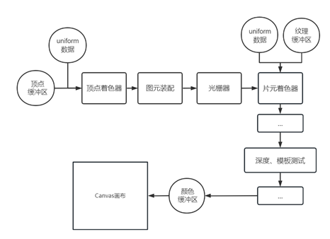

[WebGL渲染管线rendering pipeline in WebGL](#top)

- [着色器GLSL ES语言](#着色器glsl-es语言)
  - [GLSL ES基础数据类型](#glsl-es基础数据类型)
  - [变量/常量](#变量常量)
  - [声明函数](#声明函数)
  - [语句](#语句)
  - [向量](#向量)
  - [内置变量](#内置变量)
- [创建WebGL Canvas画布](#创建webgl-canvas画布)
- [顶点着色器](#顶点着色器)
- [片元着色器](#片元着色器)
- [编译着色器-程序对象](#编译着色器-程序对象)

-------------------------------------------

渲染管线想象为显卡GPU上的一条流水线，渲染管线上有不同的功能单元

## 着色器GLSL ES语言

### GLSL ES基础数据类型

|关键字|数据类型|值|
|---|---|---|
|bool|布尔值	|布尔变量值为true或false|
|int|	整型数	|值为整数，比如0,1,2,3...|
|float|	单精度浮点数	|浮点数用小数点表示，比如0.6,3.14,2.8|

### 变量/常量

```javascript
int count = 10;   // 整型变量
float num = 10.0;   // 浮点数变量
bool lightBool = true;  // 声明一个布尔值变量
// 通过关键字const声明一个常量
const int count = 10;      // 着色器语言定义一个整形常量
const float count = 10.0;  // 定义一个浮点数常量10.0
```

### 声明函数

```javascript
float add(float x,float y){
  return x + y
}
// 声明一个无返回值函数,函数前面用void关键字即可
void main(){
  float x = 10.0;
}
```

### 语句

- if语句、for语句的使用，和javascript语言、C语言中的if语句、for语句执行逻辑规则基本一致
- continue和break关键字和JavaScript语言习惯也是相似的

### 向量

在GLSL ES中，向量可以表示多种数据，也能进行多种数学运算
- `vec3`、`vec4`关键字和`int`、`float`一样也是用来表示数据的类型，`vec3`表示三维向量、`vec4`表示四维向量
  1. 向量表示颜色: `vec4 color = vec4(1.0, 0.0, 0.0, 1.0);//红色不透明, 四维向量有四个分量，可以用来表示颜色的R、G、B、A`
  2. 向量表示顶点位置坐标: 
     1. `vec3 pos = vec3(1.0, 2.0, 3.0);` - 三维向量vec3表示变量pos具有三个分量，可以用来表示顶点的xyz坐标
     2. `vec4 pos = vec4(1.0, 2.0, 3.0,1.0);` - 用四维向量vec4表示齐次坐标，所谓齐次坐标，就是在GLSL ES中表示一个顶点坐标的的时候，增加一个分量，1.0表示

|关键字	|数据类型|
|---|---|
|vec2	|三维向量 ，具有xyz三个分量，分量是浮点数|
|vec4	|四维向量 ，具有xyzw四个分量，分量是浮点数|
|ivec2	|二维向量，分量是整型数|
|ivec3	|三维向量 ，分量是整型数|
|ivec4	|四维向量 ，分量是整型数|
|bvec2	|二维向量，分量是布尔值bool|
|bvec3	|三维向量 ，分量是布尔值bool|
|bvec4	|四维向量 ，分量是布尔值bool|

**三维向量转化**

```javascript
//一个三维向量转化为四维向量
vec3 pos = vec3(1.0, 2.0, 3.0);
vec4 newPos = vec4(pos, 1.0);
//一个二维向量转化为四维向量
vec2 pos = vec2(1.0, 2.0);
vec4 newPos = vec4(pos, 3.0,1.0);
```

[⬆ back to top](#top)

### 内置变量

- 参见： [gl-official](https://docs.gl/sl4/gl_ClipDistance)
- 如：
  - `gl_PointSize`：点渲染像素大小，数据类型浮点数float
  - `gl_Position`：顶点坐标，数据类型四维向量vec4
  - `gl_FragColor`：像素颜色，数据类型四维向量vec4

[⬆ back to top](#top)

## 创建WebGL Canvas画布

- `<canvas id="webgl" width="500" height="500" style="background: #000;"></canvas>`
- 通过`getElementById()`方法获取canvas画布对象
- 通过方法`.getContext()`获取WebGL上下文,然后你就可以通过返回的对象gl调用WebGL API，实现3D绘图
  - [webGL API-Instance methods](https://developer.mozilla.org/en-US/docs/Web/API/WebGLRenderingContext/drawArrays)

```javascript
const gl = canvas.getContext('webgl');
gl.drawArrays();
gl.createShader();
gl.shaderSource();
gl.compileShader();
gl.createProgram();
gl.attachShader();
gl.linkProgram();
gl.useProgram();
```

[⬆ back to top](#top)

## 顶点着色器


- 顶点着色器代码就是在GPU上的顶点着色器功能单元执行

```javascript
// 用模板字符串``放着色器GLSL ES代码（着色器代码）
const vertexShaderSource = `这里面写着色器GLSL ES代码`
// 按照着色器语言习惯，创建一个名为main的主函数，前面使用关键字void类似C语言的语法，表示没有返回值
const vertexShaderSource = `
    void main(){                      
        gl_PointSize = 20.0;
        gl_Position = vec4(0.0,0.0,0.0,1.0);
    }
`
```

## 片元着色器


- 片元着色器代码在GPU上的片元着色器功能单元执行
  
```javascript
const fragShaderSource = `
    void main(){
        // 红色
        gl_FragColor = vec4(1.0,0.0,0.0,1.0);
    }    
`
// gl_FragColor, 设置片元(像素)颜色, 四维向量vec4，前面三个参数是颜色RGB值，第四个参数是透明度值
```

[⬆ back to top](#top)

## 编译着色器-程序对象

顶点着色器、片元着色器代码如果想在GPU上执行，需要先通过WebGL API进行编译处理，并创建一个程序对象program(initShader)
- 程序对象initShader处理好着色器代码，在网页上还不能看到渲染效果，还需要通过一个绘制的API如[gl.drawArrays()](https://developer.mozilla.org/zh-CN/docs/Web/API/WebGLRenderingContext/drawArrays)来执行绘制
- `gl.drawArrays(mode, first, count);`
  - mode表示绘制模式，有多种模式，gl.POINTS表示绘制形式是点
  - first表示从第几个点开始绘制
  - count表示总共有多少点

```javascript
//初始化着色器
const program = initShader(gl, vertexShaderSource, fragShaderSource);
//开始绘制，显示器显示结果
gl.drawArrays(gl.POINTS, 1, 3);
//声明初始化着色器函数
function initShader(gl, vertexShaderSource, fragmentShaderSource) {
    //创建顶点着色器对象
    const vertexShader = gl.createShader(gl.VERTEX_SHADER);
    //创建片元着色器对象
    const fragmentShader = gl.createShader(gl.FRAGMENT_SHADER);
    //引入顶点、片元着色器源代码
    gl.shaderSource(vertexShader, vertexShaderSource);
    gl.shaderSource(fragmentShader, fragmentShaderSource);
    //编译顶点、片元着色器
    gl.compileShader(vertexShader);
    gl.compileShader(fragmentShader);
    //创建程序对象program
    const program = gl.createProgram();
    //附着顶点着色器和片元着色器到program
    gl.attachShader(program, vertexShader);
    gl.attachShader(program, fragmentShader);
    //链接program
    gl.linkProgram(program);
    //使用program
    gl.useProgram(program);
    //返回程序program对象
    return program;
}
```

[⬆ back to top](#top)

> references
- [WebGL教程](http://www.webgl3d.cn/pages/9bc0db/)
- [WebGL Tutorial](https://www.tutorialspoint.com/webgl/index.htm)
- [offical document for OpenGL and GLSL](https://docs.gl/)
- [WebGL official](https://www.khronos.org/webgl/)
- https://github.com/KhronosGroup/WebGL
- [WebGL: 2D and 3D graphics for the web - Web APIs(MDN)](https://developer.mozilla.org/en-US/docs/Web/API/WebGL_API)
