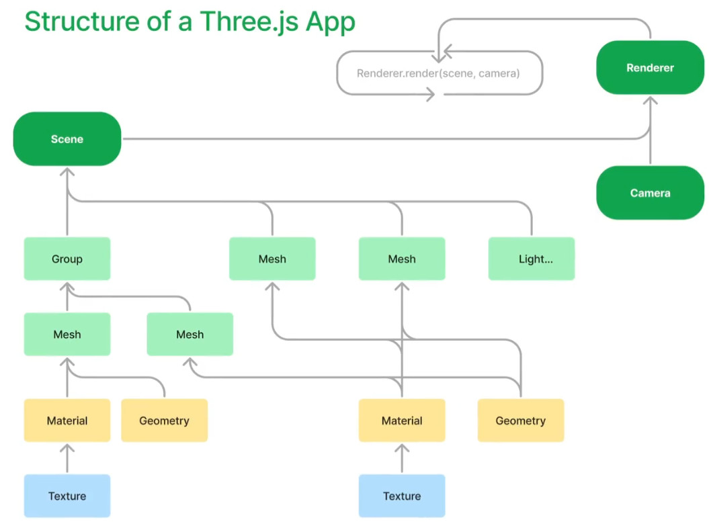

```
│   ├── WebGL/
│   │   ├── 3D几何变换数学基础.md
│   │   ├── demo-elementary-r73-2018-10/
│   │   ├── ThreeJS-study-notebook-2023版.md
│   │   └── WebGL渲染管线rendering pipeline in WebGL.md

```


WebGL 是一种基于 JavaScript 的 API，用于创建交互式 3D 图形和动画，并且可以在 web 浏览器中运行。为了掌握 WebGL，需要以下知识：

1. JavaScript 编程语言。
2. 3D 图形学的基本知识，如坐标系、矩阵、着色器和材质等。
3. WebGL API 的基本使用，包括创建画布、着色器、程序、缓冲区等。
4. 了解 WebGL 的渲染过程和管道，包括顶点处理、三角形剪裁、光照、纹理映射等。
5. 掌握 WebGL 编程中常用的库和框架，如 Three.js、Babylon.js 等。
6. 熟悉浏览器的调试工具，能够查看和调试 WebGL 应用程序的运行状态和性能问题。



## ThreeJS

- [Three.js](https://threejs.org/)
- [threejs 官方文档](https://threejs.org/docs/#manual/zh/introduction/Creating-a-scene)
- [Three.js中文教程](https://techbrood.com/threejs/docs/)
- [Three.js and TypeScript Tutorials](https://sbcode.net/threejs/)
- [Migration Guide](https://github.com/mrdoob/three.js/wiki/Migration-Guide)
- [threejs+angular 实现面积测量](https://blog.csdn.net/u013172864/article/details/89704868)
- [使用React+Three.js 封装一个三维地球](https://blog.csdn.net/future_todo/article/details/78072615)
- [Three.js 快速上手以及在 React 中运用[转]](https://www.cnblogs.com/mazhenyu/p/11834700.html)- https://github.com/zrysmt/react-threejs-app
- [Hello React And Three.js](https://zhuanlan.zhihu.com/p/450900050)

## WebGL

- [WebGL by example in MDN](https://developer.mozilla.org/en-US/docs/Web/API/WebGL_API/By_example)
- [WebGL中文网](http://www.hewebgl.com/)：是国内领先的 WebGL 学习网站，提供了 WebGL 入门教程、实战案例、书籍推荐等资源。
- [webgl3d.cn](http://www.webgl3d.cn/)：该网站提供了丰富的 WebGL 教程和案例，包括基础知识、渲染器、模型、动画等方面。
- [前端乱炖](https://www.html5rocks.com/zh/tutorials/webgl/webgl_fundamentals/)：是一个前端开发者社区，提供了有关 WebGL 的基础知识和实践经验。
- [网易云课堂](https://study.163.com/courses-search?keyword=webgl)：提供了多个有关 WebGL 的视频课程，适合初学者和进阶者。
- [慕课网](https://www.imooc.com/search/?words=webgl)：该网站提供了多个有关 WebGL 的视频课程和实战项目，适合初学者和进阶者。
- [WebGL Academy](https://www.webglacademy.com/)

## github

- [WebGL Samples](https://github.com/WebGLSamples)
- https://github.com/mrdoob/three.js/tree/dev/examples
- [mdn-webgl-examples](https://github.com/idofilin/webgl-by-example/tree/master)
- https://github.com/Sean-Bradley
- https://github.com/pmndrs/react-three-fiber
