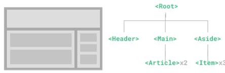
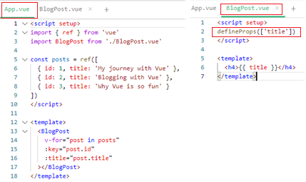
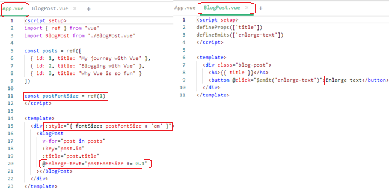
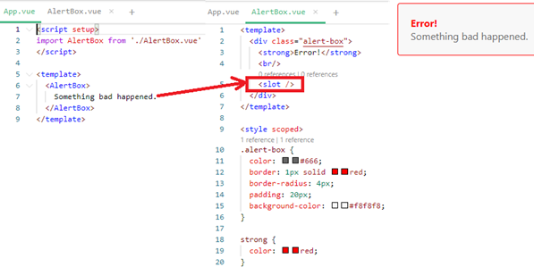
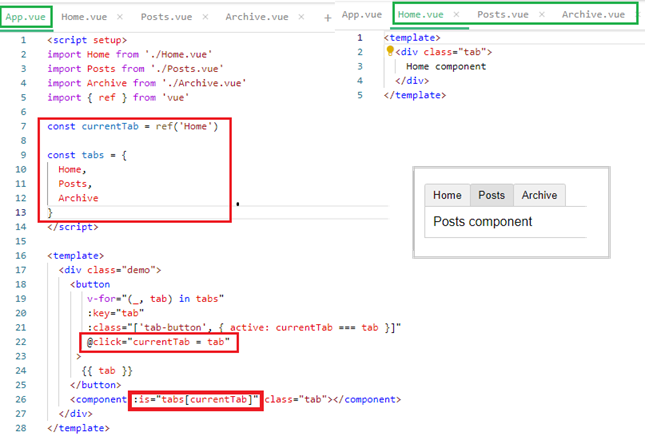
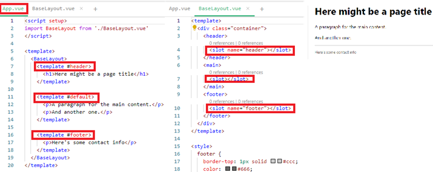
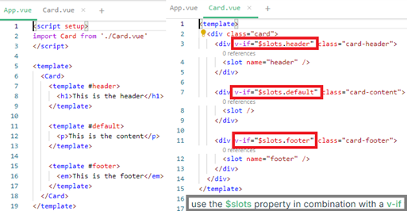
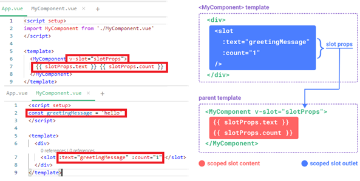

[Vue3基础01--Components](#top)

- [Passing Props: father -\> child](#passing-props-father---child)
- [Listening to Events: child -\> father](#listening-to-events-child---father)
- [With Slot](#with-slot)
- [Dynamic Components](#dynamic-components)
- [Slots](#slots)
  - [Named Slots](#named-slots)
  - [Conditional Slots](#conditional-slots)
  - [Dynamic Slot Names](#dynamic-slot-names)
  - [Scoped Slots](#scoped-slots)
- [Async Components](#async-components)

-------------------------------------------------------------



## Passing Props: father -> child



## Listening to Events: child -> father



## With Slot



## Dynamic Components

- `:is` attribute
- 

[⬆ back to top](#top)

## Slots

### Named Slots



### Conditional Slots



### Dynamic Slot Names

- [Dynamic directive arguments](https://vuejs.org/guide/essentials/template-syntax#dynamic-arguments) also work on v-slot

```html
<base-layout>
  <template v-slot:[dynamicSlotName]>
    ...
  </template>
  <!-- with shorthand -->
  <template #[dynamicSlotName]>
    ...
  </template>
</base-layout>
```

### Scoped Slots



## Async Components

- `defineAsyncComponent` function
- `<Suspense>`

```ts
// Loading and Error States
import { defineAsyncComponent } from 'vue'
const AsyncComp = defineAsyncComponent({
  loader: () => import('./Foo.vue'),
  loadingComponent: LoadingComponent,
  delay: 200,
  errorComponent: ErrorComponent,
  timeout: 3000
})
// registered globally using app.component()
app.component('AsyncComp', defineAsyncComponent(() =>
  import('./components/AsyncComp.vue')
))
```

[⬆ back to top](#top)
