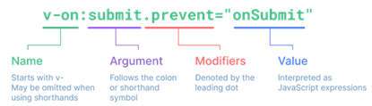

[Vue Essentials](#top)

- [Template Syntax](#template-syntax)
  - [List Rendering](#list-rendering)
  - [Conditional Rendering](#conditional-rendering)
- [Event Handling](#event-handling)
  - [Inline Handlers](#inline-handlers)
  - [Method Handlers](#method-handlers)
  - [Key Modifiers](#key-modifiers)
- [Class and Style Bindings](#class-and-style-bindings)
  - [Binding HTML Classes](#binding-html-classes)
  - [Binding Inline Styles](#binding-inline-styles)
- [Form Input Bindings](#form-input-bindings)
  - [Modifiers](#modifiers)

-------------------------------------------------------------

## Template Syntax

|||
|---|---|
|Text Interpolation|`<span>Message: {{ msg }}</span>`|
|Raw HTML-`v-html`|`<p>Using text interpolation: {{ rawHtml }}</p>`<br>`<p>Using v-html directive: <span v-html="rawHtml"></span></p>`|
|Attribute Bindings|`<div :id="dynamicId"></div>`|
|Boolean Attributes|`<button :disabled="isButtonDisabled">Button</button>`|
|Dynamically Binding Multiple Attributes|`const objectOfAttrs = {`id: 'container',`class: 'wrapper',style: 'background-color:green'}`<br>`<div v-bind="objectOfAttrs"></div>`|
|JavaScript Expressions|`<div :id="`list-${id}`"></div>`|
|Calling Functions|`<time :title="toTitleDate(date)" :datetime="date"> {{ formatDate(date) }}</time>`|
|Directives|such as `v-for`, `v-on` and `v-slot`|
|Modifiers|`<form @submit.prevent="onSubmit">...</form>`|

- 
- [Built-in Directives](https://vuejs.org/api/built-in-directives)

### List Rendering

- `v-for`
- Array Change Detection:
  - `push(),pop(), shift(), unshift(),splice(), sort(), reserve()`
- Replacing an Array:
  - `filter(), concat(), slice()`

### Conditional Rendering

- `v-if, v-else, v-else-if, v-show`

[⬆ back to top](#top)

## Event Handling

### Inline Handlers

`<button @click="count++">Add 1</button>`

### Method Handlers

```ts
const name = ref('Vue.js')
function greet(event) {      // `event` is the native DOM event
  alert(`Hello ${name.value}!`)
  if (event) {
    alert(event.target.tagName)
  }
}
<button @click="greet">Greet</button>
```

### Key Modifiers

- Key Aliases
  - `.enter`
  - `.tab`
  - `.delete` (captures both "Delete" and "Backspace" keys)
  - `.esc`
  - `.space`
  - `.up`
  - `.down`
  - `.left`
  - `.right`
- System Modifier Keys
  - `.ctrl`
  - `.alt`
  - `.shift`
  - `.meta`
- Mouse Button Modifiers
  - `.left`
  - `.right`
  - `.middle`

```html
<!-- only call `submit` when the `key` is `Enter` -->
<input @keyup.enter="submit" />
<!-- Alt + Enter -->
<input @keyup.alt.enter="clear" />
<!-- Ctrl + Click -->
<div @click.ctrl="doSomething">Do something</div>
```

[⬆ back to top](#top)

## Class and Style Bindings

### Binding HTML Classes

- `<div :class="{ active: isActive }"></div>`
1. if want bind object, it need bind to a computed property that returns an object
2. Binding to Arrays
3. You can mix the array and object syntax for ultimate flexibility!
   1. `<div :class="[{ active: isActive }, errorClass]"></div>`

```ts
//1)
const classObject = reactive({
  active: true,
  'text-danger': false
})
<div :class="classObject"></div>
// This will render:
<div class="active"></div>
// The correct way is using computed
const isActive = ref(true)
const error = ref(null)
const classObject = computed(() => ({
  active: isActive.value && !error.value,
  'text-danger': error.value && error.value.type === 'fatal'
}))
<div :class="classObject"></div>
//2) Binding to Arrays
const activeClass = ref('active')
const errorClass = ref('text-danger')
<div :class="[activeClass, errorClass]"></div>
```

### Binding Inline Styles

- `:style`
- can bind to a style object directly
- can bind :style to an array of multiple style objects
- Multiple Values

```ts
// using :style
const activeColor = ref('red')
const fontSize = ref(30)
<div :style="{ color: activeColor, fontSize: fontSize + 'px' }"></div>
// It is can bind to a style object directly
const styleObject = reactive({
  color: 'red',
  fontSize: '30px'
})
<div :style="styleObject"></div>
// can bind :style to an array of multiple style objects
<div :style="[baseStyles, overridingStyles]"></div>
//Multiple Values: it will only render the last value in the array which the browser supports
<div :style="{ display: ['-webkit-box', '-ms-flexbox', 'flex'] }"></div>
```

[⬆ back to top](#top)

## Form Input Bindings

|||
|---|---|
|Text|`<input v-model="message" placeholder="edit me">`|
|Multiline text|`<textarea v-model="message" placeholder="add multiple lines"></textarea>`|
|Checkbox|`<input type="checkbox" id="checkbox" v-model="checked" />`|
|Multiline Checkbox|`const checkedNames = ref([])`<br>`<div>Checked names: {{ checkedNames }}</div>`<br>`<input type="checkbox" id="john" value="John" v-model="checkedNames" />`<br>`<input type="checkbox" id="jack" value="Jack" v-model="checkedNames" />`|
|Radio|`<input type="radio" id="one" value="One" v-model="picked" />`|
|Multiline Radio|同上|
|Select|`<select v-model="selected">`<br>` <option disabled value="">Please select one</option>`<br>` <option>A</option>`<br>` <option>B</option>`<br>`</select>`|

```ts
const selected = ref('A')
const options = ref([
  { text: 'One', value: 'A' },
  { text: 'Two', value: 'B' },
  { text: 'Three', value: 'C' }
])
<select v-model="selected">
  <option v-for="option in options" :value="option.value">
    {{ option.text }}
  </option>
</select>
<div>Selected: {{ selected }}</div>
```

### Modifiers

|||
|---|---|
|`<input v-model.lazy="msg" />`| synced after "change" instead of "input"|
|`<input v-model.number="age" />`||
|`<input v-model.trim="msg" />`|input to be trimmed automatically|

[⬆ back to top](#top)
