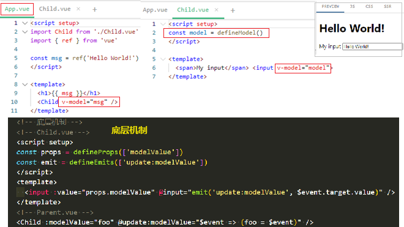

[Vue3基础04--v-model](#top)

- [基本用法](#基本用法)
- [多个 v-model 绑定](#多个-v-model-绑定)
- [v-model 修饰符](#v-model-修饰符)
  - [内置的修饰符](#内置的修饰符)
  - [自定义修饰符](#自定义修饰符)
  - [带参数的 v-model 修饰符](#带参数的-v-model-修饰符)

---------------------------------------------

v-model 可以在组件上使用以实现双向绑定

## 基本用法

- 从 **Vue 3.4** 开始，推荐的实现方式是使用 `defineModel()` 宏
- `defineModel(`) 返回的值是一个 `ref`
  - 它的 `.value` 和父组件的 `v-model` 的值同步；
  - 当它被子组件变更了，会触发父组件绑定的值一起更新
- 

```vue
<!-- 底层机制 -->
<!-- Child.vue -->
<script setup>
const props = defineProps(['modelValue'])
const emit = defineEmits(['update:modelValue'])
</script>
<template>
  <input :value="props.modelValue" @input="emit('update:modelValue', $event.target.value)" />
</template>
<!-- Parent.vue -->
<Child :modelValue="foo" @update:modelValue="$event => (foo = $event)" />
```

[⬆ back to top](#top)

## 多个 v-model 绑定

组件上的每一个 v-model 都会同步不同的 prop，而无需额外的选项

```vue
<UserName v-model:first-name="first" v-model:last-name="last" />
<!-- child component -->
<script setup>
const firstName = defineModel('firstName')
const lastName = defineModel('lastName')
</script>
<template>
  <input type="text" v-model="firstName" />
  <input type="text" v-model="lastName" />
</template>
```

[⬆ back to top](#top)

## v-model 修饰符

### 内置的修饰符

- [内置的修饰符](https://cn.vuejs.org/guide/essentials/forms.html#modifiers)

|modifiers |   |
|---|---|
| `.lazy` |默认情况下，v-model 会在每次 input 事件后更新数据, <br>lazy 修饰符在每次 `change` 事件后更新数据|
|`.number`|number 修饰符会在输入框有 `type="number"` 时自动启用|
|`.trim`|自动去除用户输入内容中两端的空格|

### 自定义修饰符

capitalize (首字母大写) 修饰符

```vue
<script setup>
const [model, modifiers] = defineModel({
  set(value) {
    if (modifiers.capitalize) {
      return value.charAt(0).toUpperCase() + value.slice(1)
    }
    return value
  }
})
</script>
<template>
  <input type="text" v-model="model" />
</template>
<!-- using -->
<MyComponent v-model.capitalize="myText" />
```

[⬆ back to top](#top)

### 带参数的 v-model 修饰符

```vue
<UserName v-model:first-name.capitalize="first" v-model:last-name.uppercase="last" />
<!-- child component -->
<script setup>
const [firstName, capitalize] = defineModel('firstName')
const [lastName, uppercase] = defineModel('lastName')
console.log(capitalize) // { capitalize: true }
console.log(uppercase) // { uppercase: true }
</script>
<!-- 3.4 之前的用法 -->
<script setup>
const props = defineProps({
  firstName: String,
  lastName: String,
  firstNameModifiers: { default: () => ({}) },
  lastNameModifiers: { default: () => ({}) }
})
defineEmits(['update:firstName', 'update:lastName'])
console.log(props.firstNameModifiers) // { capitalize: true }
console.log(props.lastNameModifiers) // { uppercase: true }
</script>
```

[⬆ back to top](#top)
