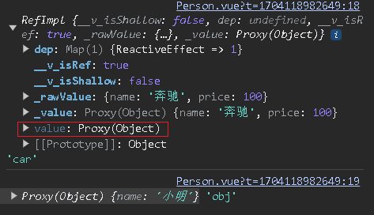

[Vue3学习小结--响应式数据ref、reactive和toRefs、toRef](#top)

- [Ref基本数据类型的响应式数据](#ref基本数据类型的响应式数据)
- [reactive对象类型的响应式数据](#reactive对象类型的响应式数据)
- [ref对比reactive](#ref对比reactive)
- [toRefs和toRef](#torefs和toref)

-------------------------------------

## Ref基本数据类型的响应式数据

|||
|---|---|
|作用|定义响应式变量|
|语法|let xxx = ref(初始值)|
|返回值|一个RefImpl的实例对象，简称ref对象或ref,ref对象的value属性是响应式的|
|注意点|JS中操作数据需要`xxx.value`,但模板中不需要.value,直接使用即可<br>对于`let name = ref('张三'`)来说，name不是响应式的，name.value是响应式的|

```ts
<script lang="ts" setup name="Person">
  // 1) import ref
  import { ref } from 'vue';
  // 2) using ref() in data defination
  let name = ref('zhang san');   //此时的数据是响应式的
  let age = ref(18);
  let tel = '111111111';
  console.log('name', name);
  function changeName() {
  // 3) change data by usibng .value
    name.value = 'Li Si'
    console.log(name.value)
  }
  function showTel() {
    alert(tel);
  }
</script> 
```

[⬆ back to top](#top)

## reactive对象类型的响应式数据

|||
|---|---|
|作用|只能定义对象类型|
|语法|let xxx = reactive({xxx})|
|返回值| 一个Proxy的实例对象，简称:响应式对象|
|注意点|reactive定义的响应式数据是“深层次”的|



```ts
<script lang="ts" setup name="Person">
 // 1) import reactive
  import { reactive } from 'vue';
 // 2) using ref() in data defination
  let car = reactive({name: 'benchi', price: 100})     //此时的数据不是响应式的
  let hobbies = reactive([       //此时的数据不是响应式的
    {id: '1', name: 'cigaret'},
    {id: '2', name: 'drink'},
    {id: '3', name: 'hair'},
  ]);  
  function changePrice() {
    car.price += 10
  }
  function changeHobby() {
    hobbies[0].name = 'reading'
  }
</script> 
```

[⬆ back to top](#top)

## ref对比reactive

- ref用来定义：基本类型数据、对象类型数据
  - ref创建的变量必须使用.value
- reactive用来定义：对象类型数据
  - 修改属性： 直接使用  ->  `hobbies[0].name = 'reading'`
  - 修改整体对象：reactive重新分配一个新对象,会失去响应式（可以使用Object.assign去整体替换）

```ts
let obj = reactive({name: '小明'})
function changeObj(){
  // obj = {name: '小红'}              // 这么写页面不更新
  // obj = reactive({name: '小红'})    // 这么写页面不更新
  Object.assign(obj, {name: '小白'})
}
```

**使用原则**：

- 若需要一个基本类型的响应式数据，必须使用ref
- 若需要一个响应式对象，层级不深，ref、reactive都可以
- 若需要一个响应式对象，且层级较深，推荐使用reactive，（form表单数据推荐使用reactive）


## toRefs和toRef

- **作用**：将一个响应式对象中的每一个属性，转换为ref对象
- **备注**：toRefs与toRef功能一致，但toRefs可以批量转换

```ts
<script lang="ts" setup name="Person">
  import { reactive, toRefs } from 'vue';
  let person = reactive({
    name: 'Zhang san',
    age: 19
  });
  let { name, age } = toRefs(person)
  console.log(name)
  console.log(age)
  function changeName() {
    //person.name = 'Li si'
    name.value = 'toRefs'
  }
  function changeAge() {
    //person.age += 1
    age.value += 1
  }
</script> 
```

[⬆ back to top](#top)

> References
-  https://www.cnblogs.com/Itstars/tag/vue.js/
-  [Vue学习计划-Vue3--核心语法（二）ref、reactive和toRefs、toRef](https://www.cnblogs.com/Itstars/p/17966834)
